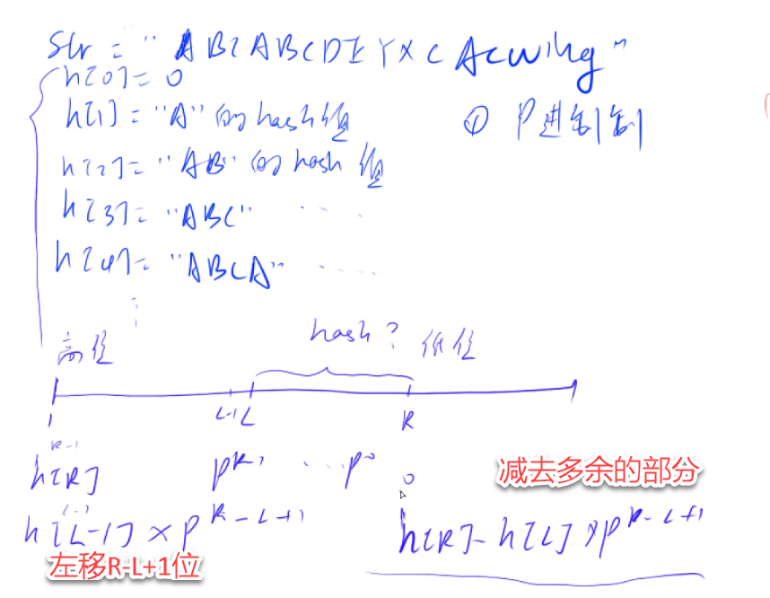

[toc]


### 一、基础操作类（遍历、转换、分割）

1. **字符串反转** 

#### **LeetCode 344. Reverse String**（反转字符串数组）

   ```
   std::reverse(s.begin(), s.end());
   ```

   ```
   s.reverse()
   ```

   ```
   // s[::-1] 会生成新的list，不会原地修改，上面都是原地修改
   // "".join(reversed(s[::])) 也不是原地修改
   ```

```
    def reverseString(self, s: List[str]) -> None:
        left = 0
        right = len(s) - 1
        while left < right:
            s[left], s[right] = s[right], s[left]
            left += 1
            right -= 1
```


#### **LeetCode 541. Reverse String II**（每 k 个字符反转一次）

   ```
   class Solution:
       def reverseStr(self, s: str, k: int) -> str:
           if len(s) < k:
               return s[::-1]
           if len(s) < 2 * k:
               return s[:k][::-1] + s[k:]
           
           cur = s
           nstr = ""
           while cur != "":
               if len(cur) < k:
                   return nstr + cur[::-1]
               if len(cur) < 2 * k:
                   return nstr + cur[:k][::-1] + cur[k:]
               tmp = cur[:2 * k]
               cur = cur[2 * k:]
               nstr += tmp[:k][::-1] + tmp[k:]
           return nstr
   ```

   ```
   class Solution:
       def reverseStr(self, s: str, k: int) -> str:
           t = list(s)
           for i in range(0, len(t), 2 * k):
               t[i:i+k] = reversed(t[i:i+k])
           return ''.join(t)
   ```

   ```
       string reverseStr(string s, int k) {
           int n = s.length();
           for (int i = 0; i < n; i += 2 * k) {
               reverse(s.begin() + i, s.begin() + min(i + k, n));
           }
           return s;
       }
   ```


2. **字符串大小写转换** 
#### **LeetCode 709. To Lower Case**（转为小写）

   ```
   return s.lower()
   ```

   ```
   class Solution {
   public:
       string toLowerCase(string s) {
           std::transform(s.begin(), s.end(), s.begin(), ::tolower);
           return s;
       }
   };
   ```

   

3. **字符串分割与拼接** 
####  **LeetCode 151. Reverse Words in a String**（反转字符串中的单词）

```
    def reverse_words(self, s: str) -> str:
        wl = s.split()
        l = 0
        r = len(wl) - 1
        while l < r:
            wl[l],wl[r] = wl[r],wl[l]
            l += 1
            r -= 1
        return " ".join(wl)
```

#### **LeetCode 557. Reverse Words in a String III**（反转每个单词的字符）

   ```
   class Solution:
       def reverseWords(self, s: str) -> str:
           res = s.split()
           res.reverse()
           return " ".join(res)
   ```

   ```
   class Solution:
       def reverseWords(self, s: str) -> str:
           res = s.split()
           n = list()
           for w in res:
               n.append(w[::-1])
           return " ".join(n)
   ```

   

4. **字符串比较与验证** 

#### **LeetCode 205. Isomorphic Strings**（同构字符串）

```
输入：s = "egg", t = "add"
输出：true
```

   ```
   class Solution:
       def isIsomorphic(self, s: str, t: str) -> bool:
           n = len(ls)
           hasha = {}
           hashb = {}
           for i in range(n):
               if hasha.get(s[i]) is not None:
                   if hasha[s[i]] != t[i]:
                       return False
               elif hashb.get(t[i]) is not None:
                   if hashb[t[i]] != s[i]:
                       return False
               else:
                   hasha[s[i]] = t[i]
                   hashb[t[i]] = s[i]
           return True
   ```

#### **LeetCode 290. Word Pattern**（单词规律）

```
输入: pattern = "abba", s = "dog cat cat dog"
输出: true
```

   ```
       def word_pattern(self, pattern: str, teststr: str) -> bool:
           phash = collections.defaultdict(str)
           thash = collections.defaultdict(str)
           testlist = teststr.split()
           for i in range(len(pattern)):
               if pattern[i] in phash:
                   if phash[pattern[i]] != testlist[i]:
                       return False
               elif testlist[i] in thash:
                   if thash[testlist[i]] != pattern[i]:
                       return False
               else:
                   phash[pattern[i]] = testlist[i]
                   thash[testlist[i]] = pattern[i]
           return True
   ```

   

5. **字符计数** 

#### **LeetCode 387. First Unique Character in a String**（字符串中的第一个唯一字符）

给定一个字符串 `s` ，找到 *它的第一个不重复的字符，并返回它的索引* 。如果不存在，则返回 `-1` 。

```
示例 1：

输入: s = "leetcode"
输出: 0
示例 2:

输入: s = "loveleetcode"
输出: 2
示例 3:

输入: s = "aabb"
输出: -1
```

   ```
   class Solution:
       def firstUniqChar(self, s: str) -> int:
           h = collections.defaultdict(int)
           for c in s:
               h[c] += 1
           for i in range(len(s)):
               if h[s[i]] == 1:
                   return i
           return -1 
   ```

   

#### **LeetCode 451. Sort Characters By Frequency**（根据字符出现频率排序）

给定一个字符串 `s` ，根据字符出现的 **频率** 对其进行 **降序排序** 。一个字符出现的 **频率** 是它出现在字符串中的次数。

```
输入: s = "tree"
输出: "eert"
解释: 'e'出现两次，'r'和't'都只出现一次。
因此'e'必须出现在'r'和't'之前。此外，"eetr"也是一个有效的答案。
```

   ```
   class Solution {
   public:
       string frequencySort(string s) {
           unordered_map<char, int> hash;
           for (auto c : s)
           {
               hash[c]++;
           }
           struct cmp
           {
               bool operator()(const pair<int, char>& l, const pair<int, char>& r) const
               {
                   return l.first < r.first;
               }
           };
           priority_queue<pair<int, char>, vector<pair<int, char>>, cmp> sh;
           for (auto i : hash)
           {
               sh.push(make_pair(i.second, i.first));
           }
           string res = "";
           while (!sh.empty())
           {
               auto cur = sh.top(); sh.pop();
               for (int c = 0; c < cur.first; c++)
               {
                   res += cur.second;
               }
           }
           return res;
       }
   };
   ```

 ```
 string frequencySort(string s) {
      int m = s.length();
      unordered_map<char, int> hash;
      for(int i = 0; i < m; i++)
      {
         hash[s[i]]++;
      }
      vector<pair<char, int>> tmpvec(hash.begin(), hash.end());
      sort(tmpvec.begin(), tmpvec.end(), [](const pair<char, int>& a, const pair<char, int>&b){
         return a.second > b.second;
      });
      string res = "";
      for (const auto& p : tmpvec)
      {
         for (int i = 0; i < p.second; i++)
         {
             res += p.first;
         }
      }
      return res;
 }
 ```

```
        std::sort(tmpvec.begin(), tmpvec.end(), [](const pair<char, int>& a, const pair<char, int>& b){
            if (a.second > b.second)
            {
                return true;
            }
            else if (a.second == b.second)
            {
                return a.first < b.first;
            }
            return false;
        });
```


### 二、字符串匹配类（子串、前缀、后缀）

1. **子串查找（暴力 / 哈希 / 前缀函数）** 

#### **LeetCode 28. Find the Index of the First Occurrence in a String**（实现 strStr ()）、

```
输入：haystack = "sadbutsad", needle = "sad"
输出：0
解释："sad" 在下标 0 和 6 处匹配。
第一个匹配项的下标是 0 ，所以返回 0 
```

   ```
   class Solution:
       def strStr(self, haystack: str, needle: str) -> int:
           for i in range(len(haystack) - len(needle) + 1):
               if haystack[i: i + len(needle)] == needle:
                   return i
           return -1
   ```

   ```
   class Solution {
   public:
       int strStr(string haystack, string needle) {
           int m = haystack.size();
           int n = needle.size();
           for (int i = 0; i < m - n + 1; i++)
           {
               int idx = i;
               int j = 0;
               for (; j < n; j++)
               {
                   if (haystack[idx] != needle[j])
                       break;
                   idx++;
               }
               if (j == n)
                   return i;
           }
           return -1;
       }
   };
   ```

 ```
 class Solution {
 public:
     /**
      * @param source: A source string
      * @param target: A target string
      * @return: An integer as index
      */
     typedef unsigned long long ULL;
 
     ULL getHash(vector<ULL>& h, vector<ULL>& p, int L, int R)
     {
         return h[R] - h[L - 1] * p[R - (L - 1)];
     }
     int strStr2(string &source, string &target) {
         int m = source.size();
         int n = target.size();
 
         vector<ULL> shash(m + 1, 0);
         vector<ULL> thash(n + 1, 0);
         vector<ULL> p(m + 1, 0);
         int P = 31;
 
         p[0] = 1;
         for (int i = 1; i <= m; i++)
         {
             p[i] = p[i - 1] * P;
             shash[i] = shash[i - 1] * P + source[i - 1];
         }
 
         for (int i = 1; i <= n; i++)
         {
             thash[i] = thash[i - 1] * P + target[i - 1];
         }
 
         for (int i = 1; i <= m - n + 1; i++)
         {
             UUL sh = getHash(shash, p, i, i + n - 1);
             if (sh == thash[n])
                 return i - 1;
         }
         return -1;
     }
 };
 ```




```

                       (L-1) L       R        
              |--------------|-------|---------------|
h[R] =      (R-1)                    0
h[L - 1] =  (L-2)            0
将h[L - 1]左移P^(R-L+1)位以后：
                       (L-1) L       R        
              |--------------|-------|---------------|
h[R] =      (R-1)XXXXXXXXXXXXXXXXXXXXX
h[L - 1] =  (L-2)XXXXXXXXXXXX000000000

h[R] - h[L - 1] * P^(R-L+1) = h[L-R]
```


#### **LeetCode 459. Repeated Substring Pattern**（重复的子字符串）

给定一个非空的字符串 `s` ，检查是否可以通过由它的一个子串重复多次构成。

```
输入: s = "abab"
输出: true
解释: 可由子串 "ab" 重复两次构成。
```

   ```
   class Solution:
       def repeatedSubstringPattern(self, s: str) -> bool:
           return (s + s).find(s, 1) != len(s)
   ```

   

2. **前缀 / 后缀匹配** 

####  **LeetCode 1392. Longest Happy Prefix**（最长快乐前缀）

**「快乐前缀」** 是在原字符串中既是 **非空** 前缀也是后缀（不包括原字符串自身）的字符串。

```
输入：s = "level"
输出："l"
解释：不包括 s 自己，一共有 4 个前缀（"l", "le", "lev", "leve"）和 4 个后缀（"l", "el", "vel", "evel"）。最长的既是前缀也是后缀的字符串是 "l" 。
```

字符串hash

```
class Solution:
    def longestPrefix(self, s: str) -> str:
        for l in range(len(s) - 1, 0, -1):
            if s[:l] == s[len(s) - l:]:
                return s[:l]
        return ""
```

```
    string longestPrefix(string s) {
        int n = s.size();
        // 从“次长的可能前后缀”开始验证（长度从n-1递减到1）
        // 长度为len的前缀：s[0..len-1]，长度为len的后缀：s[n-len..n-1]
        for (int len = n - 1; len >= 1; --len) {
            // 截取前缀和后缀，验证是否相等
            string prefix = s.substr(0, len);
            string suffix = s.substr(n - len, len);
            if (prefix == suffix) {
                return prefix; // 找到最长的，直接返回
            }
        }
        // 没有符合条件的快乐前缀，返回空串
        return "";
    }
```


3. **正则表达式匹配**

####  **LeetCode 10. Regular Expression Matching**（困难，包含 `.` 和 `*`）

```
首先状态 dp 一定能自己想出来。
dp[i][j] 表示 s 的前 i 个是否能被 p 的前 j 个匹配

转移方程
怎么想转移方程？首先想的时候从已经求出了 dp[i-1][j-1] 入手，再加上已知 s[i]、p[j]，要想的问题就是怎么去求 dp[i][j]。

已知 dp[i-1][j-1] 意思就是前面子串都匹配上了，不知道新的一位的情况。
那就分情况考虑，所以对于新的一位 p[j] s[i] 的值不同，要分情况讨论：

考虑最简单的 p[j] == s[i] : dp[i][j] = dp[i-1][j-1]
然后从 p[j] 可能的情况来考虑，让 p[j]=各种能等于的东西。

p[j] == "." : dp[i][j] = dp[i-1][j-1]

p[j] ==" * ":

第一个难想出来的点：怎么区分 ∗ 的两种讨论情况
首先给了 *，明白 * 的含义是 匹配零个或多个前面的那一个元素，所以要考虑他前面的元素 p[j-1]。* 跟着他前一个字符走，前一个能匹配上 s[i]，* 才能有用，前一个都不能匹配上 s[i]，* 也无能为力，只能让前一个字符消失，也就是匹配 0 次前一个字符。
所以按照 p[j-1] 和 s[i] 是否相等，我们分为两种情况：

3.1 p[j-1] != s[i] : dp[i][j] = dp[i][j-2]
这就是刚才说的那种前一个字符匹配不上的情况。
比如(ab, abc * )。遇到 * 往前看两个，发现前面 s[i] 的 ab 对 p[j-2] 的 ab 能匹配，虽然后面是 c*，但是可以看做匹配 0 次 c，相当于直接去掉 c *，所以也是 True。注意 (ab, abc**) 是 False。
3.2 p[j-1] == s[i] or p[j-1] == "."：
* 前面那个字符，能匹配 s[i]，或者 * 前面那个字符是万能的 .
因为 . * 就相当于 . .，那就只要看前面可不可以匹配就行。
比如 (##b , ###b *)，或者 ( ##b , ### . * ) 只看 ### 后面一定是能够匹配上的。
所以要看 b 和 b * 前面那部分 ## 的地方匹不匹配。
第二个难想出来的点：怎么判断前面是否匹配
dp[i][j] = dp[i-1][j] // 多个字符匹配的情况	
or dp[i][j] = dp[i][j-1] // 单个字符匹配的情况
or dp[i][j] = dp[i][j-2] // 没有匹配的情况	
看 ### 匹不匹配，不是直接只看 ### 匹不匹配，要综合后面的 b b* 来分析
这三种情况是 or 的关系，满足任意一种都可以匹配上，同时是最难以理解的地方：

dp[i-1][j] 就是看 s 里 b 多不多， ### 和 ###b * 是否匹配，一旦匹配，s 后面再添个 b 也不影响，因为有 * 在，也就是 ###b 和 ###b *也会匹配。

dp[i][j-1] 就是去掉 * 的那部分，###b 和 ###b 是否匹配，比如 qqb qqb

dp[i][j-2] 就是 去掉多余的 b *，p 本身之前的能否匹配，###b 和 ### 是否匹配，比如 qqb qqbb* 之前的 qqb qqb 就可以匹配，那多了的 b * 也无所谓，因为 b * 可以是匹配 0 次 b，相当于 b * 可以直接去掉了。

三种满足一种就能匹配上。

为什么没有 dp[i-1][j-2] 的情况？ 就是 ### 和 ### 是否匹配？因为这种情况已经是 dp[i][j-1] 的子问题。也就是 s[i]==p[j-1]，则 dp[i-1][j-2]=dp[i][j-1]。

最后来个归纳：
如果 p.charAt(j) == s.charAt(i) : dp[i][j] = dp[i-1][j-1]；
如果 p.charAt(j) == '.' : dp[i][j] = dp[i-1][j-1]；
如果 p.charAt(j) == '*'：
如果 p.charAt(j-1) != s.charAt(i) : dp[i][j] = dp[i][j-2] //in this case, a* only counts as empty
如果 p.charAt(i-1) == s.charAt(i) or p.charAt(i-1) == '.'：
               dp[i][j] = dp[i-1][j] //in this case, a* counts as multiple a
               or dp[i][j] = dp[i][j-1] // in this case, a* counts as single a
               or dp[i][j] = dp[i][j-2] // in this case, a* counts as empty


```

```
class Solution {
public:
    bool isMatch(string s, string p) {
        int m = s.size(), n = p.size();
        // DP数组：dp[i][j] 表示s[0..i-1]与p[0..j-1]是否匹配
        vector<vector<bool>> dp(m + 1, vector<bool>(n + 1, false));
        
        // 初始化：空字符串匹配空模式
        dp[0][0] = true;
        
        // 处理模式以*开头的情况（如p="a*"，空字符串可匹配）
        for (int j = 1; j <= n; ++j) {
            if (p[j-1] == '*') {
                dp[0][j] = dp[0][j-2]; // *匹配前面字符0次
            }
        }
        
        // 填充DP数组
        for (int i = 1; i <= m; ++i) {
            for (int j = 1; j <= n; ++j) {
                // 情况1：当前字符匹配（s[i-1] == p[j-1] 或 p[j-1] == '.'）
                if (p[j-1] == s[i-1] || p[j-1] == '.') {
                    dp[i][j] = dp[i-1][j-1];
                }
                // 情况2：当前字符是*，需分两种子情况
                else if (p[j-1] == '*') {
                    // 子情况2.1：*匹配前面字符0次（跳过p[j-2]和*）
                    dp[i][j] = dp[i][j-2];
                    
                    // 子情况2.2：*匹配前面字符至少1次（需p[j-2]与s[i-1]匹配）
                    // if (p[j-1] == s[i] || p[j-1] == '.')  p[j-1]是*前面那个字符
                   
                    if (p[j-2] == s[i-1] || p[j-2] == '.') {  
                        dp[i][j] = dp[i][j] || dp[i-1][j];
                    }
                }
                // 其他情况：不匹配
            }
        }
        
        return dp[m][n];
    }
};
```

#### 1. DP 数组定义

`dp[i][j]` 中 `i` 对应 `s` 的前 `i` 个字符（`s[0..i-1]`），`j` 对应 `p` 的前 `j` 个字符（`p[0..j-1]`），这样可以自然处理 “空字符串 / 空模式” 的边界。

#### 2. 初始化

- `dp[0][0] = true`：空字符串匹配空模式；
- 对于模式中的 `*`，`dp[0][j] = dp[0][j-2]`：表示 `*` 匹配前面字符 0 次（比如 `p="a*"`，空字符串可匹配，因为 `a*` 可以匹配 0 个 `a`）。

#### 3. 状态转移

分两种核心情况：

- **当前字符直接匹配**（`p[j-1] == s[i-1]` 或 `p[j-1] == '.'`）：

    

    ```
    dp[i][j] = dp[i-1][j-1]
    ```

    （前面的字符匹配，当前也匹配）。

- **当前字符是 `\*`**：

    - 子情况 1：`*` 匹配前面字符 0 次 → 跳过 `p[j-2]` 和 `*`，即 `dp[i][j] = dp[i][j-2]`；
    - 子情况 2：`*` 匹配前面字符至少 1 次 → 需 `p[j-2]` 与 `s[i-1]` 匹配，此时 `dp[i][j] = dp[i-1][j]`（相当于复用 `*` 的匹配能力，继续匹配 `s` 的前 `i-1` 个字符）。

```
   bool isMatch(string &s, string &p) {
        int m = s.length(); 
        int n = p.length();
        s = " " + s;
        p = " " + p;
        vector<vector<bool>> dp(m + 1, vector<bool>(n + 1, false));

        dp[0][0] = true;
        for (int i = 0; i <= m; i++)
        {
            for (int j = 1; j <= n; j++)
            {
                if (j + 1 < n && p[j + 1] == '*')
                    continue;
                if (i && p[j] != '*')
                {
                    dp[i][j] = dp[i - 1][j - 1] && ((s[i] == p[j]) || (p[j] == '.'));
                }
                if (p[j] == '*')
                {
                    dp[i][j] = dp[i][j - 2] || i && dp[i - 1][j] && (s[i] == p[j - 1] || (p[j - 1] == '.'));
                }
            }
        }

        return dp[m][n];
    }
```


#### **LeetCode 44. Wildcard Matching**（困难，包含 `?` 和 `*`）

### 三、回文串相关

1. **判断回文串**  

#### **LeetCode 125. Valid Palindrome**（验证回文串，忽略非字母数字）

   ```
   class Solution:
       def isPalindrome(self, s: str) -> bool:
           l = s.lower()
           res = "".join(ch for ch in l if ch.isalnum())
           return res == res[::-1]
   ```

   

#### **LeetCode 680. Valid Palindrome II**（最多删除一个字符判断回文）

   ```
   class Solution:
       def isPal(self, s):
           return s == s[::-1]
       def validPalindrome(self, s: str) -> bool:
           m = len(s)
           l = 0
           r = m - 1
           while l < r:
               if s[l] != s[r]:
                   return self.isPal(s[l + 1:r + 1]) or self.isPal(s[l:r])
               l += 1
               r -= 1
           return True
   ```

   

2. **最长回文子串 / 子序列** 

#### **LeetCode 5. Longest Palindromic Substring**（最长回文子串，动态规划 / 中心扩展）

   ```
   class Solution {
   public:
       string longestPalindrome(string s) {
           int m = s.size();
           vector<vector<bool>> dp(m, vector<bool>(m, false));
           for (int i = 0; i < m; i++)
           {
               dp[i][i] = true;
           }
           int maxlen = 0;
           string res = "";
           for (int len = 1; len <= m; len++)
           {
               for (int i = 0; i < m - len + 1; i++)
               {
                   int j = i + len - 1;
                   if (s[i] == s[j])
                   {
                       if (len <= 2 || dp[i+1][j-1])
                       {
                           dp[i][j] = true;
                           maxlen = len;
                           res = s.substr(i, len);
                       }
                   }
               }
           }
           return res;
       }
   };
   ```

```
class Solution:
    def longestPalindrome(self, s: str) -> str:
        if len(s) == 1:
            return s
        m = len(s)
        dp = [[False] * m for _ in range(m)]
        for i in range(m):
            dp[i][i] = True
        
        res = ""
        maxlen = -math.inf
        for L in range(1, m + 1):
            for i in range(m - L + 1):
                j = i + L - 1
                if s[i] == s[j]:
                    if L <= 2 or dp[i + 1][j - 1] == True:
                        dp[i][j] = True
                        if L > maxlen:
                            maxlen = L
                            res = s[i: j + 1]
        return res
```


#### **LeetCode 516. Longest Palindromic Subsequence**（最长回文子序列，动态规划）

   ```
   class Solution {
   public:
       int longestPalindromeSubseq(string s) {
           int m = s.size();
           vector<vector<int>> dp(m, vector<int>(m, 0));
           for (int i = 0; i < m; i++)
           {
               dp[i][i] = 1;
           }
   
           for (int len = 2; len <= m; len++)
           {
               for (int i = 0; i < m - len + 1; i++)
               {
                   int j = i + len - 1;
                   if (s[i] == s[j])
                   {
                       dp[i][j] = dp[i + 1][j - 1] + 2;
                   }
                   else
                   {
                       dp[i][j] = max(dp[i + 1][j], dp[i][j - 1]);
                   }
               }
           }
           return dp[0][m - 1];
       }
   };
   ```

   

3. **回文串构造** 

#### **LeetCode 266. Palindrome Permutation**（回文排列）

忽略所有偶数，对于奇数，减一，剩下的忽略，奇数只能有一个

```
输入："tactcoa"
输出：true（排列有"tacocat"、"atcocta"，等等）
```

   ```
   class Solution:
       def can_permute_palindrome(self, s: str) -> bool:
           if len(s) == 1:
               return True
           h = collections.defaultdict(int)
           for c in s:
               h[c] += 1
           flag = False
           for v in h.values():
               if not (v % 2):
                   continue
               else:
                   if flag == True:
                       return False
                   flag = True
           return True
   ```

   

#### **LeetCode 409. Longest Palindrome**（最长回文串，统计字符频次）

忽略所有偶数，对于奇数，减一，剩下的忽略，奇数只能有一个

   ```
       def longest_palindrome(self, s: str) -> int:
           if len(s) == 1:
               return 1
           h = collections.defaultdict(int)
           for c in s:
               h[c] += 1
           res = 0
           flag = False
           for v in h.values():
               if not (v % 2):
                   res += v
               else:
                   res += (v - 1)
                   flag = True
           if flag:
               res += 1
           return res
   ```

   

### 四、字符串修改与拼接（删除、替换、插入）

1. **删除字符** 

#### **LeetCode 392. Is Subsequence**（判断子序列，可理解为删除其他字符后匹配）

给定字符串 **s** 和 **t** ，判断 **s** 是否为 **t** 的子序列。

字符串的一个子序列是原始字符串删除一些（也可以不删除）字符而不改变剩余字符相对位置形成的新字符串。（例如，`"ace"`是`"abcde"`的一个子序列，而`"aec"`不是）。

```
输入：s = "abc", t = "ahbgdc"
输出：true
```

   ```
   def isSubsequence(self, s: str, t: str) -> bool:
       pre = -1
       for i in range(len(s)):
           if s[i] not in t:
               return False
           cur = t.find(s[i], pre + 1)
           if cur <= pre:
               return False
           pre = cur
       return True
   ```

 ```
     def isSubsequence(self, s: str, t: str) -> bool:
         n, m = len(s), len(t)
         i = j = 0
         while i < n and j < m:
             if s[i] == t[j]:
                 i += 1
             j += 1
         return i == n
 ```


####  **LeetCode 1910. Remove All Occurrences of a Substring**（删除子串的所有出现）

给你两个字符串 `s` 和 `part` ，请你对 `s` 反复执行以下操作直到 **所有** 子字符串 `part` 都被删除

```
Input: s = "daabcbaabcbc", part = "abc"
Output: "dab"
Explanation: The following operations are done:
- s = "daabcbaabcbc", remove "abc" starting at index 2, so s = "dabaabcbc".
- s = "dabaabcbc", remove "abc" starting at index 4, so s = "dababc".
- s = "dababc", remove "abc" starting at index 3, so s = "dab".
Now s has no occurrences of "abc".
```

   ```
   class Solution:
       def removeOccurrences(self, s: str, part: str) -> str:
           m = len(part)
           res = s
           while part in res:
               idx = res.find(part)
               res = res[:idx] + res[idx + m:]
           return res
   ```

判断最后的部分是否和part匹配，如果匹配则删掉尾部

   ```
       def removeOccurrences(self, s: str, part: str) -> str:
           m = len(part)
           res = ""
           for ch in s:
               # 模拟从左至右匹配的过程
               res += ch
               if len(res) >= m and res[-m:] == part:
                   # 如果匹配成功，那么删去对应后缀
                   res = res[:-m]
           return res
   
   ```


2. **替换字符** 

#### **LeetCode 8. String to Integer (atoi)**（字符串转整数，处理符号、空格、溢出）

   四步 空白，正负号，提取数字，数字范围

   ```
   class Solution:
       def myAtoi(self, s: str) -> int:
           # 步骤1：忽略前导空白
           s = s.strip()
           if not s:
               return 0  # 空字符串返回0
           
           # 步骤2：处理正负号
           sign = 1
           if s[0] == '+':
               s = s[1:]
           elif s[0] == '-':
               sign = -1
               s = s[1:]
           
           # 步骤3：提取数字字符
           num = 0
           for c in s:
               if not c.isdigit():
                   break  # 遇到非数字则停止
               num = num * 10 + int(c)
           
           # 步骤4：应用符号并限制范围（模拟32位整数）
           num *= sign
           INT_MIN, INT_MAX = -2**31, 2**31 - 1
           if num < INT_MIN:
               return INT_MIN
           if num > INT_MAX:
               return INT_MAX
           return num
   ```

   

####  **LeetCode 14. Longest Common Prefix**（最长公共前缀）

```
输入：strs = ["flower","flow","flight"]
输出："fl"
```

1. 用第一个字符串作为基准就可以，如果其他字符串长于第一个字符串，前缀肯定在第一个字符串内。
2. 纵向比较`strs[0][i]`的字符，第一个不同出现的时候那当前prefix即为结果
3. 纵向循环，每循环一边结束就将这次循环的`strs[0][i]`加入prefix的末尾
4. 全部循环完，返回prefix

   ```
   class Solution:
       def longestCommonPrefix(self, strs: List[str]) -> str:
           if len(strs) == 0:
               return ""
   
           m = len(strs[0])
           prefix = ""
           for i in range(m):
               for j in range(1, len(strs)):
                   if i >= len(strs[j]) or strs[0][i] != strs[j][i]:
                       return prefix
               prefix += strs[0][i]
           return prefix
   ```

   

3. **字符串加法 / 乘法** 

#### **LeetCode 415. Add Strings**（字符串相加，大数加法）

   保证num1长度长于num2

   ```
   class Solution:
       def add(self, num1: str, num2: str):
           n1 = list(num1)
           n2 = list(num2)
           n1.reverse()
           n2.reverse()
   
           t = 0
           res = list()
           for i in range(len(n1)):
               t += int(n1[i])
               if i < len(n2):
                   t += int(n2[i])
               res.append(str(t % 10))
               t //= 10
           if t:
               res.append(str(t))
           rres = reversed(res)
           return "".join(rres)
       
       def addStrings(self, num1: str, num2: str) -> str:
           if len(num2) > len(num1):
               return self.add(num2, num1)
           else:
               return self.add(num1, num2)
   ```

```
    string addStrings(string num1, string num2) {
        if (num2.size() > num1.size())
            return addStrings(num2, num1);
        int m = num1.size();
        int n = num2.size();
        std::reverse(num1.begin(), num1.end());
        std::reverse(num2.begin(), num2.end());

        int t = 0;
        string res = ""; 
        for (int i = 0; i < m; i++)
        {
            t += num1[i] - '0';
            if (i < n)
            {
                t += num2[i] - '0';
            }
            res += to_string(t % 10);
            t = t / 10;
        }
        if (t)
            res += to_string(t);
        std::reverse(res.begin(), res.end());
        return res;
    }
```


#### **LeetCode 43. Multiply Strings**（字符串相乘，大数乘法）

1. **竖式乘法原理**：两个数相乘的结果长度不会超过两数长度之和（例如：999 × 99 = 98901，长度 3 + 2 = 5）。
2. **结果存储**：用一个长度为 `len(num1) + len(num2)` 的数组存储中间结果，数组索引对应结果的数位（从右往左）。
3. **逐位相乘**：
    - 遍历 `num1` 的每一位（从右往左）与 `num2` 的每一位（从右往左）相乘。
    - 乘积的个位存放在 `i + j + 1` 位置，十位存放在 `i + j` 位置（累加处理进位）。
4. **结果处理**：将数组转换为字符串，去除前导零（若结果为 0 则保留一个 0）。

代码实现

```python
def multiply(num1: str, num2: str) -> str:
    if num1 == "0" or num2 == "0":
        return "0"  # 特殊情况：有一个数为0，结果为0
    
    m, n = len(num1), len(num2)
    # 结果最大长度为 m + n
    res = [0] * (m + n)
    
    # 从右往左遍历两个数的每一位
    for i in range(m-1, -1, -1):
        for j in range(n-1, -1, -1):
            # 计算当前位的乘积（字符转数字）
            mul = (ord(num1[i]) - ord('0')) * (ord(num2[j]) - ord('0'))
            # 乘积在结果数组中的位置
            p1, p2 = i + j, i + j + 1
            # 累加当前乘积到结果数组（考虑已有进位）
            total = mul + res[p2]
            res[p2] = total % 10  # 个位
            res[p1] += total // 10  # 十位（进位）
    
    # 转换结果数组为字符串，去除前导零
    # 找到第一个非零索引
    start = 0
    while start < len(res) and res[start] == 0:
        start += 1
    # 转换为字符串
    return ''.join(map(str, res[start:]))
```

示例解析

以 `num1 = "123", num2 = "456"` 为例：

1. 初始化结果数组 `res = [0, 0, 0, 0, 0, 0]`（长度 3+3=6）。
2. 遍历 `num1` 的每一位（3、2、1）和 `num2` 的每一位（6、5、4）：
    - 3×6=18 → `res[4] += 8`，`res[3] += 1` → `res = [0,0,0,1,8,0]`
    - 3×5=15 → `res[3] += 5`（1+5=6），`res[2] += 1` → `res = [0,0,1,6,8,0]`
    - ... 依次计算所有位的乘积并累加进位。
3. 最终 `res` 数组为 `[0,0,5,6,0,8,8]`，去除前导零后得到 `"56088"`（123×456=56088）。

### 五、动态规划相关字符串题

1. **最长公共子序列** 

#### **LeetCode 1143. Longest Common Subsequence**（LCS 经典题）

   f [ i \]\[ j ] 为第一个序列前i个字符中，和第二个序列前j个字符中的公共序列。所有在第一个序列的前i个字母中出现的，且在第二个序列中的前j个字母中出现的子序列

   转移方程是看最后一个字符是否选取，

	1. a[i],b[j], 都选‘f[i - 1][j - 1] + 1’ 
	1. 都不选 f[i - 1][j - 1]
	1. 选a[i]  `f[i - 1][j]`
	1. 选b[j]  `f[i][j - 1]`

其中情况2被包含在情况3，4中，因此不需要考虑

   ```
   class Solution:
       def longestCommonSubsequence(self, text1: str, text2: str) -> int:
           l1 = len(text1)
           l2 = len(text2)
           # 初始化 (l2+1) 行、(l1+1) 列的全 0 二维数组（避免索引越界）
           f = [[0] * (l1 + 1) for _ in range(l2 + 1)]
           
           # 循环范围修正：i 对应 text2（行），j 对应 text1（列），从 1 开始到长度
           for i in range(1, l2 + 1):
               for j in range(1, l1 + 1):
                   # 取上方或左方的最大值
                   f[i][j] = max(f[i - 1][j], f[i][j - 1])
                   # 若当前字符相同，取左上角 +1
                   if text2[i - 1] == text1[j - 1]:  # 注意字符串索引需减 1（因为 i/j 从 1 开始）
                       f[i][j] = max(f[i][j], f[i - 1][j - 1] + 1)
           
           return f[l2][l1]  # 返回最终右下角的结果
   ```

####  **76 · Longest Increasing Subsequence(LIS)**

f[i\] 表示所有以第i个字符为结尾的上升子序列

```
class Solution {
public:
    int longestIncreasingSubsequence(vector<int> &nums) {
        if (nums.empty())
            return 0;
        int m = nums.size();
        vector<int> f(m, 1);
        int res = 1;
        for (int i = 1; i < m; i++)
        {
            for (int j = 0; j < i; j++)
            {
                if (nums[i] > nums[j])
                {
                    f[i] = max(f[i], f[j] + 1);
                    res = max(res, f[i]);
                }
            }
        }
        return res;
    }
};
```

```
class Solution:
    def longest_increasing_subsequence(self, nums: List[int]) -> int:
        m = len(nums)
        if m == 0:
            return 0
        dp = [1 for _ in range(m)]

        res = 1
        for i in range(1, m):
            for j in range(i):
                if nums[i] > nums[j]:
                    dp[i] = max(dp[i], dp[j] + 1)
                    res = max(res, dp[i])
        return res

```


2. **编辑距离** 
#### **LeetCode 72. Edit Distance**（困难，插入 / 删除 / 替换的最小步数）

   `f[i][j]`为word1前i个字符到word2的前j个字符的转化的最小步。

   > - 在word1中插入一个字符，相当于`dp[i][j - 1] + 1`，消消乐
   > - 在word1中删除一个字符，相当于`dp[i - 1][j] + 1`，消消乐
   > - 在word1和word2修改最后一个字符，相当于`dp[i - 1][j - 1] + 1`，消消乐
   > - word1最后一个字符和word2最后 一个字符相等的话 `dp[i][j] = min(dp[i][j], dp[i - 1][j - 1])`

   ```
       def min_distance(self, word1: str, word2: str) -> int:
           m = len(word1)
           n = len(word2)
           if m == 0:
               return n
           if n == 0:
               return m
           nword1 = " " + word1
           nword2 = " " + word2
   
           dp = [[0] * (n + 1) for _ in range(m + 1)]
           for i in range(m + 1):
               dp[i][0] = i
           for j in range(n + 1):
               dp[0][j] = j
   
           for i in range(1, m + 1):
               for j in range(1, n + 1):
                   dp[i][j] = min(dp[i - 1][j], dp[i][j - 1]) + 1
                   if nword1[i] == nword2[j]:
                       dp[i][j] = min(dp[i][j], dp[i - 1][j - 1])
                   else:
                       dp[i][j] = min(dp[i][j], dp[i - 1][j - 1] + 1)
           return dp[m][n]
   ```

   

3. **不同的子序列** 
#### **LeetCode 115. Distinct Subsequences**（困难，统计子序列出现次数）

4. **解码方法** 

#### **LeetCode 91. Decode Ways**（中等，字符串解码为数字的方式数）  <<<<

   类似爬楼梯，算到当前s[i]的方式，相加

   ```
   class Solution:
       def numDecodings(self, s: str) -> int:
           if s[0] == '0':
               return 0
           m = len(s)
           f = [0 for _ in range(m)]
           f[0] = 1
           for i in range(1, m):
               if s[i] != '0':
                   f[i] += f[i - 1]
               if s[i - 1] != '0' and (int(s[i - 1]) * 10 + int(s[i])) <= 26:
                   if i > 1:
                       f[i] += f[i - 2]
                   else:
                       f[i] += 1
           return f[m - 1]
   ```

   

### 六、哈希表结合字符串

1. **字母异位词** 

#### **LeetCode 242. Valid Anagram**（有效的字母异位词）

   ```
   bool anagram(string &s, string &t) {
       sort(s.begin(), s.end());
       sort(t.begin(), t.end());
       return s == t;
   }
   ```

   

#### **LeetCode 49. Group Anagrams**（字母异位词分组）

   ```
   def group_anagrams(self, strs: List[str]) -> List[List[str]]:
       h = collections.defaultdict(list)
       for s in strs:
           tmp = sorted(s)
           h["".join(tmp)].append(s)
       res = list()
       for v in h.values():
           res.append(v)
       return res
   ```

   

2. **字符串中的异位词子串** 

#### **LeetCode 438. Find All Anagrams in a String**（找到字符串中所有字母异位词）

   滑动窗口

   ```
   class Solution:
       def findAnagrams(self, s: str, p: str) -> List[int]:
           m = len(s)
           n = len(p)
           if n > m:
               return []
           hs = [0] * 26
           hp = [0] * 26
           for i in range(n):
               hs[ord(s[i]) - 97] += 1
               hp[ord(p[i]) - 97] += 1
           res = []
           if hp == hs:
               res.append(0)
           
           for i in range(m - n):
               hs[ord(s[i]) - 97] -= 1
               hs[ord(s[i + n]) - 97] += 1
               if hs == hp:
                   res.append(i + 1)
           return res
   ```

   

3. **最长连续序列**

#### **LeetCode 128. Longest Consecutive Sequence**（可结合字符串处理数字序列）

   利用hash,  要遍历hash表，不要遍历原数组

   ```
   class Solution:
       def longestConsecutive(self, nums: List[int]) -> int:
           if len(nums) == 0:
               return 0
           m = len(nums)
           ns = set(nums)
   
           maxlen = 1
           for c in ns:
               if c - 1 not in ns:
                   curlen = 1
                   curchr = c
                   while curchr + 1 in ns:
                       curlen += 1
                       maxlen = max(maxlen, curlen)
                       curchr += 1
   
           return maxlen
   ```

 ```
     int longestConsecutive(vector<int>& nums) {
         int m = nums.size();
         unordered_set<int> hash;
         for(const auto& i : nums)
         {
             hash.insert(i);
         }
 
         int res = 0;
         for (const auto& n : hash)
         {
             if (hash.count(n - 1))
                 continue;
             int start = n;
             int curlen = 0; 
             while (hash.count(start++))
             {
                 curlen++;
                 res = max(res, curlen);
             }
         }
         return res;
     }
 ```


### 七、其他高频题

1. **括号匹配** 
####  **LeetCode 20. Valid Parentheses**（有效的括号，栈 + 字符串）

   ```
   class Solution:
       def isValid(self, s: str) -> bool:
           stack = []
   
           for c in s:
               if c == ')':
                   if len(stack) != 0 and stack[-1] == '(':
                       stack.pop()
                       continue
               elif c == ']':
                   if len(stack) != 0 and stack[-1] == '[':
                       stack.pop()
                       continue
               elif c == '}':
                   if len(stack) != 0 and stack[-1] == '{':
                       stack.pop()
                       continue
               stack.append(c)
           return len(stack) == 0
   ```

   

2. **最小覆盖子串** 

#### **LeetCode 76. Minimum Window Substring**（困难，滑动窗口经典题）

```
Input: s = "ADOBECODEBANC", t = "ABC"
Output: "BANC"
Explanation: The minimum window substring "BANC" includes 'A', 'B', and 'C' from string t.
```

   滑动窗口

   ```
   class Solution:
       def minWindow(self, s: str, t: str) -> str:
           sh = collections.defaultdict(int)
           th = collections.defaultdict(int)
           for c in t:
               th[c] += 1
           
           l = 0
           curlen = 0
           res = ""
           for r in range(len(s)):
               sh[s[r]] += 1
               if th[s[r]] and sh[s[r]] <= th[s[r]]:
                   curlen += 1
               while l < len(s) and sh[s[l]] > th[s[l]]:
                   sh[s[l]] -= 1
                   l += 1
               if curlen == len(t):
                   if res == "" or len(res) > (r - l + 1):
                       res = s[l:r + 1]
           return res
   ```

   ```
       def minWindow(self, s: str, t: str) -> str:
           shash = Counter()
           thash = Counter(t)
   
           res = ""
           minlen = math.inf
           left = 0
           r = len(s)
           for right, v in enumerate(s):
               shash[s[right]] += 1
               while shash >= thash:
                   if right - left + 1 < minlen:
                       minlen = right - left + 1
                       res = s[left: right + 1]
                   shash[s[left]] -= 1
                   left += 1
           return res
   ```


3. **无重复字符的最长子串** 

#### **LeetCode 3. Longest Substring Without Repeating Characters**（滑动窗口经典题）

   从i开始往后找，直到有重复的。算当前字串长度，更新res。

   把s[i]的hash减一，向右移动i

   ```
       def lengthOfLongestSubstring(self, s: str) -> int:
           m = len(s)
           if m == 0:  # 处理空字符串边界
               return 0
           h = collections.defaultdict(int)
   
           l = 0
           maxlen = -math.inf
           for r, v in enumerate(s):
               h[v] += 1  # 右指针字符加入哈希表（v等价于s[r]）
               # 当当前右指针字符重复时，收缩左指针
               while h[v] > 1:
                   h[s[l]] -= 1
                   l += 1
               # 更新最长长度
               maxlen = max(maxlen, r - l + 1)
           return maxlen
   ```


4. **字符串压缩** 

#### **LeetCode 443. String Compression**（原地压缩字符串）

   ```
       def compress(self, s: str) -> str:
           if s == "":
               return ""
           # write your code here
           cur = s[0]
           count = 1
           res = ""
           for i in range(1, len(s)):
               if cur == s[i]:
                   count += 1
               else:
                   res += cur + str(count)
                   cur = s[i]
                   count = 1
           res += cur + str(count)
           if len(res) < len(s):
               return res
           return s
   ```

   ```
   class Solution:
       def compress(self, chars: List[str]) -> int:
           n = len(chars)
           i = 0
           write = 0
           while i < n:
               j = i
               while j < n and chars[j] == chars[i]:
                   j += 1
               chars[write] = chars[i]
               write += 1
               if j - i > 1:
                   for c in str(j-i):
                       chars[write] = c
                       write += 1
               i = j
           return write
   ```

#### **460 · Find K Closest Elements**

```
class Solution:
    """
    @param a: an integer array
    @param target: An integer
    @param k: An integer
    @return: an integer array
    """
    def isLeftNear(self, a: List[int], l: int, r: int, target: int):
        m = len(a)
        if l < 0:
            return False
        elif r >= m:
            return True
        elif abs(a[l] - target) <= abs(a[r] - target):
            return True
        return False
    def k_closest_numbers(self, a: List[int], target: int, k: int) -> List[int]:
        m = len(a)
        l = 0
        r = m - 1
        while l < r:
            mid = (l + r) // 2
            if a[mid] >= target:
                r = mid
            else:
                l = mid + 1
        ll, rr = l - 1, l
        res = []
        while len(res) < k:
            if self.isLeftNear(a, ll, rr, target):
                res.append(a[ll])
                ll -= 1
            else:
                res.append(a[rr])
                rr += 1
        return res


```

