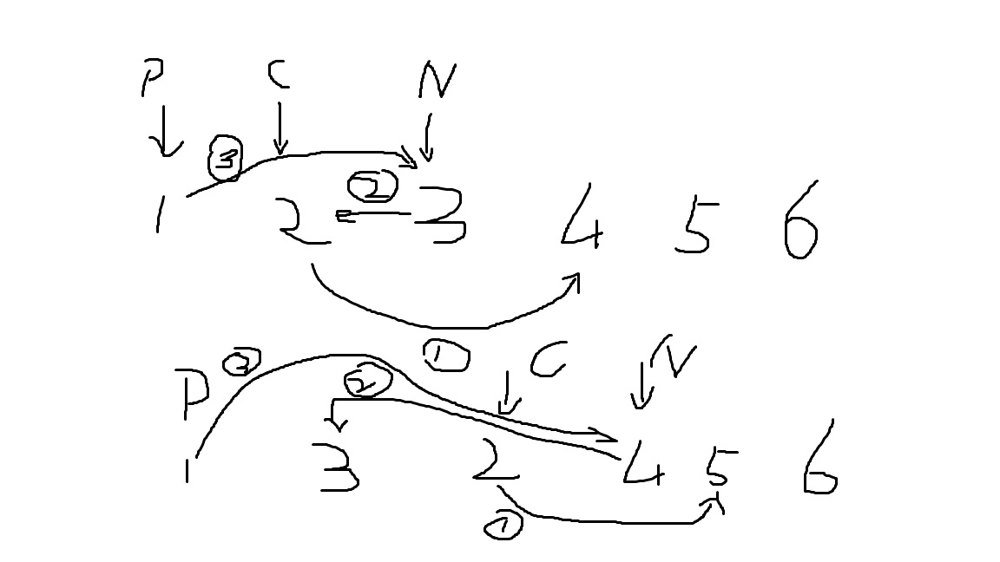
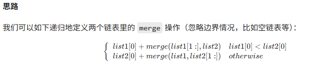

[TOC]

### 基础操作类

#### 1. 链表的中间节点 → **LeetCode 876. Middle of the Linked List**

```c++
class Solution {
public:
   ListNode* middleNode(ListNode* head) {
       ListNode* slow = head;
       ListNode* fast = head;
       while (fast != NULL && fast->next != NULL) {
           slow = slow->next;
           fast = fast->next->next;
       }
       return slow;
   }
};
```

#### 2. 删除链表中的节点（只给待删节点） → **LeetCode 237. Delete Node in a Linked List**

```
class Solution {
public:
    void deleteNode(ListNode* node) {
        ListNode* cur = node;
        ListNode* next = node->next;
        cur->next = node->next->next;
        cur->val = next->val;
    }
};
```


### 反转链表系列

#### 1. 反转整个链表 → **LeetCode 206. Reverse Linked List**

   ```c++
   class Solution {
   public:
       ListNode* reverseList(ListNode* head) {
           if (!head)
               return nullptr;
           ListNode* pre = nullptr;
           ListNode* cur = head;
           while (cur)
           {
               auto next = cur->next;
               cur->next = pre;
               pre = cur;
               cur = next;
           }
           return pre;
       }
   };
   ```

#### 2. 反转链表的第 m 到 n 个节点 → **LeetCode 92. Reverse Linked List II**

获取四个值 pre, leftnode   --   rightnode, succ

   ```
   class Solution {
   public:
       ListNode* reverseBetween(ListNode* head, int left, int right) {
           if (!head)
               return nullptr;
           ListNode* dummy = new ListNode(-1);
           ListNode* pre = dummy;
           dummy->next = head;
   
           auto nl = left;
           for (int i = 0; i < nl - 1; i++)
               pre = pre->next;
           ListNode* leftNode = pre->next;
   
           auto count = right - left;
           ListNode* rightNode = leftNode;
   
           for (int i = 0; i < count; i++)
               rightNode = rightNode->next;
   
           ListNode* succ = rightNode->next;
   
           pre->next = nullptr;
           rightNode->next = nullptr;
   
           ListNode* pp = nullptr;
           ListNode* cur = leftNode;
           while (cur)
           {
               ListNode* next = cur->next;
               cur->next = pp;
               pp = cur;
               cur = next;
           }
   
           pre->next = rightNode;
           leftNode->next = succ;
           return dummy->next;
       }
   };
   ```

1. **定位反转区间**：找到反转的起点（`left` 位置）及其前驱节点，以便后续连接反转后的链表。
2. **局部反转**：反转从 `left` 到 `right` 的节点（共 `right-left+1` 个节点）。
3. **重新连接**：将反转后的链表与原链表的前后部分重新连接，确保链表结构完整。

```python
# 定义链表节点
class ListNode:
    def __init__(self, val=0, next=None):
        self.val = val
        self.next = next

class Solution:
    def reverseBetween(self, head: ListNode, left: int, right: int) -> ListNode:
        # 虚拟头节点，简化边界处理（如 left=1 时无需特殊处理）
        dummy = ListNode(0)
        dummy.next = head
        
        # 1. 找到 left 的前驱节点（pre）
        pre = dummy
        for _ in range(left - 1):
            pre = pre.next  # 循环结束后，pre 指向 left 前一个节点
        
        # 2. 反转 left 到 right 的节点
        # cur 是反转区间的第一个节点（初始为 left 位置）
        cur = pre.next
        # 反转过程中，将当前节点的 next 指向其前一个节点
        for _ in range(right - left):
            next_node = cur.next  # 暂存 cur 的下一个节点
            cur.next = next_node.next  # cur 跳过 next_node，指向更后面的节点
            next_node.next = pre.next  # next_node 成为反转区间的新头部
            pre.next = next_node  # pre 指向新头部，完成一次局部反转
        
        return dummy.next
```

**就是将cur后面的node往pre后面插入**

1. 把cur.next的node先噶出来（next_node）

```
next_node = cur.next  # 暂存 cur 的下一个节点
cur.next = next_node.next  # cur 跳过 next_node，指向更后面的节点
```

2. 把next_node插入到pre后面

```
next_node.next = pre.next  # next_node 成为反转区间的新头部
pre.next = next_node  # pre 指向新头部，完成一次局部反转
```


以 `head = [1,2,3,4,5], left=2, right=4` 为例，步骤如下：

1. **初始化虚拟头节点**：`dummy -> 1 -> 2 -> 3 -> 4 -> 5`。

2. **定位 pre**：`left=2`，循环 1 次后，`pre` 指向节点 1（left 的前驱）。

3. **局部反转**（需反转 3 个节点，循环 `4-2=2` 次）：

    - 第 1 次循环：反转节点 3 到前面

        `cur=2   next_node=3`

        操作后链表：

        ```
        1 -> 3 -> 2 -> 4 -> 5
        ```

    - 第 2 次循环：反转节点 4 到前面

        `cur=2   next_node=4`

        操作后链表：
        ```
        1 -> 4 -> 3 -> 2 -> 5
        ```

4. **返回结果**：`dummy.next` 即为 `[1,4,3,2,5]`，符合预期。




- **虚拟头节点（dummy）**：避免处理 `left=1` 时的边界问题（此时无前驱节点）。
- **局部反转技巧**：通过调整指针，每次将 `cur` 的下一个节点 “插入” 到 `pre` 后面，实现反转（无需额外空间存储节点）。
- **时间复杂度**：O (n)（仅遍历链表一次），空间复杂度：O (1)（仅用常数个指针）。

#### 3. 两两交换链表中的节点 → **LeetCode 24. Swap Nodes in Pairs**

   交换之前的节点关系是 `temp -> node1 -> node2`，交换之后的节点关系要变成 `temp -> node2 -> node1`

   ```
   class Solution {
   public:
       ListNode* swapPairs(ListNode* head) {
           if (!head)
               return nullptr;
           ListNode dummy(-1, head);
           ListNode* temp = &dummy;
           while (temp->next && temp->next->next)
           {
               ListNode* node1 = temp->next;
               ListNode* node2 = temp->next->next;
               temp->next = node2;
               node1->next = node2->next;
               node2->next = node1;
               temp = node1;
           }
           return dummy.next;
       }
   };
   ```

   先噶出node1, node2然后连上

```
ListNode* node1 = temp->next;
ListNode* node2 = temp->next->next;
```


```
    def swapPairs(self, head: Optional[ListNode]) -> Optional[ListNode]:
        if head == None:
            return None 
        dummy = ListNode(-1, head)
        temp = dummy 
        while temp.next and temp.next.next:
            node1 = temp.next
            node2 = temp.next.next
            
            next = node2.next
            node2.next = node1
            node1.next = next
            temp.next = node2
            
            temp = node1
        return dummy.next
```


#### 4. K 个一组反转链表 → **LeetCode 25. Reverse Nodes in k-Group**

```
class Solution {
public:
    ListNode* reverse(ListNode* head)
    {
        ListNode* cur = head;
        ListNode* pre = nullptr;
        while (cur)
        {
            auto tmp = cur->next;
            cur->next = pre;
            pre = cur;
            cur = tmp;
        }
        return pre;
    }
    ListNode* reverseKGroup(ListNode *head, int k) {
        if(head == nullptr)
            return nullptr;
        
        ListNode dummy(-1);
        dummy.next = head;
        auto pre = &dummy;
        auto end = &dummy;
        while (end->next)
        {
            for (int i = 0; i < k; i++)
            {
                end = end->next;
                if (end == nullptr)
                    return dummy.next;
            }
            auto nextGroup = end->next;
            end->next = nullptr;
            auto start = pre->next;
            auto revhead = reverse(start);
            pre->next = revhead;
            start->next = nextGroup;
            pre = start;
            end = start;
        }
        return dummy.next;
    }
};
```


### 环相关问题

#### 1. 判断链表是否有环 → **LeetCode 141. Linked List Cycle**

   ```
   class Solution {
   public:
       bool hasCycle(ListNode *head) {
           if (!head)
               return false;
           ListNode* slow = head;
           ListNode* fast = head->next;
           while (fast && fast->next)
           {
               if (fast == slow)
                   return true;
               slow = slow->next;
               fast = fast->next->next;
           }
           return false;
       }
   };
   ```

#### 2. 找到环的入口点 → **LeetCode 142. Linked List Cycle II**

```
class Solution {
public:
    ListNode *detectCycle(ListNode *head) {
        if (!head)
            return nullptr;
        ListNode* slow = head;
        ListNode* fast = head;
        while (fast && fast->next)
        {
            slow = slow->next;
            fast = fast->next->next;
            if (slow == fast)
            {
                ListNode* ptr = head;
                while(ptr != slow)
                {
                    ptr = ptr->next;
                    slow = slow->next;
                }
                return ptr;
            }
        }
        return nullptr;
    }
};
```

```
class Solution {
public:
    ListNode *detectCycle(ListNode *head) {
        unordered_set<ListNode *> visited;
        while (head != nullptr) {
            if (visited.count(head)) {
                return head;
            }
            visited.insert(head);
            head = head->next;
        }
        return nullptr;
    }
};

```


### 相交链表问题

#### 1. 找到两个相交链表的第一个节点 → **LeetCode 160. Intersection of Two Linked Lists**

   ```
   class Solution {
   public:
       ListNode *getIntersectionNode(ListNode *headA, ListNode *headB) {
           if(!headA || !headB)
               return nullptr;
           auto ha = headA;
           unordered_set<ListNode*> hash;
           while (ha)
           {
               hash.insert(ha);
               ha = ha->next;
           }
           auto hb = headB;
           while (hb)
           {
               if (hash.count(hb))
                   return hb;
               hb = hb->next;
           }
           return nullptr;
       }
   };
   ```

   ```
   class Solution {
   public:
       ListNode *getIntersectionNode(ListNode *headA, ListNode *headB) {
           if (!headA || !headB)
               return nullptr;
           ListNode* ha = headA;
           ListNode* hb = headB;
           while (ha != hb)
           {
               ha = (ha == nullptr) ? headB : ha->next;
               hb = (hb == nullptr) ? headA : hb->next;
           }
           return ha;
       }
   };
   ```

   

### 删除与去重

#### 1. 删除链表中值为 val 的所有节点 → **LeetCode 203. Remove Linked List Elements**

   ```
   class Solution {
   public:
       ListNode* removeElements(ListNode* head, int val) {
           if (!head)
               return nullptr;
   
           auto h = head;
           auto dummy = new ListNode(-1, head);
           auto p = dummy;
           while (h)
           {
               if (h->val == val)
               {
                   p->next = h->next;
                   h = h->next;
               }
               else
               {
                   p = p->next;
                   h = h->next;
               }
           }
           return dummy->next;
       }
   };
   ```

   

#### 2. 删除排序链表中的重复元素（保留一个） → **LeetCode 83. Remove Duplicates from Sorted List**

   ```
   class Solution {
   public:
       ListNode* deleteDuplicates(ListNode* head) {
           if (!head)
               return nullptr;
           unordered_set<int> hash;
           ListNode* h = head;
           ListNode* dummy = new ListNode(-1, head);
           ListNode* p = dummy;
           while (h)
           {
               if (hash.count(h->val) != 0)
               {
                   p->next = h->next;
                   h = h->next;
               }
               else
               {
                   hash.insert(h->val);
                   p = p->next;
                   h = h->next;
               }
           }
           return dummy->next;
       }
   };
   ```

   

#### 3. 删除排序链表中的重复元素（完全删除） → **LeetCode 82. Remove Duplicates from Sorted List II**

   ```
   class Solution {
   public:
       ListNode* deleteDuplicates(ListNode* head) {
           if (!head)
               return nullptr;
           ListNode* dummy = new ListNode(-1, head);
           ListNode* h = head;
           ListNode* p = dummy;
           while(h && h->next)
           {
               if (h->val == h->next->val)
               {
                   while (h && h->next && (h->val == h->next->val))
                   {
                       h = h->next;
                   }
                   p->next = h->next;
                   h = h->next;
               }
               else
               {
                   p = p->next;
                   h = h->next;
               }
           }
           return dummy->next;
       }
   };
   ```

   

```python
# 定义链表节点
class ListNode:
    def __init__(self, val=0, next=None):
        self.val = val
        self.next = next

class Solution:
    def deleteDuplicates(self, head: ListNode) -> ListNode:
        # 虚拟头节点，避免头节点被删除的边界问题
        dummy = ListNode(0)
        dummy.next = head
        
        pre = dummy  # pre 指向已确认无重复的最后一个节点
        cur = head   # 当前遍历的节点
        
        while cur and cur.next:
            if cur.val == cur.next.val:
                # 记录重复值，将 cur 移到所有重复节点的最后
                dup_val = cur.val
                while cur and cur.val == dup_val:
                    cur = cur.next
                # pre 跳过所有重复节点（指向 cur，即下一个可能无重复的节点）
                pre.next = cur
            else:
                # 无重复，pre 和 cur 都后移
                pre = cur
                cur = cur.next
        
        return dummy.next
```

以 `head = [1,2,3,3,4,4,5]` 为例：

1. 初始化：`dummy -> 1 -> 2 -> 3 -> 3 -> 4 -> 4 -> 5`，`pre = dummy`，`cur = 1`。

2. `cur.val (1) != cur.next.val (2)`：`pre` 移到 1，`cur` 移到 2。

3. `cur.val (2) != cur.next.val (3)`：`pre` 移到 2，`cur` 移到 3。

4. `cur.val (3) == cur.next.val (3)`：

    - 记录重复值 `3`，`cur` 移到第一个非 3 的节点（4）。
    - `pre.next = cur`（此时 `pre` 仍在 2，链表变为 `2 -> 4 -> 4 -> 5`）。

5. `cur.val (4) == cur.next.val (4)`：

    - 记录重复值 `4`，`cur` 移到 5。
    - `pre.next = cur`（链表变为 `2 -> 5`）。

6. 遍历结束，最终结果为 `[1,2,5]`。

    

** 虚拟头节点  **

：确保即使头节点是重复节点（如 `[1,1,2]`），也能正确处理。

 跳过重复节点 

：通过内层循环将 `cur` 移到重复序列的末尾，再用 `pre.next = cur` 直接跳过整个重复序列。

 时间复杂度 **：O (n)（仅遍历链表一次），** 空间复杂度 **：O (1)（仅用常数个指针）。

```
class Solution:
    def deleteDuplicates(self, head: Optional[ListNode]) -> Optional[ListNode]:
        if head == None:
            return None 
        dummy = ListNode(-1, head)
        p = dummy 
        h = dummy.next 
        while h and h.next:
            if h.val == h.next.val:
                while h and h.next and h.val == h.next.val:
                    h = h.next 
                p.next = h.next
                h = h.next 
            else:
                p = p.next 
                h = h.next 
        return dummy.next
```


### 合并与拆分

#### 1. 合并两个有序链表 → **LeetCode 21. Merge Two Sorted Lists**

   ```
   class Solution {
   public:
       ListNode* mergeTwoLists(ListNode* list1, ListNode* list2) {
           if (!list1)
               return list2;
           if (!list2)
               return list1;
   
           ListNode* dummy = new ListNode(-1);
           ListNode* h = dummy;
           while (list1 && list2)
           {
               if (list1->val <= list2->val)
               {
                   h->next = list1;
                   h = h->next;
                   list1 = list1->next;
               }
               else
               {
                   h->next = list2;
                   h = h->next;
                   list2 = list2->next;
               }
           }
           if (list1)
           {
               h->next = list1;
           }
           if (list2)
           {
               h->next = list2;
           }
           return dummy->next;
       }
   };
   ```

   
```
    ListNode* mergeTwoLists(ListNode* l1, ListNode* l2) {
        if (l1 == nullptr) {
            return l2;
        } else if (l2 == nullptr) {
            return l1;
        } else if (l1->val < l2->val) {
            l1->next = mergeTwoLists(l1->next, l2);
            return l1;
        } else {
            l2->next = mergeTwoLists(l1, l2->next);
            return l2;
        }
    }
```

#### 2. 合并 K 个有序链表 → **LeetCode 23. Merge k Sorted Lists**

   ```
   class Solution {
   public:
       ListNode* mergeKLists(vector<ListNode*>& lists) {
           if (lists.empty())
               return nullptr;
           priority_queue<ListNode*, vector<ListNode*>, std::function<bool(ListNode*, ListNode*)>> q([](ListNode* l, ListNode* r) -> bool {
               return l->val > r->val;
           });
           for (auto l : lists)
           {
               if (!l)
                   continue;
               q.push(l);
           }
           ListNode* dummy = new ListNode(-1);
           ListNode* h = dummy;
           while (!q.empty())
           {
               auto cur = q.top(); q.pop();
               h->next = cur;
               if (cur && cur->next)
                   q.push(cur->next);
               h = h->next;
           }
           return dummy->next;
       }
   };
   ```

   ```
   class Solution {
   public:
       struct cmd
       {
           bool operator()(const ListNode* a, const ListNode* b)
           {
               return a->val > b->val;
           }
       };
       ListNode *mergeKLists(vector<ListNode *> &lists) {
           priority_queue<ListNode*, vector<ListNode*>, cmd> q;
           int m = lists.size();
           for (int i = 0; i < m; i++)
           {
               if (lists[i])
               {
                   q.push(lists[i]);
               }
           }
   
           auto dummy = ListNode(-1);
           auto p = &dummy;
           while(!q.empty())
           {
               auto cur = q.top(); q.pop();
               p->next = cur;
               p = p->next;
               if (cur->next)
               {
                   q.push(cur->next);
               }
           }
   
           return dummy.next;
       }
   };
   
   
   ```


#### 3. 按值拆分链表（小于 x 的放前面） → **LeetCode 86. Partition List**

   两个列表，小的放一个，大的放一个，最后连到一起

   ```
   class Solution {
   public:
       ListNode* partition(ListNode* head, int x) {
           if (!head)
               return nullptr;
           ListNode* smalldummy = new ListNode(-1);
           ListNode* largedummy = new ListNode(-1);
           ListNode* sp = smalldummy;
           ListNode* lp = largedummy;
           while(head)
           {
               if (head->val < x)
               {
                   sp->next = head;
                   sp = sp->next;
               }
               else
               {
                   lp->next = head;
                   lp = lp->next;
               }
               head = head->next;
           }
           lp->next = nullptr;
           sp->next = largedummy->next;
           return smalldummy->next;
       }
   };
   ```

   

#### 4. 奇偶拆分链表 → **LeetCode 328. Odd Even Linked List**

   ```
   class Solution {
   public:
       ListNode* oddEvenList(ListNode* head) {
           if(!head)
               return nullptr;
           ListNode* odummy = new ListNode(-1);
           ListNode* edummy = new ListNode(-1);
           auto op = odummy;
           auto ep = edummy;
           int idx = 1;
           while (head)
           {
               if (idx++ % 2)
               {
                   op->next = head;
                   op = op->next;
               }
               else
               {
                   ep->next = head;
                   ep = ep->next;
               }
               head = head->next;
           }
           ep->next = nullptr;
           op->next = edummy->next;
           return odummy->next;
       }
   };
   ```

   

### 其他高频题

#### 1. 回文链表判断 → **LeetCode 234. Palindrome Linked List**

   ```
   class Solution {
   public:
       bool isPalindrome(ListNode* head) {
           if (!head)
               return false;
           vector<int> lv;
           while (head)
           {
               lv.emplace_back(head->val);
               head = head->next;
           }
           auto len = lv.size();
           int l = 0;
           int r = len - 1;
           while (l < r)
           {
               if (lv[l++] != lv[r--])
               {
                   return false;
               }
           }
           return true;
       }
   };
   ```

   

#### 2. 链表求和（逆序存储） → **LeetCode 2. Add Two Numbers**

```
    def addTwoNumbers(self, l1: Optional[ListNode], l2: Optional[ListNode]) -> Optional[ListNode]:
        if not l1 or not l2:
            return None 
        t = 0
        dummy = ListNode(-1)
        h = dummy
        while l1 or l2:
            i1 = int(l1.val) if l1 else 0
            i2 = int(l2.val) if l2 else 0
            tmp = i1 + i2 + t
            node = ListNode(tmp % 10)
            h.next = node 
            h = h.next 
            t = tmp // 10
            if l1:
                l1 = l1.next
            if l2:
                l2 = l2.next
        if t > 0:
            node = ListNode(t)
            h.next = node 
        return dummy.next
```


```
class Solution {
public:
    ListNode* addTwoNumbers(ListNode* l1, ListNode* l2) {
        ListNode *head = nullptr, *tail = nullptr;
        int carry = 0;
        while (l1 || l2) {
            int n1 = l1 ? l1->val: 0;
            int n2 = l2 ? l2->val: 0;
            int sum = n1 + n2 + carry;
            if (!head) {
                head = tail = new ListNode(sum % 10);
            } else {
                tail->next = new ListNode(sum % 10);
                tail = tail->next;
            }
            carry = sum / 10;
            if (l1) {
                l1 = l1->next;
            }
            if (l2) {
                l2 = l2->next;
            }
        }
        if (carry > 0) {
            tail->next = new ListNode(carry);
        }
        return head;
    }
};
```

```
    def addTwoNumbers(self, l1: ListNode, l2: ListNode) -> ListNode:
        # 虚拟头节点，简化结果链表的构建
        dummy = ListNode(0)
        current = dummy  # 当前节点指针，用于构建结果链表
        carry = 0        # 进位
        
        # 遍历两个链表，直到两个链表都遍历完且无进位
        while l1 or l2 or carry:
            # 获取当前位的数值（若链表已遍历完，视为 0）
            val1 = l1.val if l1 else 0
            val2 = l2.val if l2 else 0
            
            # 计算当前位的总和（包含进位）
            total = val1 + val2 + carry
            # 计算当前位的结果和新的进位
            current_val = total % 10
            carry = total // 10
            
            # 创建新节点，加入结果链表
            current.next = ListNode(current_val)
            current = current.next  # 移动指针
            
            # 移动两个链表的指针（若未遍历完）
            if l1:
                l1 = l1.next
            if l2:
                l2 = l2.next
        
        return dummy.next  # 虚拟头节点的下一个节点是结果的头节点
```


#### 1. 复制带随机指针的链表 → **LeetCode 138. Copy List with Random Pointer**

```
    def copyRandomList(self, head):
        h = collections.defaultdict(RandomListNode)
        arr = []
        p = head
        while p != None:
            h[p] = RandomListNode(p.label)
            arr.append(p)
            p = p.next
        
        for i in range(len(arr) - 1):
            h[arr[i]].next = h[arr[i + 1]]
            if arr[i].random in h:
                h[arr[i]].random = h[arr[i].random]
        h[arr[len(arr) - 1]].next = None
        if arr[len(arr) - 1].random in h:
            h[arr[len(arr) - 1]].random = h[arr[len(arr) - 1].random]
        return h[arr[0]]
```

