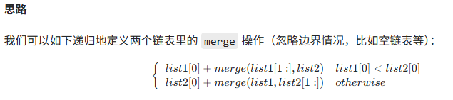
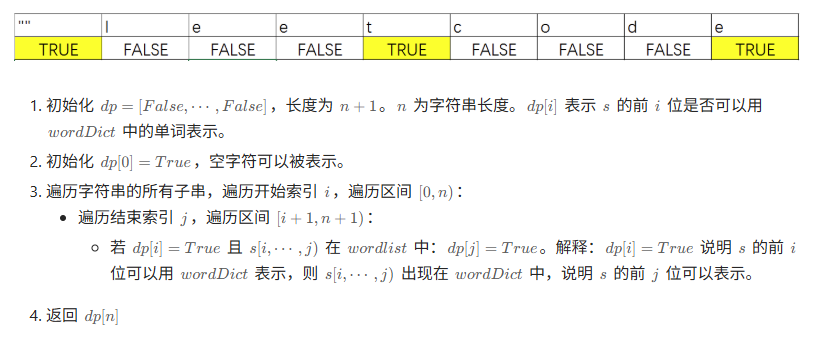
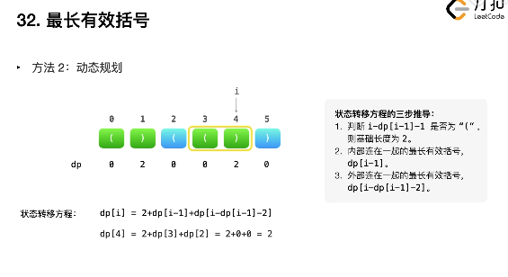
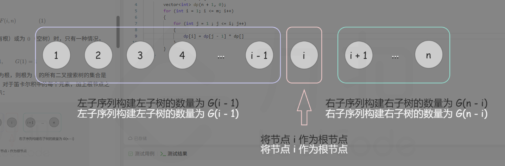
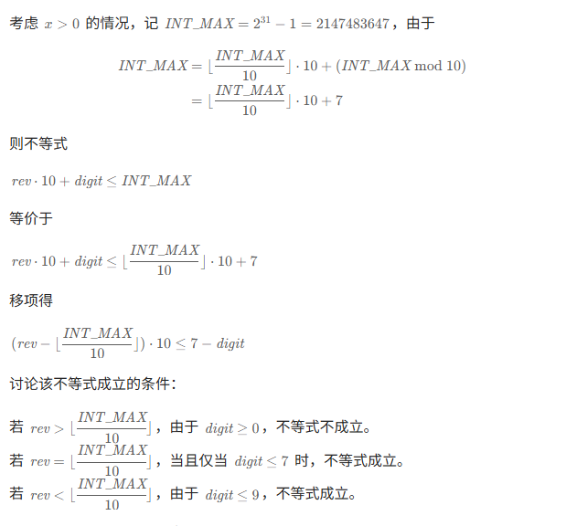
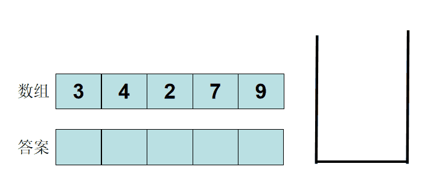
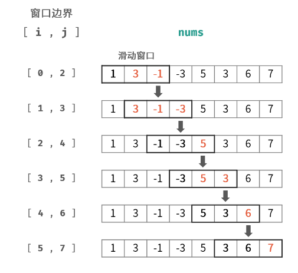

[TOC]


微软北京研发中心的算法面试题通常注重基础数据结构（链表、树、数组、哈希表）、经典算法（动态规划、贪心、DFS/BFS）及实际场景问题。以下是高频题目总结，包含 LeetCode 题号、英文名称、描述、解题思路及 Python 实现：

### 1. 两数之和（LeetCode 1. Two Sum）

**题目描述**：给定整数数组 `nums` 和目标值 `target`，返回两个数的索引，使它们的和为 `target`。假设只有一个解，且同一元素不重复使用。

- 输入：`nums = [2,7,11,15], target = 9`
- 输出：`[0,1]`

**解题思路**：用哈希表存储已遍历元素的值与索引，遍历数组时计算 `target - 当前值`，若差值在哈希表中，直接返回索引对。

**Python 实现**：

```python
def twoSum(nums, target):
    num_map = {}
    for i, num in enumerate(nums):
        complement = target - num
        if complement in num_map:
            return [num_map[complement], i]
        num_map[num] = i
    return []
```

### 2. 反转链表（LeetCode 206. Reverse Linked List）

**题目描述**：反转单链表，返回反转后的头节点。

- 输入：`1->2->3->4->5->NULL`
- 输出：`5->4->3->2->1->NULL`

**解题思路**：用迭代法，维护 `prev`（前驱节点）和 `curr`（当前节点），每次将 `curr.next` 指向 `prev`，逐步移动指针完成反转。

**Python 实现**：

```python
class ListNode:
    def __init__(self, val=0, next=None):
        self.val = val
        self.next = next

def reverseList(head):
    prev, curr = None, head
    while curr:
        next_node = curr.next  # 暂存下一个节点
        curr.next = prev       # 反转指针
        prev, curr = curr, next_node  # 移动指针
    return prev
```

### 3. 二叉树的层序遍历（LeetCode 102. Binary Tree Level Order Traversal）

**题目描述**：按层遍历二叉树，返回每层节点值的列表（从左到右，逐层收集）。

- 输入：`[3,9,20,null,null,15,7]`
- 输出：`[[3],[9,20],[15,7]]`

**解题思路**：用队列实现 BFS，每层遍历前记录队列长度（当前层节点数），依次弹出节点并收集值，同时将子节点入队。

**Python 实现**：

```python
class TreeNode:
    def __init__(self, val=0, left=None, right=None):
        self.val = val
        self.left = left
        self.right = right

def levelOrder(root):
    if not root:
        return []
    from collections import deque
    q = deque([root])
    res = []
    while q:
        level_size = len(q)
        level = []
        for _ in range(level_size):
            node = q.popleft()
            level.append(node.val)
            if node.left:
                q.append(node.left)
            if node.right:
                q.append(node.right)
        res.append(level)
    return res
```

### 4. 最长回文子串（LeetCode 5. Longest Palindromic Substring）

**题目描述**：给定字符串 `s`，返回最长的回文子串（回文是正向和反向读都相同的字符串）。

- 输入：`s = "babad"`
- 输出：`"bab"` 或 `"aba"`

**解题思路**：中心扩展法：遍历每个字符（及相邻字符对）作为回文中心，向两侧扩展寻找最长回文子串，记录最大值。

**Python 实现**：

```python
def longestPalindrome(s):
    def expand(left, right):
        while left >= 0 and right < len(s) and s[left] == s[right]:
            left -= 1
            right += 1
        return s[left+1:right]  # 返回扩展后的回文子串
    
    if not s:
        return ""
    res = ""
    for i in range(len(s)):
        # 奇数长度回文（中心为单个字符）
        s1 = expand(i, i)
        # 偶数长度回文（中心为两个字符）
        s2 = expand(i, i+1)
        res = max(res, s1, s2, key=len)
    return res
```

### 5. 最小路径和（LeetCode 64. Minimum Path Sum）

**题目描述**：给定 `m x n` 网格，从左上角到右下角的路径（只能右移或下移）中，求路径上所有数字的最小和。

- 输入：`grid = [[1,3,1],[1,5,1],[4,2,1]]`
- 输出：`7`（路径：1→3→1→1→1）

**解题思路**：动态规划：`dp[i][j]` 表示到达 `(i,j)` 的最小路径和，状态转移为 `dp[i][j] = grid[i][j] + min(dp[i-1][j], dp[i][j-1])`，边界处理第一行和第一列。

**Python 实现**：

```python
def minPathSum(grid):
    m, n = len(grid), len(grid[0])
    # 初始化dp数组（可直接修改原grid节省空间）
    for i in range(m):
        for j in range(n):
            if i == 0 and j == 0:
                continue  # 起点不变
            elif i == 0:
                grid[i][j] += grid[i][j-1]  # 第一行只能左移到达
            elif j == 0:
                grid[i][j] += grid[i-1][j]  # 第一列只能上移到达
            else:
                grid[i][j] += min(grid[i-1][j], grid[i][j-1])
    return grid[-1][-1]
```

### 6. LRU 缓存（LeetCode 146. LRU Cache）

**题目描述**：实现 LRU（最近最少使用）缓存机制，支持 `get(key)`（获取值，若不存在返回 - 1）和 `put(key, value)`（插入 / 更新，满时删除最少使用项）。

- 输入：`["LRUCache","put","put","get","put","get","put","get","get","get"]`，`[[2],[1,1],[2,2],[1],[3,3],[2],[4,4],[1],[3],[4]]`
- 输出：`[null,null,null,1,null,-1,null,-1,3,4]`

**解题思路**：哈希表 + 双向链表：哈希表映射键到链表节点（O (1) 访问），双向链表维护使用顺序（头部为最近使用，尾部为最少使用），操作时调整节点位置。

**Python 实现**：

```python
class LRUCache {
public:
    /*
    * @param capacity: An integer
    */
    LRUCache(int capacity): capacity_(capacity) {
        // do intialization if necessary
    }

    /*
     * @param key: An integer
     * @return: An integer
     */
    int get(int key) {
        if (table_.find(key) != table_.end())
        {
            lru_.splice(lru_.begin(), lru_, table_[key]);
            return table_[key]->second;
        }
        return -1;
    }

    /*
     * @param key: An integer
     * @param value: An integer
     * @return: nothing
     */
    void set(int key, int value) {
        if (table_.find(key) != table_.end())
        {
            lru_.splice(lru_.begin(), lru_, table_[key]);
            table_[key]->second = value;
            return;
        }

        lru_.push_front({key, value});
        table_[key] = lru_.begin();
        if (lru_.size() > capacity_)
        {
            table_.erase(lru_.back().first);
            lru_.pop_back();
        }
    }

    int capacity_;
    list<pair<int, int>> lru_;
    unordered_map<int, list<pair<int, int>>::iterator> table_;
};
```

### 7. 岛屿数量（LeetCode 200. Number of Islands）

**题目描述**：给定二维网格，`'1'` 表示陆地，`'0'` 表示水，求岛屿数量（岛屿是相邻陆地连接成的区域，只考虑上下左右相邻）。

- 输入：`grid = [["1","1","0","0","0"],["1","1","0","0","0"],["0","0","1","0","0"],["0","0","0","1","1"]]`
- 输出：`3`

**解题思路**：DFS/BFS：遍历网格，遇到 `'1'` 时启动 DFS/BFS，将所有相连的 `'1'` 标记为 `'0'`（避免重复计数），计数岛屿数量。

**Python 实现**：

```python
def numIslands(grid):
    if not grid:
        return 0
    m, n = len(grid), len(grid[0])
    count = 0

    def dfs(i, j):
        if i < 0 or i >= m or j < 0 or j >= n or grid[i][j] != '1':
            return
        grid[i][j] = '0'  # 标记为已访问
        dfs(i+1, j)
        dfs(i-1, j)
        dfs(i, j+1)
        dfs(i, j-1)

    for i in range(m):
        for j in range(n):
            if grid[i][j] == '1':
                count += 1
                dfs(i, j)
    return count
```

### 总结

微软面试注重代码简洁性、边界处理及算法效率。以上题目覆盖了高频考点，建议熟练掌握并理解思路迁移（如动态规划、BFS/DFS 的通用模板）。面试时可先沟通思路，再动手实现，确保代码可读性和正确性。


# 《编程之美 —— 微软技术面试心得》核心内容总结

本书由微软亚洲研究院工程师编写，聚焦微软技术面试高频考点，涵盖算法、数据结构、数学思维等核心模块，每个章节均围绕面试实际场景设计题目，强调问题分析、思路推导与优化能力，是备战微软及大厂技术面试的核心参考资料。以下是各章节关键内容梳理（含面试核心要素）：

## 第 1 章 游戏之乐 —— 游戏中碰到的题目

### 核心主题

通过游戏场景抽象算法问题，考察**问题转化、贪心策略、递归回溯、多线程协同**等能力。

### 关键内容（面试高频考点）

1. **让 CPU 占用率曲线听你指挥**：
    - 核心问题：控制 Windows CPU 使用率（固定值 / 正弦曲线）。
    - 解法：利用忙循环（空循环）与 Sleep () 调节忙闲比例，结合 GetTickCount ()、PerformanceCounter 动态适配 CPU 性能，多 CPU 场景需用 SetThreadAffinityMask 绑定核心。
    - 面试要素：操作系统线程调度、API 使用（Sleep/GetTickCount）、性能优化思维。
2. **中国象棋将帅问题**：
    - 核心问题：仅用一个变量存储将帅位置，输出所有合法布局（不照面）。
    - 解法：位运算拆分变量（4bit 存将位置，4bit 存帅位置），通过位掩码（LMASK/RMASK）读写数据。
    - 面试要素：位运算优化、空间压缩技巧。
3. **一摞烙饼的排序**：
    - 核心问题：通过翻转最上方若干块饼，求最少翻转次数使饼有序。
    - 解法：递归回溯 + 剪枝（上下界约束：最少翻转次数下界 = 相邻无序对数，上界 = 2 (n-1)），贪心策略优先翻转最大饼到目标位置。
    - 面试要素：回溯算法优化、剪枝思想、问题抽象能力。
4. **买书**

​	10本以内用dfs，多余十本，余数用dfs，十本用5+5 = 10 * 25%最大收益

1. **快速找出故障机器**：
    - 核心问题：海量机器 ID 中找出仅出现一次的 ID（单台 / 两台故障）。
    - 解法：异或运算（O (1) 空间，O (n) 时间）、求和 / 求积（应对两台故障，避免溢出）。
    - 面试要素：位运算应用、海量数据处理（低空间复杂度）。
2. **NIM 游戏系列（1-3）**：
    - 核心问题：多堆石头取物博弈，求必胜策略。
    - 解法：利用异或运算（NIM 和为 0 则必输）、斐波那契数列（特殊规则 NIM）、不安全局面推导（两堆石头游戏）。
    - 面试要素：博弈论、数学归纳法、规律抽象能力。
3. **双线程高效下载**：
    - 核心问题：多线程协同（下载线程 + 写盘线程），避免数据竞争。
    - 解法：循环队列 + 信号量（Semaphore）同步，控制缓存区满 / 空状态，避免忙等。
    - 面试要素：多线程同步（信号量 / 互斥锁）、生产者 - 消费者模型。
4. **连连看 / 俄罗斯方块 / 挖雷游戏设计**：
    - 核心问题：游戏核心逻辑（路径查找、积木摆放优化、概率计算）。
    - 解法：BFS 找最短路径（连连看转弯数≤2）、贪心 + 计分制（俄罗斯方块最优摆放）、概率统计（挖雷剩余方块地雷概率）。
    - 面试要素：场景建模、搜索算法（BFS）、启发式优化。

## 第 2 章 数字之魅 —— 数字中的技巧

### 核心主题

聚焦数组、数字运算、序列处理，考察**边界处理、动态规划、分治、数学推导**能力。

### 关键内容（面试高频考点）

1. **求二进制数中 1 的个数**：
    - 解法：除 2 取余、位运算（n&(n-1) 消去最低位 1）、查表法（空间换时间，O (1) 时间）。
    - 面试要素：位运算优化、时间 / 空间权衡。
    
2. **不要被阶乘吓倒**：
    - 核心问题：N! 末尾 0 的个数（质因数 5 的个数）、N! 二进制最低位 1 的位置（质因数 2 的个数 + 1）。
    
    - 解法：公式推导（末尾 0 个数 =ΣN/5^k，k≥1；最低位 1 位置 =ΣN/2^k）。
    
    - 面试要素：数学规律推导、质因数分解。
    
    - n的阶乘可以分解为素数乘积 2x * 3y * 5z，其中2的个数远大于5（不用计算2）, 再由于每个2 * 5都会产生一个10（既尾部多一个0）因此统计n里面有多少个5即可
    
        ```
        ret = 0
        for (int i = 1; i <= N; i++)
        {
        	j = i;
        	while(j % 5 == 0)
        	{
        		ret++;
        		j /= 5
        	}
        }
        ```
    
        ```
        ```
    
        
    
3. **寻找发帖 “水王”**：
    - 核心问题：找出发帖数超过总数一半的 ID。
    - 解法：摩尔投票法（O (n) 时间，O (1) 空间），成对抵消不同 ID，剩余即为水王。
    - 扩展：找 3 个发帖数超过 1/4 的 ID（扩展投票法）。
    - 面试要素：海量数据统计、空间优化。
    
4. **1 的数目**：
    - 核心问题：计算 1~N 中所有数字包含 “1” 的总个数。
    - 解法：按位拆分（个位 / 十位 / 百位...），统计每一位出现 1 的次数（受高位、当前位、低位影响）。
    - 面试要素：数位 DP 思想、分情况讨论。
    
5. **寻找最大的 K 个数**：
    - 解法：快排分治（平均 O (n)）、最小堆（O (n log k)，适合海量数据）、计数排序（适合数值范围小的场景）。
    - 面试要素：海量数据处理、算法时间 / 空间复杂度权衡。
    
6. **子数组之和的最大值**：
    - 核心问题：一维 / 二维数组中，连续子数组的最大和。
    - 解法：一维（动态规划 O (n)，空间优化至 O (1)）、二维（转化为一维，枚举上下边界，O (n²m)）。
    - 扩展：环形数组最大子数组和（拆分两种情况：不跨边界 / 跨边界）。
    - 面试要素：动态规划、问题转化、空间优化。
    
7. **最长递增子序列**：
    - 解法：动态规划 O (n²)、二分优化 O (n log n)（维护递增子序列最小尾元素）。
    - 面试要素：动态规划优化、二分查找应用。

## 第 3 章 结构之法 —— 字符串及链表的探索

### 核心主题

聚焦字符串、链表、树、队列等基础数据结构，考察**操作优化、边界处理、递归遍历**能力。

### 关键内容（面试高频考点）

1. **字符串移位包含问题**：
    - 核心问题：判断 s2 是否为 s1 循环移位后的子串。
    - 解法：s1+s1 包含所有循环移位结果，调用 strstr 判断（O (n) 时间）。
    - 面试要素：字符串操作优化、问题转化。
2. **从无头单链表中删除节点**：
    - 核心问题：无表头指针，删除中间节点。
    - 解法：“狸猫换太子”，将后继节点数据复制到当前节点，删除后继节点。
    - 面试要素：链表操作边界处理、空间限制下的技巧。
3. **编程判断两个链表是否相交**：
    - 核心问题：无环单链表是否相交（相交则最后一个节点相同）。
    - 解法：遍历两链表记录尾节点对比；或拼接链表判断是否有环。
    - 扩展：找相交第一个节点、有环链表相交判断。
    - 面试要素：链表遍历、边界处理（空链表）。
4. **重建二叉树**：
    - 核心问题：根据前序 + 中序遍历结果重建二叉树。
    - 解法：前序首元素为根，中序拆分左右子树，递归重建。
    - 面试要素：二叉树遍历特性、递归思想、边界检查（空树 / 单节点）。
5. **分层遍历二叉树**：
    - 解法：队列 BFS（记录每层节点数），非递归实现（避免栈溢出）。
    - 扩展：逆序分层遍历、按深度从下到上遍历。
    - 面试要素：树的遍历、队列应用。
6. **求二叉树中节点的最大距离**：
    - 核心问题：二叉树中相距最远的两个节点距离（边数）。
    - 解法：深度优先搜索，记录每个节点左右子树最大深度，更新全局最大距离。
    - 面试要素：树的递归遍历、全局变量维护。
7. **队列中取最大值操作问题**：
    - 核心问题：设计支持 O (1) 取最大值的队列。
    - 解法：双栈实现队列（栈 A 存元素，栈 B 维护最大值），或最大堆 + 链表（入队 O (log n)，取最大值 O (1)）。
    - 面试要素：数据结构扩展、空间换时间。

## 第 4 章 数学之趣 —— 数学游戏的乐趣

### 核心主题

通过数学问题考察**逻辑推理、概率计算、组合数学**能力，题目多无固定编程模板，侧重思维推导。

### 关键内容（面试高频考点）

1. **金刚坐飞机问题**：
    - 核心问题：金刚插队后，乘客随机入座，求第 i 个乘客坐到自己座位的概率。
    - 解法：分情况讨论（金刚坐自己座位 / 他人座位），全概率公式推导。
    - 结论：乘客理性入座时概率为 (N-i+1)/(N-i+2)，随机入座时概率为 1/N。
    - 面试要素：概率推导、分治思想。
2. **瓷砖覆盖地板**：
    - 核心问题：1×2 瓷砖能否覆盖 N×M 地板，2×M 地板覆盖方式数。
    - 结论：N×M 需至少一个偶数；2×M 覆盖数符合斐波那契数列（F (M)=F (M-1)+F (M-2)）。
    - 面试要素：组合计数、递归关系推导。
3. **买票找零**：
    - 核心问题：2n 人排队购票（n 人持 50 元，n 人持 100 元），求不找零困难的排队方式数。
    - 解法：卡特兰数（C (n) = (1/(n+1))×C (2n,n)），对应合法括号排列。
    - 面试要素：组合数学、动态规划计数。
4. **三角形测试用例**：
    - 核心问题：设计测试用例覆盖三角形所有场景（等边 / 等腰 / 直角 / 钝角 / 非三角形）。
    - 解法：等价类划分（边长合法 / 非法、角度类型）、边界值测试（临界边长）。
    - 面试要素：测试思维、逻辑完备性。
5. **数独知多少**：
    - 核心问题：计算合法数独的数量，构造合法数独。
    - 解法：深度优先搜索 + 剪枝（利用数独规则减少无效尝试），构造时先填固定位置再扩展。
    - 面试要素：回溯算法、逻辑剪枝。

## 面试核心要素总结

1. **能力考察重点**：
    - 问题抽象：将实际场景（游戏 / 业务）转化为算法模型。
    - 优化意识：从暴力解法逐步优化（时间 / 空间复杂度权衡）。
    - 边界处理：空输入、极端值、多线程竞争等场景。
    - 数学思维：规律推导、概率 / 组合计数、位运算应用。
2. **高频算法 / 数据结构**：
    - 算法：动态规划、递归回溯、分治、贪心、BFS/DFS、位运算。
    - 数据结构：链表、二叉树、队列 / 栈、堆、哈希表。
3. **微软面试特色**：
    - 不考偏题怪题，侧重基础能力的灵活应用。
    - 重视思考过程，而非仅关注代码正确性。
    - 鼓励主动沟通，明确问题边界（如 “是否允许使用额外空间”）。

本书题目难度标注清晰（1-3 星），部分题目附带扩展问题（如多线程下载优化、环形数组最大和），建议结合 LeetCode 同类题目（如子数组最大和、二叉树重建）强化练习，重点掌握 “思路推导 + 代码优化” 的完整流程。


以下筛选《编程之美》中**微软面试高频题**，涵盖数字运算、数组、数据结构、场景算法四大类，每道题含题目描述、Python 解（简洁高效）、C/C++ 解（贴合面试编码规范），兼顾思路清晰性与工程实现细节。

## 一、数字与位运算类

### 1. 求二进制数中 1 的个数

#### 题目描述

给定一个整数（或字节），计算其二进制表示中 “1” 的个数，要求时间复杂度最优。

#### Python 解

```python
def count_one_bits(n: int) -> int:
    """利用 n & (n-1) 消去最低位1，循环次数=1的个数"""
    count = 0
    while n:
        n &= n - 1  # 消去最低位的1
        count += 1
    return count

# 测试
print(count_one_bits(0b10100010))  # 输入二进制10100010，输出3
print(count_one_bits(0))  # 边界测试，输出0
```

#### C++ 解

```cpp
#include <iostream>
using namespace std;

int countOneBits(int n) {
    int count = 0;
    // 注意：n为负数时，C++中右移是算术右移（补符号位），需用无符号数避免死循环
    unsigned int num = static_cast<unsigned int>(n);
    while (num) {
        num &= num - 1;
        count++;
    }
    return count;
}

int main() {
    cout << countOneBits(0b10100010) << endl;  // 输出3
    cout << countOneBits(0) << endl;           // 输出0
    return 0;
}
```

### 2. N! 末尾 0 的个数

#### 题目描述

给定非负整数 N，计算 N!（N 的阶乘）末尾连续 “0” 的个数（核心：末尾 0 由质因数 2×5 产生，5 的个数少于 2，故统计 5 的个数）。

#### Python 解

```python
def count_trailing_zeros(n: int) -> int:
    count = 0
    while n > 0:
        n //= 5  # 每次除以5，统计包含5^k的因子个数
        count += n
    return count

# 测试
print(count_trailing_zeros(10))  # 10! = 3628800，输出2
print(count_trailing_zeros(25))  # 25! 含6个5（25=5²），输出6
```

#### C++ 解

```cpp
#include <iostream>
using namespace std;

int countTrailingZeros(int n) {
    int count = 0;
    while (n > 0) {
        n /= 5;
        count += n;
    }
    return count;
}

int main() {
    cout << countTrailingZeros(10) << endl;  // 输出2
    cout << countTrailingZeros(25) << endl;  // 输出6
    return 0;
}
```

### 3. 寻找发帖 “水王”

#### 题目描述

论坛中 “水王” 的发帖数超过总帖子数的一半，给定帖子 ID 列表，快速找出水王的 ID（要求 O (n) 时间、O (1) 空间）。

#### Python 解

```python
def find_water_king(ids: list) -> int | None:
    """摩尔投票法：成对抵消不同ID，剩余候选为水王"""
    candidate = None
    count = 0
    for id in ids:
        if count == 0:
            candidate = id
            count = 1
        else:
            count += 1 if id == candidate else -1
    # 验证（题目假设存在水王，可选）
    if candidate is not None and ids.count(candidate) > len(ids) // 2:
        return candidate
    return None

# 测试
print(find_water_king([1, 2, 1, 1, 3, 1, 4]))  # 输出1
```

#### C++ 解

```cpp
#include <iostream>
#include <vector>
#include <algorithm>  // 用于count
using namespace std;

int findWaterKing(vector<int>& ids) {
    int candidate = -1;
    int count = 0;
    for (int id : ids) {
        if (count == 0) {
            candidate = id;
            count = 1;
        } else {
            count += (id == candidate) ? 1 : -1;
        }
    }
    // 验证
    if (count > 0 && count(ids.begin(), ids.end(), candidate) > ids.size() / 2) {
        return candidate;
    }
    return -1;  // 无结果（题目假设存在，可忽略）
}

int main() {
    vector<int> ids = {1, 2, 1, 1, 3, 1, 4};
    cout << findWaterKing(ids) << endl;  // 输出1
    return 0;
}
```

## 二、数组与子数组类

### 1. 子数组之和的最大值

#### 题目描述

给定整数数组（可含负整数），找出连续子数组的最大和（如输入 `[1,-2,3,5,-3,2]`，输出 8，对应子数组 `[3,5]`）。

#### Python 解

```python
def max_subarray_sum(arr: list) -> int:
    """动态规划：空间优化至O(1)"""
    if not arr:
        return 0
    current_max = global_max = arr[0]
    for num in arr[1:]:
        # 要么以当前元素为起点，要么拼接前序子数组
        current_max = max(num, current_max + num)
        global_max = max(global_max, current_max)
    return global_max

# 测试
print(max_subarray_sum([1, -2, 3, 5, -3, 2]))  # 输出8
print(max_subarray_sum([-9, -2, -3]))  # 输出-2（单个最小负数）
```

#### C++ 解

```cpp
#include <iostream>
#include <vector>
#include <algorithm>  // 用于max
using namespace std;

int maxSubarraySum(vector<int>& arr) {
    if (arr.empty()) {
        return 0;
    }
    int currentMax = arr[0];
    int globalMax = arr[0];
    for (int i = 1; i < arr.size(); ++i) {
        currentMax = max(arr[i], currentMax + arr[i]);
        globalMax = max(globalMax, currentMax);
    }
    return globalMax;
}

int main() {
    vector<int> arr1 = {1, -2, 3, 5, -3, 2};
    vector<int> arr2 = {-9, -2, -3};
    cout << maxSubarraySum(arr1) << endl;  // 输出8
    cout << maxSubarraySum(arr2) << endl;  // 输出-2
    return 0;
}
```

### 2. 寻找最大的 K 个数

#### 题目描述

给定海量整数（如 1 亿个），找出其中最大的 K 个数（要求效率优先，空间占用低）。

#### Python 解

```python
import heapq

def find_top_k(nums: list, k: int) -> list:
    """最小堆实现：O(n log k) 时间，适合海量数据"""
    if k <= 0 or not nums:
        return []
    # 用前k个元素建最小堆
    heap = nums[:k]
    heapq.heapify(heap)
    # 遍历剩余元素，比堆顶大则替换
    for num in nums[k:]:
        if num > heap[0]:
            heapq.heappop(heap)
            heapq.heappush(heap, num)
    return sorted(heap, reverse=True)  # 可选：按从大到小排序

# 测试
print(find_top_k([3, 1, 4, 1, 5, 9, 2, 6], 3))  # 输出[9,6,5]
```

#### C++ 解

```cpp
#include <iostream>
#include <vector>
#include <queue>  // 用于priority_queue（默认大根堆，需改为小根堆）
#include <algorithm>
using namespace std;

vector<int> findTopK(vector<int>& nums, int k) {
    vector<int> result;
    if (k <= 0 || nums.empty()) {
        return result;
    }
    // 小根堆（priority_queue默认大根堆，需用greater<int>）
    priority_queue<int, vector<int>, greater<int>> minHeap;
    // 前k个元素入堆
    for (int i = 0; i < k; ++i) {
        minHeap.push(nums[i]);
    }
    // 遍历剩余元素
    for (int i = k; i < nums.size(); ++i) {
        if (nums[i] > minHeap.top()) {
            minHeap.pop();
            minHeap.push(nums[i]);
        }
    }
    // 堆中元素存入结果并逆序（使从大到小）
    while (!minHeap.empty()) {
        result.push_back(minHeap.top());
        minHeap.pop();
    }
    reverse(result.begin(), result.end());
    return result;
}

int main() {
    vector<int> nums = {3, 1, 4, 1, 5, 9, 2, 6};
    vector<int> topK = findTopK(nums, 3);
    for (int num : topK) {
        cout << num << " ";  // 输出9 6 5
    }
    cout << endl;
    return 0;
}
```

## 三、数据结构类

### 1. 从无头单链表中删除节点

#### 题目描述

给定单链表中一个**非尾节点**（无表头指针），删除该节点（要求 O (1) 时间）。

Python 解

```python
class ListNode:
    def __init__(self, val=0, next=None):
        self.val = val
        self.next = next

def delete_node(node: ListNode) -> None:
    """狸猫换太子：复制后继节点数据，删除后继节点"""
    if not node or not node.next:
        raise ValueError("节点不能为尾节点或空")
    # 复制后继节点数据
    node.val = node.next.val
    # 删除后继节点
    node.next = node.next.next

# 测试：链表 1->2->3->4，删除节点2
head = ListNode(1)
node_to_delete = ListNode(2)
head.next = node_to_delete
head.next.next = ListNode(3)
head.next.next.next = ListNode(4)

delete_node(node_to_delete)
# 遍历验证
current = head
while current:
    print(current.val, end="->")  # 输出1->3->4->
    current = current.next
```

#### C++ 解

```cpp
#include <iostream>
using namespace std;

struct ListNode {
    int val;
    ListNode* next;
    ListNode(int x) : val(x), next(nullptr) {}
};

void deleteNode(ListNode* node) {
    if (node == nullptr || node->next == nullptr) {
        throw invalid_argument("Node cannot be tail or null");
    }
    // 复制后继节点数据
    ListNode* nextNode = node->next;
    node->val = nextNode->val;
    // 删除后继节点
    node->next = nextNode->next;
    delete nextNode;  // 释放内存（C++需手动管理）
}

// 遍历链表辅助函数
void printList(ListNode* head) {
    ListNode* current = head;
    while (current) {
        cout << current->val << "->";
        current = current->next;
    }
    cout << endl;
}

int main() {
    ListNode* head = new ListNode(1);
    ListNode* nodeToDelete = new ListNode(2);
    head->next = nodeToDelete;
    head->next->next = new ListNode(3);
    head->next->next->next = new ListNode(4);

    deleteNode(nodeToDelete);
    printList(head);  // 输出1->3->4->

    // 释放剩余内存（面试可简化）
    ListNode* temp;
    while (head) {
        temp = head;
        head = head->next;
        delete temp;
    }
    return 0;
}
```

### 2. 重建二叉树

#### 题目描述

根据二叉树的**前序遍历**和**中序遍历**结果（节点值唯一），重建二叉树。

#### Python 解

```python
class TreeNode:
    def __init__(self, val=0, left=None, right=None):
        self.val = val
        self.left = left
        self.right = right

def build_tree(preorder: list, inorder: list) -> TreeNode | None:
    """前序首元素为根，中序拆分左右子树，递归重建"""
    if not preorder or not inorder:
        return None
    # 根节点：前序第一个元素
    root_val = preorder[0]
    root = TreeNode(root_val)
    # 中序中找到根节点索引，拆分左右子树
    root_idx = inorder.index(root_val)
    # 递归构建左右子树
    root.left = build_tree(preorder[1:1+root_idx], inorder[:root_idx])
    root.right = build_tree(preorder[1+root_idx:], inorder[root_idx+1:])
    return root

# 测试：前序[3,9,20,15,7]，中序[9,3,15,20,7]
def preorder_traversal(node: TreeNode) -> None:
    """前序遍历验证"""
    if node:
        print(node.val, end=" ")
        preorder_traversal(node.left)
        preorder_traversal(node.right)

root = build_tree([3,9,20,15,7], [9,3,15,20,7])
preorder_traversal(root)  # 输出3 9 20 15 7
```

#### C++ 解

```cpp
#include <iostream>
#include <vector>
#include <unordered_map>  // 优化中序索引查找（O(1)）
using namespace std;

struct TreeNode {
    int val;
    TreeNode* left;
    TreeNode* right;
    TreeNode(int x) : val(x), left(nullptr), right(nullptr) {}
};

class Solution {
public:
    TreeNode* buildTree(vector<int>& preorder, vector<int>& inorder) {
        // 用哈希表存储中序值到索引的映射，优化查找
        unordered_map<int, int> inorderMap;
        for (int i = 0; i < inorder.size(); ++i) {
            inorderMap[inorder[i]] = i;
        }
        return build(preorder, 0, preorder.size()-1, inorderMap, 0, inorder.size()-1);
    }

private:
    TreeNode* build(vector<int>& preorder, int preL, int preR,
                   unordered_map<int, int>& inMap, int inL, int inR) {
        if (preL > preR || inL > inR) {
            return nullptr;
        }
        // 根节点：前序左边界
        int rootVal = preorder[preL];
        TreeNode* root = new TreeNode(rootVal);
        // 中序根节点索引
        int rootIdx = inMap[rootVal];
        // 左子树节点数
        int leftSize = rootIdx - inL;
        // 递归构建左右子树
        root->left = build(preorder, preL+1, preL+leftSize, inMap, inL, rootIdx-1);
        root->right = build(preorder, preL+leftSize+1, preR, inMap, rootIdx+1, inR);
        return root;
    }
};

// 前序遍历验证
void preorderTraversal(TreeNode* node) {
    if (node) {
        cout << node->val << " ";
        preorderTraversal(node->left);
        preorderTraversal(node->right);
    }
}

int main() {
    vector<int> preorder = {3,9,20,15,7};
    vector<int> inorder = {9,3,15,20,7};
    Solution sol;
    TreeNode* root = sol.buildTree(preorder, inorder);
    preorderTraversal(root);  // 输出3 9 20 15 7
    return 0;
}
```

## 四、场景算法类

### 1. 一摞烙饼的排序

#### 题目描述

n 块大小不一的烙饼摞成一摞，每次可翻转最上方 k 块饼（k≥2），求最少翻转次数使饼从小到大排序（小在上，大在下）。

#### Python 解

```python
def reverse_pancakes(pancakes: list, k: int) -> list:
    """辅助函数：翻转前k块饼"""
    return pancakes[:k][::-1] + pancakes[k:]

def min_pancake_flips(pancakes: list) -> int:
    """递归回溯+剪枝：优先翻转最大饼到目标位置"""
    target = sorted(pancakes)
    min_flips = float('inf')

    def backtrack(current: list, flips: int) -> None:
        nonlocal min_flips
        # 剪枝：当前翻转次数≥已知最小值
        if flips >= min_flips:
            return
        # 找到目标，更新最小值
        if current == target:
            min_flips = flips
            return
        # 遍历所有可能的翻转长度（2~len(current)）
        n = len(current)
        for k in range(2, n+1):
            new_current = reverse_pancakes(current, k)
            backtrack(new_current, flips + 1)

    backtrack(pancakes, 0)
    return min_flips if min_flips != float('inf') else 0

# 测试
print(min_pancake_flips([3,2,1]))  # 输出2（翻转3块→[1,2,3]）
print(min_pancake_flips([4,3,2,1]))  # 输出2（翻转4块→[1,2,3,4]）
```

#### C++ 解

```cpp
#include <iostream>
#include <vector>
#include <climits>  // 用于INT_MAX
#include <algorithm>  // 用于sort
using namespace std;

vector<int> reversePancakes(vector<int>& pancakes, int k) {
    vector<int> res = pancakes;
    reverse(res.begin(), res.begin() + k);
    return res;
}

void backtrack(vector<int>& current, vector<int>& target, int flips, int& minFlips) {
    if (flips >= minFlips) {
        return;
    }
    if (current == target) {
        minFlips = flips;
        return;
    }
    int n = current.size();
    for (int k = 2; k <= n; ++k) {
        vector<int> newCurrent = reversePancakes(current, k);
        backtrack(newCurrent, target, flips + 1, minFlips);
    }
}

int minPancakeFlips(vector<int>& pancakes) {
    vector<int> target = pancakes;
    sort(target.begin(), target.end());
    int minFlips = INT_MAX;
    backtrack(pancakes, target, 0, minFlips);
    return minFlips == INT_MAX ? 0 : minFlips;
}

int main() {
    vector<int> p1 = {3,2,1};
    vector<int> p2 = {4,3,2,1};
    cout << minPancakeFlips(p1) << endl;  // 输出2
    cout << minPancakeFlips(p2) << endl;  // 输出2
    return 0;
}
```

## 核心说明

1. **面试适配性**：所有题目均为微软面试高频考点，解法优先选择 “时间最优 + 空间最优”，贴合面试编码习惯；
2. **语言差异**：
    - Python 解注重简洁性，利用内置函数（如 `heapq`、`reverse`）提升效率；
    - C++ 解注重内存管理（如手动释放链表 / 二叉树节点）、边界处理（如无符号数避免死循环）、性能优化（如哈希表映射中序索引）；
3. **扩展提示**：面试中需主动沟通思路（如摩尔投票法的原理、堆的选择理由），部分题目可进一步优化（如烙饼排序加入上下界剪枝）。


### 一、字符串与数组（面试最高频模块）

#### 1. 字符串移位包含问题（P46：字符串移位）

- **题目**：给定两个字符串 `s1` 和 `s2`，判断 `s2` 是否是 `s1` 经过若干次左移或右移得到的子串（例如 `s1="ABCDE"`，左移 2 位为 `"CDEAB"`，若 `s2="CDE"` 则返回 `true`）。
- **核心考点**：字符串拼接的技巧（避免复杂移位逻辑）。
- **解题关键**：`s1` 移位后的所有可能结果，都包含在 `s1 + s1` 中（如 `ABCDE+ABCDE="ABCDEABCDE"`，包含所有左移 / 右移结果），因此只需判断 `s2` 是否是 `s1+s1` 的子串。
- **面试变种**：判断 `s2` 是否是 `s1` 的旋转子串（LeetCode 796. 旋转字符串原题）。

#### 2. 替换空格（P51：替换空格）

- **题目**：将字符串中的空格替换为 `%20`（例如输入 `"We are happy."`，输出 `"We%20are%20happy."`）。
- **核心考点**：字符串遍历、内存扩容（若原地修改）、双指针技巧。
- **解题关键**：
    - 先统计空格数量，计算最终字符串长度（原长度 + 空格数 ×2）；
    - 从后往前遍历替换（避免多次移动字符，时间复杂度 O (n)）。
- **面试变种**：替换字符串中特定字符（如将 `#` 替换为 `##`），考察原地修改的效率。

#### 3. 数组中出现次数超过一半的数字（P179：求数组中出现次数超过一半的数字）

- **题目**：找出数组中出现次数超过数组长度一半的数字（假设数组非空，且一定存在这样的数字）。
- **核心考点**：摩尔投票法（O (n) 时间 + O (1) 空间）、哈希表统计（备选方案）。
- **解题关键**：摩尔投票法 —— 遍历数组，用 `count` 计数，相同数字 `count++`，不同则 `count--`，`count` 为 0 时更换候选数字，最终候选数字即为结果。
- **面试变种**：找出数组中出现次数最多的数字（无 “超过一半” 限制）、验证数组中是否存在出现次数超过一半的数字。

#### 4. 最小的 k 个数（P192：寻找最小的 k 个数）

- **题目**：输入 n 个整数，找出其中最小的 k 个数（例如输入 `[4,5,1,6,2,7,3,8]`，k=4，输出 `[1,2,3,4]`）。
- **核心考点**：堆排序（大根堆，O (n log k)）、快速选择（O (n) 平均时间）、边界条件处理（k=0、k=n、数组为空）。
- **解题关键**：
    - 大根堆：维护一个大小为 k 的大根堆，遍历数组时，比堆顶小的元素入堆，最终堆内元素即为最小 k 个（适合海量数据，无需全部加载）；
    - 快速选择：基于快速排序的分区思想，找到第 k 小的元素，左侧即为结果（适合数据量较小、允许修改原数组）。
- **面试变种**：最大的 k 个数、第 k 大 / 小的元素（LeetCode 215. 数组中的第 K 个最大元素）。

### 二、树与递归（中层难度，考察逻辑严谨性）

#### 1. 二叉树的镜像（P157：二叉树的镜像）

- **题目**：输入一棵二叉树，输出它的镜像（交换每个节点的左右子树）。
- **核心考点**：二叉树递归遍历、迭代遍历（栈 / 队列）。
- **解题关键**：递归终止条件（节点为空），递归逻辑（交换当前节点左右子树，再递归处理左右子树）。
- **面试变种**：判断两棵树是否互为镜像、二叉树的对称判断（LeetCode 101. 对称二叉树）。

#### 2. 重建二叉树（P153：重建二叉树）

- **题目**：根据二叉树的前序遍历和中序遍历结果，重建该二叉树（假设树中无重复元素）。
- **核心考点**：二叉树遍历特性、递归分治、哈希表优化（快速查找中序遍历的根节点位置）。
- **解题关键**：
    - 前序遍历第一个元素为根节点；
    - 在中序遍历中找到根节点位置，左侧为左子树，右侧为右子树；
    - 递归重建左、右子树（需计算左子树长度，确定前序遍历的左右子树范围）。
- **面试变种**：根据中序 + 后序遍历重建二叉树、处理有重复元素的情况。

#### 3. 二叉树的深度（P161：二叉树的深度）

- **题目**：输入一棵二叉树，求该树的深度（从根节点到叶子节点的最长路径上的节点数）。
- **核心考点**：二叉树递归遍历、层次遍历（BFS）。
- **解题关键**：
    - 递归：树的深度 = max (左子树深度，右子树深度) + 1；
    - 层次遍历：用队列记录每一层的节点数，遍历完一层深度 + 1。
- **面试变种**：求二叉树的最小深度（LeetCode 111. 二叉树的最小深度）、判断是否为平衡二叉树（P163：平衡二叉树，左右子树深度差不超过 1）。

### 三、动态规划与贪心（高频中等难度）

#### 1. 跳台阶（P113：跳台阶）

- **题目**：一只青蛙一次可以跳上 1 级台阶，也可以跳上 2 级，求该青蛙跳上 n 级台阶的总共有多少种跳法。
- **核心考点**：动态规划（递推关系）、斐波那契数列、边界条件（n=0→1，n=1→1，n=2→2）。
- **解题关键**：dp [n] = dp [n-1] + dp [n-2]（第 n 级台阶可从第 n-1 级跳 1 步，或第 n-2 级跳 2 步）。
- **面试变种**：青蛙一次可跳 1~k 级台阶（dp [n] = 2^n-1）、跳台阶带障碍（LeetCode 62. 不同路径 II）。

#### 2. 最大子数组和（P218：最大子数组和）

- **题目**：输入一个整型数组，数组中有正数也有负数，求数组中连续子数组的最大和（例如输入 `[-2,1,-3,4,-1,2,1,-5,4]`，输出 `6`，对应子数组 `[4,-1,2,1]`）。
- **核心考点**：动态规划（O (n) 时间）、贪心算法、边界条件（数组全为负数）。
- **解题关键**：dp [i] = max (nums [i], dp [i-1] + nums [i])（以第 i 个元素结尾的最大子数组和，要么是自身，要么是前一个子数组和 + 自身）。
- **面试变种**：最大子数组乘积（LeetCode 152. 乘积最大子数组）、最长递增子数组。

#### 3. 硬币找零（P224：硬币找零）

- **题目**：给定不同面额的硬币和一个总金额，计算可以凑成总金额的最少硬币数（假设每种硬币数量无限，例如硬币 `[1,2,5]`，总金额 `11`，输出 `3`（5+5+1））。
- **核心考点**：动态规划（完全背包问题）、边界条件（总金额为 0→0，无法凑成→-1）。
- **解题关键**：dp [amount] = min (dp [amount - coin] + 1)（遍历所有硬币，取能凑成 amount-coin 的最小硬币数 + 1）。
- **面试变种**：计算凑成总金额的所有组合数（LeetCode 518. 零钱兑换 II）、硬币数量有限的情况。

### 四、数学与逻辑（考察思维灵活性）

#### 1. 二进制中 1 的个数（P109：二进制中 1 的个数）

- **题目**：输入一个整数，输出该数二进制表示中 1 的个数（例如输入 `9`（二进制 `1001`），输出 `2`）。
- **核心考点**：位运算（`n & (n-1)` 技巧）、边界处理（负数的二进制表示，无符号右移）。
- **解题关键**：`n & (n-1)` 会消除 n 二进制中最后一个 1，循环执行该操作直到 n=0，循环次数即为 1 的个数（O (k) 时间，k 为 1 的个数）。
- **面试变种**：判断一个数是否是 2 的幂（二进制只有一个 1）、计算两个数的二进制异或后 1 的个数（汉明距离）。

#### 2. 不用加减乘除做加法（P49：不用加减乘除做加法）

- **题目**：写一个函数，求两个整数之和，要求在函数体内不得使用 `+`、`-`、`*`、`/` 四则运算符号。
- **核心考点**：位运算（异或求无进位和，与运算求进位）。
- **解题关键**：
    - 无进位和：`a ^ b`（相同位为 0，不同位为 1）；
    - 进位：`(a & b) << 1`（相同位为 1 时产生进位，左移 1 位）；
    - 循环计算：直到进位为 0，此时无进位和即为结果。
- **面试变种**：不用乘除做乘法（位运算移位）、不用取模做除法。

#### 3. 约瑟夫环问题（P300：约瑟夫环问题）

- **题目**：n 个人围成一圈，每次数到 k 的人出列，求最后剩下的人的位置（例如 n=5，k=3，输出 `3`）。
- **核心考点**：递推公式（O (n) 时间）、数学思维（避免模拟的 O (nk) 复杂度）。
- **解题关键**：递推公式 `f(n,k) = (f(n-1,k) + k) % n`（f (n,k) 表示 n 个人时最后剩下的位置，f (1,k)=0）。
- **面试变种**：k=2 时的简化公式、约瑟夫环的变种（每次出列第 k 个人的前一个）。

### 五、面试准备建议（结合你的背景）

作为拥有 15 年经验的云原生 / 存储领域高级工程师，面试中考察《编程之美》题目时，更侧重 **“思路 + 工程实现 + 边界处理”**，而非单纯的代码记忆：

1. **优先掌握高频题**：字符串替换、最小 k 个数、最大子数组和、二进制中 1 的个数（基础且高频，适合快速得分）；
2. **突出工程思维**：例如实现 “最小的 k 个数” 时，可主动提及 “海量数据场景下优先用大根堆（节省内存）”，贴合你的存储系统开发经验；
3. **注重边界条件**：面试中面试官常追问 “数组为空怎么办？”“k 大于数组长度怎么办？”“负数如何处理？”，需提前考虑；
4. **结合语言特性**：用 Python/Go 实现时，可利用语言自带的数据结构（如 Python 的 `heapq`、Go 的 `container/heap`），展示对语言的熟悉度；
5. **关联项目经验**：例如讲解 “动态规划” 时，可简要提及 “在存储系统性能优化中，曾用动态规划模型预测缓存命中率”，强化技术深度。

如果需要针对某道题的 Python/Go 实现（结合面试场景的优化版本），或想模拟面试中的追问环节，可以随时告知！


# skiplist跳表是一个什么数据结构

### 跳表（SkipList）：核心定义与核心特性

跳表是一种**基于有序链表扩展的概率型数据结构**，由 William Pugh 在 1990 年提出，核心目标是为有序链表提供**对数级（O (log n)）的查找、插入、删除效率**，同时保持链表 “插入 / 删除无需移动大量元素” 的灵活性，可看作 “有序链表 + 多级索引” 的组合，常作为平衡树（如红黑树、AVL 树）的轻量级替代（Redis 的有序集合 `zset` 底层就用了跳表）。

------

## 一、跳表的核心结构：“链表 + 多级索引”

有序链表的痛点是：查找需要遍历所有元素（O (n)），而跳表通过**为链表建立多层稀疏索引**解决这个问题 —— 每一层索引都是下一层的 “快捷方式”，越上层的索引越稀疏，最终形成 “金字塔” 结构。

### 1. 结构示例（有序链表：1→3→5→7→9→11）

| 索引层级 | 元素（索引节点）       | 作用                     |
| -------- | ---------------------- | ------------------------ |
| 第 3 层  | 1 → 9                  | 最顶层索引，跨度最大     |
| 第 2 层  | 1 → 5 → 9              | 中间层索引，跨度中等     |
| 第 1 层  | 1 → 3 → 5 → 7 → 9 → 11 | 第一层索引（稀疏版链表） |
| 第 0 层  | 1 → 3 → 5 → 7 → 9 → 11 | 原始有序链表（全量元素） |

### 2. 核心概念

- **层（Level）**：跳表的索引分为多层，底层（Level 0）是完整的有序链表，上层是下层的索引；每个节点有多个 “指针”，分别指向对应层级的下一个节点。
- **晋升概率**：新节点插入时，通过随机算法决定其 “晋升” 到上层索引的概率（通常为 50%），保证索引的稀疏性（如 Redis 中晋升概率为 1/4）。
- **哨兵节点**：跳表首尾通常有 “头哨兵”（最小虚拟节点）和 “尾哨兵”（最大虚拟节点），简化边界处理。

------

## 二、核心操作原理（以查找 7 为例）

### 1. 查找流程（从顶层索引开始，逐层向下）

1. 从第 3 层头节点出发，当前节点是 1，下一个节点是 9（9 > 7），无法继续，**向下一层**（第 2 层）；
2. 第 2 层当前节点是 1，下一个节点是 5（5 <7），移动到 5；5 的下一个节点是 9（9> 7），**向下一层**（第 1 层）；
3. 第 1 层当前节点是 5，下一个节点是 7（7 = 目标值），**向下一层**（第 0 层）；
4. 第 0 层验证节点 7，查找完成。

### 2. 插入流程

1. 先通过查找找到插入位置（如插入 8，找到 7 和 9 之间）；
2. 随机生成新节点的 “层数”（如随机到 2 层）；
3. 在 Level 0 插入 8，同时将 8 晋升到 Level 1、Level 2 的索引中，调整对应层级的指针；
4. 若新节点的层数超过跳表当前最大层数，扩展跳表的最大层数。

### 3. 删除流程

1. 查找目标节点，记录其在各层索引中的位置；
2. 从最上层开始，删除该节点在对应层级的索引指针；
3. 若删除后某层索引无元素，删除该层；
4. 最后删除 Level 0 的原始节点。

------

## 三、跳表的核心特性

### 1. 时间复杂度

| 操作 | 平均时间复杂度 | 最坏时间复杂度 | 说明                                       |
| ---- | -------------- | -------------- | ------------------------------------------ |
| 查找 | O(log n)       | O(n)           | 最坏情况：索引失效（如所有节点都在同一层） |
| 插入 | O(log n)       | O(n)           | 主要耗时在查找插入位置                     |
| 删除 | O(log n)       | O(n)           | 主要耗时在查找删除位置                     |

### 2. 空间复杂度

- 平均：O (n)（索引的总节点数约为 n，因为每层索引的节点数是下一层的 1/2，总和为 n + n/2 + n/4 + ... ≈ 2n）；
- 最坏：O (n log n)（极端情况所有节点都晋升到最高层）。

### 3. 对比平衡树（红黑树）

| 特性       | 跳表                        | 红黑树                    |
| ---------- | --------------------------- | ------------------------- |
| 实现难度   | 低（链表 + 索引，逻辑简单） | 高（旋转 / 变色规则复杂） |
| 范围查询   | 高效（链表天然支持遍历）    | 较复杂（需中序遍历）      |
| 并发性能   | 好（局部修改，锁粒度小）    | 差（整棵树需加锁）        |
| 时间复杂度 | 平均 O (log n)              | 最坏 O (log n)            |
| 空间开销   | 略高（索引占用额外空间）    | 低（无额外索引）          |

------

## 四、跳表的典型应用

1. **Redis 有序集合（zset）**：当有序集合元素较多时，Redis 放弃红黑树，改用 “跳表 + 哈希表” 实现 —— 跳表保证有序性和范围查询，哈希表保证 O (1) 查找元素分值。
2. **LevelDB/RocksDB**：底层的 MemTable 采用跳表存储，利用其高效的插入 / 查找特性。
3. **分布式系统**：如 HBase 的 Region 索引，利用跳表的轻量级特性减少内存开销。

------

## 五、核心设计要点

1. **随机层数生成**：必须保证层数的概率分布（如几何分布），否则会退化为普通链表；例如 Redis 中通过 “每次随机 0~3，仅当为 0 时晋升” 控制层数。
2. **节点结构设计**：每个节点需存储 “值 + 各层指针 + 层数”，指针数量等于节点的层数。
3. **边界处理**：通过哨兵节点避免越界，简化空跳表、单节点跳表的逻辑。

------

## 总结

跳表的本质是**用 “概率性稀疏索引” 替代平衡树的 “确定性平衡”**，以 “少量空间开销” 换取 “简单实现 + 高效操作”：

- 优势：实现简单、范围查询高效、并发修改友好；
- 劣势：空间开销略高、最坏时间复杂度不如平衡树稳定；
- 适用场景：需要有序存储、高效增删查，且希望避免平衡树复杂实现的场景（如 Redis zset、内存数据库）。


#### 1. 存储数据结构核心题（RocksDB/LevelDB 底层 + 哈希表）

这类题直接匹配 JD 中 “internal storage data structures、distributed hash table” 的核心要求，是面试重中之重。

| 题型方向               | LeetCode 题号 | 题目名称                      | 匹配 JD 的核心原因                                           |
| ---------------------- | ------------- | ----------------------------- | ------------------------------------------------------------ |
| 哈希表优化 / 冲突解决  | 146           | LRU Cache                     | ① RocksDB 缓存层核心逻辑；② 分布式系统中缓存淘汰策略是性能优化关键；③ 考察 C++ 高性能实现（如用双向链表 + 哈希表） |
|                        | 155           | Min Stack                     | 存储系统中高频的栈式缓存 / 日志栈场景，考察空间换时间的优化思路 |
|                        | 706           | Design HashMap                | 分布式哈希表（ObjectStore 核心）的基础实现，考察哈希冲突解决（链地址 / 开放寻址）、扩容逻辑 |
| 跳表（LevelDB 核心）   | 1206          | Design Skiplist               | LevelDB/RocksDB 的核心索引结构，分布式存储中替代红黑树的高性能索引，高频设计题 |
| 链表操作（存储底层）   | 25            | Reverse Nodes in k-Group      | 存储系统中链表式数据块管理，考察链表指针操作（C++ 高频）、边界处理 |
|                        | 148           | Sort List                     | 存储数据分片排序，考察 O (n logn) 排序算法（归并）在链表上的实现，高性能场景必考点 |
| 树 / 红黑树（RocksDB） | 98            | Validate Binary Search Tree   | RocksDB 底层 MemTable 的红黑树实现基础，考察 BST 核心特性    |
|                        | 230           | Kth Smallest Element in a BST | 存储索引的高频查询场景，考察树的遍历优化                     |

#### 2. 分布式系统相关算法（ObjectStore 核心场景）

这类题匹配 “distributed environments、scalability、data consistency”，侧重考察分布式系统的核心算法思想，部分无直接 LeetCode 题，但会以编程 / 设计题形式出现。

| 题型方向          | LeetCode 题号 | 题目 / 考点名称                 | 匹配 JD 的核心原因                                           |
| ----------------- | ------------- | ------------------------------- | ------------------------------------------------------------ |
| 一致性哈希        | 无（设计题）  | Consistent Hashing              | 分布式哈希表（ObjectStore）的核心分片策略，考察哈希环、虚拟节点设计，必问设计题 |
| 分布式锁          | 无（编程题）  | Distributed Lock Implementation | 分布式存储的并发控制核心，考察基于 CAS / 红锁的 C++ 实现     |
| 数据分片 / 一致性 | 151           | Reverse Words in a String       | （间接）分布式数据分片的字符串处理，延伸考察 Paxos/Raft 协议的核心逻辑（设计题） |
| 限流 / 性能控制   | 480           | Sliding Window Median           | 分布式存储的流量控制场景，考察滑动窗口算法，延伸到漏桶 / 令牌桶实现 |
| 海量数据处理      | 23            | Merge k Sorted Lists            | 分布式存储的多节点数据合并场景，考察归并算法、优先级队列优化 |
|                   | 347           | Top K Frequent Elements         | 分布式日志 / 遥测数据（telemetry）的 TopK 统计，考察堆 / 哈希表的高性能实现 |

#### 3. 高性能 C++ 编程题（匹配 “high performance C++ code”）

这类题不直接对应 LeetCode，但会以代码手写形式考察，核心是 C++ 性能优化、内存管理、并发编程：

- 手写双向链表（带内存池优化）：存储底层数据结构，考察内存池减少 malloc 开销；
- 实现一个线程安全的哈希表：分布式系统并发场景，考察 C++11 + 的 mutex/atomic、分段锁（Striped Lock）；
- RocksDB 读写流程优化：考察对 LSM 树的理解，如 Compaction 策略、WAL 日志写入优化；
- 内存对齐 / 缓存行优化：考察对 CPU 缓存的理解，如何减少缓存失效（如结构体对齐、避免伪共享）。

#### 4. 基础算法（通用考察）

这类题是面试基础，用于筛选算法基本功，JD 要求 “core algorithms problems”，以下是高频题：

| 题型方向             | LeetCode 题号 | 题目名称                       | 匹配 JD 的核心原因                                    |
| -------------------- | ------------- | ------------------------------ | ----------------------------------------------------- |
| 数组 / 字符串        | 283           | Move Zeroes                    | 考察原地操作、性能优化（避免额外空间）                |
|                      | 49            | Group Anagrams                 | 哈希表高频应用，分布式数据分组场景                    |
| 动态规划（性能优化） | 53            | Maximum Subarray               | 基础 DP，延伸考察存储系统的资源分配优化               |
| 二分查找（存储索引） | 33            | Search in Rotated Sorted Array | 存储索引的高频查询场景，考察二分变种                  |
| 并发编程基础         | 无（编程题）  | 生产者消费者模型               | 考察 C++ 条件变量、队列实现，分布式存储的任务调度核心 |

### 三、面试题特点总结

1. **侧重 “工程落地”**：算法题不仅考思路，更考 C++ 高性能实现（如时间 / 空间复杂度优化、内存管理），比如 LRU Cache 要求用双向链表 + unordered_map，且要考虑并发安全；
2. **结合存储场景**：所有算法题都会围绕 “存储、分布式、性能” 展开，比如链表题会关联 “存储数据块管理”，哈希表题关联 “分布式哈希表”；
3. **设计题＞纯算法题**：分布式系统相关的设计题（一致性哈希、分布式锁、Raft 协议）占比更高，匹配 JD 中 “architectural design、design documents” 的要求；
4. **RocksDB/LevelDB 相关**：大概率会问跳表、LSM 树、Compaction 等底层实现，甚至手写跳表核心逻辑。

### 四、备考优先级建议

1. 优先掌握：LRU Cache（146）、Design HashMap（706）、Reverse Nodes in k-Group（25）、Merge k Sorted Lists（23）、Design Skiplist（1206）；
2. 重点准备设计题：一致性哈希、分布式锁、跳表实现、RocksDB LSM 树流程；
3. 补充 C++ 高性能编程：内存池、分段锁、缓存行优化、并发容器实现。


# Publisher Marketplace 团队

微软北京 Publisher Marketplace 团队核心是负责微软商业市场（Microsoft Commercial Marketplace）的发布商侧全链路研发，涵盖发布平台、交易结算、合规管控、生态赋能等，面向全球 ISV 与服务商，支撑 Azure/365/Dynamics 等产品的第三方应用上架与商业化运营。Senior Programmer 需兼具**云原生微服务能力、高并发分布式经验、业务架构设计能力**，面试重点考察 DSA、系统设计、工程落地与团队协作。

------

### 一、团队核心工作内容

| 核心模块     | 具体职责                                                 | 业务价值                                                     |
| ------------ | -------------------------------------------------------- | ------------------------------------------------------------ |
| 发布商工作台 | 设计开发 Partner Center 发布流、版本管理、合规校验工具   | 降低 ISV 入驻门槛，支持全球 10 万 + 发布商快速上架 SaaS / 应用 / 服务 |
| 交易与计费   | 构建多币种定价、订阅管理、分账结算、税务合规系统         | 保障平台交易对账准确，支撑数十亿级年交易额                   |
| 搜索与推荐   | 优化 Marketplace 应用检索、个性化推荐、转化归因          | 提升用户找应用效率，帮助优质 ISV 获客                        |
| 生态赋能     | 开发 API 生态、集成 Copilot 智能助手、数据洞察看板       | 让发布商高效接入并运营业务，提升平台活跃度                   |
| 稳定性与安全 | 保障高并发发布 / 交易链路、数据安全与合规（GDPR / 等保） | 支撑全球 24x7 平台可用，规避合规风险                         |

------

### 二、核心技术栈（2025 年）

1. **后端核心**：C#/.NET 8+、[ASP.NET](https://asp.net/) Core、Azure Functions（Serverless）、gRPC/RESTful API
2. **数据与存储**：Azure SQL、Cosmos DB（NoSQL）、Event Hubs/Kafka、Redis 缓存
3. **云原生与 DevOps**：Kubernetes、Docker、Azure DevOps（CI/CD）、Prometheus+Grafana 监控
4. **辅助技术**：Dapr（微服务治理）、Azure AI 服务（推荐 / 风控）、Terraform（IaC）

------

### 三、Senior Programmer 能力要求

| 能力维度 | 具体要求                                          | 面试考察重点                                         |
| -------- | ------------------------------------------------- | ---------------------------------------------------- |
| 技术基础 | 精通 C#/.NET 生态，熟悉云原生架构与分布式系统原理 | 代码题（中等偏难）、复杂度分析、异步编程、线程安全   |
| 系统设计 | 能设计高可用微服务、分布式事务、流量管控方案      | 设计 Marketplace 发布系统 / 交易平台，讲清权衡与容错 |
| 工程落地 | 有大型系统重构、性能调优、故障排查经验            | 项目中如何解决高并发瓶颈、数据一致性、线上事故       |
| 业务理解 | 理解 SaaS 订阅模式、多租户架构、合规与安全要求    | 如何设计符合业务增长的计费 / 发布系统                |
| 团队协作 | 能主导模块设计、Code Review、指导初级工程师       | STAR 法则讲跨团队协作、技术决策冲突解决案例          |

------

### 四、面试准备全攻略（分阶段）

#### 1. 基础技术（必过）

- **DSA 刷题**：LeetCode 微软高频题（Medium 为主，Hard 为辅），重点练：
    1. 字符串 / 数组（滑动窗口、双指针）
    2. 树 / 图（BFS/DFS、拓扑排序）
    3. 动态规划（背包、子序列）
    4. 并发编程（线程池、锁优化、异步任务）
- **.NET 深度**：掌握 [ASP.NET](https://asp.net/) Core 中间件、依赖注入、性能优化（如对象池、缓存策略），了解 AOT 编译
- **分布式基础**：CAP 定理、分布式事务（SAGA/2PC）、缓存雪崩 / 穿透 / 击穿解决方案

#### 2. 系统设计（核心加分）

- **高频场景**：设计发布商工作台（支持百万级发布）、交易计费系统（一致性与高可用）、搜索推荐引擎（低延迟高吞吐）
- **准备框架**：
    1. 需求拆解：明确核心用例、约束（QPS / 延迟 / 一致性级别）
    2. 架构分层：接入层→服务层→数据层→缓存层→消息层
    3. 技术选型：讲清为何选 Cosmos DB 而非 SQL、为何用 Event Hubs 做异步通信
    4. 容错设计：限流降级、熔断、重试、灾备方案
- **示例**：设计发布商应用发布流时，要考虑发布队列削峰、版本回滚机制、合规校验并行化

#### 3. 项目与行为面试（定级关键）

- **项目梳理**：用 STAR 法则准备 2–3 个核心项目，突出：
    - 技术挑战：如如何解决跨区域交易一致性
    - 技术决策：如微服务拆分的依据、性能优化效果（量化：如接口延迟从 500ms 降至 80ms）
    - 团队贡献：如主导重构、搭建 CI/CD 流程、提升团队交付效率
- **行为问题**：准备 “团队冲突解决”“技术方案被质疑”“线上故障排查” 案例，体现成长型思维

#### 4. 业务与文化适配

- **业务预习**：
    1. 浏览 Microsoft Learn 了解 Commercial Marketplace 生态
    2. 注册 Partner Center 实操发布流程，理解 ISV 痛点
    3. 思考如何用 Copilot 提升发布商运营效率
- **文化匹配**：强调 “客户至上、成长心态、协作共赢”，举例说明如何跨团队推动复杂项目落地

------

### 五、面试流程与高频问题

1. **流程（4–5 轮）**：
    - 1–2 轮：DSA 编码（现场写代码，如 LeetCode 239 滑动窗口最大值、设计 LRU 缓存）
    - 1 轮：系统设计（白板 / 在线绘图，如设计 Marketplace 交易系统）
    - 1 轮：项目深度（追问技术细节、故障排查过程）
    - 1 轮：团队协作（行为面试 + 技术领导力）
2. **高频问题**：
    - 技术：.NET 中 IHostedService 与 BackgroundService 的区别？如何保证分布式事务一致性？
    - 业务：如何设计支持全球多币种的定价系统？如何处理发布商合规风险？
    - 行为：描述一次你主导的技术重构，遇到的最大阻力是什么？如何解决？

------

### 六、一周冲刺计划

1. 第 1–2 天：刷 10 道微软高频 DSA 题，复盘解题思路与复杂度
2. 第 3–4 天：准备 2 个系统设计方案，用架构图 + 文字说明讲清权衡
3. 第 5 天：梳理项目案例，量化成果，准备 STAR 回答模板
4. 第 6 天：复习 .NET 与 Azure 核心技术，了解团队业务
5. 第 7 天：模拟面试（找同行练 DSA + 系统设计），调整表达节奏


----------------------------------------------------


# 50 · 数组剔除元素后的乘积 Product of Array Exclude Itself   Easy

前缀积，从后向前算积，然后从前向后算积，除去i的位置。

```
class Solution:
    def productExceptSelf(self, nums: List[int]) -> List[int]:
        m = len(nums)
        multi = [1] * (m + 1)
        for i in range(m - 1, -1, -1):
            multi[i] = multi[i + 1] * nums[i]
        cur = 1
        res = []
        for i in range(m):
            res.append(cur * multi[i + 1])
            cur *= nums[i]

        return res
```

```
    vector<long long> productExcludeItself(vector<int> &nums) {
        int m = nums.size();
        vector<long long> f(m + 1, 0);
        f[m] = 1;
        for (int i = m - 1; i >= 0; i--)
        {
            f[i] = f[i + 1] * nums[i];
        }

        vector<long long> tmp(m + 1, 0);
        tmp[0] = 1;
        vector<long long> res(m, 0);
        for (int i = 1; i <= m; i++)
        {
            tmp[i] = tmp[i - 1] * nums[i - 1];
            res[i - 1] = tmp[i - 1] * f[i];
        }
        return res;
    }
```

```
class Solution:
    def productExceptSelf(self, nums: List[int]) -> List[int]:
        m = len(nums)
        mm = [1] * (m + 1)
        for i in range(1, m + 1):
            mm[i] = mm[i - 1] * nums[i - 1]
        
        bm = [1] * (m + 1)
        for i in range(m - 1, -1, -1):
            bm[i] = bm[i + 1] * nums[i]
        res = []
        for i in range(1, m + 1):
            cur = mm[i - 1] * bm[i]
            res.append(cur)
        return res
```


# 53 · 翻转字符串 Easy  151. Reverse Words in a String

```
Input: s = "the sky is blue"
Output: "blue is sky the"
```

```
    def reverse_words(self, s: str) -> str:
        ws = s.split()
        m = len(ws)
        l = 0
        r = m - 1
        while l < r:
            ws[l],ws[r] = ws[r],ws[l]
            l += 1
            r -= 1
        return ' '.join(ws)
```

```
class Solution:
    def reverse(self, s):
        st = list(s)
        m = len(s)
        l = 0
        r = m - 1
        while l < r:
            st[l], st[r] = st[r], st[l]
            l += 1
            r -= 1
        return "".join(st)
    def reverseWords(self, s: str) -> str:
        m = len(s)
        end = m - 1
        res = []
        while end >= 0:
            while end >= 0 and s[end] == ' ':
                end -= 1
            if end < 0:
                 break
            start = end
            while start >= 0 and s[start] != ' ':
                start -= 1
            res.append(s[start + 1: end + 1])
            end = start
        
        return " ".join(res)
```

```
class Solution:
    def reverse(self, words):
        m = len(words)
        l = 0
        r = m - 1
        while l < r:
            words[l], words[r] = words[r], words[l]
            l += 1
            r -= 1
        return words
    def reverseWords(self, s: str) -> str:
        m = len(s)
        start = 0
        res = []
        while start < m:
            while start < m and s[start] == ' ':
                start += 1
            if start >= m:
                break
    
            end = start
            while end < m and s[end] != ' ':
                end += 1
            res.append(s[start : end])
            start = end
        return " ".join(self.reverse(res))
```
---------------------
```
class Solution {
public:
    string reverseWords(string s) {
        int m = s.size();
        int end = m - 1;
        string res = "";
        while (end >= 0)
        {
            while (end >= 0 && s[end] == ' ')
                end--;
            if (end < 0)
                break;
            int start = end;
            while (start >= 0 && s[start] != ' ')
                start--;
            res += s.substr(start + 1, end - start);
            res += " ";
            end = start;
        }
        res.erase(res.size() - 1);
        return res;
    }
};
```

空间O(1)

```
class Solution {
public:
    string reverseWords(string s) {
        int m = s.size();
        int start = 0;
        int write = 0;
        while (start < m)
        {
            while (start < m && s[start] == ' ')
                start++;
            if (start >= m)
                break;
            int end = start;
            int curwrite = write;
            while (end < m && s[end] != ' ')
                s[curwrite++] = s[end++];
            reverse(s.begin() + write, s.begin() + curwrite);
            s[curwrite++] = ' ';
            write = curwrite;
            start = end;        
        }
        if(write)
            write--;
        s.erase(s.begin() + write, s.end());
        reverse(s.begin(), s.end());
        return s;
    }
};
```


# 56 · 两数之和 Easy

other = target - numbers[i]

```
    def two_sum(self, numbers: List[int], target: int) -> List[int]:
        m = len(numbers)
        s = collections.defaultdict(int)
        for i in range(m):
            other = target - numbers[i]
            if other in s.keys():
                return [s[other], i]
            s[numbers[i]] = i
        return [-1, -1]
```


# 165 · 合并两个排序链表 Easy  Merge Sorted Array

```
    def merge_two_lists(self, l1: ListNode, l2: ListNode) -> ListNode:
        dummy = ListNode(-1)
        cur = dummy
        while l1 and l2:
            if l1.val < l2.val:
                cur.next = l1
                l1 = l1.next
            else:
                cur.next = l2
                l2 = l2.next
            cur = cur.next
        if l1:
            cur.next = l1
        if l2:
            cur.next = l2
        return dummy.next
```

```
    ListNode* mergeTwoLists(ListNode* l1, ListNode* l2) {
        if (l1 == nullptr) {
            return l2;
        } else if (l2 == nullptr) {
            return l1;
        } else if (l1->val < l2->val) {
            l1->next = mergeTwoLists(l1->next, l2);
            return l1;
        } else {
            l2->next = mergeTwoLists(l1, l2->next);
            return l2;
        }
    }
```

# 88. Merge Sorted Array

nums1后面有空间，要在nums1上合并，从后向前合并

```
Input: nums1 = [1,2,3,0,0,0], m = 3, nums2 = [2,5,6], n = 3
Output: [1,2,2,3,5,6]
Explanation: The arrays we are merging are [1,2,3] and [2,5,6].
The result of the merge is [1,2,2,3,5,6] with the underlined elements coming from nums1.
```

```
class Solution {
public:
    void merge(vector<int>& nums1, int m, vector<int>& nums2, int n) {
        int k = m + n - 1;
        int i = m - 1;
        int j = n - 1;
        while(i >= 0 && j >= 0)
        {
            if (nums1[i] > nums2[j])
                nums1[k--] = nums1[i--];
            else
                nums1[k--] = nums2[j--]; 
        }
        while (j >= 0)
            nums1[k--] = nums2[j--]; 
    }
};
```


# 213 · 字符串压缩 Easy   String Compression  <<<

```
Input: str = "aabcccccaaa"
Output: "a2b1c5a3"
```

```
    def compress(self, original_string: str) -> str:
        if len(original_string) == 0:
            return ""
        pre = original_string[0]
        res = []
        count = 0
        for c in original_string:
            if c == pre:
                count += 1
            else:
                res += pre + str(count)
                count = 1
            pre = c
        res += pre + str(count)
        
        if len(res) >= len(original_string):
            return original_string
        return "".join(res)
```

原地: 用三个指针，1. 原字符串扫描 2. 重复次数 3. write的位置

``` 
class Solution:
    def compress(self, chars: List[str]) -> int:
        n = len(chars)
        i = 0
        write = 0
        while i < n:
            j = i
            while j < n and chars[j] == chars[i]:
                j += 1
            chars[write] = chars[i]
            write += 1
            if j - i > 1:
                for c in str(j-i):
                    chars[write] = c
                    write += 1
            i = j
        return write
```


```
class Solution {
public:
    int compress(vector<char>& chars) {
        int m = chars.size();
        int write = 0;
        int i = 0;
        while (i < m)
        {
            int j = i;
            while (j < m && chars[i] == chars[j])
                j++;
            chars[write++] = chars[i];
            if(j - i > 1)
            {
                string count = to_string(j - i);
                for (auto c : count)
                    chars[write++] = c;
            }
            i = j;
        }
        return write;
    }
};
```


# 433 · 岛屿的个数 Easy  200. Number of Islands

```
class Solution:
    def isInBound(self, x, y, m, n):
        if x < 0 or y < 0 or x >= m or y >= n:
            return False
        return True

    def dfs(self, grid, x, y):
        m, n = len(grid), len(grid[0])
        dx = [0,0,1,-1]
        dy = [1,-1,0,0]
        for i in range(4):
            nx = x + dx[i]
            ny = y + dy[i]
            if not self.isInBound(nx, ny, m, n) or grid[nx][ny] == 0:
                continue
            grid[nx][ny] = 0
            self.dfs(grid, nx, ny)
    
    def num_islands(self, grid: List[List[bool]]) -> int:
        if len(grid) == 0:
            return 0
        m, n = len(grid), len(grid[0])
        res = 0
        for i in range(m):
            for j in range(n):
                if grid[i][j] == 1:
                    res += 1
                    self.dfs(grid, i, j)
        return res
```

```
class Solution {
public:
    int find(unordered_map<int, int>& p, int x)
    {
        if (p[x] != x) p[x] = find(p, p[x]);
        return p[x];
    }
    int idx(int x, int y, int m)
    {
        return x * m + y;
    }
    bool isInBound(int x, int y, int m, int n)
    {
        if (x >= m || y >= n || x < 0 || y < 0)
            return false;
        return true;
    }
    int numIslands(vector<vector<bool>> &grid) {
        if (grid.size() == 0)
            return 0;
        
        int m = grid.size();
        int n = grid[0].size();

        unordered_map<int, int> p;
        for(int i = 0; i < m; i++)
            for(int j = 0; j < n; j++)
                p[idx(i, j, m)] = idx(i, j, m);

        int dx[4] = {0,0,-1,1};
        int dy[4] = {-1,1,0,0};
        for(int i = 0; i < m; i++)
        {
            for(int j = 0; j < n; j++)
            {
                if (grid[i][j] != 1)
                    continue;
                for (int d = 0; d < 4; d++)
                {
                    int nx = i + dx[d];
                    int ny = j + dy[d];
                    if (!isInBound(nx, ny, m, n) || grid[nx][ny] != 1 ||
                        p[find(p, idx(i, j, m))] == find(p, idx(nx, ny, m)))
                        continue;

                    p[find(p, idx(i, j, m))] = find(p, idx(nx, ny, m));
                }
            }
        }
        
        unordered_set<int> s;
        for(int i = 0; i < m; i++)
        {
            for(int j = 0; j < n; j++)
            {
                if (grid[i][j] == 1)
                {
                    s.insert(find(p, idx(i, j, m)));
                }
            }
        }
        return s.size();
    }
};
```

```
class Solution:
    """
    @param grid: a boolean 2D matrix
    @return: an integer
    """
    def isInBound(self, x, y, m, n):
        if x < 0 or x >= m or y < 0 or y >= n:
            return False
        return True 
    def bfs(self, grid, x, y, visit):
        m = len(grid)
        n = len(grid[0])
        dx = (0, 0, 1, -1)
        dy = (1, -1, 0, 0)
        q = deque([(x, y)])
        visit.add((x, y))

        while len(q) > 0:
            cur = q.popleft()
            #print (cur)
            for i in range(4):
                nx = cur[0] + dx[i]
                ny = cur[1] + dy[i]
                if not self.isInBound(nx, ny, m, n) or ((nx, ny) in visit):
                    continue
                if grid[nx][ny] != 1:
                    continue

                visit.add((nx, ny))
                q.append((nx, ny))

        
    def num_islands(self, grid: List[List[bool]]) -> int:
        if len(grid) == 0:
            return 0
        if len(grid[0]) == 0:
            return 0
        m = len(grid)
        n = len(grid[0])
        visit = set()
        res = 0
        for i in range(m):
            for j in range(n):
                if grid[i][j] == 1 and ((i, j) not in visit):
                    res += 1
                    self.bfs(grid, i, j, visit)
        return res
```

```
class Solution {
public:
    bool isInBounds(int x, int y, int m, int n)
    {
        if (x < 0 || y < 0 || x >= m || y >= n)
            return false;
        return true;
    }
    void bfs(vector<vector<char>>& grid, int x, int y)
    {
        int m = grid.size();
        int n = grid[0].size();
        int dx[] = {0,0,1,-1};
        int dy[] = {1,-1,0,0};
        queue<pair<int, int>> q;
        q.push({x, y});
        while (!q.empty())
        {
            auto cur = q.front(); q.pop();
            for (int i = 0; i < 4; i++)
            {
                int nx = cur.first + dx[i];
                int ny = cur.second + dy[i];
                if (!isInBounds(nx, ny, m, n) || grid[nx][ny] == '0')
                    continue;
                grid[nx][ny] = '0';
                q.push({nx, ny}); 
            }
        }
    }
    int numIslands(vector<vector<char>>& grid) {
        int m = grid.size();
        int n = grid[0].size();
        
        int res = 0;
        for (int i = 0; i < m; i++)
        {
            for (int j = 0; j < n; j++)
            {
                if (grid[i][j] != '1')
                    continue;
                res++;
                bfs(grid, i, j);
            }
        }
        return res;
    }
};
```


# 464 · 整数排序 II Easy

```
    void quick_sort(vector<int> &a, int l, int r)
    {
        if (l >= r)
            return;
        int i = l - 1;
        int j = r + 1;
        int x = a[(i + j) / 2];
        while (i < j)
        {
            do { i++; } while(a[i] < x);
            do { j--; } while(a[j] > x);
            if (i < j)
                swap(a[i], a[j]);
        }
        quick_sort(a, l, j);
        quick_sort(a, j + 1, r);
    }
    void sortIntegers2(vector<int> &a) {
        quick_sort(a, 0, a.size() - 1);
    }
```

```
def bubble_sort(arr):
    """
    最基本的冒泡排序实现
    时间复杂度：O(n²)，空间复杂度：O(1)
    """
    n = len(arr)
    
    # 进行 n-1 轮排序
    for i in range(n - 1):
        # 每轮比较相邻元素
        for j in range(0, n - 1 - i):
            if arr[j] > arr[j + 1]:
                # 交换位置
                arr[j], arr[j + 1] = arr[j + 1], arr[j]
    
    return arr

# 测试
nums = [64, 34, 25, 12, 22, 11, 90]
print("原始数组:", nums)
print("排序结果:", bubble_sort(nums.copy()))
```

```
class Solution {
public:
    void merge_sort(vector<int>& nums, int l, int r)
    {
        if (l >= r)
            return;
        int mid = (l + r) / 2;
        merge_sort(nums, l, mid);
        merge_sort(nums, mid + 1, r);

        vector<int> tmp(r - l + 1, 0);
        int k = 0, i = l, j = mid + 1;
        while (i <= mid && j <= r)
        {
            if (nums[i] < nums[j])
                tmp[k++] = nums[i++];
            else
                tmp[k++] = nums[j++];
        }
        while (i <= mid)
            tmp[k++] = nums[i++];
        while (j <= r)
            tmp[k++] = nums[j++];

        i = l; j = 0;
        while (i <= r)
            nums[i++] = tmp[j++];
    }
    vector<int> sortArray(vector<int>& nums) {
        int m = nums.size();
        merge_sort(nums, 0, m - 1);
        return nums;
    }
};
```


# 539 · 移动零 Easy  283. Move Zeroes

```
    def move_zeroes(self, nums: List[int]):
        m = len(nums)
        l, r = 0, 0
        while r < m:
            if nums[r] != 0:
                nums[r], nums[l] = nums[l], nums[r]
                l += 1
                r += 1
            elif nums[r] == 0:
                r += 1
```


# 1181 · 二叉树的直径 Diameter of Binary Tree

- **题目描述**：给定二叉树的根节点，返回该树的直径（任意两节点之间的最长路径长度，路径可不经过根节点，长度为路径上的边数）。

- **示例**：输入 `1->2->3->4->5`，返回 `3`（路径 4-2-1-3 或 5-2-1-3，边数 3）。

- 思路：递归法，计算每个节点的 “左深度 + 右深度”，取最大值即为直径。

    直径：左子树的最深长度，加上右子树最深长度，加1

    ```
    class Solution {
    public:
        int search(TreeNode* root, int& res)
        {
            if (root == nullptr)
                return 0;
            int left = search(root->left, res);
            int right = search(root->right, res);
    
            if (res < right + left)
            {
                res = right + left;
            }
            return max(left + 1, right + 1);
        }
        int diameterOfBinaryTree(TreeNode* root) {
            int res = INT_MIN;
            search(root, res);
            return res;
        }
    };
    ```
    
    ```
        def dfs(self, root):
            if root == None:
                return 0
            l = self.dfs(root.left)
            r = self.dfs(root.right)
            if self.res < l + r + 1:
                self.res = l + r + 1
            return max(l + 1, r + 1)
    
        def diameter_of_binary_tree(self, root: TreeNode) -> int:
            self.res = 0 
            self.dfs(root)
            return self.res - 1
    ```
    
    **注意：算的是边数，不是节点数**

# > 1517 · 最大子数组  Largest subarray     1708. Largest Subarray Length K

给定一个由N个整数构成的数组A和一个整数K，
从所有长度为K的A的连续子数组中返回最大的连续子数组。
如果两个数组中的第一个不相等元素在A中的值大于B中的值，则我们定义子数组A大于子数组B。
例如,A=[1,2,4,3]，B=[1,2,3,5].
A大于B，因为A [2]> B [2]。

```
输入:
[1,4,3,2,5]
4
输出:
[4,3,2,5]
解释:
该数组有两个长度为4的连续子数组，分别为:
[1,4,3,2] 以及 [4,3,2,5].
所以最大的子数组为 [4,3,2,5].
```

```
    def largest_subarray(self, a: List[int], k: int) -> List[int]:
        m = len(a)
        start = 0
        for i in range(m - k + 1):
            for j in range(k):
                if a[start + j] > a[i + j]:
                    break
                elif a[start + j] < a[i + j]:
                    start = i
                    break
        return a[start:start+k]
```

```
class Solution {
public:
    vector<int> largestSubarray(vector<int> &a, int k) {
        int m = a.size();
        int start = 0;
        for (int i = 0; i < m - k + 1; i++)
        {
            for (int j = 0; j < k; j++)
            {
                if (a[start + j] > a[j + i])
                {
                    break;
                }
                else if (a[start + j] < a[j + i])
                {
                    start = i;
                    break;
                }
            }
        }

        return {a.begin() + start, a.begin() + start + k};
    }
};
```

```
class Solution {
public:
    vector<int> largestSubarray(vector<int>& nums, int k) {
        int m = nums.size();
        int start = 0;
        int maxVal = INT_MIN;
        for (int i = 0; i < m - k + 1; i++)
        {
            if (nums[i] > maxVal)
            {
                maxVal = nums[i];
                start = i;
            }
        }
        return {nums.begin() + start, nums.begin() + start + k};
    }
};
```


# 5 · 第k大元素  Kth Largest Element

```
    int kthLargestElement(int k, vector<int> &nums) {
        int m = nums.size();
        priority_queue<int, vector<int>, greater<int>> q;
        for (auto c : nums)
        {
            q.push(c);
            if (q.size() > k)
            {
                q.pop();
            }
        }

        return q.top();
    }
```


```
class Solution {
public:
    // Hoare分区算法的修正版本
    int partition(vector<int>& nums, int l, int r) {
        int pivot_idx = l + (r - l) / 2;
        int pivot = nums[pivot_idx];
        
        // 将基准交换到左边界
        swap(nums[l], nums[pivot_idx]);
        
        int i = l, j = r;
        
        while (i < j) {
            // 先移动右指针：找到第一个大于等于基准的元素
            while (i < j && nums[j] <= pivot) j--;
            // 再移动左指针：找到第一个小于等于基准的元素
            while (i < j && nums[i] >= pivot) i++;
            
            if (i < j) {
                swap(nums[i], nums[j]);
            }
        }
        
        // 将基准放回正确位置
        swap(nums[l], nums[i]);
        
        return i; // 基准的最终位置
    }

    // 或者使用更简单的Lomuto分区算法
    int partition_simple(vector<int>& nums, int l, int r) {
        int pivot_idx = l + (r - l) / 2;
        int pivot = nums[pivot_idx];
        
        // 将基准交换到右边界（Lomuto分区的常规做法）
        swap(nums[pivot_idx], nums[r]);
        
        int store_idx = l;
        for (int i = l; i < r; i++) {
            if (nums[i] > pivot) {  // 降序排列
                swap(nums[i], nums[store_idx]);
                store_idx++;
            }
        }
        
        // 将基准放回正确位置
        swap(nums[store_idx], nums[r]);
        return store_idx;
    }

    int quick_select(vector<int>& nums, int k, int l, int r) {
        int idx = partition(nums, l, r); // 使用简单版本
        int target_idx = k - 1;
        
        if (idx == target_idx) {
            return nums[idx];
        } else if (idx > target_idx) {
            return quick_select(nums, k, l, idx - 1);
        } else {
            return quick_select(nums, k, idx + 1, r);
        }
    }

    int findKthLargest(vector<int>& nums, int k) {
        return quick_select(nums, k, 0, nums.size() - 1);
    }
};
```


```
    void quick_sort(vector<int>& nums, int l, int r)
    {
        if (l >= r)
            return;
        int i = l - 1;
        int j = r + 1;
        int x = nums[(i + j) / 2];
        while(i < j)
        {
            do { i++; } while(nums[i] > x);
            do { j--; } while(nums[j] < x);
            if (i < j)
                swap(nums[i], nums[j]);
        }
        quick_sort(nums, l, j);
        quick_sort(nums, j + 1, r);
    }
    int findKthLargest(vector<int>& nums, int k) {
        quick_sort(nums, 0, nums.size() - 1);
        return nums[k - 1];
    }
```

```
    int findKthLargest(vector<int>& nums, int k) {
        // 题目中 nums[i] 的范围是 [-10^4, 10^4]，共 20001 个可能值
        const int OFFSET = 10000; // 偏移量，将负数转为非负索引
        vector<int> count(20001, 0);
        
        // 统计每个数值出现的次数
        for (int num : nums) {
            count[num + OFFSET]++;
        }
        
        // 从大到小遍历计数数组，累计次数
        int remaining = k;
        for (int i = 20000; i >= 0; --i) {
            remaining -= count[i];
            if (remaining <= 0) {
                return i - OFFSET; // 转回原数值
            }
        }
        
        return -1; // 理论上不会执行到这里
    }
```

```
class Solution:
    def findKthLargest(self, nums: List[int], k: int) -> int:
        M = max(nums)
        m = min(nums)
        l = m
        r = M
        while l < r:
            count = 0
            mid = (l + r + 1) // 2
            for n in nums:
                if n >= mid:
                    count += 1
            if count >= k:
                l = mid
            else:
                r = mid - 1
        return l

        
```

前面用的if n >= mid:，所以后面if count >= k:也要这么判断， 因为if count <= k:不可能存在，因为count包含mid   （n >= mid）

count大于k说明mid比k对应的数小，因此要移动l = mid

```
class Solution {
public:
    int check(vector<int>& nums, int mid)
    {
        int count = 0;
        for(const auto& n : nums)
        {
            if (n >= mid)
                count++;
        }
        return count;
    }
    int binsearch(vector<int>& nums, int k, int l, int r)
    {
        while (l < r)
        {
            int mid = (l + r + 1) / 2;
            if (check(nums, mid) >= k)
            {
                l = mid;
            }
            else
            {
                r = mid - 1;
            }
        }
        return l;
    }
    int findKthLargest(vector<int>& nums, int k) {
        auto maxval = std::max_element(nums.begin(), nums.end());
        auto minval = std::min_element(nums.begin(), nums.end());
        
        return binsearch(nums, k, *minval, *maxval);
    }
};
```


# 52 · 下一个排列 Medium （DFS 可解，更优为贪心，但 DFS 是通用思路）

下一个排列 → **LeetCode 31. Next Permutation**

a. 从后向前找到第一个升序nums[i] < nums[i  + 1], 存下i, 如果i不存在则说明是最后一个排列

b. 从后向前找第一个大于nums[i] 的j，存下j,

c. 交换nums[i], nums[j]

d. 将i + 1 到 len(nums) - 1的序列，逆序


降序是每个子序列的最大排列，那么就可以从后向前找这个降序的最大长度，这个长度之前的那个数就是要更换的数，在这个数的右边找第一个比他大的就可以，类似数值进位，然后把剩下的数从小到大排列，从小到大排列是一个子序列的最小排列

```
class Solution:
    def next_permutation(self, nums: List[int]) -> List[int]:
        m = len(nums)
        i = m - 2
        while i >= 0 and nums[i] >= nums[i + 1]:
            i -= 1
        if i >= 0:
            j = m - 1
            while j >= i and nums[i] >= nums[j]:
                j -= 1
            nums[i], nums[j] = nums[j], nums[i]
        l = i + 1
        r = m - 1
        while l < r:
            nums[l], nums[r] = nums[r], nums[l]
            l += 1
            r -= 1
        return nums
```

```
class Solution {
public:
    void nextPermutation(vector<int>& nums) {
        int m = nums.size();
        int i = m - 2;
        while (i >= 0 && nums[i] >= nums[i + 1])
            i--;
        if (i >= 0)
        {
            int j = m - 1;
            while (j >= i && nums[j] <= nums[i])
                j--;
            swap(nums[i], nums[j]);
        }
        int l = i + 1;
        int r = m - 1;
        while (l < r)
        {
            swap(nums[l], nums[r]);
            l++; r--;
        }
    }
};
```


注意到下一个排列总是比当前排列要大，除非该排列已经是最大的排列。我们希望找到一种方法，能够找到一个大于当前序列的新序列，且变大的幅度尽可能小。具体地：

我们需要将一个左边的「较小数」与一个右边的「较大数」交换，以能够让当前排列变大，从而得到下一个排列。

同时我们要让这个「较小数」尽量靠右，而「较大数」尽可能小。当交换完成后，「较大数」右边的数需要按照升序重新排列。这样可以在保证新排列大于原来排列的情况下，使变大的幅度尽可能小。

**以排列 [4,5,2,6,3,1] 为例：**

我们能找到的符合条件的一对「较小数」与「较大数」的组合为 2 与 3，满足「较小数」尽量靠右，而「较大数」尽可能小。

当我们完成交换后排列变为 [4,5,3,6,2,1]，此时我们可以重排「较小数」右边的序列，序列变为 [4,5,3,1,2,6]。

具体地，我们这样描述该算法，对于长度为 n 的排列 a：

首先从后向前查找第一个顺序对 (i,i+1)，满足 a[i]<a[i+1]。这样「较小数」即为 a[i]。此时 [i+1,n) 必然是下降序列。

如果找到了顺序对，那么在区间 [i+1,n) 中从后向前查找第一个元素 j 满足 a[i]<a[j]。这样「较大数」即为 a[j]。

交换 a[i] 与 a[j]，此时可以证明区间 [i+1,n) 必为降序。我们可以直接使用双指针反转区间 [i+1,n) 使其变为升序，而无需对该区间进行排序。


# 62 · 搜索旋转排序数组  Search in Rotated Sorted Array

```
class Solution:
    def check(self, a, l, r, mid, target):
        if a[l] <= a[mid]:
            if a[l] <= target and target <= a[mid]:
                return True
            else:
                return False
        else:
            if a[mid] < target and target < a[r]:
                return False
            else:
                return True

    def search(self, a: List[int], target: int) -> int:
        if len(a) == 0:
            return -1
        m = len(a)
        l = 0
        r = m - 1
        while l < r:
            mid = (l + r) // 2
            if self.check(a, l, r, mid, target):
                r = mid
            else:
                l = mid + 1
        if a[l] == target:
            return l
        return -1
```


先找转折点，然后根据target找单调区间，在单调区间内部再用二分

```
    int search(vector<int>& nums, int target) {
        int m = nums.size();
        int l = 0;
        int r = m - 1;
        while (l < r)
        {
            int mid = (l + r + 1) / 2;
            if(nums[0] <= nums[mid])
            {
                l = mid;
            }
            else
            {
                r = mid - 1;
            }
        }

        if (nums[0] <= target)
        {
            l = 0; //r不变
        }
        else
        {
            l++; r = m - 1;
        }

        while (l < r)
        {
            int mid = (l + r) / 2;
            if (nums[mid] >= target)
                r = mid;
            else 
                l = mid + 1;
        }

        if (l < m && nums[l] == target)
            return l;
        return -1;
    }
```


**Search in Rotated Sorted Array II**

先去掉左右两端相同的数字，因为有相同的数字没有办法区分二分的两段

```
    bool search(vector<int>& nums, int target) {
        int m = nums.size();
        int R = m - 1;
        while (R >= 0 && nums[0] == nums[R])
            R--;
        if (R < 0)
            return nums[0] == target;
 
        int l = 0;
        int r = R;
        while (l < r)
        {
            int mid = (l + r + 1) / 2;
            if (nums[0] <= nums[mid])
                l = mid;
            else
                r = mid - 1;
        }

        if (nums[0] <= target)
        {
            l = 0;
        }
        else
        {
            l++; r = R;
        }

        while (l < r)
        {
            int mid = (l + r) / 2;
            if (nums[mid] >= target)
                r = mid;
            else
                l = mid + 1;
        }

        if(l < m && target == nums[l])
            return true;
        return false;
    }

```


# 71 · 二叉树的锯齿形层次遍历  Binary Tree Zigzag Level Order Traversal

```
    def zigzag_level_order(self, root: TreeNode) -> List[List[int]]:
        if root == None:
            return []
        q = collections.deque([root])
        res = []
        count = 1
        while len(q) > 0:
            row = []
            level = len(q)
            for i in range(level):
                cur = q.popleft()
                row.append(cur.val)
                if cur.left:
                    q.append(cur.left)
                if cur.right:
                    q.append(cur.right)

            if not count % 2:
                row.reverse()

            res.append(list(row))
            count += 1
        return res
```


```
class Solution:
    def preorder(self, root: TreeNode, h, level):
        if root == None:
            return
        if not (level % 2):
            h[level].append(root.val)
        else:
            h[level].insert(0, root.val)

        self.preorder(root.left, h, level + 1)
        self.preorder(root.right, h, level + 1)
        
        
    def zigzag_level_order(self, root: TreeNode) -> List[List[int]]:
        h = collections.defaultdict(list)
        self.preorder(root, h, 0)
        res = []
        for v in h.values():
            res.append(v)
        return res

```


# 107 · 单词拆分（一） Word Break

trie 树,  i为每个单词最后一个位置

```
class Trie:
    def __init__(self):
        self.children = [None] * 26
        self.isEnd = False
        self.word = ""
    def insert(self, word):
        cur = self 
        for ch in word:
            asc = ord(ch) - ord('a')
            if not cur.children[asc]:
                cur.children[asc] = Trie()
            cur = cur.children[asc]
        cur.isEnd = True
        cur.word = word
    def search(self, word):
        cur = self 
        for ch in word:
            asc = ord(ch) - ord('a')
            if not cur.children[asc]:
                return False
            cur = cur.children[asc]
        return cur.isEnd

class Solution:

    def wordBreak(self, s: str, wordDict: List[str]) -> bool:
        m = len(s)
        tree = Trie()
        for w in wordDict:
            tree.insert(w)

        q = collections.deque([0])
        visit = [False for _ in range(m + 1)]
        while len(q) > 0:
            cur = q.popleft()
            for i in range(cur, m):
                if visit[i]:
                    continue
                tmp = s[cur: i + 1]
                if tree.search(tmp):
                    if i == m - 1:
                        return True 
                    q.append(i + 1)
                    visit[i] = True 
        return False
```
trie + mem
```
class Trie:
    def __init__(self):
        self.children = [None] * 26
        self.isEnd = False
        self.word = ""
    def insert(self, word):
        cur = self 
        for ch in word:
            idx = ord(ch) - ord('a')
            if not cur.children[idx]:
                cur.children[idx] = Trie()
            cur = cur.children[idx]
        cur.isEnd = True
        cur.word = word 

class Solution: 
    def dfs(self, s, idx, trie):
        m = len(s)
        if idx == len(s):
            self.res = True
            return True
        if idx in self.mem.keys():
            return self.mem[idx]
        t = trie
        for i in range(idx, m):
            curidx = ord(s[i]) - ord('a')
            if t.children[curidx]:
                t = t.children[curidx]
                if t.isEnd and self.dfs(s, i + 1, trie):
                    self.mem[idx] = True
                    return True
            else:
                break
        self.mem[idx] = False
        return False

    def wordBreak(self, s: str, wordDict: List[str]) -> bool:
        self.res = False
        self.mem = collections.defaultdict(bool)
        trie = Trie()
        for w in wordDict:
            trie.insert(w)
        
        return self.dfs(s, 0, trie)

```

```
class Trie:
    def __init__(self):
        self.children = [None] * 26
        self.isEnd = False
        self.word = ""
    def insert(self, word):
        cur = self 
        for ch in word:
            idx = ord(ch) - ord('a')
            if not cur.children[idx]:
                cur.children[idx] = Trie()
            cur = cur.children[idx]
        cur.isEnd = True 
        cur.word = word 
    def search(self, word):
        cur = self 
        for ch in word:
            idx = ord(ch) - ord('a')
            if not cur.children[idx]:
                return False 
            cur = cur.children[idx]
        return cur.isEnd

class Solution:
    def dfs(self, s, wordDict, trie, idx):
        if idx == len(s):
            return True 
        if idx in self.mem.keys():
            return self.mem[idx]
        m = len(s)
        for i in range(idx, m):
            tmp = s[idx: i + 1]
            if trie.search(tmp):
                ret = self.dfs(s, wordDict, trie, i + 1)
                self.mem[idx] = ret
                if ret == True:
                    return True
        return False 

    def wordBreak(self, s: str, wordDict: List[str]) -> bool:
        self.mem = collections.defaultdict(bool)
        trie = Trie()
        for w in wordDict:
            trie.insert(w)
        return self.dfs(s, wordDict, trie, 0)
```




```
    def wordBreak(self, s: str, wordDict: List[str]) -> bool:
        m = len(s)
        dp = [False for _ in range(m + 1)]
        dp[0] = True
        for i in range(m):
            for j in range(i + 1, m + 1):
                if dp[i] and s[i: j] in wordDict:
                    dp[j] = True
        return dp[m]
```

```
class Solution:
    def wordBreak(self, s: str, wordDict: List[str]) -> bool:
        m = len(s)
        dp = [False] * (m + 1)
        dp[0] = True

        for i in range(1, m + 1):
            for j in range(i, m + 1):
                if dp[i - 1] and s[i - 1: j] in wordDict:
                    dp[j] = True 
        return dp[m]
```


**582 · Word Break II**

1是判断能不能分，2是分成什么样

给一字串s和单词的字典dict,在字串中增加空格来构建一个句子，并且所有单词都来自字典。
返回所有有可能的句子。

```
输入："lintcode"，["de","ding","co","code","lint"]
输出：["lint code", "lint co de"]
解释：
插入一个空格是"lint code"，插入两个空格是 "lint co de"
```

```
    unordered_map<string, vector<string>> mem;
    vector<string> dfs(string& s, unordered_set<string> &wordDict)
    {
        int m = s.size();
        if (mem.count(s))
            return mem[s];

        vector<string> res;
        if (wordDict.count(s))
            res.push_back(s);

        for (int i = 1; i <= m; i++)
        {
            string t = s.substr(0, i);
            if (wordDict.count(t))
            {
                string tmp = s.substr(i, m - i + 1);
                auto ret = dfs(tmp, wordDict);
                for (auto rt : ret)
                {
                    res.push_back(t + " " + rt);
                }
            }
        }
        mem[s] = res;
        return res;
    }
    vector<string> wordBreak(string &s, unordered_set<string> &wordDict) {
        return dfs(s, wordDict);
    }
```

```
class Solution:
    def dfs(self, remain, wordDict):
        m = len(remain)
        if remain in self.mem.keys():
            return self.mem[remain]
        res = []
        if remain in wordDict:
            res.append(remain)
    
        for i in range(m):
            tmp = remain[:i + 1]
            if tmp in wordDict:
                ret = self.dfs(remain[i + 1:], wordDict)
                for r in ret:
                    res.append(tmp + " " + r)
        self.mem[remain] = res
        return res
    
    def wordBreak(self, s: str, wordDict: List[str]) -> List[str]:
        self.mem = collections.defaultdict(str)
        return self.dfs(s, wordDict)
```

```
class Solution:
    def dfs(self, s, wordDict, idx):
        m = len(s)
        if idx in self.mem.keys():
            return self.mem[idx]
        res = []
        if s[idx:] in wordDict:
            res.append(s[idx:])

        for i in range(idx, m):
            tmp = s[idx: i + 1]
            if tmp in wordDict:
                ret = self.dfs(s, wordDict, i + 1)
                for c in ret:
                    res.append(tmp + " " + c)
        self.mem[idx] = res
        return res
             
    def wordBreak(self, s: str, wordDict: List[str]) -> List[str]:
        m = len(s)
        self.mem = collections.defaultdict(str)
        return self.dfs(s, wordDict, 0)
        

```

**和word break I一样用trie + mem**

```
class Trie:
    def __init__(self):
        self.children = [None] * 26
        self.isEnd = False
    def insert(self, word):
        cur = self
        for ch in word:
            idx = ord(ch) - ord('a')
            if not cur.children[idx]:
                cur.children[idx] = Trie()
            cur = cur.children[idx]
        cur.isEnd = True
    def search(self, word):
        cur = self
        for ch in word:
            idx = ord(ch) - ord('a')
            if not cur.children[idx]:
                return False
            cur = cur.children[idx]
        return cur.isEnd

class Solution:
    def dfs(self, s, wordDict, trie, idx):
        if idx == len(s):
            return []
        if idx in self.mem.keys():
            return self.mem[idx]
        m = len(s)

        cur = s[idx:]
        res = []
        if trie.search(cur):
            res.append(cur)

        for i in range(idx, m):
            tmp = s[idx: i + 1]
            if trie.search(tmp):
                ret = self.dfs(s, wordDict, trie, i + 1)
                for r in ret:
                    res.append(tmp + " " + r)
        self.mem[idx] = res 
        return res 

    def wordBreak(self, s: str, wordDict: List[str]) -> List[str]:
        trie = Trie()
        for w in wordDict:
            trie.insert(w)
        
        self.mem = collections.defaultdict(list)
        return self.dfs(s, wordDict, trie, 0)
```


# 136 · 分割回文串  Palindrome Partitioning

```
class Solution:
    def isPal(self, s):
        l = 0
        r = len(s) - 1
        while l < r:
            if s[l] != s[r]:
                return False
            l += 1
            r -= 1
        return True
    def dfs(self, s, cur, curlist, res):
        if cur == len(s):
            res.append(list(curlist))
        for i in range(cur, len(s)):
            tmp = s[cur:i + 1]
            if not self.isPal(tmp):
                continue
            curlist.append(tmp)
            self.dfs(s, i+1, curlist, res)
            curlist.pop()
    def partition(self, s):
        res = []
        self.dfs(s, 0, [], res)
        return res
```

记忆化搜索

```
class Solution:
    def isPal(self, s):
        return s[::-1] == s
    def dfs(self, s, idx):
        if idx == len(s):
            return ""
        if idx in self.mem.keys():
            return self.mem[idx]
        res = []
        cur = s[idx:]
        if self.isPal(cur):
            res.append([cur])

        for i in range(idx, len(s)):
            tmp = s[idx: i + 1]
            if self.isPal(tmp):
                ret = self.dfs(s, i + 1)
                for it in ret:
                    res.append([tmp] + it)
        self.mem[idx] = res 
        return res 

    def partition(self, s: str) -> List[List[str]]:
        m = len(s)
        self.mem = collections.defaultdict(list)
        return self.dfs(s, 0)


        
```

记忆化搜索+DP

```
class Solution:
    def partition(self, s: str) -> List[List[str]]:
        n = len(s)
        # 动态规划预处理回文
        is_pal = [[False] * n for _ in range(n)]
        
        # 从后向前计算，方便判断回文
        for i in range(n - 1, -1, -1):
            for j in range(i, n):
                if s[i] == s[j] and (j - i <= 2 or is_pal[i + 1][j - 1]):
                    is_pal[i][j] = True
        
        # 显式记忆化存储
        mem = {}
        
        def dfs(start: int):
            if start in mem:
                return mem[start]
            
            if start == n:
                return [[]]
            
            result = []
            for end in range(start, n):
                if is_pal[start][end]:
                    current = s[start:end + 1]
                    # 递归获取后续分割
                    for rest in dfs(end + 1):
                        result.append([current] + rest)
            
            mem[start] = result
            return result
        
        return dfs(0)
```


```
class Solution:
    def is_cri(self, s):
        return s == s[::-1]

    def partition(self, s: str) -> List[List[str]]:
        if len(s) == 0: return [[]]
        res = []
        for i in range(1, len(s)+1):
            c = s[:i]
            if self.is_cri(c):
                r = [[]] if i >= len(s) else self.partition(s[i:])
                for rr in r:
                    res.append([c] + rr)
        return res
```


# 153 · 数字组合 II  Combination Sum II

```
class Solution:
    def dfs(self, can, target, idx, curlist, sum, res):
        if sum > target:
            return
        if target == sum:
            res.append(list(curlist))
        
        for i in range(idx, len(can)):
            if i > idx and can[i] == can[i - 1]:
                continue
            curlist.append(can[i])
            self.dfs(can, target, i + 1, curlist, sum + can[i], res)
            curlist.pop()

    def combinationSum2(self, candidates: List[int], target: int) -> List[List[int]]:
        res = []
        candidates.sort()
        self.dfs(candidates, target, 0, [], 0, res)
        return res
```


# 159 · 寻找旋转排序数组中的最小值  159 · Find Minimum in Rotated Sorted Array

旋转数组找最小值，都要考虑右端点

```
    def find_min(self, nums: List[int]) -> int:
        l = 0
        r = len(nums) - 1
        while l < r:
            mid = (l + r) // 2
            if nums[len(nums) - 1] >= nums[mid]:
                r = mid
            else:
                l = mid + 1
        return nums[l]
```


```
    def find_min(self, nums: List[int]) -> int:
        if len(nums) == 1:
            return nums[0]
        if nums[0] < nums[len(nums) - 1]:
            return nums[0]

        l = 0
        r = len(nums) - 1
        while l < r:
            mid = (l + r) // 2
            if nums[0] > nums[mid]:
                r = mid
            else:
                l = mid + 1
        return nums[l]
```

## 154. Find Minimum in Rotated Sorted Array II

```
class Solution {
public:
    int findMin(vector<int>& nums) {
        int m = nums.size();
        int l = 0;
        int r = m - 1;
        while (r >= 0 && nums[0] == nums[r])
            r--;
        if (r < 0)
            return nums[0];
        while (l < r)
        {
            int mid = (l + r) / 2;

            if (nums[mid] <= nums[r])
                r = mid;
            else
                l = mid + 1;
        }
        return nums[l];
    }
};
```


# 191 · 乘积最大子数组 Medium  Maximum Product Subarray

与 “最大子数组和” 不同，**乘积的最大子数组** 存在关键特性：

- 负数 × 负数 = 正数，可能让原本的最小值（负）乘以当前负数后，变成最大值（正）；
- 正数 × 负数 = 负数，会让原本的最大值（正）变成最小值（负）。

例如：数组 `[2, -3, -4]`，若只跟踪最大值，会得到 `2 → max(2×-3, -3)=-3 → max(-3×-4, -4)=12`（结果正确）；但如果数组是 `[-2, 3, -4]`，仅跟踪最大值会得到 `-2 → max(-2×3, 3)=3 → max(3×-4, -4)=-4`，但实际最大乘积是 `-2×3×-4=24` —— 这说明**仅跟踪最大值是不够的，必须同时跟踪最小值**。

### 案例验证：以 `nums = [-2, 3, -4]` 为例

| 索引 `i` | `nums[i]` | `imax[i]` 计算    | `imin[i]` 计算    | `res` 更新   |
| -------- | --------- | ----------------- | ----------------- | ------------ |
| 0        | -2        | -2                | -2                | -2           |
| 1        | 3（正）   | max(-2×3, 3)=3    | min(-2×3, 3)=-6   | max(-2,3)=3  |
| 2        | -4（负）  | max(-6×-4, -4)=24 | min(3×-4, -4)=-12 | max(3,24)=24 |

```
class Solution {
public:
    int maxProduct(vector<int>& nums) {
        int n = nums.size();
        vector<int> imax(n), imin(n);  // 定义DP数组，imax[i]存以i结尾的最大乘积，imin[i]存最小
        int i, res;

        res = imax[0] = imin[0] = nums[0];  // 初始化：第一个元素的最大/最小都是自己，结果初始为第一个元素
        for(i = 1; i < n; i++){  // 从第二个元素开始遍历
            if(nums[i] > 0){  // 当前元素为正
                // 最大乘积：前一个最大×当前正，或当前正（重新开始子数组）
                imax[i] = max(imax[i - 1] * nums[i], nums[i]);
                // 最小乘积：前一个最小×当前正，或当前正（重新开始子数组）
                imin[i] = min(imin[i - 1] * nums[i], nums[i]);
            }
            else{  // 当前元素为负（包括0）
                // 最大乘积：前一个最小×当前负（负负得正可能更大），或当前负（重新开始子数组）
                imax[i] = max(imin[i - 1] * nums[i], nums[i]);
                // 最小乘积：前一个最大×当前负（正负得负可能更小），或当前负（重新开始子数组）
                imin[i] = min(imax[i - 1] * nums[i], nums[i]);
            }
            res = max(res, imax[i]);  // 更新全局最大乘积
        }

        return res;  // 返回最终结果
    }
};
```

优化解：

你贴的这个解法，本质上是**前一种分正负写法的 “简化版 / 统一版”** —— 它不再显式判断 `nums[i]` 是正还是负，而是直接把所有可能的情况（前一个最大值 × 当前值、前一个最小值 × 当前值、当前值本身）纳入计算，通过 `max`/`min` 函数自动筛选出正确的 `dpmax[i]` 和 `dpmin[i]`。

```cpp
dpmax[i] = max(nums[i], max(dpmax[i-1]*nums[i], dpmin[i-1]*nums[i]));
dpmin[i] = min(nums[i], min(dpmax[i-1]*nums[i], dpmin[i-1]*nums[i]));
```

```
int maxProduct(vector<int> &nums) {
    int len = nums.size();
    int dpmax[20010] = {0};  // 存储以i结尾的最大乘积，数组大小20010是预留足够空间（题目nums长度≤20000）
    int dpmin[20010] = {0};  // 存储以i结尾的最小乘积

    dpmax[0] = nums[0];      // 初始化：第一个元素的最大乘积是自己
    dpmin[0] = nums[0];      // 初始化：第一个元素的最小乘积是自己
    int res = nums[0];       // 全局最大结果初始化为第一个元素
    for (int i = 1; i < len; ++i)
    { 
        // 计算dpmax[i]：三种可能选最大（前最大×当前、前最小×当前、当前值本身）
        dpmax[i] = max (nums[i], max(dpmax[i - 1] * nums[i], dpmin[i - 1] * nums[i]));
        // 计算dpmin[i]：三种可能选最小（前最大×当前、前最小×当前、当前值本身）
        dpmin[i] = min (nums[i], min(dpmax[i - 1] * nums[i], dpmin[i - 1] * nums[i]));
        // 更新全局最大结果
        res = max (res, dpmax[i]); 
    }

    return res;
}
```


根据最大子序和，要算dmax[i]， dmin[i], 求下面三个的max和min即可

nums[i - 1], dmax[i - 1] * nums[i - 1], dmin[i - 1] * nums[i - 1]

```
    def max_product(self, nums: List[int]) -> int:
        m = len(nums)
        dmax = [0 for _ in range(m + 1)]
        dmin = [0 for _ in range(m + 1)]
        dmax[0] = 1
        dmin[0] = 1
        res = -math.inf
        for i in range(1, m + 1):
            dmax[i] = max(nums[i - 1], max(dmax[i - 1] * nums[i - 1], dmin[i - 1] * nums[i - 1]))
            dmin[i] = min(nums[i - 1], min(dmax[i - 1] * nums[i - 1], dmin[i - 1] * nums[i - 1]))
            res = max(res, dmax[i])
        return res
```


```
class Solution {
public:
    int maxProduct(vector<int>& nums) {
        int m = nums.size();
        vector<int> dmax(m + 1, 1);
        vector<int> dmin(m + 1, 1);

        int res = INT_MIN;
        for (int i = 1; i <= m; i++)
        {
            dmax[i] = max(nums[i - 1], max(nums[i - 1] * dmax[i - 1], dmin[i - 1] * nums[i - 1]));
            dmin[i] = min(nums[i - 1], min(nums[i - 1] * dmin[i - 1], dmax[i - 1] * nums[i - 1]));
            res = max(res, dmax[i]);
        }
        return res;
    }
};
```


**最大子序和**

dp[i] 以i为结尾的数的最大和

```
    def maxSubArray(self, nums: List[int]) -> int:
        if len(nums) == 1:
            return nums[0]
        m = len(nums)
        dp = collections.defaultdict(int)
        dp[0] = nums[0]
        res = dp[0]
        for i in range(1, m):
            dp[i] = max(dp[i - 1] + nums[i], nums[i])
            res = max(res, dp[i])
        return res
```


# 425 · 电话号码的字母组合 Medium


```
    def dfs(self, digits, h, idx, curlist, res):
        if len(curlist) == len(digits):
            res.append("".join(curlist))
            return
        for c in h[digits[idx]]:
            curlist.append(c)
            self.dfs(digits, h, idx + 1, curlist, res)
            curlist.pop()
        
    def letter_combinations(self, digits: str) -> List[str]:
        if len(digits) == 0:
            return []
        h = {"2":"abc", "3":"def", "4":"ghi", "5":"jkl", "6":"mno", "7":"pqrs", "8":"tuv", "9":"wxyz"}
        res = []
        self.dfs(digits, h, 0, [], res)
        return res
```


# 860 · 不同岛屿的个数 Medium   694. Number of Distinct Islands

pattern 算当前点和原点的距离

```
class Solution:
    def isInBound(self, x, y, m, n):
        if x < 0 or y < 0 or x >= m or y >= n:
            return False
        return True

    def bfs(self, grid, x, y, ox, oy):
        m, n = len(grid), len(grid[0])
        dx = [0,0,1,-1]
        dy = [1,-1,0,0]
        q = collections.deque([(x, y)])
        pattern = ""
        while len(q) > 0:
            cur = q.popleft()
            pattern += str(cur[0] - ox) + str(cur[1] - oy)
            for i in range(4):
                nx = cur[0] + dx[i]
                ny = cur[1] + dy[i]
                if not self.isInBound(nx, ny, m, n) or grid[nx][ny] != 1:
                    continue
                q.append((nx, ny))
                grid[nx][ny] = 0
        return pattern

    def numberof_distinct_islands(self, grid: List[List[int]]) -> int:
        m, n = len(grid), len(grid[0])
        res = set()
        for i in range(m):
            for j in range(n):
                if grid[i][j] == 1:
                    pattern = self.bfs(grid, i, j, i, j)
                    res.add(pattern)
        return len(res)
```


# 919 · 会议室 II Medium

**会议室 I**

```
    def can_attend_meetings(self, intervals: List[Interval]) -> bool:
        new_intervals = sorted(intervals, key = lambda x: x.start)
        end_time = -1
        for i in new_intervals:
            if i.start < end_time:
                return False
            end_time = i.end
        return True
```

```
class Solution:
    def can_attend_meetings(self, intervals: List[Interval]) -> bool:
        end = -1
        for i in sorted(intervals, key = lambda x : (x.start, x.end)):
            if end > i.start:
                return False
            end = i.end
        return True
```


**会议室 II**

扫描线，对所有点排序，从左到右扫描每个点，是起点就加一，是终点就减一，判断这个过程中的最大值

```
import heapq
class Solution:
    def min_meeting_rooms(self, intervals: List[Interval]) -> int:
        h = []
        for i in intervals:
            heapq.heappush(h, (i.start, 1))
            heapq.heappush(h, (i.end, -1))
        res = 0
        count = 0
        while len(h) > 0:
            cur = heapq.heappop(h)
            count += cur[1]
            res = max(res, count)
        return res
```


# 54 · 转换字符串到整数 Hard   8. String to Integer (atoi)

四步：1. 清空格 2. 获得符号 3. 算数 4. 查范围是否越界

```
    def atoi(self, s: str) -> int:
        s = s.strip()
        if len(s) == 0:
            return 0

        flag = 1
        if s[0] == '-':
            flag = -1
            s = s[1:]
        elif s[0] == '+':
            s = s[1:]
        
        res = 0
        scale = 1
        for i in s:
            if not i.isdigit():
                break
            res = res * 10 + int(i)
        
        res *= flag
        INT_MIN, INT_MAX = -2**31, 2**31 - 1
        if res > INT_MAX:
            return INT_MAX
        elif res < INT_MIN:
            return INT_MIN
        return res
```

```
class Solution {
public:
    int myAtoi(string s) {
        int idx = 0;
        while (idx < s.size() && s[idx] == ' ')
            idx++;
        if (idx == s.size())
            return 0;

        int flag = 1;
        if (s[idx] == '-')
            flag = -1;
        if (s[idx] == '-' || s[idx] == '+')
            idx++;
        
        int count = 0;
        while (idx < s.size() && isdigit(s[idx]))
        {
            int digit = s[idx] - '0';
            if (flag > 0 && (count > INT_MAX / 10 || (count == INT_MAX / 10 && digit >= 7)))
                return INT_MAX;
            if (flag < 0 && (-count < INT_MIN / 10 || (-count == INT_MIN / 10 && -digit <= -8)))
                return INT_MIN;
            count = count * 10 + digit;
            idx++;
        }
        return count * flag;
    }
};
```


# 134 · LRU缓存策略 Hard    146. LRU Cache

利用std::list::splice()方法

lru_.splice(lru_.begin(), lru_, table_[key]);     

将lru位于table_[key]的位置的元素，移动到lru_.begin()的地方, table_[key]为iterator

```
#include <list>
class LRUCache {
public:
    LRUCache(int capacity) : _capacity(capacity) {

    }

    int get(int key) {
        auto it = _table.find(key);
        if (it != _table.end()) {
            _lru.splice(_lru.begin(), _lru, it->second);
            return it->second->second;
        }
        return -1;
    }

    void set(int key, int value) {
        auto it = _table.find(key);
        if (it != _table.end()) {
            _lru.splice(_lru.begin(), _lru, it->second);
            it->second->second = value;
            return;
        }

        _lru.emplace_front(key, value);
        _table[key] = _lru.begin();

        if (_table.size() > _capacity) {
            _table.erase(_lru.back().first);
            _lru.pop_back();
        }
    }
private:
    unordered_map<int, std::list<std::pair<int, int>>::iterator> _table;
    std::list<std::pair<int, int>> _lru;
    int _capacity;
};
```


```
#include <list>
#include <unordered_map>
#include <optional>

class LRUCache {
public:
	explicit LRUCache(int capacity) : sz(capacity) {}

	int get(int key) {
		if (up.count(key) == 0) return -1;

		lst.splice(lst.begin(), lst, up[key]);
		return lst.front().second;
	}

	void put(int key, int value) {
		if (sz == 0) return;

		if (up.count(key) != 0) {
			lst.splice(lst.begin(), lst, up[key]);
			lst.front().second = value;
			return;
		}

		if (sz == lst.size()) {
			up.erase(lst.back().first);
			lst.pop_back();
		}
		lst.emplace_front(key, value);
		up[key] = lst.begin();
		//up.emplace(key, lst.begin());
		return;
	}

private:
	int sz;
	std::list<std::pair<int, int>> lst;
	std::unordered_map<int, std::list<std::pair<int, int>>::iterator> up;
};
```

```
class DListNode:
    def __init__(self, key, val):
        self.key = key 
        self.val = val 
        self.size = 0
        self.next = None 
        self.prev = None 
class DList:
    def __init__(self):
        self.head = DListNode(0, 0)
        self.tail = DListNode(-1, -1)
        self.head.next = self.tail
        self.tail.prev = self.head 

    def addToHead(self, node):
        node.next = self.head.next 
        self.head.next.prev = node
        self.head.next = node 
        node.prev = self.head 

    def removeNode(self, node):
        node.prev.next = node.next 
        node.next.prev = node.prev

    def removeTail(self):
        tailNode = self.tail.prev
        self.removeNode(tailNode)
        return tailNode

class LRUCache:

    def __init__(self, capacity: int):
        self.data = DList()
        self.capacity = capacity
        self.size = 0
        self.cache = dict()

    def get(self, key: int) -> int:
        if key not in self.cache.keys():
            return -1
        cur = self.cache[key]
        self.data.removeNode(cur)
        self.data.addToHead(cur)
        return cur.val

    def put(self, key: int, value: int) -> None:
        if key in self.cache.keys():
            cur = self.cache[key]
            self.data.removeNode(cur)
            cur.val = value
            self.data.addToHead(cur)
            return   
        newNode = DListNode(key, value)
        self.data.addToHead(newNode)
        self.cache[key] = newNode
        self.size += 1
        if self.size > self.capacity:
            tailNode = self.data.removeTail()
            del self.cache[tailNode.key]
            self.size -= 1
```


# 判断二叉树是否对称 → **LeetCode 101. Symmetric Tree**

   递归判断左右，每层的最左边，和最右边是否对称，还有每层的中间

   ```
class Solution {
public:
    bool issym(TreeNode* left, TreeNode* right)
    {
        if ((!left && right) || (left && !right))
            return false;
        if (!left && !right)
            return true;
        if (left->val != right->val)
            return false;
        return issym(left->left, right->right) && issym(left->right, right->left);
    }

    bool isSymmetric(TreeNode *root) {
        if (root == nullptr)
            return true;
        return issym(root->left, root->right);
    }
};
   ```

   

# 633 · Find the Duplicate Number

题目要求：1. 是连续数列里面有重复，找出这个重复  2. 数组只读不能排序，解法空间O(1)

```
index: 1 2 3 4 5
value: 1 2 3 3 4
```

用二分法，在某个index的位置算小于等于这个index的数字的个数， 例如index==2，count==2,  但是 index==4, count==5。因此可以看出，当count<=index的时候mid是在重复数字的左边，当count > index的时候mid在重复数字的右边。

```
class Solution:
    def count(self, nums, mid):
        cnt = 0
        for i in nums:
            if i <= mid:
                cnt += 1
        return cnt

    def find_duplicate(self, nums: List[int]) -> int:
        m = len(nums)
        l = 0
        r = m - 1

        while l < r:
            mid = (l + r + 1) // 2
            if self.count(nums, mid) <= mid:
                l = mid
            else:
                r = mid - 1
        return l + 1
```


# 156 · Merge Intervals

```
    def merge(self, intervals: List[Interval]) -> List[Interval]:
        intervals.sort(key=lambda x: x.start)
        res = []
        for e in intervals:
            if len(res) == 0 or e.start > res[-1].end:
                res.append(e)
            else:
                res[-1].end = e.end if res[-1].end < e.end else res[-1].end
        return res
            
```


# 7 · Serialize and Deserialize Binary Tree

```
class Solution:
    """
    @param root: An object of TreeNode, denote the root of the binary tree.
    This method will be invoked first, you should design your own algorithm 
    to serialize a binary tree which denote by a root node to a string which
    can be easily deserialized by your own "deserialize" method later.
    """
    def serialize(self, root):
        if root == None:
            return None
        q = collections.deque([root])
        res = []
        while len(q) > 0:
            cur = q.popleft()
            if cur.val != -1:
                res.append(str(cur.val))
            else:
                res.append("#")
                continue
            l = cur.left if cur.left != None else TreeNode(-1)
            q.append(l)
            r = cur.right if cur.right != None else TreeNode(-1)
            q.append(r)
        return " ".join(res)

    """
    @param data: A string serialized by your serialize method.
    This method will be invoked second, the argument data is what exactly
    you serialized at method "serialize", that means the data is not given by
    system, it's given by your own serialize method. So the format of data is
    designed by yourself, and deserialize it here as you serialize it in 
    "serialize" method.
    """
    def deserialize(self, data):
        if data == None:
            return None
        lnodes = [TreeNode(int(n)) if n != "#" else None for n in data.split()]
        root = lnodes[0]
        nodes = [root]
        slow = 0
        fast = 1
        while slow < len(nodes):
            cur = nodes[slow]
            cur.left = lnodes[fast]
            cur.right = lnodes[fast + 1]

            if cur.left:
                nodes.append(cur.left)
            if cur.right:
                nodes.append(cur.right)
            slow += 1
            fast += 2
        return root

```

1. 先TreeNode() 2. while slow < len(nodes)

```
class Solution:
    """
    @param root: An object of TreeNode, denote the root of the binary tree.
    This method will be invoked first, you should design your own algorithm 
    to serialize a binary tree which denote by a root node to a string which
    can be easily deserialized by your own "deserialize" method later.
    """

    def bfs(self, root):
        if root == None:
            return ""
        res = []
        q = collections.deque([root])
        while len(q) > 0:
            cur = q.popleft()
            res.append(str(cur.val) if cur != None else "#")
            if cur != None:
                q.append(cur.left)
                q.append(cur.right)
        return " ".join(res)

    def serialize(self, root):
        if root == None:
            return None
        return self.bfs(root)

        

    """
    @param data: A string serialized by your serialize method.
    This method will be invoked second, the argument data is what exactly
    you serialized at method "serialize", that means the data is not given by
    system, it's given by your own serialize method. So the format of data is
    designed by yourself, and deserialize it here as you serialize it in 
    "serialize" method.
    """
    def deserialize(self, data):
        if not data:
            return None

        lnode = [TreeNode(int(sn)) if sn != "#" else None for sn in data.split()]
        
        slow = 0
        fast = 1
        root = lnode[0]
        nodes = [root]
        while slow < len(nodes):
            cur = nodes[slow]
            slow += 1

            l = lnode[fast]
            r = lnode[fast + 1]
            fast += 2

            cur.left  = l if l != None else None
            cur.right = r if r != None else None
            if l:
                nodes.append(l)
            if r:
                nodes.append(r)
        return root
```


# 450 · Reverse Nodes in k-Group

1. 先找到第一段的end  2. 断开后面的链接 3. 将当前列表反转 4.链接到pre.next和next_group 5. 复位pre end

```
    def reverse(self, head):  # 修正1：参数名更清晰，返回反转后的头节点
        cur = head
        pre = None
        while cur is not None:
            tmp = cur.next
            cur.next = pre
            pre = cur
            cur = tmp
        return pre  # 修正2：返回反转后的头节点（pre）
    
    def reverse_k_group(self, head: ListNode, k: int) -> ListNode:
        dummy = ListNode(-1, head)
        pre = dummy
        end = dummy
        
        while end.next is not None:
            # 修正3：正确的分组判断逻辑
            for _ in range(k):
                end = end.next
                if end is None:  # 走k步过程中end为空，不足k个，直接返回
                    return dummy.next
            
            # 保存下一组的头节点 + 切断当前组
            next_group = end.next
            end.next = None
            start = pre.next
            
            # 修正4：接收反转后的头节点
            reversed_head = self.reverse(start)
            
            # 修正5：正确的拼接逻辑（先拼头，再拼尾）
            pre.next = reversed_head  # 反转后的头节点拼到pre后面
            start.next = next_group   # 反转后的尾节点（原start）拼接下一组
            
            # 重置pre和end，准备下一组
            pre, end = start, start
        
        return dummy.next

```


```
class Solution:
    # 翻转一个子链表，并且返回新的头与尾
    def reverse(self, head: ListNode, tail: ListNode):
        prev = tail.next
        p = head
        while prev != tail:
            nex = p.next
            p.next = prev
            prev = p
            p = nex
        return tail, head

    def reverseKGroup(self, head: ListNode, k: int) -> ListNode:
        hair = ListNode(0)
        hair.next = head
        pre = hair

        while head:
            tail = pre
            # 查看剩余部分长度是否大于等于 k
            for i in range(k):
                tail = tail.next
                if not tail:
                    return hair.next
            nex = tail.next
            head, tail = self.reverse(head, tail)
            # 把子链表重新接回原链表
            pre.next = head
            tail.next = nex
            pre = tail
            head = tail.next
        
        return hair.next
```

```
class Solution {
public:
    ListNode* reverse(ListNode* root)
    {
        auto cur = root;
        ListNode* pre = nullptr;

        while(cur != nullptr)
        {
            auto next = cur->next;
            cur->next = pre;
            pre = cur;
            cur = next;
        }
        return pre;
    }
    ListNode* reverseKGroup(ListNode* head, int k) {
        if (head == nullptr)
            return nullptr;
        ListNode* dummy = new ListNode(-1, head);
        auto end = dummy;
        auto pre = dummy;

        while (end != nullptr)
        {
            for (int i = 0; i < k; i++)
            {
                end = end->next;
                if (end == nullptr)
                    return dummy->next;
            }

            auto nextNode = end->next;
            end->next = nullptr;
            auto start = pre->next;

            auto h = reverse(start);
            pre->next = h;
            start->next = nextNode;
            end = start;
            pre = start;
        }
        return dummy->next;
    }
};
```


# 706. Design HashMap

```
class MyHashMap {
public:
    MyHashMap(): data(768) {
        
    }
    
    int hash(int key)
    {
        return key % 768;
    }

    void put(int key, int value) {
        int hkey = hash(key);
        for (auto it = data[hkey].begin(); it != data[hkey].end(); it++)
        {
            if (it->first == key)
            {
                it->second = value;
                return;
            }
        }
        data[hkey].emplace_back(key, value);
    }
    
    int get(int key) {
        int hkey = hash(key);
        for (auto it = data[hkey].begin(); it != data[hkey].end(); it++)
        {
            if (it->first == key)
            {
                return it->second;
            }
        }
        return -1;
    }
    
    void remove(int key) {
        int hkey = hash(key);
        for (auto it = data[hkey].begin(); it != data[hkey].end(); it++)
        {
            if (it->first == key)
            {
                data[hkey].erase(it);
                return;
            }
        }
    }
private:
    vector<list<pair<int, int>>> data;

};

```


```
class MyHashMap:

    def __init__(self):
        self.data = collections.defaultdict(dict)
    
    def hashfunc(self, key):
        return key % 768 

    def put(self, key: int, value: int) -> None:
        hkey = self.hashfunc(key)
        self.data[hkey][key] = value

    def get(self, key: int) -> int:
        hkey = self.hashfunc(key)
        if key in self.data[hkey]:
            return self.data[hkey][key]
        return -1

    def remove(self, key: int) -> None:
        hkey = self.hashfunc(key)
        if key in self.data[hkey]:
            del self.data[hkey][key]

```


# 155. Min Stack


```
class MinStack {
public:
    MinStack() {
        min_st_.push(INT_MAX);
    }
    
    void push(int val) {
        st_.push(val);
        min_st_.push(min(val, min_st_.top()));
    }
    
    void pop() {
        st_.pop();
        min_st_.pop();
    }
    
    int top() {
        return st_.top();
    }
    
    int getMin() {
        return min_st_.top();
    }
private:
    stack<int> st_;
    stack<int> min_st_;
};
```


# 716. Max Stack

```
class MaxStack {
public:
    MaxStack(): count_(0) {
    }
    
    void push(int x) {
        stack_.insert({count_, x});
        maxValues_.insert({x, count_});
        count_++;
    }
    
    int pop() {
        auto p = *stack_.rbegin();
        stack_.erase(p);
        maxValues_.erase({p.second, p.first});
        return p.second;
    }
    
    int top() {
        auto p = stack_.rbegin();
        return p->second;
    }
    
    int peekMax() {
        auto p = maxValues_.rbegin();
        return p->first;
    }
    
    int popMax() {
        auto p = *maxValues_.rbegin();
        maxValues_.erase(p);
        stack_.erase({p.second, p.first});
        return p.first;
    }

private:
    set<pair<int, int>> stack_;
    set<pair<int, int>> maxValues_;
    int count_;
};

/**
 * Your MaxStack object will be instantiated and called as such:
 * MaxStack* obj = new MaxStack();
 * obj->push(x);
 * int param_2 = obj->pop();
 * int param_3 = obj->top();
 * int param_4 = obj->peekMax();
 * int param_5 = obj->popMax();
 */
```


# 合并 K 个有序链表 → **LeetCode 23. Merge k Sorted Lists**

   ```
class Solution {
public:
    ListNode* mergeKLists(vector<ListNode*>& lists) {
        if (lists.empty())
            return nullptr;
        priority_queue<ListNode*, vector<ListNode*>, std::function<bool(ListNode*, ListNode*)>> q([](ListNode* l, ListNode* r) -> bool {
            return l->val > r->val;
        });
        for (auto l : lists)
        {
            if (!l)
                continue;
            q.push(l);
        }
        ListNode* dummy = new ListNode(-1);
        ListNode* h = dummy;
        while (!q.empty())
        {
            auto cur = q.top(); q.pop();
            h->next = cur;
            if (cur && cur->next)
                q.push(cur->next);
            h = h->next;
        }
        return dummy->next;
    }
};
   ```

   ```
class Solution {
public:
    struct cmd
    {
        bool operator()(const ListNode* a, const ListNode* b)
        {
            return a->val > b->val;
        }
    };
    ListNode *mergeKLists(vector<ListNode *> &lists) {
        priority_queue<ListNode*, vector<ListNode*>, cmd> q;
        int m = lists.size();
        for (int i = 0; i < m; i++)
        {
            if (lists[i])
            {
                q.push(lists[i]);
            }
        }

        auto dummy = ListNode(-1);
        auto p = &dummy;
        while(!q.empty())
        {
            auto cur = q.top(); q.pop();
            p->next = cur;
            p = p->next;
            if (cur->next)
            {
                q.push(cur->next);
            }
        }

        return dummy.next;
    }
};


   ```


# 137 · Clone Graph

```
from lintcode import (
    UndirectedGraphNode,
)

"""
Definition for a UndirectedGraphNode:
class UndirectedGraphNode:
    def __init__(self, label):
        self.label = label
        self.neighbors = []
"""

class Solution:
    """
    @param node: A undirected graph node
    @return: A undirected graph node
    """
    def getnode(self, node):
        nodelist = [node]
        d = collections.deque([node])
        while len(d) > 0:
            cur = d.popleft()
            for n in cur.neighbors:
                if n not in nodelist:
                    nodelist.append(n)
                    d.append(n)
        return nodelist

    def clone_graph(self, node: UndirectedGraphNode) -> UndirectedGraphNode:
        if node == None:
            return None
        nl = self.getnode(node)

        nmap = {}
        for n in nl:
            nmap[n] = UndirectedGraphNode(n.label)
        for n in nl:
            for ne in n.neighbors:
                nmap[n].neighbors.append(nmap[ne])
        return nmap[node]
```
BFS
```
class Solution {
public:
    /**
     * @param node: A undirected graph node
     * @return: A undirected graph node
     */
    UndirectedGraphNode* cloneGraph(UndirectedGraphNode *node) {
        if(!node)
            return nullptr;
        unordered_map<UndirectedGraphNode *, UndirectedGraphNode *> mclone;

        UndirectedGraphNode* croot = new UndirectedGraphNode(node->label);
        mclone[node] = croot;
        queue<UndirectedGraphNode *> q;
        q.push(node);

        while (!q.empty())
        {
            auto cur = q.front(); q.pop();
            for (auto n : cur->neighbors)
            {
                auto it = mclone.find(n);
                if (it != mclone.end())
                {
                    mclone[cur]->neighbors.push_back(it->second);
                }
                else
                {
                    auto newNode = new UndirectedGraphNode(n->label);
                    mclone[cur]->neighbors.push_back(newNode);
                    mclone[n] = newNode;
                    q.push(n);
                }
            }
        }
        return croot;

    }
};
```

DFS

```
class Solution {
public:
    UndirectedGraphNode* dfs(UndirectedGraphNode* node, unordered_map<int, UndirectedGraphNode*>& visit)
    {
        if (!node)
            return nullptr;
        
        auto it = visit.find(node->label);
        if (it == visit.end())
        {
            UndirectedGraphNode* current = new UndirectedGraphNode(node->label);
            visit.insert(make_pair(current->label, current));
            for (auto c : node->neighbors)
            {
                UndirectedGraphNode* child = dfs(c, visit);
                current->neighbors.push_back(child);
            }
        }

        return visit[node->label];
    }

    UndirectedGraphNode* cloneGraph(UndirectedGraphNode* node) {
        if (!node)
        {
            return nullptr;
        }

        unordered_map<int, UndirectedGraphNode*> visit;
        return dfs(node, visit);
    }
};
```


# **LeetCode 105. Construct Binary Tree from Preorder and Inorder Traversal（从前序与中序遍历序列构造二叉树）**

- **题目描述**：给定二叉树的前序遍历数组 `preorder` 和中序遍历数组 `inorder`，构造并返回该二叉树。

- **示例**：`preorder = [3,9,20,15,7]`，`inorder = [9,3,15,20,7]`，返回根节点为 3，左子树 9，右子树 20（20 的左右子树 15、7）。

- 思路：前序的第一个元素是根，在中序中找到根的位置，划分左右子树区间，递归构造左右子树。

    ```
            if len(preorder) == 0 or len(inorder) == 0:
                return None
            if len(preorder) == 1:
                return TreeNode(preorder[0])
    
            curRoot = TreeNode(preorder[0])
            idx = inorder.index(preorder[0])
            curRoot.left = self.dfs(preorder[1:idx + 1], inorder[:idx])
            curRoot.right = self.dfs(preorder[idx + 1:], inorder[idx + 1:])
            return curRoot
    ```

    ```
    class Solution {
    public:
        TreeNode* preorder_search(const vector<int>& preorder, int pBegin, int pEnd, const vector<int>& inorder, int iBegin, int iEnd)
        {
            if(pBegin > pEnd || iBegin > iEnd)
                return nullptr;
    
            auto current = new TreeNode(preorder[pBegin]);
            int leftsize = 0;
            for (int i = iBegin; i < iEnd; i++)
            {
                if (inorder[i] == preorder[pBegin])
                    break;
                leftsize++;
            }
    
            current->left = preorder_search(preorder, pBegin + 1, pBegin + leftsize, inorder, iBegin, iBegin + leftsize - 1);
            current->right = preorder_search(preorder, pBegin + leftsize + 1, pEnd, inorder, iBegin + leftsize + 1, iEnd);
            return current;
        }
        TreeNode* buildTree(vector<int>& preorder, vector<int>& inorder) {
            return preorder_search(preorder, 0, preorder.size() - 1, inorder, 0, inorder.size() - 1);
        }
    };
    ```

    ```
    class Solution {
    public:
        TreeNode* preorder_search(const vector<int>& preorder, vector<int>& inorder)
        {
            if(preorder.empty() || inorder.empty())
                return nullptr;
    
            auto current = new TreeNode(preorder[0]);
    
            auto rootIt = find(inorder.begin(), inorder.end(), preorder[0]);
            int leftSize = rootIt - inorder.begin();
    
            vector<int> leftPreorder(preorder.begin() + 1, preorder.begin() + 1 + leftSize);
            vector<int> leftInorder(inorder.begin(), rootIt);
            
            vector<int> rightPreorder(preorder.begin() + 1 + leftSize, preorder.end());
            vector<int> rightInorder(rootIt + 1, inorder.end());
    
            current->left = preorder_search(leftPreorder, leftInorder);
            current->right = preorder_search(rightPreorder, rightInorder);
    
            return current;
        }
        TreeNode* buildTree(vector<int>& preorder, vector<int>& inorder) {
            return preorder_search(preorder, inorder);
        }
    };
    ```

    

# **LeetCode 106. Construct Binary Tree from Inorder and Postorder Traversal（从中序与后序遍历序列构造二叉树）**

- **题目描述**：给定二叉树的中序遍历数组 `inorder` 和后序遍历数组 `postorder`，构造并返回该二叉树。

- **示例**：`inorder = [9,3,15,20,7]`，`postorder = [9,15,7,20,3]`，返回同上的二叉树。

- 思路：后序的最后一个元素是根，在中序中找到根的位置，划分左右子树区间，递归构造左右子树。

- 第一次调用：

    text

    ```
    根节点值: 3 (postorder[4])
    在inorder中的位置: idx = 1
    左子树大小: leftsize = 1
    ```

    

    **正确的切片**：

    - 左子树后序遍历: `[9]` (postorder[0:1])
    - 右子树后序遍历: `[15, 7, 20]` (postorder[1:4])

    

    ```
    class Solution:
        def preorder(self, inorder, postorder):
            if len(inorder) == 0 or len(postorder) == 0:
                return None
            current = TreeNode(postorder[-1])
            idx = inorder.index(postorder[-1])
            current.left = self.preorder(inorder[:idx], postorder[:idx])
            current.right = self.preorder(inorder[idx + 1:], postorder[idx:-1])
            return current
    
        def buildTree(self, inorder: List[int], postorder: List[int]) -> Optional[TreeNode]:
            return self.preorder(inorder, postorder)
    ```

    ```
        TreeNode* preorder_search(vector<int>& inorder, vector<int>& postorder)
        {
            if (inorder.empty() || postorder.empty())
                return nullptr;
                
            int root_val = postorder.back();
            auto current = new TreeNode(root_val);
            auto it = std::find(inorder.begin(), inorder.end(), root_val);
            int leftsize = it - inorder.begin();
    
            vector<int> leftInorder(inorder.begin(), it);
            vector<int> leftPostorder(postorder.begin(), postorder.begin() + leftsize);
            vector<int> rightInorder(it + 1, inorder.end());
            vector<int> rightPostorder(postorder.begin() + leftsize, postorder.end() - 1);
    
            current->left = preorder_search(leftInorder, leftPostorder);
            current->right = preorder_search(rightInorder, rightPostorder);
            return current;
        }
    ```

    

# 464 · Sort Integers II

归并排序 

```
void merge_sort(int q[], int l, int r)
{
    if (l >= r) return;

    int mid = l + r >> 1;
    merge_sort(q, l, mid);
    merge_sort(q, mid + 1, r);

    int k = 0, i = l, j = mid + 1;
    while (i <= mid && j <= r)
        if (q[i] <= q[j]) tmp[k ++ ] = q[i ++ ];
        else tmp[k ++ ] = q[j ++ ];

    while (i <= mid) tmp[k ++ ] = q[i ++ ];
    while (j <= r) tmp[k ++ ] = q[j ++ ];

    for (i = l, j = 0; i <= r; i ++, j ++ ) q[i] = tmp[j];
}

```

```
    void merge_sort(vector<int>& a, int l, int r)
    {
        if (l >= r)
            return;
        int mid = (l + r) / 2;
        merge_sort(a, l, mid);
        merge_sort(a, mid + 1, r);

        vector<int> tmp(a.size(), 0);
        int k = 0, i = l, j = mid + 1;
        while (i <= mid && j <= r)
        {
            if (a[i] <= a[j])
                tmp[k++] = a[i++];
            else
                tmp[k++] = a[j++];
        }
        while (i <= mid)
        {
            tmp[k++] = a[i++];
        }
        while (j <= r)
        {
            tmp[k++] = a[j++];
        }
        i = l;k = 0;
        while (i <= r)
        {
            a[i++] = tmp[k++];
        }
    }
    void sortIntegers2(vector<int> &a) {
        merge_sort(a, 0, a.size() - 1);
    }
```

快速排序

```
    void quick_sort(vector<int>& a, int l, int r)
    {
        if (l >= r)
            return;
        int i = l - 1;
        int j = r + 1;
        int x = a[(l + r) / 2];
        while (i < j)
        {
            do { i++; } while(a[i] < x);
            do { j--; } while(a[j] > x);
            if (i < j)
                swap(a[i], a[j]);
        }
        quick_sort(a, l, j);
        quick_sort(a, j + 1, r);
    }
    void sortIntegers2(vector<int> &a) {
        quick_sort(a, 0, a.size() - 1);
    }
```

# 4. Median of Two Sorted Arrays

三路归并

```
class Solution:
    def findMedianSortedArrays(self, nums1: List[int], nums2: List[int]) -> float:
        i, j = 0, 0
        m,n = len(nums1), len(nums2)
        tmp = []
        while i < m and j < n:
            if nums1[i] < nums2[j]:
                tmp.append(nums1[i])
                i += 1
            else:
                tmp.append(nums2[j])
                j += 1
        while i < m:
            tmp.append(nums1[i])
            i += 1
        while j < n:
            tmp.append(nums2[j])
            j += 1
        l = len(tmp)
        if l % 2:
            return float(tmp[l // 2])
        return (tmp[l//2 - 1] + tmp[l//2]) / 2.0
```


```
class Solution:
    def findMedianSortedArrays(self, nums1: List[int], nums2: List[int]) -> float:
        m = len(nums1)
        n = len(nums2)
        total = m + n
        k = total // 2
        astart, bstart = 0, 0
        pre, cur = -1, -1
        for i in range(k + 1):
            pre = cur 
            if astart < m and (bstart >= n or nums1[astart] < nums2[bstart]):
                cur = nums1[astart]
                astart += 1
            else:
                cur = nums2[bstart]
                bstart += 1

        if total % 2 == 0:
            return (pre + cur) / 2.0
        else:
            return cur
```

log(m + n)

```
class Solution:
    def getKNum(self, nums1, start1, end1, nums2, start2, end2, k):
        m = end1 - start1 + 1
        n = end2 - start2 + 1
        if m > n:
            return self.getKNum(nums2, start2, end2, nums1, start1, end1, k)
        if m == 0:
            return nums2[start2 + k - 1]
        if k == 1:
            return min(nums1[start1], nums2[start2])

        k1 = start1 + min(m, k // 2) - 1
        k2 = start2 + min(n, k - k // 2) - 1

        if nums1[k1] < nums2[k2]:
            return self.getKNum(nums1, k1 + 1, end1, nums2, start2, end2, k - (k1 - start1 + 1))
        else:
            return self.getKNum(nums1, start1, end1, nums2, k2 + 1, end2, k - (k2 - start2 + 1))

    def findMedianSortedArrays(self, nums1: List[int], nums2: List[int]) -> float:
        m = len(nums1)
        n = len(nums2)
        left = (m + n + 1) // 2
        right = (m + n + 2) // 2
        if (m + n) % 2 == 1:
            return self.getKNum(nums1, 0, m - 1, nums2, 0, n - 1, left)
        else:
            l = self.getKNum(nums1, 0, m - 1, nums2, 0, n - 1, left)
            r = self.getKNum(nums1, 0, m - 1, nums2, 0, n - 1, right)
            return (l + r) / 2.0
        
```

```
class Solution {
public:
    double getKMid(vector<int>& nums1, int start1, int end1, vector<int>& nums2, int start2, int end2, int k)
    {
        int len1 = end1 - start1 + 1;
        int len2 = end2 - start2 + 1;
        if (len1 > len2)
            return getKMid(nums2, start2, end2, nums1, start1, end1, k);
        if (len1 == 0)
            return nums2[start2 + k - 1];
        if (k == 1)
            return min(nums1[start1], nums2[start2]);
        
        int digit1 = start1 + min(len1, k / 2) - 1;
        int digit2 = start2 + min(len2, k - k / 2) - 1;

        if (nums1[digit1] < nums2[digit2])
            return getKMid(nums1, digit1 + 1, end1, nums2, start2, end2, k - (digit1 - start1 + 1));
        else 
            return getKMid(nums1, start1, end1, nums2, digit2 + 1, end2, k - (digit2 - start2 + 1));
    }

    double findMedianSortedArrays(vector<int>& nums1, vector<int>& nums2) {
        int m = nums1.size();
        int n = nums2.size();
        int left = (m + n + 1) / 2;
        int right = (m + n + 2) / 2;
        if ((m + n) % 2 != 0)
            return getKMid(nums1, 0, nums1.size() - 1, nums2, 0, nums2.size() - 1, left);
        else
        {
            double lc = getKMid(nums1, 0, nums1.size() - 1, nums2, 0, nums2.size() - 1, left);
            double rc = getKMid(nums1, 0, nums1.size() - 1, nums2, 0, nums2.size() - 1, right);
            return (lc + rc) / 2.0;
        }
        return 0.0;
    }
};
```


# 32. Longest Valid Parentheses

1. 左括号和右括号数相等
2. 前缀里面，左括号必然 >= 右括号
3. stack只存"("的位置
4. 分段，当到达第一个不合法的位置重置start,每个不合法段不跨越
5. 按右括号位置找最大左括号位置
6. `(()()))`   因为左括号比右括号多，所以st.pop()以后的st.top()肯定是多的那个左括号，而且是不能和右边对应的，因此算这个位置和当前i的距离
    1. 左边最大到st.top()的下一个位置


```
    int longestValidParentheses(string s) {
         int m = s.size();
         int start = -1;
         stack<int> st;
         int res = 0;
         for (int i = 0; i < m; i ++)
         {
            if (s[i] == '(')
                st.push(i);
            else
            {
                if (!st.empty())
                {
                    st.pop();
                    if (!st.empty())
                        res = max(res, i - st.top());
                    else 
                        res = max(res, i - start);
                }
                else
                {
                    start = i;
                }
            }
         }
         return res;
    }
```



```
    int longestValidParentheses(string s) {
        int m = s.size();
        vector<int> dp(m + 1, 0);
        int res = 0;
        for (int i = 1; i < m; i++)
        {
            if(s[i] == ')')
            {
                int left = i - dp[i - 1] - 1;
                if (left >= 0 && s[left] == '(')
                {
                    dp[i] = dp[i - 1] + 2;
                    if (left - 1 >= 0)
                        dp[i] += dp[left - 1];
                    res = max(res, dp[i]);
                }
            }
        }
        return res;
    }
```

```
class Solution {
public:
    int longestValidParentheses(string s) {
        int m = s.size();
        vector<int> dp(m + 1, 0);
        int res = 0;
        for (int i = 1; i <= m; i++)
        {
            if (s[i - 1] == ')')
            {
                int left = i - dp[i - 1] - 1;
                if (left > 0 && s[left - 1] == '(')
                {
                    dp[i] = dp[i - 1] + 2; 
                    if (left - 1 >= 0)
                        dp[i] += dp[left - 1];
                    res = max(res, dp[i]);
                }
            }
        }
        return res;
    }
};
```


```
class Solution {
public:
    bool isVal(const string& s)
    {
        stack<char> st;
        for (const auto& c : s)
        {
            if (c == '(')
                st.push('(');
            else
                if (st.empty())
                    return false;
                else
                    st.pop();
        }
        return st.empty();
    }
    int longestValidParentheses(string s) {
        int m = s.size();
        for (int len = m; len > 0; len--)
        {
            for (int i = 0; i < m - len + 1; i++)
            {
                string temp = s.substr(i, len);
                if (isVal(temp))
                    return len;
            }
        }
        return 0;
    }
};
```


# 15. 3Sum

```
class Solution {
public:
    vector<vector<int>> threeSum(vector<int>& nums) {
        int m = nums.size();
        sort(nums.begin(), nums.end());
        set<vector<int>> res;
        for (int i = 0; i < m; i++)
        {
            int l = i + 1;
            int r = m - 1;
            while (l < r)
            {
                int sum = nums[i] + nums[l] + nums[r];
                if (sum == 0)
                {
                    res.insert({nums[i], nums[l], nums[r]});
                    l++;
                }
                else if (sum > 0)
                {
                    r--;
                }
                else
                {
                    l++;
                }
            }
        }
        return vector<vector<int>>(res.begin(), res.end());
    }
};
```

去重

```
class Solution {
public:
    vector<vector<int>> threeSum(vector<int>& nums) {
        int m = nums.size();
        sort(nums.begin(), nums.end());
        vector<vector<int>> res;
        for (int i = 0; i < m; i++)
        {
            if(i > 0 && nums[i - 1] == nums[i])
                continue;
            int l = i + 1;
            int r = m - 1;
            while (l < r)
            {
                if (l > i + 1 && nums[l - 1] == nums[l])
                {
                    l++;
                    continue;
                }
                if (r < m - 1 && nums[r + 1] == nums[r])
                {
                    r--;
                    continue;
                }
                int sum = nums[i] + nums[l] + nums[r];
                if (sum == 0)
                {
                    res.push_back({nums[i], nums[l], nums[r]});
                    l++;
                }
                else if (sum > 0)
                {
                    r--;
                }
                else
                {
                    l++;
                }
            }
        }
        return res;
    }
};
```


# 171. Excel Sheet Column Number

```
Example 2:

Input: columnTitle = "AB"
Output: 28
Example 3:

Input: columnTitle = "ZY"
Output: 701
```


```
class Solution {
public:
    int titleToNumber(string columnTitle) {
        int m = columnTitle.size();
        vector<int> number(m + 1, 0);

        for (int i = 1; i <= m; i++)
        {
            number[i] = number[i - 1] * 26 + (columnTitle[i - 1] - 'A' + 1);
        }
        return number[m];
    }
};
```

```
class Solution:
    def titleToNumber(self, columnTitle: str) -> int:
        m = len(columnTitle)
        res = 0
        for c in columnTitle:
            digit = ord(c) - ord('A') + 1
            res = res * 26 + digit
        return res 
```

```
class Solution {
public:
    int titleToNumber(string columnTitle) {
        int m = columnTitle.size();
        int res = 0;
        for (int i = 0; i < m; i++)
        {
            res = res * 26 + (columnTitle[i] - 'A' + 1);
        }
        return res;
    }
};
```


# 168. Excel Sheet Column Title

和正常 0~25 的 26 进制相比，本质上就是每一位多加了 1。假设 A == 0，B == 1，那么 AB = 26 * 0 + 1 * 1，而现在 AB = 26 * (0 + 1) + 1 * (1 + 1)，所以只要在处理每一位的时候减 1，就可以按照正常的 26 进制来处理

```
class Solution {
public:
    string convertToTitle(int columnNumber) {
        string res = "";
        while (columnNumber)
        {
            columnNumber--;
            int temp = (columnNumber) % 26;
            columnNumber = (columnNumber) / 26;
            res += (temp + 'A');
        }
        reverse(res.begin(), res.end());
        return res;
    }
};
```

```
class Solution {
public:
    string convertToTitle(int columnNumber) {
        string res = "";
        int cur = columnNumber;
        while (cur)
        {
            int single = (cur - 1) % 26;
            res += (single + 'A');
            cur = (cur - 1) / 26;
        }
        reverse(res.begin(), res.end());
        return res;
    }
};
```


# 121. Best Time to Buy and Sell Stock

```
    def maxProfit(self, prices: List[int]) -> int:
        m = len(prices)
        dp = [0] * m
        minval = prices[0]
        res = 0 
        for i in range(m):
            dp[i] = (prices[i] - minval) if (prices[i] - minval) >= 0 else 0
            minval = min(minval, prices[i])
            res = max(res, dp[i])
        return res
```


# 122. Best Time to Buy and Sell Stock II

股票买卖可以将一段时间的买卖，拆分为每天买入并且卖出，每天的收益的和

```
class Solution {
public:
    int maxProfit(vector<int>& prices) {
        int m = prices.size();
        int res = 0;
        for (int i = 0; i < m - 1; i++)
        {
            res = max(res, (prices[i + 1] - prices[i]) + res);
        }
        return res;
    }
};
```


# 123. Best Time to Buy and Sell Stock III

前后缀分解，先从正向算出`dp[i]`以前的最大收入，然后从后向前搜索，后段的最大收入+`dp[i - 1]`就是当前i点的最大收益

```
class Solution:
    def maxProfit(self, prices: List[int]) -> int:
        m = len(prices)
        dp = [0] * (m + 1)
        minval = math.inf
        for i in range(1, m + 1):
            dp[i] = max(dp[i - 1], prices[i - 1] - minval)
            minval = min(minval, prices[i - 1])
        
        res = 0
        maxval = -math.inf
        for i in range(m, 0, -1):
            res = max(res, maxval - prices[i - 1] + dp[i - 1])
            maxval = max(maxval, prices[i - 1])
        return res
```

```
class Solution {
public:
    int maxProfit(vector<int>& prices) {
        int m = prices.size();
        int res = 0;
        vector<int> left(m + 1, 0);
        int minval = INT_MAX;
        for (int i = 1; i <= m; i++)
        {
            minval = min(minval, prices[i - 1]);
            left[i] = max(left[i - 1], prices[i - 1] - minval); 
        }

        int maxval = INT_MIN;
        for (int i = m; i > 0; i--)
        {
            maxval = max(maxval, prices[i - 1]);
            res = max(res, maxval - prices[i - 1] + left[i - 1]); 
        }

        return res;
    }
};
```

```
class Solution {
public:
    int maxProfit(vector<int>& prices) {
        int m = prices.size();
        vector<int> left(m, 0);
        int minval = prices[0];
        for (int i = 1; i < m; i++)
        {
            left[i] = max(left[i - 1], prices[i] - minval);
            minval = min(minval, prices[i]);
        }

        vector<int> right(m, 0);
        int maxval = prices[m - 1];
        for (int i = m - 2; i >= 0; i--)
        {
            right[i] = max(right[i + 1], maxval - prices[i]);
            maxval = max(maxval, prices[i]);
        }

        int res = 0;
        for (int i = 0; i < m; i++)
        {
            res = max(res, left[i] + right[i]);
        }
        return res;
    }
};
```


# 450. Delete Node in a BST

先找到节点再删除

有三种情况：

1. 如果是叶子节点，则直接删除叶子节点

2. 如果有左子树或者右子树，用子树代替当前节点

3. 如果左子树和右子树同时存在，用后继节点代替当前节点

    1. 后继节点是当前节点的右子树，的最左的节点

        ```
        # 步骤1：找到当前节点的「后继节点」（右子树中最左侧的节点）
        succ = root.right 
        while succ.left:
            succ = succ.left 
        ```

    2. 将后继节点删除

        ```
        # 步骤2：递归删除右子树中的后继节点（因为后继节点要替换当前节点，需先从原位置删除）
        root.right = self.dfs(root.right, succ.val)
        ```

    3. 将后继节点的值赋值给当前节点

        ```
        # 步骤3：用后继节点的值替换当前待删除节点的值
        root.val = succ.val 
        ```

        

```
class Solution:
    def dfs(self, root, key):
        if root == None:
            return None
        if root.val > key:
            root.left = self.dfs(root.left, key)
        elif root.val < key:
            root.right = self.dfs(root.right, key)
        elif root.left == None or root.right == None:
            return root.left if root.left else root.right 
        else:
            # 步骤1：找到当前节点的「后继节点」（右子树中最左侧的节点）
            succ = root.right 
            while succ.left:
                succ = succ.left 
            # 步骤2：递归删除右子树中的后继节点（因为后继节点要替换当前节点，需先从原位置删除）
            root.right = self.dfs(root.right, succ.val)
            # 步骤3：用后继节点的值替换当前待删除节点的值
            root.val = succ.val 
        return root
```

```
class Solution {
public:
    TreeNode* dfs(TreeNode* root, int key)
    {
        if (root == nullptr)
            return nullptr;
        if (root->val > key)
        {
            root->left = dfs(root->left, key);
        }
        else if (root->val < key)
        {
            root->right = dfs(root->right, key);
        }
        else if (root->left == nullptr || root->right == nullptr)
        {
            root = root->left ? root->left : root->right;
        }
        else 
        {
            auto succ = root->right;
            while(succ->left)
                succ = succ->left;
            root->right = dfs(root->right, succ->val);
            root->val = succ->val; 
        }
        return root;
    }
    TreeNode* deleteNode(TreeNode* root, int key) {
        return dfs(root, key);
    }
};
```


# Unique Binary Search Trees  <<

可以组成不同的BST多少个  `dp(n): 长度为 n 的序列能构成的不同二叉搜索树的个数。`



```
class Solution:
    def numTrees(self, n: int) -> int:
        dp = [0] * (n + 1)
        dp[0] = 1
        for i in range(1, n + 1):
            for j in range(1, i + 1):
                dp[i] += dp[j - 1] * dp[i - j]
        return dp[n]
```

```
class Solution {
public:
    int numTrees(int n) {
        vector<int> dp(n + 1, 0);
        dp[0] = 1;
        for (int i = 1; i <= n; i++)
        {
            for (int j = 1 ; j <= i; j++)
            {
                dp[i] += dp[j - 1] * dp[i - j];
            }
        }
        return dp[n];
    }
};
```


# Unique Binary Search Trees II

```
class Solution:
    def dfs(self, l, r):
        if l > r:
            return [None]
        
        res = []
        for i in range(l, r + 1):
            left = self.dfs(l, i - 1)
            right = self.dfs(i + 1, r)
            for ln in left:
                for rn in right:
                    current = TreeNode(i)
                    res.append(current)
                    current.left = ln
                    current.right = rn
        return res

    def generateTrees(self, n: int) -> List[Optional[TreeNode]]:
        return self.dfs(1, n)
```


# 最大的和

https://www.acwing.com/problem/content/description/1053/

```
#include <iostream>
#include <vector>
#include <limits.h>

using namespace std;

int helper(const vector<int>& nums)
{
    int m = nums.size();
    if (m < 2) return 0; // 至少需要两个元素
    
    // 从左到右的最大子段和
    vector<int> left_max(m, 0);
    int current_max = nums[0];
    left_max[0] = nums[0];
    
    for (int i = 1; i < m; i++)
    {
        current_max = max(nums[i], current_max + nums[i]);
        left_max[i] = max(left_max[i-1], current_max);
    }
    
    // 从右到左的最大子段和
    vector<int> right_max(m, 0);
    current_max = nums[m-1];
    right_max[m-1] = nums[m-1];
    
    for (int i = m-2; i >= 0; i--)
    {
        current_max = max(nums[i], current_max + nums[i]);
        right_max[i] = max(right_max[i+1], current_max);
    }
    
    // 找到最大和
    int res = INT_MIN;
    for (int i = 0; i < m-1; i++)
    {
        res = max(res, left_max[i] + right_max[i+1]);
    }
    
    return res;
}

int main()
{
    int group = 0;
    cin >> group;
    vector<vector<int>> veclist;
    for (int i = 0; i < group; i++)
    {
        int count = 0;
        cin >> count;
        veclist.push_back({});
        for (int j = 0; j < count; j++)
        {
            int cur = 0;
            cin >> cur;
            veclist[i].push_back(cur);
        }
    }
    
    for (int i = 0; i < group; i++)
    {
        int res = helper(veclist[i]);   
        cout << res << endl;
    }
}
```


```
#include <iostream>
#include <vector>
#include <limits.h>

using namespace std;

int helper(const vector<int>& nums)
{
    int m = nums.size();
    vector<int> dpmax(m + 2, 0);
    vector<int> left(m + 1, 0);
    left[0] = INT_MIN;
    for (int i = 1; i <= m; i++)
    {
        dpmax[i] = max(nums[i - 1], nums[i - 1] + dpmax[i - 1]);
        left[i] = max(left[i - 1], dpmax[i]);
    }
    
    vector<int> right(m + 2, 0);
    right[m + 1] = INT_MIN;
    for (int i = m; i > 0; i--)
    {
        dpmax[i] = max(nums[i - 1], nums[i - 1] + dpmax[i + 1]);
        right[i] = max(right[i + 1], dpmax[i]);
    }

    int res = INT_MIN;
    for (int i = 1; i < m; i++)
    {
        res = max(res, left[i] + right[i + 1]);
    }
    return res;
}

```


# 19. Remove Nth Node From End of List

从dummy开始循环n次的结果是，指向目标node前面的一个，循环n + 1次后指向的是目标node

```
class Solution:
    def removeNthFromEnd(self, head: Optional[ListNode], n: int) -> Optional[ListNode]:
        dummy = ListNode(-1, head);
        first = dummy
        for _ in range(n):
            first = first.next
            if first == None:
                return head  

        current = dummy
        while first.next != None:
            first = first.next
            current = current.next 

        nextNode = current.next
        if nextNode != None:
            current.next = nextNode.next
        
        return dummy.next
```

```
class Solution:
    def removeNthFromEnd(self, head: Optional[ListNode], n: int) -> Optional[ListNode]:
        dummy = ListNode(-1, head);
        first = dummy
        for _ in range(n):
            first = first.next

        second = dummy
        while first.next != None:
            first = first.next
            second = second.next 

        second.next = second.next.next
        
        return dummy.next
```

```
class Solution:
    def removeNthFromEnd(self, head: Optional[ListNode], n: int) -> Optional[ListNode]:
        if head == None:
            return None 
        dummy = ListNode(-1, head)
        first = dummy
        for _ in range(n):
            first = first.next
            if first == None:
                return head 
        
        second = dummy
        while first.next:
            first = first.next
            second = second.next

        second.next = second.next.next
        return dummy.next
        
```


# 322. Coin Change

```
Input: coins = [1,2,5], amount = 11
Output: 3
Explanation: 11 = 5 + 5 + 1
```

朴素搜索

```
class Solution:
    def dfs(self, coins, amount, idx, curlist, sum):
        if sum > amount:
            return
        if sum == amount:
            self.res = min(self.res, len(curlist))
            return
        for i in range(idx, len(coins)):
            curlist.append(coins[i])
            self.dfs(coins, amount, i, curlist, sum + coins[i])
            curlist.pop()

    def coinChange(self, coins: List[int], amount: int) -> int:
        self.res = math.inf
        coins.sort(key = lambda x : -x)
        self.dfs(coins, amount, 0, [], 0)
        return self.res if self.res != math.inf else -1
```

记忆化搜索

```
class Solution:
    def dfs(self, coins, remain):
        if remain in self.mem:
            return self.mem[remain]
        if remain == 0:
            return 0
        if remain < 0:
            return math.inf

        minval = math.inf
        for coin in coins:
            count = self.dfs(coins, remain - coin)
            minval = min(minval, count + 1)
            
        self.mem[remain] = minval
        return minval

    def coinChange(self, coins: List[int], amount: int) -> int:
        self.mem = dict()
        res = self.dfs(coins, amount)
        return res if res != math.inf else -1
```


完全背包暴力解

```
class Solution:
    def coinChange(self, coins: List[int], amount: int) -> int:
        m = len(coins)
        dp = [[math.inf] * (amount + 1) for _ in range(m + 1)]
        for i in range(m + 1):
            dp[i][0] = 0
        for i in range(1, m + 1):
            for j in range(0, amount + 1):
                k = 0
                while coins[i - 1] * k <= j:
                    dp[i][j] = min(dp[i][j], dp[i - 1][j - k * coins[i - 1]] + k)
                    k += 1
        return dp[m][amount] if dp[m][amount] != math.inf else -1
```

**优化1**

```
class Solution:
    def coinChange(self, coins: List[int], amount: int) -> int:
        m = len(coins)
        dp = [[math.inf] * (amount + 1) for _ in range(m + 1)]
        for i in range(m + 1):
            dp[i][0] = 0
        for i in range(1, m + 1):
            for j in range(0, amount + 1):
                dp[i][j] = dp[i - 1][j]
                if j >= coins[i - 1]:
                    dp[i][j] = min(dp[i - 1][j], dp[i][j - coins[i - 1]] + 1)

        return dp[m][amount] if dp[m][amount] != math.inf else -1
```

滚动数组

```
class Solution:
    def coinChange(self, coins: List[int], amount: int) -> int:
        m = len(coins)
        dp = [math.inf] * (amount + 1)
        dp[0] = 0
        for i in range(1, m + 1):
            for j in range(coins[i - 1], amount + 1):
                dp[j] = min(dp[j], dp[j - coins[i - 1]] + 1)

        return dp[amount] if dp[amount] != math.inf else -1
```


```
    def coin_change(self, coins: List[int], amount: int) -> int:
        m = len(coins)
        dp = [math.inf for _ in range(amount + 1)]
        dp[0] = 0
        for i in range(1, amount + 1):
            for c in coins:
                if c > i:
                    continue
                dp[i] = min(dp[i - c] + 1, dp[i])
        if dp[amount] == math.inf:
            return -1;
        return dp[amount]
```

```
class Solution:
    def coinChange(self, coins: List[int], amount: int) -> int:
        dp = [math.inf] * (amount + 1)
        dp[0] = 0
        for coin in coins:
            for j in range(coin, amount + 1):
                dp[j] = min(dp[j], dp[j - coin] + 1)
        return dp[amount] if dp[amount] != math.inf else -1
```

C++

```
class Solution {
public:
    int coinChange(vector<int>& coins, int amount) {
        int m = coins.size();
        vector<vector<int>> dp(m + 1, vector<int>(amount + 1, 0x3f3f3f3f));
        for (int i = 0; i <= m; i++)
            dp[i][0] = 0;
        for (int i = 1; i <= m; i++)
        {
            for (int j = 0; j <= amount; j++)
            {
                dp[i][j] = dp[i - 1][j];
                if (j >= coins[i - 1])
                    dp[i][j] = min(dp[i][j], dp[i][j - coins[i - 1]] + 1);
            }
        }
        return dp[m][amount] == 0x3f3f3f3f ? -1 : dp[m][amount];
    }
};
```


## 滑动窗口

# 3. Longest Substring Without Repeating Characters


```
class Solution:
    def lengthOfLongestSubstring(self, s: str) -> int:
        m = len(s)
        h = collections.defaultdict(int)
        left = 0
        res = 0
        for right in range(len(s)):
            h[s[right]] += 1
            while h[s[right]] > 1:
                h[s[left]] -= 1
                left += 1
            res = max(res, right - left + 1)
        return res
```

# 567. Permutation in String


```
class Solution:
    def checkInclusion(self, s1: str, s2: str) -> bool:
        if len(s1) > len(s2):
            return False
        m, n = len(s1), len(s2)
        shash = {}
        thash = {}
        for i in range(26):
            shash[i] = 0
            thash[i] = 0
        for i in range(m):
            shash[ord(s2[i]) - ord('a')] += 1
            thash[ord(s1[i]) - ord('a')] += 1
        if shash == thash:
            return True
        for i in range(n - m):
            shash[ord(s2[i]) - ord('a')] -= 1
            shash[ord(s2[i + m]) - ord('a')] += 1
            if shash == thash:
                return True
        return False
```

```
class Solution {
public:
    bool checkInclusion(string s1, string s2) {
        if (s1.size() > s2.size())
            return false;
        int m = s1.size();
        int n = s2.size();
        vector<int> shash(26, 0);
        vector<int> thash(26, 0);
        for (int i = 0; i < m; i++)
        {
            thash[s1[i] - 'a'] += 1;
            shash[s2[i] - 'a'] += 1;
        }
        if (shash == thash)
            return true;
        for (int i = 0; i < n - m; i++)
        {
            shash[s2[i] - 'a'] -= 1;
            shash[s2[i + m] - 'a'] += 1;
            if (shash == thash)
                return true; 
        }
        return false;
    }
};
```


```
class Solution {
public:
    bool check(unordered_map<char, int>& hs1, unordered_map<char, int>& hs2, char c)
    {
        if (hs1.count(c) && hs1[c] == hs2[c])
            return true;
        return false;
    }
    bool checkInclusion(string s1, string s2) {
        unordered_map<char, int> hs1, hs2;
        for (const auto& c : s1)
            hs1[c] += 1;
        int count = 0;
        int left = 0;
        int right = 0;
        for (;right < s2.size(); right++)
        {
            if (check(hs1, hs2, s2[right])) count--;
            hs2[s2[right]]++;
            if (check(hs1, hs2, s2[right])) count++;

            if ((right - left) >= s1.size())
            {
                if (check(hs1, hs2, s2[left])) count--;
                hs2[s2[left]]--;
                if (check(hs1, hs2, s2[left])) count++;
                left++;
            }
            if (count == hs1.size())
                return true;
        }
        return false;
    }
};
```


# **LeetCode 76. Minimum Window Substring**（困难，滑动窗口经典题）

```
Input: s = "ADOBECODEBANC", t = "ABC"
Output: "BANC"
Explanation: The minimum window substring "BANC" includes 'A', 'B', and 'C' from string t.
```

   滑动窗口

```
class Solution:
    def minWindow(self, s: str, t: str) -> str:
        m = len(s)
        sh = collections.defaultdict(int)
        th = collections.defaultdict(int)

        for i in range(len(t)):
            th[t[i]] += 1

        l = 0
        res = math.inf
        resStr = ""
        curlen = 0
        for r in range(m):
            sh[s[r]] += 1
            if th[s[r]] and sh[s[r]] <= th[s[r]]:
                curlen += 1
            while l < r and sh[s[l]] > th[s[l]]:
                sh[s[l]] -= 1
                l += 1
            if curlen == len(t):
                if res > r - l + 1:
                    res = r - l + 1
                    resStr = s[l : r + 1]
        return resStr
```

   ```
class Solution:
    def minWindow(self, s: str, t: str) -> str:
        sh = collections.defaultdict(int)
        th = collections.defaultdict(int)
        for c in t:
            th[c] += 1
        
        l = 0
        curlen = 0
        res = ""
        for r in range(len(s)):
            sh[s[r]] += 1
            if th[s[r]] and sh[s[r]] <= th[s[r]]:
                curlen += 1
            while l < len(s) and sh[s[l]] > th[s[l]]:
                sh[s[l]] -= 1
                l += 1
            if curlen == len(t):
                if res == "" or len(res) > (r - l + 1):
                    res = s[l:r + 1]
        return res
   ```

   ```
    def minWindow(self, s: str, t: str) -> str:
        shash = Counter()
        thash = Counter(t)

        res = ""
        minlen = math.inf
        left = 0
        r = len(s)
        for right, v in enumerate(s):
            shash[s[right]] += 1
            while shash >= thash:
                if right - left + 1 < minlen:
                    minlen = right - left + 1
                    res = s[left: right + 1]
                shash[s[left]] -= 1
                left += 1
        return res
   ```

```
class Solution {
public:
    string minWindow(string s, string t) {
        int m = s.size();
        int n = t.size();
        unordered_map<char, int> shash;
        unordered_map<char, int> thash;
        for (int i = 0; i < n; i ++)
        {
            thash[t[i]]++;
        }

        int curlen = 0;
        int l = 0;
        int res = INT_MAX;
        string resStr = "";
        for (int r = 0; r < m; r++)
        {
            shash[s[r]]++;
            if (thash[s[r]] && shash[s[r]] <= thash[s[r]])
                curlen++;
            while (l < r && shash[s[l]] > thash[s[l]])
            {
                shash[s[l]]--;
                l++;
            }
            if (curlen == n && res > r - l + 1)
            {
                res = r - l + 1;
                resStr = s.substr(l, r - l + 1);
            }
        }
        return resStr;
    }
};
```


# 1208. Get Equal Substrings Within Budget

滑动窗口

```
class Solution:
    def equalSubstring(self, s: str, t: str, maxCost: int) -> int:
        m = len(s)
        diff = [0] * m
        def getIdx(s):
            return ord(s) - ord('a')
        
        for i in range(m):
            diff[i] = abs(getIdx(s[i]) - getIdx(t[i]))

        costs = 0
        left, right = 0, 0
        res = 0
        while right < m:
            costs += diff[right]
            while costs > maxCost:
                costs -= diff[left]
                left += 1
            res = max(res, right - left + 1)
            right += 1
        return res

```

```
class Solution {
public:
    int equalSubstring(string s, string t, int maxCost) {
        int m = s.size();
        vector<int> diff(m, 0);
        for (int i = 0; i < m; i++)
        {
            diff[i] = abs(s[i] - t[i]);
        }

        int l = 0;
        int cursum = 0;
        int res = 0;
        for (int r = 0; r < m; r++)
        {
            cursum += diff[r];
            while (cursum > maxCost)
            {
                cursum -= diff[l];
                l++;
            }
            res = max(res, r - l + 1);
        }
        return res;
    }
};
```


二分，查找前缀和的另一半, 找L或者L右边的一个

``` 
(R - L) <= maxCost
R - maxCost <= L 
```

```
class Solution:
    def binsearch(self, accDiff, r, target):
        l = 0
        while l < r:
            mid = (l + r) // 2
            if accDiff[mid] >= target:
                r = mid
            else:
                l = mid + 1
        return l

    def equalSubstring(self, s: str, t: str, maxCost: int) -> int:
        m = len(s)
        accDiff = [0] * (m + 1)
        def getIdx(s):
            return ord(s) - ord('a')
        
        for i in range(1, m + 1):
            accDiff[i] = accDiff[i - 1] + abs(getIdx(s[i - 1]) - getIdx(t[i - 1]))

        res = 0
        for right in range(1, m + 1):
            left = self.binsearch(accDiff, right, accDiff[right] - maxCost)
            res = max(res, right - left)
        return res

```


# 904. Fruit Into Baskets

```
class Solution:
    def totalFruit(self, fruits: List[int]) -> int:
        m = len(fruits)
        h = collections.defaultdict(int)
        l = 0
        res = 0
        for r in range(m):
            h[fruits[r]] += 1
            while len(h) > 2 and l < r:
                h[fruits[l]] -= 1
                if h[fruits[l]] == 0:
                    h.pop(fruits[l])
                    # del h[fruits[l]]
                l += 1
            res = max(res, r - l + 1)
        return res
```

```
class Solution {
public:
    int totalFruit(vector<int>& fruits) {
        unordered_map<int, int> hash;
        int m = fruits.size();
        int l = 0;
        int res = 0;
        for (int r = 0; r < m; r ++)
        {
            hash[fruits[r]] += 1;
            while (l < r && hash.size() > 2)
            {
                hash[fruits[l]] -= 1;
                if (hash[fruits[l]] == 0)
                    hash.erase(fruits[l]);
                l++;
            }
            res = max(res, r - l + 1);
        }
        return res;
    }
};
```


# 239. Sliding Window Maximum

单调队列

```
class Solution {
public:
    vector<int> maxSlidingWindow(vector<int>& nums, int k) {
        int m = nums.size();
        deque<int> q;
        vector<int> res;
        for (int i = 0; i < m; i++)
        {
            if (!q.empty() && q.front() <= (i - k))
                q.pop_front();
            
            while (!q.empty() && nums[q.back()] <= nums[i])
                q.pop_back();

            q.push_back(i);

            if (i >= k - 1)
                res.emplace_back(nums[q.front()]);
        }

        return res;
    }
};
```


---------------------------------------------

## NEW

# 560. Subarray Sum Equals K


```
class Solution:
    def subarraySum(self, nums: List[int], k: int) -> int:
        m = len(nums)
        s = [0] * (m + 1)
        for i in range(1, m + 1):
            s[i] = s[i - 1] + nums[i - 1]
        res = 0
        for L in range(m, 0, -1):
            for i in range(m - L + 1):
                j = i + L - 1
                tsum = s[j + 1] - s[i]
                if tsum == k:
                    res += 1
        return res
```


```
class Solution:
    def subarraySum(self, nums: List[int], k: int) -> int:
        m = len(nums)
        s = [0] * (m + 1)
        for i in range(1, m + 1):
            s[i] = s[i - 1] + nums[i - 1]
        res = 0
        h = collections.defaultdict(int)
        h[0] = 1
        for i in range(1, m + 1):
            res += h[s[i] - k]
            h[s[i]] += 1
        return res
```

```
class Solution {
public:
    int subarraySum(vector<int>& nums, int k) {
        int m = nums.size();
        vector<int> sums(m + 1, 0);
        for (int i = 1; i <= m; i++)
        {
            sums[i] = sums[i - 1] + nums[i - 1];
        }
        unordered_map<int, int> hash;
        int res = 0;
        hash[0] = 1;
        for (int i = 1; i <= m; i ++)
        {
            int remain = sums[i] - k;
            res += hash[remain];
            hash[sums[i]] += 1;
        }
        return res;
    }
};
```


# 22. Generate Parentheses

所有方案的数量： C(2n, n) / (n + 1)

性质：

1. 所有前缀的左括号数量大于等于右括号的数量
2. 左数量 == 右数量

```
class Solution:
    def dfs(self, n, lc, rc, curStr):
        if lc == n and rc == n:
            self.res.append(curStr)
            return
        if lc < n:
            self.dfs(n, lc + 1, rc, curStr + "(")
        if rc < n and lc > rc:
            self.dfs(n, lc, rc + 1, curStr + ")")

    def generateParenthesis(self, n: int) -> List[str]:
        self.res = []
        self.dfs(n, 0, 0, "")
        return self.res
```


# 13. Roman to Integer


```
class Solution:
    def romanToInt(self, s: str) -> int:
        roman = {"I":1, "V":5, "X":10, "L":50, "C":100, "D":500, "M":1000, "IV":4, "IX":9, "XL":40, "XC":90, "CD":400, "CM":900}
        m = len(s)
        res = 0
        i = 0 
        while i < m:
            if i + 1 < m and s[i:i + 2] in roman:
                res += roman[s[i:i + 2]]
                i += 2
            else:
                res += roman[s[i]]
                i += 1
        return res
```

```
class Solution:
    def romanToInt(self, s: str) -> int:
        roman = {"I":1, "V":5, "X":10, "L":50, "C":100, "D":500, "M":1000}
        m = len(s)
        res = 0
        i = 0 
        prechar = -math.inf
        for c in reversed(s): 
            if roman[c] < prechar:
                res -= roman[c]
            else:
                res += roman[c]
            prechar = roman[c]

        return res
```

```
class Solution {
public:
    int romanToInt(string s) {
        int m = s.size();
        unordered_map<char, int> hash;
        hash['I'] = 1;
        hash['V'] = 5;
        hash['X'] = 10;
        hash['L'] = 50;
        hash['C'] = 100;
        hash['D'] = 500;
        hash['M'] = 1000;

        int pre = INT_MIN;
        int res = 0;
        for (int i = m - 1; i >= 0; i--)
        {
            if (hash[s[i]] < pre)
            {
                res -= hash[s[i]];
                continue;
            }
            res += hash[s[i]];
            pre = hash[s[i]];
        }
        return res;
    }
};
```


# 2413. Smallest Even Multiple

根据题意，当 *n* 为奇数时，答案为 2*n*，当 *n* 为偶数时，答案为 *n*。

```
class Solution:
    def smallestEvenMultiple(self, n: int) -> int:
        return (n % 2 + 1) * n
```

```
class Solution:
    def smallestEvenMultiple(self, n: int) -> int:
        if n % 2 == 0:
            return n
        else:
            return n * 2
```


# 11. Container With Most Water

当左边界确定的时候，右边界如果大于这个左边界，这个时候如果移动右边界，总的水面积会减少。反之移动会增大谁面积。

**移动小的是增大面积，移动大的是减小面积**

```
class Solution:
    def maxArea(self, height: List[int]) -> int:
        m = len(height)
        l = 0
        r = m - 1
        res = 0
        while l < r:
            res = max(res, min(height[l], height[r]) * (r - l))
            if height[l] < height[r]:
                l += 1
            else:
                r -= 1
        return res
```


# 49. Group Anagrams

O(knlogn)

```
class Solution:
    def groupAnagrams(self, strs: List[str]) -> List[List[str]]:
        h = collections.defaultdict(list)
        for s in strs:
            ts = "".join(sorted(s))
            h[ts].append(s)
        res = []
        for v in h.values():
            res.append(v)
        return res
```

O(m * k)

```
class Solution:
    def groupAnagrams(self, strs: List[str]) -> List[List[str]]:
        h = collections.defaultdict(list)
        for s in strs:
            sh = [0] * 26
            for c in s:
                sh[ord(c) - ord('a')] += 1
            h[tuple(sh)].append(s)
        return list(h.values())
```


# 143. Reorder List


```
    def mergeList(self, l1: ListNode, l2: ListNode):
        while l1 and l2:
            l1_tmp = l1.next
            l2_tmp = l2.next

            l1.next = l2
            l1 = l1_tmp

            l2.next = l1
            l2 = l2_tmp
```


```
# Definition for singly-linked list.
# class ListNode:
#     def __init__(self, val=0, next=None):
#         self.val = val
#         self.next = next
class Solution:
    def findMid(self, head):
        slow = head 
        fast = head.next 
        while fast and fast.next:
            slow = slow.next
            fast = fast.next.next 
        return slow
    def reverse(self, head):
        cur = head
        pre = None
        while cur != None:
            tmp = cur.next 
            cur.next = pre 
            pre = cur 
            cur = tmp
        return pre 
    def merge(self, h1, h2, count):
        if h1 == None:
            return h2
        if h2 == None:
            return h1
        if count % 2:
            h1.next = self.merge(h1.next, h2, count + 1)
            return h1
        else:
            h2.next = self.merge(h1, h2.next, count + 1)
            return h2
        
    def reorderList(self, head: Optional[ListNode]) -> None:
        if head == None:
            return
        
        midNode = self.findMid(head)

        secondlist = midNode.next 
        midNode.next = None 

        secondlist = self.reverse(secondlist)

        return self.merge(head, secondlist, 1)
        
```


# 1202. Smallest String With Swaps

所有段可以最合到一起，用并查集，所有同组的字符可以排列，然后填回原位即可。

```
class Solution {
public:
    int find(vector<int>& p, int x)
    {
        if (p[x] != x) p[x] = find(p, p[x]);
        return p[x];
    }
    string smallestStringWithSwaps(string s, vector<vector<int>>& pairs) {
        int m = s.size();
        vector<int> p(m);
        for (int i = 0; i < m; i++)
            p[i] = i;
        for (const auto& it : pairs)
        {
            p[find(p, it[0])] = find(p, it[1]);
        }
        
        vector<vector<int>> chr(m);
        vector<vector<int>> pos(m);
        for (int i = 0; i < m; i++)
        {
            chr[find(p, i)].push_back(s[i]);
            pos[find(p, i)].push_back(i);
        }

        string res = s; 
        for(int i = 0; i < m; i++)
        {
            int plen = pos[i].size();
            sort(chr[i].begin(), chr[i].end());
            for (int j = 0; j < plen; j++)
                res[pos[i][j]] = chr[i][j];
        }
        return res;
    }
};
```


# 707. Design Linked List

0-index:  pre: index, cur:index + 1

```
class ListNode:
    def __init__(self, val):
        self.val = val
        self.next = None 

class MyLinkedList:

    def __init__(self):
        self.size = 0
        self.head = ListNode(-1)
        
    def get(self, index: int) -> int:
        if index < 0 or index >= self.size:
            return -1
        cur = self.head 
        for _ in range(index + 1):
            cur = cur.next 
        return cur.val        

    def addAtHead(self, val: int) -> None:
        self.addAtIndex(0, val)

    def addAtTail(self, val: int) -> None:
        self.addAtIndex(self.size, val)

    def addAtIndex(self, index: int, val: int) -> None:
        if index < 0 or index > self.size:
            return
        pre = self.head 
        for _ in range(index):
            pre = pre.next 
        newNode = ListNode(val)
        newNode.next = pre.next 
        pre.next = newNode
        self.size += 1

    def deleteAtIndex(self, index: int) -> None:
        if index < 0 or index >= self.size:
            return
        pre = self.head 
        for _ in range(index):
            pre = pre.next 
        pre.next = pre.next.next
        self.size -= 1


# Your MyLinkedList object will be instantiated and called as such:
# obj = MyLinkedList()
# param_1 = obj.get(index)
# obj.addAtHead(val)
# obj.addAtTail(val)
# obj.addAtIndex(index,val)
# obj.deleteAtIndex(index)
```

```

class MyLinkedList {
public:
    MyLinkedList(): head_(new ListNode(-1)), count_(0) {
    }
    
    int get(int index) {
        if (index < 0)
            return -1;
        auto cur = head_;
        for (int i = 0; i <= index; i++)
        {
            cur = cur->next;
            if (!cur)
                return -1;
        }
        return cur->val;
    }
    
    void addAtHead(int val) {
        addAtIndex(0, val);
    }
    
    void addAtTail(int val) {
        addAtIndex(count_, val);
    }
    
    void addAtIndex(int index, int val) {
        if (index < 0)
            return;

        auto cur = head_;
        for (int i = 0; i < index; i++)
        {
            cur = cur->next;
            if (!cur)
                return;
        }
        
        auto newNode = new ListNode(val);
        newNode->next = cur->next;
        cur->next = newNode;
        count_++;
    }
    
    void deleteAtIndex(int index) {
        if (index < 0)
            return;

        auto cur = head_;
        for (int i = 0; i < index; i++)
        {
            cur = cur->next;
            if (!cur)
                return;
        }
        if (!cur->next)
            return;
        cur->next = cur->next->next;
        count_--;
    }
private:
    ListNode* head_;
    int count_;
};
```


## 3 Month

# 202. Happy Number

```
class Solution:
    def getNext(self, n):
        res = 0
        while n > 0:
            s = n % 10
            n = n // 10
            res += s * s
        return res
    def isHappy(self, n: int) -> bool:
        if n == 1:
            return True

        h = set()
        t = n
        while t != 1:
            t = self.getNext(t)
            if t in h:
                return False
            h.add(t)
        return True
```

```
class Solution {
public:
    int getNext(int n)
    {
        int res = 0;
        while (n)
        {
            int single = n % 10;
            res += single * single;
            n /= 10;
        }
        return res;
    }
    bool isHappy(int n) {
        set<int> hash;
        while (n != 1)
        {
            n = getNext(n);
            if (hash.count(n) != 0)
                return false;
            hash.insert(n);
        }
        return true;
    }
};
```

使用快慢指针找环，如果存在环则最后会有一个不为1的交点， 否则会停在1

```
class Solution:
    def getNext(self, n):
        res = 0
        while n != 0:
            t = n % 10
            res += t * t
            n = n // 10
        return res
    def isHappy(self, n: int) -> bool:
        slow = n 
        fast = self.getNext(n)

        while fast != slow:
            slow = self.getNext(slow)
            fast = self.getNext(self.getNext(fast))
        return fast == 1
```


# 17.19. Missing Two LCCI

等比数列和 = n * (n + 1) // 2

```
class Solution:
    def missingTwo(self, nums: List[int]) -> List[int]:
        m = len(nums) + 2

        sums = 0
        for n in nums:
            sums += n

        missingTwoSum = m * (m + 1) // 2 - sums 
        mid = missingTwoSum // 2

        sums = 0
        for n in nums:
            if n <= mid:
                sums += n 
        first = mid * (mid + 1) // 2 - sums 
        return [first, missingTwoSum - first]
```

原地 注意这个顺序 nums[nums[i]], nums[i] = nums[i], nums[nums[i]]

1. **交换操作** `swap(nums[i], nums[nums[i]])`：
    - 将`nums[i]`的值放到索引为`nums[i]`的位置
    - 例如：如果`nums[2] = 5`，就交换`nums[2]`和`nums[5]`

```
class Solution:
    def missingTwo(self, nums: List[int]) -> List[int]:
        nums.extend([-1, -1, -1])
        
        n = len(nums)

		# 数字归位
        for i in range(n):
            while nums[i] != i and nums[i] != -1:
                nums[nums[i]], nums[i] = nums[i], nums[nums[i]]
        
        return [i for i in range(1, n) if nums[i] == -1]
```


# 219. Contains Duplicate II


```
class Solution:
    def containsNearbyDuplicate(self, nums: List[int], k: int) -> bool:
        m = len(nums)
        h = collections.defaultdict(int)
        for i in range(m):
            if nums[i] in h:
                if i - h[nums[i]] <= k:
                    return True
            h[nums[i]] = i
        return False
```

```
class Solution {
public:
    bool containsNearbyDuplicate(vector<int>& nums, int k) {
        int m = nums.size();
        unordered_map<int, int> hs;
        for (int i = 0; i < m; i++)
        {
            if (hs.count(nums[i]))
            {
                if (abs(i - hs[nums[i]]) <= k)
                    return true;
            }
            hs[nums[i]] = i;
        }
        return false;
    }
};
```


# 1052. Grumpy Bookstore Owner

原始解法O(n2)，超时

```
class Solution:
    def maxSatisfied(self, customers: List[int], grumpy: List[int], minutes: int) -> int:
        m = len(customers)
        res = 0
        for l in range(m - minutes + 1):
            r = l + minutes - 1
            sums = 0
            for i in range(m):
                if (i < l or i > r) and grumpy[i] == 1:
                    continue
                sums += customers[i]
            res = max(res, sums)
        return res
```

滑动窗口

```
class Solution:
    def maxSatisfied(self, customers: List[int], grumpy: List[int], minutes: int) -> int:
        m = len(customers)

        total = 0
        for i in range(m):
            if grumpy[i] == 0:
                total += customers[i]

        for i in range(minutes):
            if grumpy[i] == 1:
                total += customers[i]
        res = total

        for i in range(m - minutes):
            if grumpy[i] == 1:
                total -= customers[i]
            if grumpy[i + minutes] == 1:
                total += customers[i + minutes]
            res = max(res, total) 

        return res
```


# 263. Ugly Number II

三路归并，S * 2 并 S * 3 并 S * 5     S为1,2,3,4,5....

```
class Solution:
    def nthUglyNumber(self, n: int) -> int:
        p = [1]
        i, j, k = 0, 0, 0
        while 0 < len(p) < n:
            t = min(p[i] * 2, p[j] * 3, p[k] * 5)
            p.append(t)
            if t == p[i] * 2:
                i += 1
            if t == p[j] * 3:
                j += 1
            if t == p[k] * 5:
                k += 1
        return p[-1]
```


**263. Ugly Number**

只含有2,3,5的数为丑数

```
class Solution:
    def isUgly(self, n: int) -> bool:
        if n <= 0:
            return False

        factors = [2, 3, 5]
        for factor in factors:
            while n % factor == 0:
                n //= factor
        
        return n == 1
```


# 3623. Count Number of Trapezoids I

1. 将点按横坐标归类
2. 两个同横坐标可以组成一个边，可以用C(n, 2) = n * (n - 1) // 2选出所有可能的边的数量
3. 按横坐标归类，不同行的坐标之间相乘即可算出可能的梯形数量

```
class Solution:
    def countTrapezoids(self, points: List[List[int]]) -> int:
        MOD = int(1e9 + 7)
        m = len(points)
        h = collections.defaultdict(int)

        for p in points:
            h[p[1]] += 1
        
        sums = 0
        res = 0
        for v in h.values():
            edge = v * (v - 1) // 2  #同一行中可能的所有的边
            res += edge * sums       # 当前行和其他所有行能组成的所有梯形
            sums += edge

        return res % MOD
```


# 2343. Query Kth Smallest Trimmed Number *


```
class Solution:
    def smallestTrimmedNumbers(self, nums: List[str], queries: List[List[int]]) -> List[int]:
        m = len(nums)
        n = len(queries)
        res = []
        for i in range(n):
            q = queries[i]
            heap = []
            for i in range(len(nums)):
                tmp = nums[i][-q[1]:]
                heapq.heappush(heap, (-int(tmp), -i))
                if len(heap) > q[0]:
                    heapq.heappop(heap)
            _, v = heapq.heappop(heap)
            res.append(-v)
        return res
```


```
class Solution:
    def smallestTrimmedNumbers(self, nums: List[str], queries: List[List[int]]) -> List[int]:
        m = len(nums)
        res = []
        for k, trim in queries:
            curlist = []
            for i, s in enumerate(nums):
                curlist.append((int(s[-trim:]), i))
            curlist.sort(key = lambda x : x[0])
            res.append(curlist[k - 1][1])
        return res
```


# 100. Same Tree

```
class Solution:
    def dfs(self, p, q):
        if (p == None and q != None) or (p != None and q == None):
            return False
        if p == None and q == None:
            return True
        if p.val != q.val:
            return False

        return self.dfs(p.left, q.left) and self.dfs(p.right, q.right)
    def isSameTree(self, p: Optional[TreeNode], q: Optional[TreeNode]) -> bool:
        return self.dfs(p, q)
```


# 1475. Final Prices With a Special Discount in a Shop

```
class Solution:
    def finalPrices(self, prices: List[int]) -> List[int]:
        m = len(prices)
        res = [0] * m
        for i in range(m):
            res[i] = prices[i]
            for j in range(i + 1, m):
                if prices[i] >= prices[j]:
                    res[i] = prices[i] - prices[j]
                    break
        return res
```

单调栈

```
class Solution:
    def finalPrices(self, prices: List[int]) -> List[int]:
        stack = []
        m = len(prices)
        for i in range(m):
            while len(stack) != 0 and prices[stack[-1]] >= prices[i]:
               prices[stack.pop()] -= prices[i]
            stack.append(i)
        return prices
```

```
class Solution {
public:
    vector<int> finalPrices(vector<int>& prices) {
        int m = prices.size();
        stack<int> st;

        for (int i = 0; i < m; i++)
        {
            while(!st.empty() && prices[st.top()] >= prices[i])
            {
                prices[st.top()] -= prices[i];
                st.pop();
            }
            st.push(i);
        }
        return prices;
    }
};
```


# 1456. Maximum Number of Vowels in a Substring of Given Length

基础 超时

```
class Solution:
    def maxVowels(self, s: str, k: int) -> int:
        m = len(s)
        pattern = set("aeiou")
        res = 0
        for i in range(m - k + 1):
            j = i + k - 1
            cur = 0
            for t in range(i, j + 1):
                if s[t] in pattern:
                    cur += 1
            res = max(res, cur)
        return res
```

前缀和

```
class Solution:
    def maxVowels(self, s: str, k: int) -> int:
        m = len(s)
        pattern = set("aeiou")

        sums = [0] * (m + 1)
        for i in range(1, m + 1):
            count = 1 if s[i - 1] in pattern else 0
            sums[i] = sums[i - 1] + count 

        res = 0
        for i in range(m - k + 1):
            j = i + k - 1
            vcount = sums[j + 1] - sums[i] 
            res = max(res, vcount)
        return res
```

滑动窗口

```
class Solution:
    def maxVowels(self, s: str, k: int) -> int:
        m = len(s)
        pattern = set("aeiou")
        subsum = 0
        for i in range(k):
            if s[i] in pattern:
                subsum += 1
        
        idx = 0
        res = subsum
        while idx < m - k:
            if s[idx] in pattern:
                subsum -= 1
            if s[idx + k] in pattern:
                subsum += 1
            res = max(res, subsum)
            idx += 1
        return res
```

```
class Solution {
public:
    int maxVowels(string s, int k) {
        int m = s.size();
        int total = 0;
        set<char> pattern = {'a','e','i','o','u'};
        for (int i = 0; i < k; i++)
        {
            if (pattern.count(s[i]))
                total ++;
        }
        int res = total;
        for (int i = 0; i < m - k; i++)
        {
            if (pattern.count(s[i]))
                total--;
            if (pattern.count(s[i + k]))
                total++;
            res = max(res, total);
        }
        return res;
    }
};
```


# House Robber


```
class Solution:
    def rob(self, a: List[int]) -> int:
        if len(a) == 0:
            return 0
        m = len(a)
        dp = [0] * (m + 1)
        dp[0] = 0
        dp[1] = a[0]

        for i in range(2, m + 1):
            dp[i] = max(dp[i - 1], dp[i - 2] + a[i - 1])

        return dp[m]
```


# House Robber II

1或者n不能同时选。

分别讨论

a. 选1，不选n

b. 选n，不选1

```
class Solution:
    def rob(self, nums: List[int]) -> int:
        if len(nums) == 0:
            return 0
        if len(nums) == 1:
            return nums[0]
    
        m = len(nums)
        dp = [0] * (m + 1)

        # select 1
        dp[0] = 0
        dp[1] = nums[0]
        for i in range(2, m):
            dp[i] = max(dp[i - 1], dp[i - 2] + nums[i - 1])
        
        res = dp[m - 1]

        # select n
        dp[0] = 0
        dp[1] = 0
        for i in range(2, m + 1):
            dp[i] = max(dp[i - 1], dp[i - 2] + nums[i - 1])

        return max(res, dp[m])
```

```
class Solution {
public:
    int rob(vector<int>& nums) {
        int m = nums.size();
        vector<int> dp(m + 1, 0);
        dp[0] = 0;
        dp[1] = nums[0];
        int res = nums[0];
        for (int i = 2; i < m; i++)
        {
            dp[i] = max(dp[i - 1], dp[i - 2] + nums[i - 1]);
            res = max(res, dp[i]);
        }

        dp[0] = 0;
        dp[1] = 0;
        for (int i = 2; i <= m; i++)
        {
            dp[i] = max(dp[i - 1], dp[i - 2] + nums[i - 1]);
            res = max(res, dp[i]);
        }

        return res;
    }
};
```


# 134. Gas Station

从i 开始搜索，如果到j的时候不满足要求。那么i到j之间的点也都不会满足，因此直接让i = j + 1。

从i开始的话到中间的某个k点的时候上一次剩余的气肯定>=0，这个时候都只能到j, 那么如果直接从中间的某个k点开始，同样不可能过j点

```
class Solution {
public:
    int canCompleteCircuit(vector<int>& gas, vector<int>& cost) {
        int m = gas.size();
        for (int i = 0; i < m; )
        {
            int remain = 0;
            int j = 0;
            for (; j < m; j++)
            {
                int k = (i + j) % m;
                remain += gas[k] - cost[k];
                if (remain < 0)
                    break;
            }
            if (j == m)
                return i;
            i = i + j + 1; 
        }
        return -1;
    }
};
```


总的gas < 总cost 说明油不够，肯定-1， 从最低点开始走其他点肯定不会低于最低点

```
class Solution:
    def canCompleteCircuit(self, gas: List[int], cost: List[int]) -> int:
        ans = min_s = s = 0  # s 表示油量，min_s 表示最小油量
        for i, (g, c) in enumerate(zip(gas, cost)):
            s += g - c  # 在 i 处加油，然后从 i 到 i+1
            if s < min_s:
                min_s = s  # 更新最小油量
                ans = i + 1  # 注意 s 减去 c 之后，汽车在 i+1 而不是 i
        # 循环结束后，s 即为 gas 之和减去 cost 之和
        return -1 if s < 0 else ans

```

```
class Solution {
public:
    int canCompleteCircuit(vector<int>& gas, vector<int>& cost) {
        int m = gas.size();
        int s = 0;
        int minval = INT_MAX;
        int startid = -1;
        for (int i = 0; i < m; i++)
        {
            s += gas[i] - cost[i];
            if (s < minval)
            {
                minval = s;
                startid = i;
            }
        }
        return s >= 0 ? (startid + 1) % m : -1;
    }
};
```


# 108. Convert Sorted Array to Binary Search Tree

```
class Solution:
    def createtree(self, nums):
        if len(nums) == 0:
            return None
        if len(nums) == 1:
            return TreeNode(nums[0])
        m = len(nums)
        l, r = 0, m - 1
        mid = (l + r) // 2
        current = TreeNode(nums[mid])
        current.left = self.createtree(nums[:mid])
        current.right = self.createtree(nums[mid + 1:])
        return current
    
    def sortedArrayToBST(self, nums: List[int]) -> Optional[TreeNode]:
        return self.createtree(nums)
```

```
class Solution {
public:
    TreeNode* dfs(vector<int>& nums, int l, int r)
    {
        if (l == r)
            return new TreeNode(nums[l]);
        if (l > r)
            return nullptr;
        int m = nums.size();
        int mid = (l + r) / 2;
        auto current = new TreeNode(nums[mid]);
        current->left = dfs(nums, l, mid - 1);
        current->right = dfs(nums, mid + 1, r);
        return current;
    }
    TreeNode* sortedArrayToBST(vector<int>& nums) {
        return dfs(nums, 0, nums.size() - 1);
    }
};
```


# 84. Largest Rectangle in Histogram

单调队列

每一个柱子，和他一样高的柱子往左有几个，加上右边有几个，就是length，然后面积= height[i] * length

左边为例，就是求当前柱子左边第一个比他小的位置

```
class Solution:
    def largestRectangleArea(self, heights: List[int]) -> int:
        m = len(heights)
        stack = []

        left = []
        for i in range(m):
            while len(stack) > 0 and heights[stack[-1]] >= heights[i]:
                stack.pop()
            left.append(stack[-1] if len(stack) > 0 else -1)
            stack.append(i)

        stack = []
        right = []
        for i in range(m - 1, -1, -1):
            while len(stack) > 0 and heights[stack[-1]] >= heights[i]:
                stack.pop()
            right.append(stack[-1] if len(stack) > 0 else m)
            stack.append(i)

        res = 0
        right = right[::-1]
        for i in range(m):
            length = right[i] - left[i] - 1
            res = max(res, length * heights[i])
        return res
            

        
```

```
class Solution:
    def largestRectangleArea(self, heights: List[int]) -> int:
        m = len(heights)
        stack = []
        left = [0] * m
        for i in range(m):
            while len(stack) > 0 and heights[stack[-1]] >= heights[i]:
                stack.pop()
            left[i] = stack[-1] + 1 if len(stack) > 0 else 0
            stack.append(i)

        stack = []
        right = [0] * m
        for i in range(m - 1, -1, -1):
            while len(stack) > 0 and heights[stack[-1]] >= heights[i]:
                stack.pop()
            right[i] = stack[-1] - 1 if len(stack) > 0 else m - 1
            stack.append(i)
        
        res = 0
        for i in range(m):
            area = heights[i] * (right[i] - left[i] + 1)
            res = max(res, area)
        return res
```

```
class Solution {
public:
    int largestRectangleArea(vector<int>& heights) {
        int m = heights.size();
        stack<int> stfront;
        vector<int> left;
        for (int i = 0; i < m; i++)
        {
            while (!stfront.empty() && heights[stfront.top()] >= heights[i])
                stfront.pop();
            if(!stfront.empty())
                left.push_back(stfront.top());
            else 
                left.push_back(-1);
            stfront.push(i);
        }

        stack<int> stback;
        vector<int> right;
        for (int i = m - 1; i >= 0; i--)
        {
            while (!stback.empty() && heights[stback.top()] >= heights[i])
                stback.pop();
            if(!stback.empty())
                right.push_back(stback.top());
            else 
                right.push_back(m);
            stback.push(i);
        }

        reverse(right.begin(), right.end());
        int res = 0;
        for (int i = 0; i < m; i++)
        {
            res = max(res, (right[i] - left[i] - 1) * heights[i]);
        }
        return res;
    }
};
```


# 27. Remove Element

和移动零那道题一样

```
class Solution {
public:
    int removeElement(vector<int>& nums, int val) {
        int m = nums.size();
        int l = 0;
        int r = 0;
        int count = 0;
        while (r < m)
        {
            if (nums[r] != val)
            {
                swap(nums[r], nums[l]);
                l++;
                r++;
            }
            else if (nums[r] == val)
            {
                r++;
                count++;
            }
        }
        return m - count;
    }
}; 
```


# 2. Add Two Numbers

```
# Definition for singly-linked list.
# class ListNode:
#     def __init__(self, val=0, next=None):
#         self.val = val
#         self.next = next
class Solution:
    def addTwoNumbers(self, l1: Optional[ListNode], l2: Optional[ListNode]) -> Optional[ListNode]:
        if l1 == None:
            return l2
        if l2 == None:
            return l1
        t = 0
        dummy = ListNode(-1)
        pre = dummy
        while l1 or l2:
            curN1 = l1.val if l1 else 0
            curN2 = l2.val if l2 else 0
            
            newNode = ListNode((curN1 + curN2 + t) % 10)
            pre.next = newNode
            pre = pre.next 
            t = (curN1 + curN2 + t) // 10

            l1 = l1.next if l1 else None
            l2 = l2.next if l2 else None
        if t:
            pre.next = ListNode(t)
        return dummy.next
```


# Longest Consecutive Sequence

```
class Solution:
    def longestConsecutive(self, nums: List[int]) -> int:
        m = len(nums)
        h = set()
        for n in nums:
            h.add(n)
        
        res = 0
        for n in h:
            if n - 1 in h:
                continue
            count = 0
            while n in h:
                    count += 1
                    n += 1
            res = max(res, count)
        return res
```


# 42. Trapping Rain Water

```
class Solution {
public:
    int trap(vector<int>& height) {
        int m = height.size();
        stack<int> st;
        int res = 0;
        for (int i = 0; i < m; i++)
        {
            while(!st.empty() && height[st.top()] <= height[i])
            {
                auto base = st.top(); st.pop();
                if (st.empty())
                    continue;
                int length = i - st.top() - 1;
                int area = length * (min(height[i], height[st.top()]) - height[base]);
                res += area;
            }
            st.push(i);
        }
        return res;
    }
};
```


# 7. Reverse Integer

atoi()

```
class Solution:
    def atoi(self, ns, sign):
        res = 0
        for c in ns:
            res = res * 10 + int(c)

        res *= sign
        INT_MIN, INT_MAX = -2**31, 2**31 - 1
        if res <= INT_MIN:
            return 0
        elif res >= INT_MAX:
            return 0
        return res 

    def reverse(self, x: int) -> int:
        sign = -1 if x < 0 else 1
        snum = str(x * sign)[::-1]
    
        return self.atoi(snum, sign)
```



```
class Solution {
public:
    int reverse(int x) {
        int res = 0;
        while (x != 0)
        {
            int single = x % 10;
            if (res > INT_MAX / 10 || (res == INT_MAX / 10 && single > 7))
                return 0;
            if (res < INT_MIN / 10 || (res == INT_MIN / 10 && single < -8))
                return 0;

            res = res * 10 + single;
            x /= 10; 
        }
        return res;
    }
};
```


# 946. Validate Stack Sequences

```
Example 1:

Input: pushed = [1,2,3,4,5], popped = [4,5,3,2,1]
Output: true
Explanation: We might do the following sequence:
push(1), push(2), push(3), push(4),
pop() -> 4,
push(5),
pop() -> 5, pop() -> 3, pop() -> 2, pop() -> 1
```


滑动窗口

```
class Solution:
    def validateStackSequences(self, pushed: List[int], popped: List[int]) -> bool:
        stack = []
        m = len(pushed)
        j = 0
        for i in range(m):
            stack.append(pushed[i])
            while len(stack) > 0 and stack[-1] == popped[j]:
                stack.pop()
                j += 1
        return j == m
```

基础dfs

```
class Solution:
    def dfs(self, pushed, popped, lpush, lpop, curStack):
        m = len(pushed)
        if lpush == m - 1 and lpop == m - 1:
            return True
    
        for i in range(m):
            if lpush + 1 < m:
                curStack.append(pushed[lpush + 1])
                if self.dfs(pushed, popped, lpush + 1, lpop, curStack):
                    return True 
                curStack.pop()
            if lpop + 1 < m and len(curStack) != 0 and popped[lpop + 1] == curStack[-1]:
                curStack.pop()
                if self.dfs(pushed, popped, lpush, lpop + 1, curStack):
                    return True 
                curStack.append(popped[lpop + 1])
        return False
            
    def validateStackSequences(self, pushed: List[int], popped: List[int]) -> bool:
        return self.dfs(pushed, popped, -1, -1, [])
```


# 1578. Minimum Time to Make Rope Colorful

```
Input: colors = "abaac", neededTime = [1,2,3,4,5]
Output: 3
Explanation: In the above image, 'a' is blue, 'b' is red, and 'c' is green.
Bob can remove the blue balloon at index 2. This takes 3 seconds.
There are no longer two consecutive balloons of the same color. Total time = 3.
```


贪心， 每段相同串中，保留最大的，删除其余的

```
class Solution {
public:
    int minCost(string colors, vector<int>& neededTime) {
        int m = colors.size();
        
        int i = 0;
        int res = 0;
        while (i < m)
        {
            auto curColor = colors[i];
            auto maxVal = 0;
            while(i < m && curColor == colors[i])
            {
                maxVal = max(maxVal, neededTime[i]);
                res += neededTime[i];
                i++;
            }
            res -= maxVal;
        }
        return res;
    }
};
```


# 343. Integer Break

基本做法 超时

```
class Solution:
    def dfs(self, n, idx, cursum, curpoduct):
        if cursum > n:
            return
        if cursum == n:
            self.product = max(self.product, curpoduct)
            return 
        for i in range(idx, n):
            self.dfs(n, i, cursum + i, curpoduct * i)

    def integerBreak(self, n: int) -> int:
        self.product = 1
        self.dfs(n, 1, 0, 1)
        return self.product
```

1. 结果组合中不可能有大于等于5的数，因为大于的话就可以分解为相乘大于当前方案的数，因此不合理.因此只能2, 3, 4
2. `如果对于某 i 有 ni≥5，那么把 ni 拆分成 3+(ni−3)，我们有 3(ni−3)=3ni−9>ni    2ni > 9成立 `
3. 4 =  2 * 2因此4也不需要
4. 2 + 2+ 2 = 6 = 3 + 3，因此2的个数不会大于两个
5. 结论：
    1. 只能有2, 3 
    2. 2的个数不超过两个

```
class Solution:
    def integerBreak(self, n: int) -> int:
        if n <= 3:
            return 1 * (n - 1)
        p = 1
        while n >= 5:
            n -= 3
            p *= 3

        return p * n
```


# 35. Search Insert Position

```
class Solution {
public:
    int searchInsert(vector<int>& nums, int target) {
        int m = nums.size();
        int l = 0;
        int r = m;
        while (l < r)
        {
            int mid = (l + r) / 2;
            if (nums[mid] >= target)
            {
                r = mid;
            }
            else
            {
                l = mid + 1;
            }
        }
        if (nums[l] == target)
            return l;
        return l;
    }
};
```


# 674. Longest Continuous Increasing Subsequence


```
class Solution:
    def findLengthOfLCIS(self, nums: List[int]) -> int:
        if len(nums) == 1:
            return 1
        m = len(nums)
        dp = [0] * (m + 1)
        res = 0
        dp[0] = 1
        for i in range(1, m):
            if nums[i] > nums[i - 1]:
                dp[i] = dp[i - 1] + 1
            else:
                dp[i] = 1    
            res = max(res, dp[i])
        return res
        
```

```
class Solution {
public:
    int findLengthOfLCIS(vector<int>& nums) {
        int m = nums.size();
        int res = 0;
        for (int i = 0; i < m;)
        {
            int count = 1;
            int j = i + 1;
            while (j < m && nums[j - 1] < nums[j])
            {
                count++;
                j++;
            } 
            res = max(res, count);
            i = j;
        }
        return res;
    }
};
```


# 1156. Swap For Longest Repeated Character Substring

```
Input: text = "ababa"
Output: 3
Explanation: We can swap the first 'b' with the last 'a', or the last 'b' with the first 'a'. Then, the longest repeated character substring is "aaa" with length 3.
```

考虑两种情况

1. 中间有一个空的情况
2. 没有空，如果旁边有可以交换过来的可以+1

```
class Solution {
public:
    int maxRepOpt1(string text) {
        int m = text.size();
        vector<vector<int>> hash(26, vector<int>());
        for (int i = 0; i < m; i++)
        {
            hash[text[i] - 'a'].push_back(i);
        }

        int res = 0;
        for (auto clist : hash)
        {
            if (clist.empty())
                continue;

            for (int l = 0, r = 0; r < clist.size(); r++)
            {
                while (clist[r] - clist[l] > r - l + 1) 
                    l++;
                if (l > 0 || r + 1 < clist.size())
                {
                    res = max(res, clist[r] - clist[l] + 1);
                }
            }

            for (int l = 0, r = 0; r < clist.size(); r++)
            {
                while (clist[r] - clist[l] > r - l) 
                    l++;
                
                int t = clist[r] - clist[l] + 1;
                if (l > 0 || r + 1 < clist.size())
                {
                    t++;
                }
                res = max(res, t);
            }
        }
        return res;
    }
};
```


# 763. Partition Labels

区间合并

```
class Solution:
    def partitionLabels(self, s: str) -> List[int]:
        h = collections.defaultdict(list)
        m = len(s)
        for i in range(m):
            h[s[i]].append(i)

        res = []
        for p in sorted(h.values(), key = lambda x: (x[0], x[-1])):
            if len(res) == 0 or res[-1][-1] < p[0]:
                res.append(p)
            else:
                res[-1][-1] = res[-1][-1] if res[-1][-1] > p[-1] else p[-1]

        ant = []
        for phase in res:
            ant.append(phase[-1] - phase[0] + 1)
        return ant
```

```
class Solution {
public:
    vector<int> partitionLabels(string s) {
        int m = s.size();
        vector<vector<int>> hash(26);
        for (int i = 0; i < m; i++) {
            hash[s[i] - 'a'].push_back(i);
        }

        // 收集非空区间
        vector<vector<int>> intervals;
        for (int i = 0; i < 26; i++) {
            if (!hash[i].empty()) {
                // 每个字符的区间是 [最早出现位置, 最晚出现位置]
                intervals.push_back({hash[i].front(), hash[i].back()});
            }
        }

        // 按起始位置排序
        sort(intervals.begin(), intervals.end(), [](vector<int>& a, vector<int>& b) {
            return a[0] < b[0];  // 只需要按起始位置排序
        });

        // 合并重叠区间
        vector<vector<int>> merged;
        for (auto& interval : intervals) {
            if (merged.empty() || merged.back()[1] < interval[0]) {
                merged.push_back(interval);
            } else {
                merged.back()[1] = max(merged.back()[1], interval[1]);
            }
        }

        // 计算每个区间的长度
        vector<int> ans;
        for (auto& p : merged) {
            ans.push_back(p[1] - p[0] + 1);
        }
        return ans;
    }
};
```


```
class Solution {
public:
    vector<int> partitionLabels(string s) {
        // 记录每个字母最后出现的位置
        vector<int> last(26, 0);
        for (int i = 0; i < s.size(); i++) {
            last[s[i] - 'a'] = i;
        }
        
        vector<int> result;
        int start = 0, end = 0;
        
        for (int i = 0; i < s.size(); i++) {
            // 更新当前分区的结束位置
            end = max(end, last[s[i] - 'a']);
            
            // 如果当前位置等于分区结束位置
            if (i == end) {
                result.push_back(end - start + 1);
                start = i + 1;  // 下一个分区的开始
            }
        }
        
        return result;
    }
};
```


# 45. Jump Game II

想象整个区间是一个一个段组成，每段是step =1, step=2, step=3..., 计算当前i由前面哪个j可以跳到，说明当前i就是前面dp[j]的步数加一

```
class Solution:
    def jump(self, nums: List[int]) -> int:
        m = len(nums)
        j = 0
        dp = [0] * (m)
        for i in range(1, m):
            while j + nums[j] < i:
                j += 1
            dp[i] = dp[j] + 1
        return dp[m - 1]
```


维护i前面的跳跃，最远能跳到的位置farEnd。如果当前i到达了curEnd的位置，说明需要继续向后面建桥，将当前最远的curEnd = farEnd.

最后一个m - 1点不需要计算，因为已经到达终点

**避免无意义的额外跳跃**：最后一个点是「目标点」，不是「跳跃的边界点」。遍历到最后一个点时，若触发 `i == curdist`，会错误地认为「需要再跳一次」，但此时已经到达终点，这一跳是完全多余的，会导致 `res` 多计数一次。

```
class Solution:
    def jump(self, nums: List[int]) -> int:
        m = len(nums)
        farEnd = 0
        curEnd = 0
        res = 0
        for i in range(m - 1):
            farEnd = max(farEnd, i + nums[i])
            if i == curEnd:
                curEnd = farEnd
                res += 1
        return res
```


**1326. Minimum Number of Taps to Open to Water a Garden**


```
class Solution:
    def minTaps(self, n: int, ranges: List[int]) -> int:
        rightMost = collections.defaultdict(int)
        for i, r in enumerate(ranges):
            left = max(i - r, 0)
            rightMost[left] = max(rightMost[left], i + r)

        curdist = 0
        fardist = 0
        res = 0
        for i in range(n):
            fardist = max(fardist, rightMost[i])
            if i == curdist:
                if curdist == fardist:
                    return -1
                curdist = fardist
                res += 1
        return res
```


# **LeetCode 680. Valid Palindrome II**（最多删除一个字符判断回文）

   ```
class Solution:
    def isPal(self, s):
        return s == s[::-1]
    def validPalindrome(self, s: str) -> bool:
        m = len(s)
        l = 0
        r = m - 1
        while l < r:
            if s[l] != s[r]:
                return self.isPal(s[l + 1:r + 1]) or self.isPal(s[l:r])
            l += 1
            r -= 1
        return True
   ```

   


# 2380. Time Needed to Rearrange a Binary String

10010100

如果 1 的左侧没有 0，则无需移动。

如果 1 的左侧存在 cnt(cnt > 0) 个 0，则至少需要 cnt 秒来移动；同时，如果这个 1 的左侧还存在 1，那么它至少需要比左侧那个 1 多一秒才能到达最终位置。

这是因为，当左侧的 1 刚到达最终位置的时刻，右侧的 1 一定不会移动到最终位置，而是至少与前面的 1 间隔一个 0，因为连续的 11 无法同时向左移动，从而无法同时到达最终位置。

res是前一个1的移动次数，因此res + 1

1. 如果是100101这种情况，每个1就是左边的0的个数
2. 如果是100011这种情况，左边的1比右边的1多走一步，即res + 1

100101  101010 110100 111000

```
class Solution:
    def secondsToRemoveOccurrences(self, s: str) -> int:
        res, cnt = 0, 0
        for c in s:
            if c == '0': 
                cnt += 1
            elif cnt: 
                res = max(res + 1, cnt)
        return res
```


# 2815. Max Pair Sum in an Array  <<<<

```
Input: nums = [2536,1613,3366,162]
Output: 5902
Explanation:
All the numbers have 6 as their largest digit, so the answer is 2536 + 3366 = 5902.
```


```
class Solution {
public:
    int getMax(int n)
    {
        int maxval = INT_MIN;
        while (n)
        {
            maxval = max(maxval, n % 10);
            n /= 10;
        }
        return maxval;
    }
    int maxSum(vector<int>& nums) {
        int m = nums.size();
        unordered_map<int, int> hmax;
        int res = -1;
        for (int i = 0; i < m; i++)
        {
            int cur = getMax(nums[i]);
            if (hmax[cur] != 0)
                res = max(res, hmax[cur] + nums[i]);
            hmax[cur] = max(hmax[cur], nums[i]);
        }
        return res;
    }
};
```

```
class Solution:
    def maxSum(self, nums: List[int]) -> int:
        m = len(nums)
        maxNumForD = [0] * 10
        res = -1
        for n in nums:
            maxD = max(map(int, str(n)))
            if maxNumForD[maxD] != 0:
                res = max(res, n + maxNumForD[maxD])
            maxNumForD[maxD] = max(maxNumForD[maxD], n)
        return res
```

```
class Solution:
    def getMax(self, n):
        res = 0
        while n != 0:
            cur = n % 10
            res = max(res, cur)
            n = n // 10
        return res 
    def maxSum(self, nums: List[int]) -> int:
        m = len(nums)
        h = collections.defaultdict(list)
        for i in range (m):
            h[self.getMax(nums[i])].append(nums[i])

        res = -1
        for k, v in sorted(h.items(), key = lambda x : -x[0]):
            if len(v) < 2:
                continue
            v.sort(key = lambda x : -x)
            res = max(res, v[0] + v[1])
            
        return res
```

```
class Solution:
    def getMax(self, n):
        res = 0
        while n:
            res = max(res, n % 10)
            n //= 10
        return res 

    def maxSum(self, nums: List[int]) -> int:
        h = collections.defaultdict(list)
        for n in nums:
            maxdigit = self.getMax(n)
            heapq.heappush(h[maxdigit], -n)
        res = -1
        for v in h.values():
            if len(v) <= 1:
                continue
            first = -heapq.heappop(v)
            second = -heapq.heappop(v)
            res = max(res, first + second)
        return res
```

```
class Solution {
public:
    int getMax(int n)
    {
        int maxval = INT_MIN;
        while (n)
        {
            maxval = max(maxval, n % 10);
            n /= 10;
        }
        return maxval;
    }
    int maxSum(vector<int>& nums) {
        int m = nums.size();
        map<int, vector<int>, greater<int>> hash;
        for (auto n : nums)
        {
            int cur = getMax(n);
            hash[cur].push_back(n);
        }
        int res = -1;
        for (auto it : hash)
        {
            if (it.second.size() <= 1)
                continue;
            sort(it.second.begin(), it.second.end(), greater<int>());
            int first = *it.second.begin(); it.second.erase(it.second.begin());
            int second = *it.second.begin();
            res = max(res, first + second);
        }
        return res;
    }
};
```


# 1095. Find in Mountain Array

```
/**
 * // This is the MountainArray's API interface.
 * // You should not implement it, or speculate about its implementation
 * class MountainArray {
 *   public:
 *     int get(int index);
 *     int length();
 * };
 */

class Solution {
public:
    int findInMountainArray(int target, MountainArray &mountainArr) {
        int m = mountainArr.length();
        int l = 0;
        int r = m - 1;
        while (l < r)
        {
            int mid = (l + r) / 2;
            if (mountainArr.get(mid) >= mountainArr.get(mid + 1))
                r = mid;
            else
                l = mid + 1;
        }
        int topId = l;
        l = 0;
        r = topId;
        while (l < r)
        {
            int mid = (l + r) / 2;
            if (mountainArr.get(mid) >= target)
                r = mid;
            else
                l = mid + 1;
        }
        if (mountainArr.get(l) == target)
            return l;
        l = topId + 1;
        r = m - 1;
        while (l < r)
        {
            int mid = (l + r) / 2;
            if (mountainArr.get(mid) <= target)
                r = mid;
            else 
                l = mid + 1;
        }
        if (mountainArr.get(l) == target)
            return l;
        return -1;
    }
};
```


# 3347. Maximum Frequency of an Element After Performing Operations II

```
Input: nums = [1,4,5], k = 1, numOperations = 2

Output: 2

Explanation:

We can achieve a maximum frequency of two by:

Adding 0 to nums[1], after which nums becomes [1, 4, 5].
Adding -1 to nums[2], after which nums becomes [1, 4, 4].
```


差分

将x - k, x + k的所有数每一个算hash都加1最后最大的就是结果

如果结果curSum不在原nums中，说明curSum整个都需要操作，因此要判断min(curSum, numOperations)

如果结果curSum在原nums中，需要将原数组中相同的数一起判断，减去原有的数字就是需要操作的次数，min(curSum - h[x], numOperations),  

```
class Solution:
    def maxFrequency(self, nums: List[int], k: int, numOperations: int) -> int:
        m = len(nums)
        d = collections.defaultdict(int)
        h = collections.defaultdict(int)
        for x in nums:
            h[x] += 1
            d[x]
            d[x - k] += 1 
            d[x + k + 1] -= 1

        curSum = 0
        res = 0
        for x in sorted(d.keys()):
            curSum += d[x]
            res = max(res, min(curSum, h[x] + numOperations, m))
        return res

```


`min(sums - h[key], numOperations) + h[key]` 前面 `min(sums - h[key], numOperations)`在算操作的次数，算完了，还要把不需要操作的数加回来`+ h[key]`

`min(sums - h[key], numOperations) + h[key] = min(sums, h[key] + numOperations) + h[key]`

```
class Solution:
    def maxFrequency(self, nums: List[int], k: int, numOperations: int) -> int:
        m = len(nums)
        diff = collections.defaultdict(int)
        h = collections.defaultdict(int)
        for x in nums:
            h[x] += 1
            diff[x] += 0
            diff[x - k] += 1
            diff[x + k + 1] -= 1

        sums = 0
        res = 0
        for key in sorted(diff.keys()):
            sums += diff[key]
            if h[key] == 0:
                res = max(res, min(sums, numOperations))
            else:
                res = max(res, min(sums - h[key], numOperations) + h[key]) 
        return res
```


# LCP 21. 追逐游戏


```
class Solution:
    def topsort(self, g, indeg):
        start = [k for k,v in indeg.items() if v == 1]
        q = collections.deque(start)
        res = set()
        while len(q) > 0:
            cur = q.popleft()
            res.add(cur)
            for n in g[cur]:
                indeg[n] -= 1
                if indeg[n] == 1:
                    q.append(n)
        return res
    
    def bfs(self, g, start):
        m = len(g)
        q = collections.deque([start])
        dist = [-1] * m
        step = 0
        while len(q) > 0:
            m = len(q)
            for _ in range(m):
                cur = q.popleft()
                if dist[cur] != -1:
                    # 因为有环
                    continue
                dist[cur] = step
                for n in g[cur]:
                    if dist[n] != -1:
                        continue
                    q.append(n)
            step += 1
        return dist

    def chaseGame(self, edges: List[List[int]], startA: int, startB: int) -> int:
        m = len(edges)
        g = collections.defaultdict(list)
        indeg = collections.defaultdict(int)
        startA -= 1
        startB -= 1
        
        for e in edges:
            g[e[0] - 1].append(e[1] - 1)
            g[e[1] - 1].append(e[0] - 1)
            indeg[e[0] - 1] += 1
            indeg[e[1] - 1] += 1

        noCircle = self.topsort(g, indeg)
        circle = set(range(m)) - noCircle
        
        if startB in g[startA]:
            return 1
        if startB in circle and len(circle) > 3:
            return -1

        distA = self.bfs(g, startA) 
        distB = self.bfs(g, startB)

        entry = min((distB[i], i) for i in circle)[1]
        if len(circle) > 3 and distA[entry] > distB[entry] + 1:
            return -1
        
        res = max(distA[i] for i in range(m) if distA[i] > distB[i] + 1)
        return res
```


# 735. Asteroid Collision


```
class Solution:
    def asteroidCollision(self, asteroids: List[int]) -> List[int]:
        m = len(asteroids)
        stack = []
        for x in asteroids:
            if x > 0:
                stack.append(x)
            else:
                while stack and stack[-1] > 0 and stack[-1] < -x:
                    stack.pop()
                if stack and stack[-1] == -x:
                    stack.pop()
                elif len(stack) == 0 or stack[-1] < 0:
                    stack.append(x)
        return stack
```

```
class Solution {
public:
    vector<int> asteroidCollision(vector<int>& asteroids) {
        int m = asteroids.size();
        vector<int> st;
        for (int i = 0;i < m; i ++)
        {
            if (asteroids[i] > 0)
                st.push_back(asteroids[i]);
            else
            {
                while (!st.empty() && st.back() > 0 && st.back() < -asteroids[i])
                    st.pop_back();
                if (!st.empty() && st.back() == -asteroids[i])
                    st.pop_back();
                else if (st.empty() || st.back() < 0)
                    st.push_back(asteroids[i]);
            }
        }
        return st;
    }
};
```


# 382. Linked List Random Node

```
Given a singly linked list, return a random node's value from the linked list. Each node must have the same probability of being chosen.
Input
["Solution", "getRandom", "getRandom", "getRandom", "getRandom", "getRandom"]
[[[1, 2, 3]], [], [], [], [], []]
Output
[null, 1, 3, 2, 2, 3]
```

蓄水池抽样算法
最近经常能看到面经中出现在大数据流中的随机抽样问题

即：当内存无法加载全部数据时，如何从包含未知大小的数据流中随机选取k个数据，并且要保证每个数据被抽取到的概率相等。

当 k = 1 时，即此题的情况
也就是说，我们每次只能读一个数据。

假设数据流含有N个数，我们知道如果要保证所有的数被抽到的概率相等，那么每个数抽到的概率应该为 1/N

那如何保证呢？

先说方案：

每次只保留一个数，当遇到第 i 个数时，以 1/i的概率保留它，(i-1)/i的概率保留原来的数。

举例说明： 1 - 10

遇到1，概率为1，保留第一个数。
遇到2，概率为1/2，这个时候，1和2各1/2的概率被保留
遇到3，3被保留的概率为1/3，(之前剩下的数假设1被保留)，2/3的概率 1 被保留，(此时1被保留的总概率为 2/3 * 1/2 = 1/3)
遇到4，4被保留的概率为1/4，(之前剩下的数假设1被保留)，3/4的概率 1 被保留，(此时1被保留的总概率为 3/4 * 2/3 * 1/2 = 1/4)
以此类推，每个数被保留的概率都是1/N。


```
# Definition for singly-linked list.
# class ListNode:
#     def __init__(self, val=0, next=None):
#         self.val = val
#         self.next = next
class Solution:
    def __init__(self, head: Optional[ListNode]):
        self.head = head

    def getRandom(self) -> int:
        count = 0
        reserve = 0
        cur = self.head 
        while cur:
            count += 1
            rand = random.randint(1, count)
            if rand == 1:  # 1/count的概率
                reserve = cur.val
            cur = cur.next 
        return reserve


# Your Solution object will be instantiated and called as such:
# obj = Solution(head)
# param_1 = obj.getRandom()
```


# 398. Random Pick Index

```
class Solution:
    def __init__(self, nums):
        self.nums = nums
    
    def pick(self, target: int) -> int:
        count = 0
        result = -1
        
        for i, num in enumerate(self.nums):
            if num == target:
                count += 1
                # 以1/count的概率选择当前索引
                if random.randint(1, count) == 1:
                    result = i
        return result
```


# 189. Rotate Array

三次反转，1.全反转，2.反转前半k部分，3.反转后面m - k部分

```
class Solution:
    def reverse(self, nums, l, r):
        while l < r:
            nums[l], nums[r] = nums[r], nums[l]
            l += 1
            r -= 1
    def rotate(self, nums: List[int], k: int) -> None:
        m = len(nums)
        k = k % m
        self.reverse(nums, 0, m - 1)
        self.reverse(nums, 0, k - 1)
        self.reverse(nums, k, m - 1)
```


# 2858. Minimum Edge Reversals So Every Node Is Reachable

换根dp，核心思想是换根后只有和换根前的节点间才会有变化，其他的节点关系不变

[834. Sum of Distances in Tree](https://leetcode.cn/problems/sum-of-distances-in-tree/)

https://leetcode.cn/problems/sum-of-distances-in-tree/solutions/2345592/tu-jie-yi-zhang-tu-miao-dong-huan-gen-dp-6bgb

```
这里的 dir 就是建图时存储的 1 或 -1，它的本质是「根从 x 换到 y 时，x-y 这条边带来的反转次数变化量」。我们分两种情况拆解，对应 dir=1 和 dir=-1：

情况 1：建图时 x 的邻接表中存储 (y, 1)（对应原始边 x→y）
「根为 x 时」（对应 res[x]）：
根是 x，要遍历到 y，走原始边 x→y 即可，不需要反转这条边，这个状态已经包含在 res[x] 中（res[x] 中没有为这条边增加反转次数）。
「根切换为 y 时」（对应 res[y]）：
现在根是 y，要遍历到 x，但原始边是 x→y，此时必须反转这条边才能从 y 到达 x。相比 res[x]，res[y] 需要多 1 次反转。
此时 dir=1，res[y] = res[x] + 1，恰好匹配 res[y] = res[x] + dir。

情况 2：建图时 x 的邻接表中存储 (y, -1)（对应原始边 y→x）
「根为 x 时」（对应 res[x]）：
根是 x，要遍历到 y，但原始边是 y→x，必须反转这条边才能从 x 到达 y，这个反转次数已经计入 res[x] 中（res[x] 因为 dir=-1 < 0，已经累加了 1 次反转）。
「根切换为 y 时」（对应 res[y]）：
现在根是 y，要遍历到 x，走原始边 y→x 即可，不需要反转这条边。相比 res[x]，res[y] 可以少 1 次反转（原来计入的 1 次反转现在不需要了）。
此时 dir=-1，res[y] = res[x] - 1，恰好匹配 res[y] = res[x] + dir。
```

```
class Solution:
    def dfs(self, g, current, parent):
        for n, dir in g[current]:
            if n == parent:
                continue
            self.res[0] += dir < 0
            self.dfs(g, n, current)
    def reroot(self, g, current, parent):
        for n, dir in g[current]:
            if n == parent:
                continue
            self.res[n] = self.res[current] + dir 
            self.reroot(g, n, current)
        
            
    def minEdgeReversals(self, n: int, edges: List[List[int]]) -> List[int]:
        g = collections.defaultdict(list)
        self.res = [0] * n
        for i in range(n):
            g[i] = []
        for start, end in edges:
            g[start].append((end, 1))
            g[end].append((start, -1))
        
        self.dfs(g, 0, -1)
        self.reroot(g, 0, -1)
        return self.res
```

```
class Solution {
public:
    typedef unordered_map<int, list<pair<int, int>>> G;
    void dfs(G& g, int x, int parent, vector<int>& res)
    {
        for (auto [ne, dir] : g[x])
        {
            if (ne == parent)
                continue;
            res[0] += dir < 0;
            dfs(g, ne, x, res);
        }
    }
    void reroot(G& g, int x, int parent, vector<int>& res)
    {
        for (auto [ne, dir] : g[x])
        {
            if (ne == parent)
                continue;
            res[ne] = res[x] + dir;
            reroot(g, ne, x, res);
        }
    }
    vector<int> minEdgeReversals(int n, vector<vector<int>>& edges) {
        G g;
        for (int i = 0; i < n; i++)
        {
            g[i] = {};
        }
        for (auto e : edges)
        {
            g[e[0]].push_back({e[1], 1});
            g[e[1]].push_back({e[0], -1});
        }
        vector<int> res(n, 0);
        dfs(g, 0, -1, res);
        reroot(g, 0, -1, res);
        return res;
    }
};
```

```
class Solution {
public:
    typedef unordered_map<int, list<pair<int, int>>> G;
    void dfs(G& g, int x, vector<bool>& visit, vector<int>& res)
    { 
        for (auto it : g[x])
        {
            if (visit[it.first] == true)
                continue;
            
            visit[it.first] = true;
            res[0] += it.second < 0;
            dfs(g, it.first, visit, res);
        }
    }

    void reroot(G& g, int x, vector<bool>& visit, vector<int>& res)
    {
        for (auto it : g[x])
        {
            if (visit[it.first] == true)
                continue;
            
            visit[it.first] = true;
            res[it.first] = res[x] + it.second;
            reroot(g, it.first, visit, res);
        }
    }

    vector<int> minEdgeReversals(int n, vector<vector<int>>& edges) {
        G g;
        for (int i = 0; i < n; i++)
        {
            g[i] = {};
        }
        for (auto e : edges)
        {
            g[e[0]].push_back({e[1], 1});
            g[e[1]].push_back({e[0], -1});
        }
        vector<int> res(n);
        vector<bool> visit(n, false);
        visit[0] = true;
        dfs(g, 0, visit, res);

        vector<bool> visit2(n, false);
        visit2[0] = true;
        reroot(g, 0, visit2, res);
        return res;
    }
};
```


# 18. 4Sum

三数和多加一个循环，去重

```
class Solution {
public:
    vector<vector<int>> fourSum(vector<int>& nums, int target) {
        int m = nums.size();
        sort(nums.begin(), nums.end());
        vector<vector<int>> res;
        for (int i = 0; i < m; i++)
        {
            if (i && nums[i] == nums[i - 1])
                continue;
            for (int j = i + 1; j < m; j++)
            {
                if (j > i + 1 && nums[j] == nums[j - 1])
                    continue;
                int l = j + 1;
                int r = m - 1;
                while (l < r)
                {
                    if (l > j + 1 && nums[l] == nums[l - 1])
                    {
                        l++;
                        continue;
                    }
                    if (r < m - 1 && nums[r] == nums[r + 1])
                    {
                        r--;
                        continue;
                    }

                    long long s = ((long long)nums[i] + (long long)nums[j] + (long long)nums[l] + (long long)nums[r]);
                    if (s == target)
                    {
                        res.push_back({nums[i], nums[j], nums[l], nums[r]});
                        l++;
                    }
                    else if (s < target)
                        l++;
                    else
                        r--;
                }
            }
        }
        return res;
    }
};
```


# 2560. House Robber IV

```
class Solution {
public:
    bool check(vector<int>& nums, int mid, int k)
    {
        int m = nums.size();
        bool visit = false;
        int count = 0;
        for (int i = 0; i < m; i++)
        {
            if (nums[i] <= mid && !visit)
            {
                count++;
                visit = true;
            }
            else
            {
                visit = false;
            }
        }
        return count >= k;
    }
    int minCapability(vector<int>& nums, int k) {
        int m = nums.size();
        int r = *max_element(nums.begin(), nums.end());
        int l = *min_element(nums.begin(), nums.end());
        while (l < r)
        {
            int mid = (l + r) / 2;
            if (check(nums, mid, k))
                r = mid;
            else 
                l = mid + 1;
        }
        return l;
    }
};
```


# 199. Binary Tree Right Side View

层序遍历

```
class Solution {
public:
    vector<int> rightSideView(TreeNode* root) {
        if (root == nullptr)
            return {};
        queue<TreeNode*> q;
        q.push(root);
        vector<int> res;
        while(!q.empty())
        {
            int length = q.size();
            vector<int> curlevel;
            for (int i = 0; i < length; i++)
            {
                auto cur = q.front(); q.pop();
                curlevel.push_back(cur->val);
                if (cur->left)
                    q.push(cur->left);
                if (cur->right)
                    q.push(cur->right);
            }
            res.push_back(curlevel.back());
        }
        return res;
    }
};
```


# 167. Two Sum II - Input Array Is Sorted

原数组是排序的，因此相同的数是在一起的，用r = mid

```
class Solution {
public:
    int binsearch(vector<int>& numbers, int target, int targetpos)
    {
        int l = 0;
        int r = numbers.size() - 1;
        while (l < r)
        {
            int mid = (l + r) / 2;
            if (numbers[mid] >= target)
                r = mid;
            else 
                l = mid + 1;
        }

        if (numbers[l] == target && l != targetpos)
            return l;
        return -1;
    }
    vector<int> twoSum(vector<int>& numbers, int target) {
        int m = numbers.size();
        for (int i = 0; i < m; i++)
        {
            int remain = target - numbers[i];
            int other = binsearch(numbers, remain, i);
            if (other == -1)
                continue;
            if (i < other)
                return {i + 1, other + 1};
            else
                return {other + 1, i + 1};
        }
        return {};
    }
};
```


# 62. Unique Paths

```
class Solution {
public:
    int uniquePaths(int m, int n) {
        vector<vector<int>> dp(m, vector<int>(n, 0));
        for (int i = 0; i < m; i++)
        {
            dp[i][0] = 1;
        }
        for (int i = 0; i < n; i++)
        {
            dp[0][i] = 1;
        }
        for (int i = 1; i < m; i++)
        {
            for (int j = 1; j < n; j++)
            {
                dp[i][j] = dp[i - 1][j] + dp[i][j - 1];
            }
        }
        return dp[m - 1][n - 1];
    }
};
```


| 序号 | 题目名称                                                     | 考察技术                                                     | 难度 |
| :--- | :----------------------------------------------------------- | :----------------------------------------------------------- | :--- |
| 1    | Longest Happy String                                         | Heap, Misc                                                   | 中等 |
| 2    | Minimum Deletions to Make Character Frequencies Unique       | Basic DSA, Misc                                              | 中等 |
| 3    | Integer to English Words                                     | Backtracking                                                 | 高   |
| 4    | Sign of the Product of an Array                              | Basic DSA                                                    | 简单 |
| 5    | LRU Cache                                                    | Basic DSA                                                    | 中等 |
| 6    | Maximum Length of a Concatenated String with Unique Characters | Backtracking                                                 | 中等 |
| 7    | Number of Islands                                            | Adv. Data Structure, Breadth-First Search, Depth-First Search | 中等 |
| 8    | Find N Unique Integers Sum up to Zero                        | Basic DSA                                                    | 简单 |
| 9    | Count Good Nodes in Binary Tree                              | Breadth-First Search, Depth-First Search                     | 中等 |
| 10   | Reverse Words in a String II                                 | Two Pointers                                                 | 中等 |


# 1405. Longest Happy String

```
class Solution {
public:
    struct cmp 
    {
        bool operator()(const pair<int, int>& a, const pair<int, int>& b)
        {
            return a.first < b.first;
        }
    };
    string longestDiverseString(int a, int b, int c) {
        priority_queue<pair<int, int>, vector<pair<int, int>>, cmp> q;
        if (a != 0)
            q.push({a, 0});
        if (b != 0)
            q.push({b, 1});
        if (c != 0)
            q.push({c, 2});
        string res = "";
        while (!q.empty())
        {
            auto cur = q.top(); q.pop();
            auto res_len = res.size();
            auto cur_char = cur.second + 'a';
            if (res.size() >= 2 && res[res_len - 1] == cur_char && res[res_len - 2] == cur_char)
            {
                if (q.empty())
                    break;
                auto cur_next = q.top(); q.pop();
                auto next_char = cur_next.second + 'a';
                res += next_char;
                cur_next.first--;
                if (cur_next.first > 0)
                    q.push(cur_next);
                q.push(cur);
            }
            else
            {
                res += cur_char;
                cur.first--;
                if (cur.first > 0)
                    q.push(cur);
            }
        }
        return res;
    }
};
```


# 1647. Minimum Deletions to Make Character Frequencies Unique

```
class Solution:
    def minDeletions(self, s: str) -> int:
        # 1. 统计每个字符的频率
        freq_count = collections.Counter(s)
        freq = list(freq_count.values())
        
        # 2. 用集合记录已使用的频率（避免重复）
        used_freq = set()
        res = 0
        
        # 3. 遍历每个频率，确保唯一
        for f in freq:
            current = f
            # 当当前频率已被占用，且频率>0时，不断减1（累加删除次数）
            while current in used_freq and current > 0:
                current -= 1
                res += 1
            # 只有当频率>0时，才标记为已使用（0频率无需记录）
            if current > 0:
                used_freq.add(current)
        
        return res
```

# 1822. Sign of the Product of an Array

```
class Solution:
    def arraySign(self, nums: List[int]) -> int:
        count = 0
        for n in nums:
            if n < 0:
                count += 1
            elif n == 0:
                return 0
        if count % 2:
            return -1
        return 1
```


# More

382.**Linked List Random Node **  蓄水池抽样

76. Minimum Window Substring
77. Median of Two Sorted Arrays    <<<<
78. Smallest String With Swaps  并查集
79. Grumpy Bookstore Owner
80. Contains Duplicate II
81. Count Number of Trapezoids I
82. Query Kth Smallest Trimmed Number 
83. Final Prices With a Special Discount in a Shop
84. Minimum Edge Reversals So Every Node Is Reachable  <<
85. Jump Game II
86. Palindrome Number
87. Validate Stack Sequences
88. Gas Station
89. Product of Array Except Self   <<
90. Largest Rectangle in Histogram ---
92. Trapping Rain Water 
93. Time Needed to Rearrange a Binary String
94. Minimum Time to Make Rope Colorful  <<
95. Integer Break
7. Reverse Integer

```java
214748364 7 -8
```

2815. Max Pair Sum in an Array *

2816. Swap For Longest Repeated Character Substring    <<

追逐游戏 <<

Fruit Into Baskets

Maximum Number of Vowels in a Substring of Given Length

Subarray Sum Equals K


**practice:**

Valid Palindrome II

Unique Binary Search Trees  （II） <<

290. Word Pattern
291. N-Queens
292. Word Break  <<
295. Find in Mountain Array

Binary Tree Inorder Traversal

Longest Consecutive Sequence

322. Coin Change

151. Reverse Words in a String

32. Longest Valid Parentheses


171. Excel Sheet Column Number

168. Excel Sheet Column Title

123. Best Time to Buy and Sell Stock III

450. Delete Node in a BST

Unique Binary Search Trees <<<

Minimum Window Substring <<<<


## 30天

19. Remove Nth Node From End of List

511. Game Play Analysis I

2858. Minimum Edge Reversals So Every Node Is Reachable

16. 3Sum Closest

9. Palindrome Number

763. Partition Labels

574. Winning Candidate

2. Add Two Numbers

13. Roman to Integer

1661. Average Time of Process per Machine

2413. Smallest Even Multiple

22. Generate Parentheses

716. Max Stack

49. Group Anagrams

1929. Concatenation of Array

1. Two Sum

11. Container With Most Water

31. Next Permutation

33. Search in Rotated Sorted Array

143. Reorder List

1484. Group Sold Products By The Date

56. Merge Intervals

707. Design Linked List

101. Symmetric Tree

264. Ugly Number II

200. Number of Islands


## 3月

1052. Grumpy Bookstore Owner

1202. Smallest String With Swaps

101. Symmetric Tree

213. House Robber II

264. Ugly Number II

14. Longest Common Prefix

1208. Get Equal Substrings Within Budget

509. Fibonacci Number

181. Employees Earning More Than Their Managers

219. Contains Duplicate II

1484. Group Sold Products By The Date

3623. Count Number of Trapezoids I

2343. Query Kth Smallest Trimmed Number

139. Word Break

100. Same Tree

202. Happy Number

1475. Final Prices With a Special Discount in a Shop

LCP 21. 追逐游戏

125. Valid Palindrome

1661. Average Time of Process per Machine

45. Jump Game II

511. Game Play Analysis I

2858. Minimum Edge Reversals So Every Node Is Reachable

763. Partition Labels

9. Palindrome Number

16. 3Sum Closest

438. Find All Anagrams in a String

574. Winning Candidate

13. Roman to Integer

51. N-Queens

2413. Smallest Even Multiple

22. Generate Parentheses

716. Max Stack

19. Remove Nth Node From End of List

1929. Concatenation of Array

31. Next Permutation

33. Search in Rotated Sorted Array

143. Reorder List

134. Gas Station

2356. Number of Unique Subjects Taught by Each Teacher

238. Product of Array Except Self

25. Reverse Nodes in k-Group

236. Lowest Common Ancestor of a Binary Tree

707. Design Linked List

5. Longest Palindromic Substring

84. Largest Rectangle in Histogram

27. Remove Element

11. Container With Most Water

20. Valid Parentheses

2. Add Two Numbers

128. Longest Consecutive Sequence

200. Number of Islands

46. Permutations

4. Median of Two Sorted Arrays

49. Group Anagrams

94. Binary Tree Inorder Traversal

42. Trapping Rain Water

35. Search Insert Position

2380. Time Needed to Rearrange a Binary String

290. Word Pattern

1456. Maximum Number of Vowels in a Substring of Given Length

56. Merge Intervals

904. Fruit Into Baskets

946. Validate Stack Sequences

1578. Minimum Time to Make Rope Colorful

343. Integer Break

1. Two Sum

1193. Monthly Transactions I

7. Reverse Integer

2815. Max Pair Sum in an Array

3346. Maximum Frequency of an Element After Performing Operations I

674. Longest Continuous Increasing Subsequence

1156. Swap For Longest Repeated Character Substring

131. Palindrome Partitioning

409. Longest Palindrome


----------------------------------


## n次方 快速幂

### 428 · Pow(x, n)   50. Pow(x, n)

```
// 如果x^(n/2)，即x的一半，是偶数，x^n = y * y
// 如果x^(n/2)，即x的一半，是奇数，x^n = y * y * x
class Solution {
public:
    double quickMul(double x, long long N) {
        if (N == 0) {
            return 1.0;
        }
        double y = quickMul(x, N / 2);
        return N % 2 == 0 ? y * y : y * y * x;
    }

    double myPow(double x, int n) {
        long long N = n;
        return N >= 0 ? quickMul(x, N) : 1.0 / quickMul(x, -N);
    }
};
```

```
class Solution {
public:
    double myPow(double x, int n) {
        unsigned int N = abs(n);
        double res = 1;
        double cur = x;
        while (N > 0)
        {
            if (N & 1)
            {
                res *= cur;
            }
            cur *= cur;
            N >>= 1;
        }
        return n < 0 ? 1.0 / res: res;
    }
};
```

```
class Solution {
public:
    double myPow(double x, int n) {
        long long N = n;
        N = N < 0 ? -N : N;
        double res = 1;
        while (N)
        {
            if (N & 1)
                res = res * x;
            N >>= 1;
            x *= x;
        }
        return n < 0 ? 1.0 / res : res;
    }
};
```


## 开平方

### 69. Sqrt(x)

```
class Solution {
public:
    int mySqrt(int x) {
        long long l = 0;
        long long r = x;
        while (l < r)
        {
            long long mid = (l + r + 1) / 2;
            if (mid * mid <= x)
                l = mid;
            else
                r = mid - 1;
        }
        return l;
    }
};
```


## 质数

### 1324 · Count Primes

原始解法，定义：当n，只有1和自己能整除，n是质数

```
class Solution {
public:
    bool isPrime(int n)
    {
        if (n < 2)
            return false;
        for (int i = 2; i < n; i++)
        {
            if ((n % i) == 0)
                return false;
        }
        return true;
    }
    int countPrimes(int n) {
        int res = 0;
        for (int i = 2; i < n; i++)
        {
            if (isPrime(i))
                res++;
        }
        return res;
    }
};
```

观察发现约数都是成对出现的，例如n = 12, 2是约数，那么6也是，因此我们遍历i < (n / i)即可O(根号n)

```\
    bool isPrime(int n)
    {
        if (n < 2)
            return false;
        for (int i = 2; i <= (n / i); i++)
        {
            if ((n % i) == 0)
            {
                return false;
            }
        }
        return true;
    }
```

筛法求素数O(nlogn) ，就是把自己的倍数都标记为True，说明这些肯定不是质数

```
class Solution {
public:
    vector<int> getPrime(int n)
    {
        if (n < 2)
            return {};
        vector<bool> st(n + 1, false);
        vector<int> primes;
        for (int i = 2; i < n; i++)
        {
            if (st[i])
                continue;
            primes.push_back(i);
            for (int j = i + i; j <= n; j += i)
            {
                st[j] = true;
            }
        }
        return primes;
    }
    int countPrimes(int n) {
        auto res = getPrime(n);
        return res.size();
    }
};
```

优化，只筛质数即可  O(n)

```
class Solution {
public:
    vector<int> getPrime(int n)
    {
        if (n < 2)
            return {};
        vector<bool> st(n + 1, false);
        vector<int> primes;
        for (int i = 2; i < n; i++)
        {
            if (!st[i])
            {
                primes.push_back(i);
                for (int j = i + i; j <= n; j += i)
                {
                    st[j] = true;
                }
            }
        }
        return primes;
    }
    int countPrimes(int n) {
        auto res = getPrime(n);
        return res.size();
    }
};
```

线性筛法

```
class Solution {
public:
    vector<int> primes;
    int cnt = 0;   
    bool st[2000000];     
    int res = 0;
    Solution(): primes(2000000, 0) {}

    void get_primes(int n)
    {
        for (int i = 2; i <= n; i ++ )
        {
            if (!st[i]) 
            {
                primes[cnt ++ ] = i;
            }
            for (int j = 0; primes[j] <= n / i; j ++ )
            {
                st[primes[j] * i] = true;
                if (i % primes[j] == 0) break;
            }
        }
    }

    int countPrimes(int n) {
        get_primes(n);

        for (auto c : primes)
            if (c != 0 && c != n)
                res++;
        return res;
    }
};
```

## 高精度

```
// C = A + B, A >= 0, B >= 0
vector<int> add(vector<int> &A, vector<int> &B)
{
    if (A.size() < B.size()) return add(B, A);

    vector<int> C;
    int t = 0;
    for (int i = 0; i < A.size(); i ++ )
    {
        t += A[i];
        if (i < B.size()) t += B[i];
        C.push_back(t % 10);
        t /= 10;
    }

    if (t) C.push_back(t);
    return C;
}
```

### 2. Add Two Numbers


## GCD

845 · Greatest Common Divisor

辗转相除

以计算 gcd⁡(48,18)为例：

1. 48÷18=2  48÷18=2 余 12   12 → gcd⁡(48,18)=gcd⁡(18,12)gcd(48,18)=gcd(18,12)
2. 18÷12=1  18÷12=1 余 66 → gcd⁡(18,12)=gcd⁡(12,6)gcd(18,12)=gcd(12,6)
3. 12÷6=2    12÷6=2 余 00 → 余数为 0，最大公约数是 **6**。

```
int gcd(int a, int b)
{
    return b ? gcd(b, a % b) : a;
}

def gcd(self, a: int, b: int) -> int:
    return self.gcd(b, a % b) if b else a;
```


# 单调栈

https://www.acwing.com/problem/content/832/

给定一个长度为 N 的整数数列，输出每个数左边第一个比它小的数，如果不存在则输出 −1。




# 单调队列（滑动窗口）

https://www.acwing.com/problem/content/156/




```
#include <iostream>
#include <deque>
#include <vector>
using namespace std;

vector<int> slidingWindow(int a[], int n, int k, bool getMax) {
    deque<int> dq;
    vector<int> result;
    
    for (int i = 0; i < n; i++) {
        // 移除滑出窗口的元素
        if (!dq.empty() && dq.front() <= i - k) {
            dq.pop_front();
        }
        
        // 维护单调性
        if (getMax) {
            // 求最大值：保持递减
            while (!dq.empty() && a[dq.back()] <= a[i]) {
                dq.pop_back();
            }
        } else {
            // 求最小值：保持递增
            while (!dq.empty() && a[dq.back()] >= a[i]) {
                dq.pop_back();
            }
        }
        
        // 新元素入队
        dq.push_back(i);
        
        // 收集结果
        if (i >= k - 1) {
            result.push_back(a[dq.front()]);
        }
    }
    
    return result;
}
```


```
from collections import deque
from typing import List

def sliding_window_min(nums: List[int], k: int) -> List[int]:
    """滑动窗口最小值"""
    if not nums or k <= 0:
        return []
    
    n = len(nums)
    dq = deque()  # 存储索引，保持递增队列
    result = []
    
    for i in range(n):
        # 1. 移除滑出窗口的元素
        if dq and dq[0] <= i - k:
            dq.popleft()
        
        # 2. 维护单调递增性（队尾到队首递增）
        while dq and nums[dq[-1]] >= nums[i]:
            dq.pop()
        
        # 3. 新元素入队
        dq.append(i)
        
        # 4. 记录结果（窗口形成后）
        if i >= k - 1:
            result.append(nums[dq[0]])
    
    return result

def sliding_window_max(nums: List[int], k: int) -> List[int]:
    """滑动窗口最大值"""
    if not nums or k <= 0:
        return []
    
    n = len(nums)
    dq = deque()  # 存储索引，保持递减队列
    result = []
    
    for i in range(n):
        # 1. 移除滑出窗口的元素
        if dq and dq[0] <= i - k:
            dq.popleft()
        
        # 2. 维护单调递减性（队尾到队首递减）
        while dq and nums[dq[-1]] <= nums[i]:
            dq.pop()
        
        # 3. 新元素入队
        dq.append(i)
        
        # 4. 记录结果
        if i >= k - 1:
            result.append(nums[dq[0]])
    
    return result

# 测试
if __name__ == "__main__":
    nums = [1, 3, -1, -3, 5, 3, 6, 7]
    k = 3
    
    print("原始数组:", nums)
    print("窗口大小:", k)
    print("滑动窗口最小值:", sliding_window_min(nums, k))
    print("滑动窗口最大值:", sliding_window_max(nums, k))
```


# 一维差分

### 1094. Car Pooling

```
class Solution {
public:
    bool carPooling(vector<vector<int>>& trips, int capacity) {
        int m = trips.size();
        vector<int> d(1001, 0);
        for (const auto& t : trips)
        {
            d[t[1]] += t[0];
            d[t[2]] -= t[0];
        }

        int sum = 0;
        for (int i = 0; i <= 1000; i++)
        {
            sum += d[i];
            if (sum > capacity)
                return false;
        }
        return true;
    }
};
```


