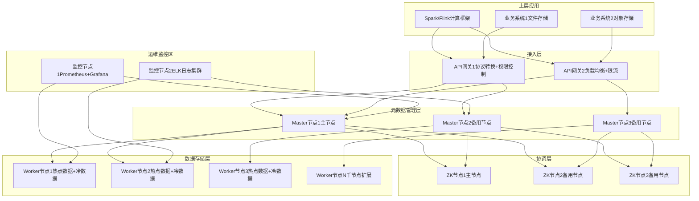
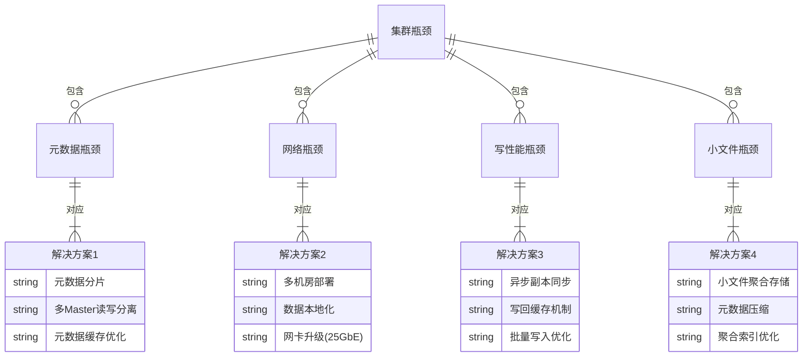
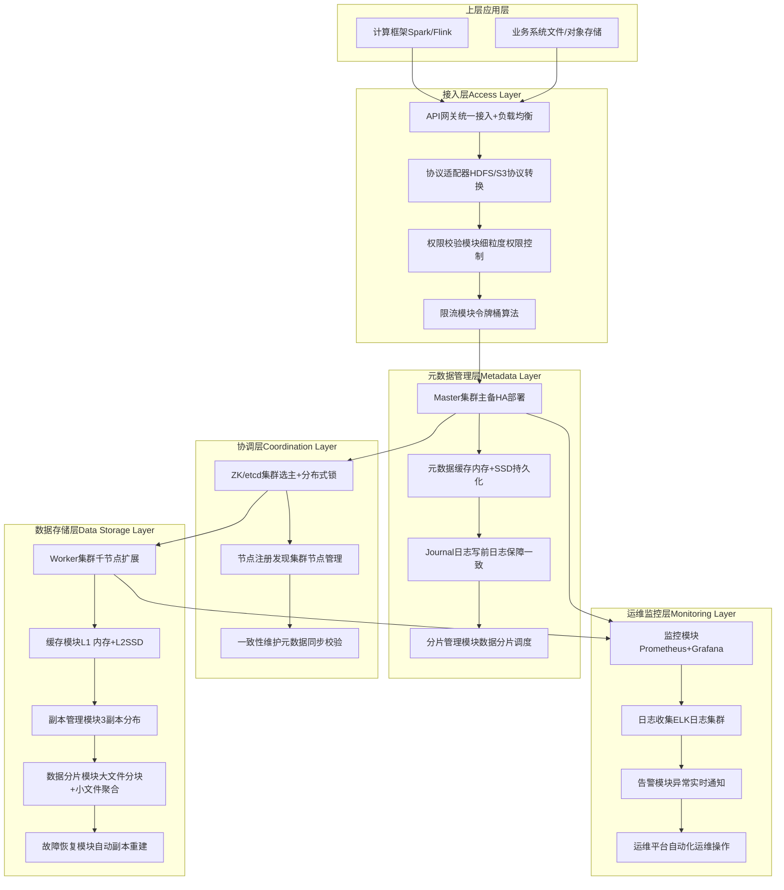
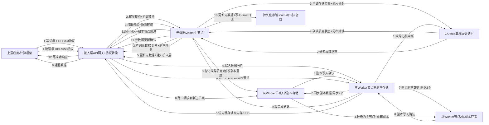
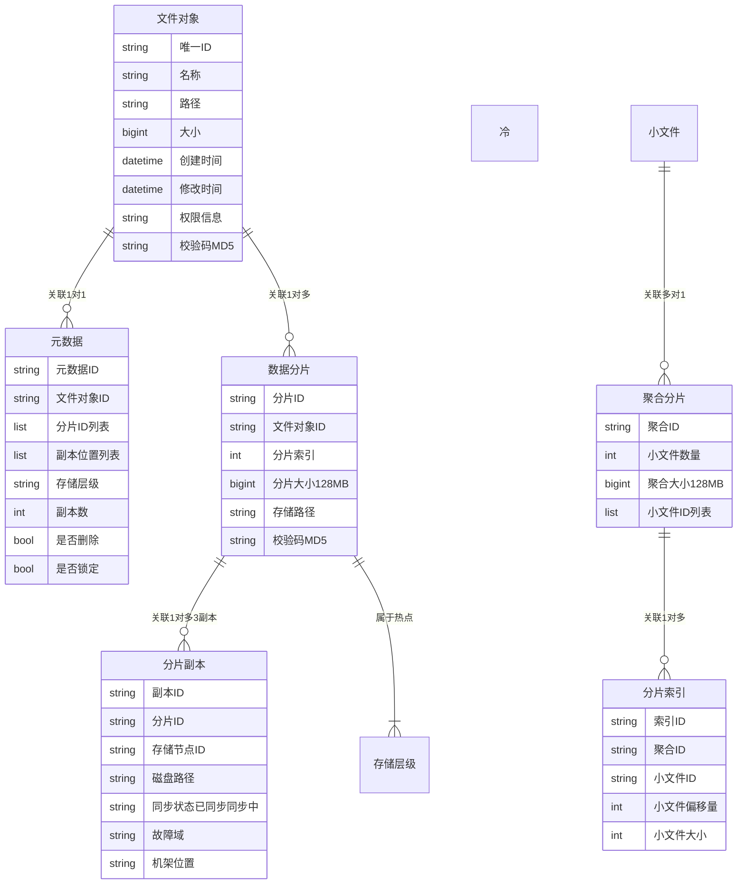
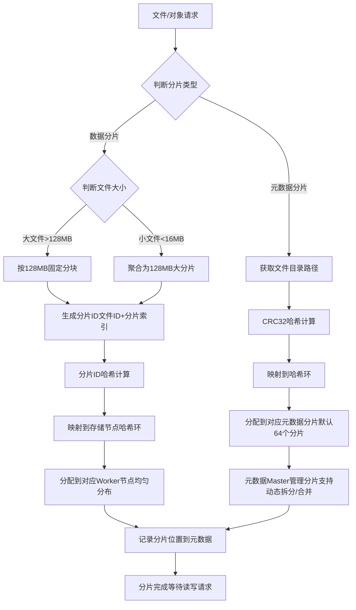
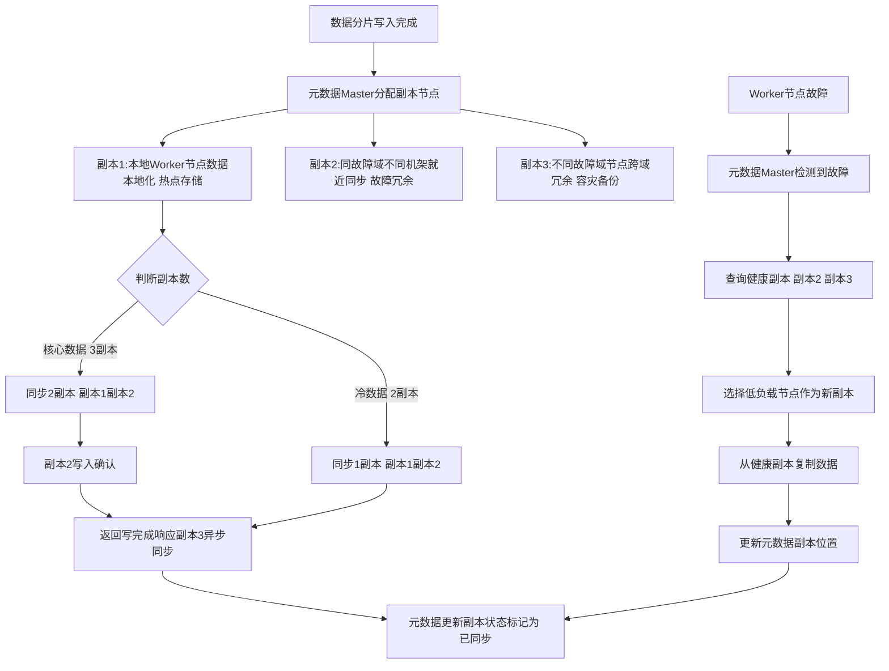
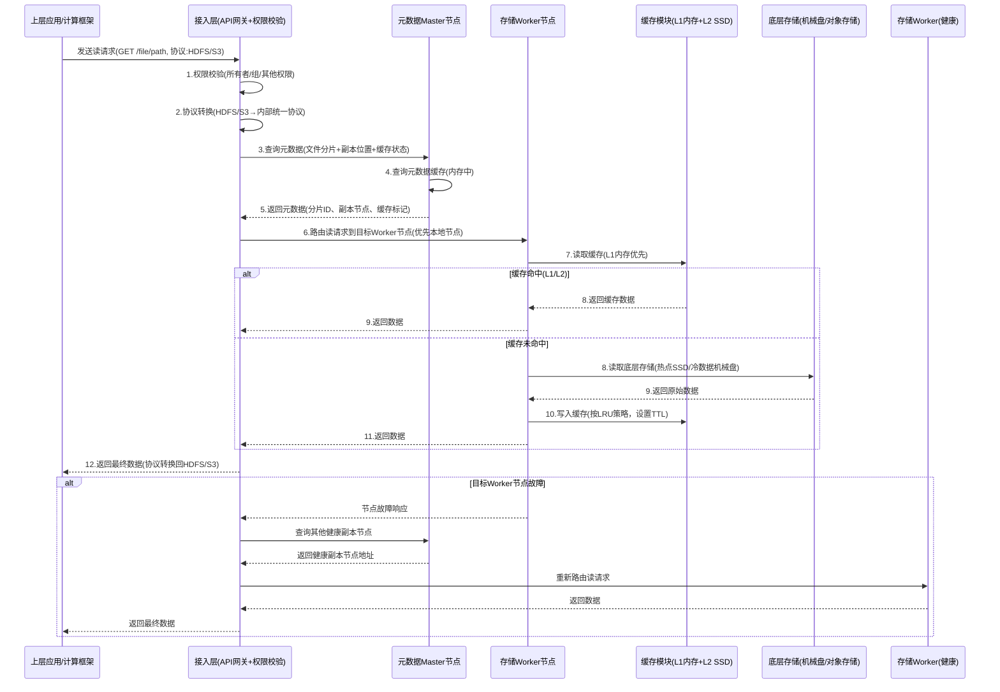
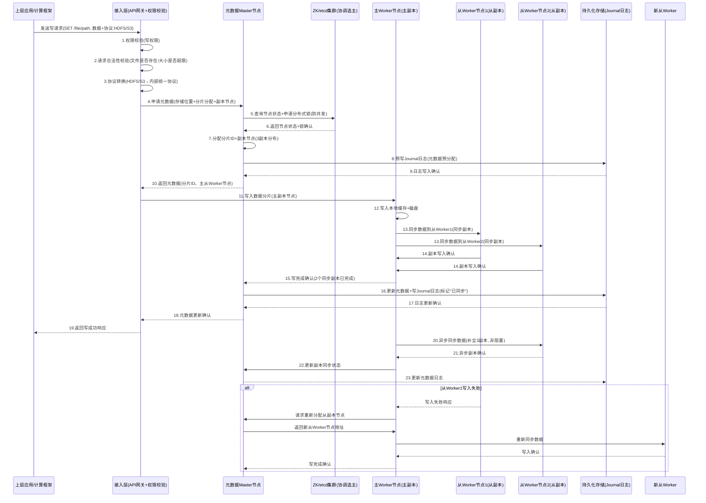
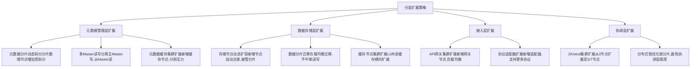

# 分布式存储系统设计方案（完整版，适配面试表达）

说明：本分布式存储系统定位为「通用型分布式对象+文件存储」，支持千节点集群扩展，兼容HDFS、S3等底层存储接入（类似Alluxio数据编排能力），兼顾高可用、高吞吐和数据一致性，完全按照指定框架拆解，每个环节均补充面试高频考点和落地细节，新增多类mermaid图辅助理解。

# 一、需求澄清（设计前提，面试必先讲）

## 1. 功能需求（核心可落地，不冗余）

- 基础存储：支持文件/对象的创建、读取、修改、删除、重命名，支持目录层级管理（类似文件系统）和对象元数据关联。

- 数据管理：支持副本管理（可配置副本数）、数据分片、碎片整理、数据生命周期管理（冷热数据分层）。

- 接入能力：提供统一API接口，兼容HDFS、S3协议，支持上层计算框架（Spark、Flink）和业务系统无缝接入。

- 容错恢复：支持节点故障、网络故障、磁盘故障的自动检测和自动恢复，无需人工干预。

- 扩展能力：支持集群横向扩展（千节点级别），新增节点自动加入集群，承担存储和计算负载。

## 2. 非功能需求（量化指标，面试加分）

- QPS/TPS：日均请求量10亿，平均QPS 1.2万，峰值QPS 6万（峰值系数5）；写TPS平均1000，峰值5000（读多写少，符合分布式存储典型场景）。

- 延迟：读延迟p99≤10ms（缓存命中）、p99≤100ms（缓存未命中，访问本地节点）、p99≤500ms（跨节点访问）；写延迟p99≤50ms。

- 可用性：系统整体可用性≥99.99%（每年故障 downtime ≤52.56分钟）；核心组件（主节点、元数据节点）可用性≥99.999%。

- 一致性：默认提供强一致性（写完成后，所有节点读均为最新数据）；支持可配置一致性级别（强一致/最终一致），适配不同业务场景。

- 数据量：总存储容量100PB，其中热点数据20PB（内存/SSD存储），冷数据80PB（机械盘/底层对象存储）；单文件大小支持1KB~1TB（小文件聚合存储，大文件分块存储）。

- 其他：支持数据加密（传输加密+存储加密）、权限控制（细粒度文件/对象权限）、抗节点故障（单节点故障不影响服务，多节点故障不丢失数据）。

# 二、容量估算（面试必算，体现量化能力）

## 1. QPS估算（验证集群承载能力）

- 日均请求量：10亿 → 平均QPS = 10亿 / 86400 ≈ 1.2万。

- 峰值QPS = 平均QPS × 峰值系数（取5）= 1.2万 × 5 = 6万。

- 读写比例：按分布式存储典型比例10:1（读多写少）→ 峰值读QPS 5.5万，峰值写QPS 5000。

- 单机QPS承载：存储节点（IO密集型）单机峰值读QPS 3000，峰值写QPS 300 → 需存储节点数量：读节点5.5万/3000≈19台，写节点5000/300≈17台，取整20台（读写节点复用，预留冗余）。

## 2. 存储容量估算（区分数据+元数据，重点）

### （1）数据存储容量

核心公式：总存储容量 = 原始数据量 × 副本数 × 膨胀系数（1.2~1.5，取1.3）

- 原始数据量：100PB（热点20PB + 冷数据80PB）。

- 副本数：默认3副本（核心数据），冷数据可配置2副本 → 加权平均副本数2.2。

- 膨胀系数：1.3（含索引、日志、碎片、预留空间）。

- 总存储容量 = 100PB × 2.2 × 1.3 = 286PB。

### （2）元数据存储容量

- 假设总文件/对象数1亿，单条元数据大小1KB（含路径、大小、权限、副本位置等）→ 原始元数据量 = 1亿 × 1KB = 100GB。

- 元数据副本数3副本，膨胀系数1.2 → 元数据总存储容量 = 100GB × 3 × 1.2 = 360GB（元数据量小，可全部放入内存，磁盘仅做持久化备份）。

## 3. 带宽估算（避免网络瓶颈）

- 峰值读带宽：峰值读QPS 5.5万 × 平均读请求大小（假设1MB）= 55GB/s。

- 峰值写带宽：峰值写QPS 5000 × 平均写请求大小（假设1MB）= 5GB/s。

- 网卡配置：存储节点采用10GbE网卡（实际带宽≈1GB/s），20台节点总带宽20GB/s → 读带宽需拆分（跨节点分流），核心节点可配置25GbE网卡，避免网络瓶颈。

- 跨机房带宽：若多机房部署，跨机房带宽预留10GB/s，用于数据同步和故障恢复。

## 4. 机器数估算（按组件拆分，面试清晰）

|组件类型|机器配置（参考）|数量|用途|
|---|---|---|---|
|元数据节点（Master）|CPU 32核、内存128GB、SSD 1TB（元数据持久化）|3台（主备+备用，HA部署）|管理元数据、分片调度、节点管理|
|存储节点（Worker）|CPU 48核、内存64GB、10GbE网卡、SSD 10PB（热点）/ 机械盘 10PB（冷数据）|30台（预留冗余，286PB总容量）|实际存储数据、处理读写请求、缓存热点数据|
|协调节点（ZK/etcd）|CPU 16核、内存32GB、SSD 500GB|3台（奇数，保证quorum）|选主、服务发现、分布式锁、元数据一致性维护|
|监控/运维节点|CPU 16核、内存32GB、SSD 1TB|2台（主备）|监控指标、日志收集、告警、运维管理|
### 集群部署架构图（mermaid部署图）


## 5. 潜在瓶颈（面试必讲，体现问题意识）

- 元数据瓶颈：单主Master节点处理元数据请求，峰值时可能成为瓶颈（解决方案：元数据分片、多Master读写分离）。

- 网络瓶颈：峰值读带宽55GB/s，单机房网络带宽不足（解决方案：多机房部署、数据本地化、网卡升级）。

- 写性能瓶颈：3副本同步写，延迟较高（解决方案：异步副本、写回缓存、批量写入）。

- 小文件瓶颈：大量小文件导致元数据膨胀、IO效率低（解决方案：小文件聚合存储、元数据压缩）。

### 集群潜在瓶颈关系图（mermaid关系图）


# 三、高层架构（分层设计，清晰易懂）

## 1. 分层架构（从上到下，职责明确，面试画图更清晰）

### 分层架构图（mermaid结构图）


### （1）接入层（Access Layer）

- 核心职责：统一接入、协议转换、权限控制、请求路由。

- 核心组件：API网关、协议适配器（HDFS协议适配器、S3协议适配器）、权限校验模块。

- 功能：接收上层业务/计算框架的请求，转换为系统内部统一请求格式，校验权限后路由到对应的元数据节点或存储节点；支持负载均衡，避免单点接入压力。

### （2）元数据管理层（Metadata Layer）

- 核心职责：元数据存储、元数据读写、分片调度、节点状态管理。

- 核心组件：元数据Master集群（主备+备用）、元数据缓存、Journal/WAL日志模块、分片管理模块。

- 功能：维护所有文件/对象的元数据，处理元数据读写请求，调度数据分片和副本分布，监控存储节点状态；元数据优先存储在内存，Journal日志做持久化，保证故障可恢复。

### （3）数据存储层（Data Storage Layer）

- 核心职责：数据存储、数据读写、副本管理、故障恢复、缓存管理。

- 核心组件：存储Worker集群、缓存模块（内存+SSD）、副本管理模块、数据分片模块、故障恢复模块。

- 功能：实际存储数据分片和副本，处理具体的读写IO请求，维护缓存（热点数据），执行副本重建和故障恢复，配合元数据节点完成分片迁移和负载均衡。

### （4）协调层（Coordination Layer）

- 核心职责：集群协调、选主、分布式锁、服务发现。

- 核心组件：ZooKeeper/etcd集群、选主模块、分布式锁模块、节点注册与发现模块。

- 功能：保障元数据Master集群的高可用（选主），提供分布式锁避免并发冲突，管理所有节点的注册与状态，维护集群一致性。

### （5）运维监控层（Monitoring & Operations Layer）

- 核心职责：指标监控、日志收集、告警、运维管理、安全管控。

- 核心组件：监控模块（Prometheus+Grafana）、日志收集模块（ELK）、告警模块、运维管理平台、加密模块。

- 功能：采集集群所有组件的监控指标，收集日志并分析，触发异常告警，提供运维操作界面（节点扩容、故障排查），实现数据传输和存储加密。

## 2. 核心组件交互（数据流，面试必讲）

### 核心组件数据流图（mermaid流程图）


1. 写数据流：上层请求 → 接入层（权限校验、协议转换）→ 元数据Master（申请存储位置、分配分片）→ 存储Worker（写入数据、同步副本）→ 元数据Master（更新元数据、记录Journal日志）→ 接入层（返回写成功响应）。

2. 读数据流：上层请求 → 接入层（权限校验、协议转换）→ 元数据Master（查询数据存储位置、缓存状态）→ 存储Worker（读取数据，优先缓存）→ 接入层（返回数据）。

3. 故障数据流：存储Worker故障 → 协调层（ZK）检测心跳异常 → 元数据Master（标记故障节点、触发副本重建）→ 健康存储Worker（重建副本）→ 元数据Master（更新元数据）→ 故障恢复完成。

# 四、数据模型 & 分片（分布式存储核心，面试重点）

## 1. 数据模型（清晰定义数据结构，落地性强）

### （1）元数据模型（核心，分两类）

- 文件/对象元数据（核心）：

- 基础字段：唯一ID、名称、路径、大小、创建时间、修改时间、访问时间、权限信息（所有者、组、读写执行权限）。

- 存储字段：分片ID列表、每个分片的副本位置（节点ID、磁盘路径）、存储层级（热点/冷数据）、副本数。

- 状态字段：是否删除（逻辑删除）、是否锁定（并发控制）、数据校验码（MD5，保证完整性）。

集群节点元数据：
      

- 基础字段：节点ID、IP地址、端口、组件类型（元数据节点/存储节点）、机架位置、故障域。

- 资源字段：CPU使用率、内存使用率、磁盘容量、剩余容量、网络带宽、缓存使用率。

- 状态字段：在线/离线、健康状态、承担的分片列表。

### （2）数据模型（实际存储的数据结构）

### 数据模型关系图（mermaid er图）


- 数据分片（Block）：将大文件拆分为固定大小的分片（默认128MB，可配置），每个分片有唯一ID，独立存储和管理。

- 分片副本：每个分片的副本有唯一标识，记录所属分片ID、存储节点、磁盘路径、同步状态（已同步/同步中）。

- 小文件聚合：小于16MB的小文件，聚合为一个128MB的大分片存储，减少元数据量和IO开销，聚合文件有独立的索引，记录小文件的位置和大小。

## 2. 分片策略（适配千节点扩展，面试必讲）

核心原则：分片均匀、避免热点、扩缩容影响小、支持故障域隔离，采用「哈希分片+范围分片」结合的策略，分两层分片。

### 双层分片策略流程图（mermaid流程图）


### （1）第一层分片：目录哈希分片（元数据分片）

- 逻辑：按文件/对象的目录路径做哈希（采用一致性哈希算法），将不同目录的元数据分配到不同的元数据分片。

- 优势：目录级别的元数据隔离，避免单个目录元数据过多导致的分片过载；扩缩容时，仅影响部分目录的元数据，影响范围小。

- 细节：元数据分片数可配置（默认64个），支持动态拆分和合并；每个元数据分片由一个元数据Master节点负责管理。

### （2）第二层分片：文件分块分片（数据分片）

- 逻辑：单个大文件（超过128MB）按固定大小（128MB）拆分为多个数据分片；小文件聚合为大分片后，按大文件规则处理。

- 分片ID生成：采用「文件ID + 分片索引」的方式生成，确保全局唯一；同时，对分片ID做哈希，分配到不同的存储节点。

- 优势：数据分片大小均匀，IO效率高；支持并行读写（多个分片同时读写），提升吞吐量；单个分片故障，仅影响文件的部分内容，不影响整体可用性。

## 3. 副本策略（保障数据高可用，面试必讲）

### 副本分布与同步流程图（mermaid流程图）


### （1）副本数配置（可动态调整）

- 核心数据（热点数据）：3副本，确保任意2个节点故障，数据不丢失。

- 冷数据：2副本，平衡可用性和存储成本。

- 临时数据：1副本，降低存储开销（业务自行承担数据丢失风险）。

### （2）副本分布策略（机架感知，避免故障扩散）

- 核心原则：3副本分布在「不同故障域、不同机架、不同节点」，避免单个机架/故障域故障导致副本全部丢失。

- 具体分布：1个副本在本地节点（数据本地化，提升读写速度），1个副本在同故障域的不同机架节点，1个副本在不同故障域的节点。

### （3）副本同步策略

- 写副本：默认「同步2副本+异步1副本」，确保写完成后，至少2个副本可用（保证强一致性），第3个副本异步同步（提升写性能）。

- 副本修复：当副本丢失（节点故障）时，元数据Master触发副本修复，从健康副本复制数据，优先选择负载低、网络近的节点作为新副本节点。

# 五、核心读写路径（面试重中之重，讲清每一步）

## 1. 读路径（优先缓存，提升性能，贴合读多写少场景）

### 文件读取全流程序列图（mermaid序列图，核心要求）


1. 请求接入：上层业务/计算框架通过HDFS/S3协议发送读请求（如读取某个文件），接入层接收请求，校验请求合法性（权限、路径是否存在）。

2. 元数据查询：接入层将请求路由到对应的元数据Master节点，查询该文件的元数据（分片ID、副本位置、缓存状态）。

3. 缓存判断：元数据Master返回元数据，接入层判断该文件是否在缓存中（优先查询本地存储节点缓存，再查询远端缓存）。

4. 缓存命中：若缓存命中，接入层路由请求到缓存所在的存储Worker节点，Worker节点从内存/SSD缓存中读取数据，返回给接入层，最终返回给上层请求方（延迟p99≤10ms）。

5. 缓存未命中：若缓存未命中，接入层根据元数据中的副本位置，选择距离最近（数据本地化）、负载最低的存储Worker节点，Worker节点从本地磁盘（热点数据）或底层存储（冷数据）读取数据，返回给接入层；同时，将该数据写入缓存（按LRU策略），方便后续读取（延迟p99≤100ms）。

6. 异常处理：若选中的Worker节点故障，接入层自动切换到其他健康的副本节点，重复步骤4/5；若所有副本节点故障，返回读失败响应，并触发告警。

## 2. 写路径（保证一致性，兼顾性能）

### 文件写入全流程序列图（mermaid序列图，核心要求）


1. 请求接入：上层业务发送写请求（如创建文件、写入数据），接入层接收请求，校验权限和请求合法性（如文件是否已存在、写入大小是否超限）。

2. 元数据申请：接入层路由请求到元数据Master节点，申请文件的存储位置、分片ID（大文件拆分分片）、副本分配（按副本分布策略分配3个副本节点）。

3. 元数据预分配：元数据Master分配分片ID和副本节点，更新元数据（标记分片为“同步中”），记录Journal日志（写前日志，保证故障可恢复），返回元数据（分片ID、副本节点位置）给接入层。

4. 数据写入：接入层将数据分片，路由到对应的3个存储Worker节点（主副本节点+2个从副本节点），主副本节点先写入数据到本地缓存和磁盘，同时同步数据到2个从副本节点。

5. 副本确认：2个从副本节点写入数据完成后，返回确认响应给主副本节点，主副本节点汇总响应后，返回“写完成”给接入层（同步2副本，异步1副本，保证强一致性）。

6. 元数据更新：接入层通知元数据Master节点，更新元数据（标记分片为“已同步”，更新副本状态），记录Journal日志，元数据Master返回“元数据更新完成”。

7. 响应返回：接入层返回“写成功”响应给上层请求方；异步副本（第3个副本）后续完成同步，同步完成后更新元数据。

8. 异常处理：若某个副本节点写入失败，主副本节点重新选择健康节点，触发副本重建；若主副本节点故障，接入层切换到从副本节点，重新执行写入流程；写入失败时，回滚元数据和已写入的数据，避免数据不一致。


## 3. 缓存策略（提升读性能，类似Alluxio缓存机制）

### 三级缓存架构图（mermaid结构图）

```mermaid

flowchart TD
    subgraph 存储Worker节点
        direction TB
        A[L1缓存内存最热数据微秒级读取]
        B[L2缓存SSD次热数据毫秒级读取]
        C[L3缓存远端共享缓存热点非高频数据十毫秒级读取]
        D[底层存储机械盘/对象存储冷数据百毫秒级读取]
    end
    
    %% 缓存层级关系
    A -- 淘汰策略(LRU+LFU) --> B
    B -- 淘汰策略(LRU+LFU) --> C
    C -- 淘汰策略(LRU) --> D
    
    %% 数据流动
    读请求 -- 优先读取 --> A
    A -- 未命中 --> B
    B -- 未命中 --> C
    C -- 未命中 --> D
    D -- 读取数据 --> C
    C -- 缓存数据 --> B
    B -- 缓存数据 --> A
    
    %% 缓存特性标注
    note over A: 容量小(单机16GB)、速度快存储最近1小时热点数据
    note over B: 容量中等(单机1TB)、速度较快存储最近24小时热点数据
    note over C: 容量大(集群共享100TB)、速度中等存储最近7天热点数据
    note over D: 容量极大、速度慢存储冷数据+全量备份

```
### （1）三级缓存架构设计（核心，面试必讲）

采用「L1内存缓存 + L2 SSD缓存 + L3远端共享缓存」的三级缓存架构，贴合分布式存储“读多写少”场景，最大化提升读性能，同时平衡缓存成本和命中率，类似Alluxio的分层缓存思想，但适配分布式存储节点扩展特性。

- L1缓存（内存）：单机部署，容量较小（默认16GB/节点），存储最近1小时内访问频率最高的热点数据（如高频读取的小文件、大文件分片），读取延迟微秒级（≤1ms）；采用写回（Write Back）策略，写入时先更新缓存，再异步刷盘，提升写性能；故障时缓存数据丢失，但不影响底层数据一致性（可从L2缓存或底层存储恢复）。

- L2缓存（SSD）：单机部署，容量中等（默认1TB/节点），存储最近24小时内访问的次热数据，以及L1缓存淘汰的数据，读取延迟毫秒级（≤10ms）；采用写透（Write Through）策略，写入时同时更新缓存和底层存储，保证缓存与数据一致性；SSD缓存寿命长、IOPS高，适合承载次热点数据的高频读取。

- L3缓存（远端共享缓存）：集群级部署，多节点共享，容量较大（默认100TB集群共享），存储最近7天内访问的热点非高频数据，以及L2缓存淘汰的数据，读取延迟十毫秒级（≤50ms）；采用分布式缓存架构（类似Redis Cluster），由专门的缓存节点集群管理，支持跨节点缓存共享，避免单个节点缓存命中率低的问题；故障时可从其他缓存节点或底层存储恢复数据。

### （2）缓存淘汰策略（适配不同缓存层级，面试高频）

核心原则：兼顾访问频率和访问时间，避免无效缓存占用资源，不同层级采用差异化淘汰策略，提升整体缓存命中率（目标缓存命中率≥95%）。

- L1/L2缓存：采用「LRU（最近最少使用）+ LFU（最不经常使用）」混合淘汰策略。LRU保证最近访问的数据不被淘汰，LFU保证高频访问的数据不被淘汰，解决单一LRU策略下“偶发高频数据被淘汰”、单一LFU策略下“旧高频数据长期占用缓存”的问题；淘汰阈值设置为缓存容量的80%，避免缓存满溢导致的性能抖动。

- L3缓存：采用「LRU（最近最少使用）」淘汰策略。由于L3缓存存储的是热点非高频数据，访问频率差异不大，LRU策略简单高效、开销低，同时结合缓存TTL（生存时间），默认TTL为7天，过期数据自动淘汰，避免缓存数据过期导致的一致性问题。

### （3）缓存一致性保障（面试重点，避免缓存脏数据）

缓存一致性是分布式存储的核心难点，本方案通过“分层策略+主动更新+被动失效”三重机制，保证缓存与底层数据一致，同时兼顾性能。

```mermaid

flowchart TD
    A[缓存一致性保障机制] --> B[分层更新策略]
    A --> C[主动更新机制]
    A --> D[被动失效机制]
    
    B --> B1[L1缓存:写回策略写入先更缓存,异步刷盘]
    B --> B2[L2缓存:写透策略写入同步更缓存+底层存储]
    B --> B3[L3缓存:异步更新策略底层数据更新后,异步更缓存]
    
    C --> C1[数据更新时主动删除对应缓存(Invalidate)]
    C --> C2[元数据Master推送更新通知所有缓存节点同步失效对应缓存]
    C --> C3[定时校验(每10分钟)对比缓存与底层数据校验码(MD5)]
    
    D --> D1[缓存访问时校验数据校验码不一致则失效缓存,重新加载]
    D --> D2[缓存失效时返回底层数据,同时更新缓存]
    D --> D3[节点故障恢复时清空本地缓存,重新从健康节点加载]

```
- 分层更新策略：结合不同缓存层级的特性，采用差异化更新策略，平衡一致性和性能。L1缓存写回、L2缓存写透、L3缓存异步更新，既保证核心缓存（L2）的一致性，又避免写性能被同步更新拖累。

- 主动更新机制：数据发生修改/删除时，元数据Master主动推送更新通知，所有缓存节点（L1/L2/L3）同步删除对应缓存（Invalidate策略，而非Update策略），避免缓存脏数据；同时定时（每10分钟）校验缓存与底层数据的MD5校验码，发现不一致则立即失效缓存、重新加载。

- 被动失效机制：缓存访问时，先校验数据校验码和缓存TTL，若缓存过期或校验码不一致，则被动失效缓存，从底层存储读取最新数据，同时更新缓存；节点故障恢复时，清空本地L1/L2缓存，重新从L3缓存或底层存储加载数据，避免故障节点缓存数据过期。

### （4）缓存优化技巧（面试加分项）

- 缓存预热：集群启动、节点扩容或缓存失效后，主动加载最近访问的热点数据到缓存（从底层存储或其他健康节点加载），避免缓存冷启动导致的读性能下降；可通过元数据Master统计的热点数据列表，定向预热。

- 缓存分片：L3远端共享缓存采用分片存储，按缓存数据的哈希值分配到不同缓存节点，避免单一缓存节点过载；缓存分片与数据分片一一对应，提升缓存查询效率（根据数据分片ID即可定位缓存分片）。

- 小文件缓存优化：将聚合后的小文件分片整体缓存，同时缓存小文件索引，避免单个小文件缓存导致的缓存碎片化；L1缓存优先缓存小文件索引和高频小文件，提升小文件读取速度。

- 缓存限流：当缓存节点负载过高（CPU≥80%、内存≥90%）时，暂时停止缓存更新，优先返回底层数据，避免缓存节点故障导致整体读性能下降；同时触发缓存扩容，新增缓存节点分担负载。

### （5）面试高频问题&应答（重点准备）

- 问题1：为什么采用三级缓存，而不是两级或一级？
应答：一级缓存（仅内存）容量小、成本高，无法承载大量热点数据；两级缓存（内存+SSD）缺乏跨节点共享能力，单个节点缓存命中率低；三级缓存通过“本地快缓存+远端共享缓存”的组合，平衡了速度、容量和成本，既保证高频数据的快速读取，又能承载大量热点非高频数据，适配千节点集群的扩展需求。

- 问题2：缓存一致性的核心难点是什么？你们是怎么解决的？
应答：核心难点是“分布式环境下，数据更新后，所有节点的缓存同步失效”，同时要平衡一致性和性能。我们通过“分层更新策略+主动更新+被动失效”三重机制解决：写透保证L2缓存一致性，写回提升L1性能；主动删除缓存避免脏数据，定时校验兜底；被动失效解决漏删、误删缓存的问题，确保缓存与底层数据一致。

- 问题3：缓存淘汰策略为什么选择LRU+LFU混合策略？
应答：单一LRU策略会淘汰“偶发高频数据”（比如某数据每月爆发一次高频访问，平时不访问，LRU会淘汰它），单一LFU策略会保留“旧高频数据”（比如某数据过去高频访问，现在不访问，LFU会一直保留它）；混合策略结合两者优势，既保证最近访问的数据不被淘汰，又保证高频访问的数据不被淘汰，提升缓存命中率。

# 六、容错与高可用设计（面试必讲，体现可靠性思维）

## 1. 核心容错目标（量化指标，贴合非功能需求）

系统整体可用性≥99.99%，核心组件可用性≥99.999%；支持单节点、多节点、机架、故障域级别的故障，故障发生后自动恢复，无需人工干预；数据丢失率为0（核心数据3副本，冷数据2副本，多故障域分布）。

## 2. 分层容错设计（按组件拆分，清晰易懂）

```mermaid

flowchart TD
    A[分层容错设计] --> B[接入层容错]
    A --> C[元数据管理层容错]
    A --> D[数据存储层容错]
    A --> E[协调层容错]
    A --> F[运维监控层容错]
    
    B --> B1[API网关主备部署故障自动切换]
    B --> B2[请求重试机制失败重试3次,间隔100ms]
    B --> B3[限流熔断避免雪崩效应]
    
    C --> C1[Master集群HA部署主备+备用,ZK选主]
    C --> C2[Journal日志持久化故障后基于日志恢复元数据]
    C --> C3[元数据分片备份每个分片多副本存储]
    
    D --> D1[3副本分布(多故障域)任意2节点故障不丢数据]
    D --> D2[节点故障自动检测心跳检测(间隔1s),超时3s标记故障]
    D --> D3[副本自动重建故障后10分钟内完成重建]
    D --> D4[磁盘故障检测SMART检测,坏道自动隔离]
    
    E --> E1[ZK/etcd集群(3节点)半数以上节点存活即可提供服务]
    E --> E2[数据同步机制主从同步,保证集群数据一致]
    
    F --> F1[监控节点主备部署故障后自动切换,不中断监控]
    F --> F2[日志多副本存储跨节点备份,避免日志丢失]

```
### （1）接入层容错

- API网关主备部署：部署2台API网关节点（主备），通过ZK实现服务发现和故障切换，主节点故障后，备用节点100ms内接管服务，不中断上层请求。

- 请求重试与幂等性：接入层对失败的请求（网络超时、节点故障）自动重试3次，间隔100ms，避免瞬时故障导致的请求失败；所有请求均实现幂等性（基于请求ID去重），避免重试导致的数据重复写入。

- 限流与熔断：采用令牌桶算法实现限流，峰值时拒绝超出集群承载能力的请求，返回友好提示；当后端组件（元数据节点、存储节点）故障时，接入层触发熔断机制，暂时停止请求路由，避免雪崩效应，故障恢复后自动解除熔断。

### （2）元数据管理层容错（核心，避免元数据丢失）

- Master集群HA部署：3台Master节点（主备+备用），通过ZK实现选主机制，主节点负责处理所有元数据请求，备用节点实时同步主节点的元数据和Journal日志，主节点故障后，备用节点1s内完成选主，接管服务，无数据丢失。

- Journal日志持久化：元数据的所有修改操作（新增、删除、更新）均先写入Journal日志（SSD存储，3副本），再更新内存元数据，确保故障后可基于Journal日志恢复元数据，无数据丢失；日志保留7天，用于故障排查和数据恢复。

- 元数据分片备份：元数据分片（默认64个）采用3副本存储，分布在不同的Master节点和磁盘，单个分片故障后，可从其他副本快速恢复，不影响整体元数据服务。

### （3）数据存储层容错（核心，避免数据丢失）

- 多副本容错：核心数据3副本、冷数据2副本，分布在不同故障域、不同机架、不同节点，单个节点、机架甚至故障域故障，均不会导致数据丢失；比如单节点故障，仅影响该节点上的副本，健康节点的副本可正常提供服务。

- 故障自动检测：通过心跳机制（节点每1s向ZK发送心跳）检测节点状态，超时3s标记节点为故障状态；同时通过SMART技术检测磁盘状态，发现坏道、磁盘损坏时，自动隔离故障磁盘，避免数据损坏。

- 副本自动重建：节点故障后，元数据Master立即触发副本重建，从健康副本复制数据，优先选择负载低、网络近的节点作为新副本节点；副本重建速度≥100MB/s，1TB数据10分钟内完成重建，重建期间不影响数据读写。

- 数据校验与修复：定时（每小时）校验数据的MD5校验码，发现数据不一致（缓存脏数据、磁盘坏道导致的数据损坏）时，自动从健康副本修复数据；同时支持手动触发数据校验和修复，适配运维需求。

### （4）协调层容错

- ZK/etcd集群容错：3台ZK/etcd节点（奇数），采用主从同步机制，半数以上节点存活即可提供服务（比如1台节点故障，剩余2台正常工作，不影响服务）；节点故障后，自动触发主从切换，同步数据，无服务中断。

- 分布式锁容错：采用临时有序节点实现分布式锁，节点故障后，临时节点自动删除，锁自动释放，避免死锁；同时设置锁超时时间（默认30s），防止节点卡住导致锁无法释放。

## 3. 故障恢复流程（面试必讲，讲清全流程）

以“存储Worker节点故障”为例，完整故障恢复流程（贴合实际落地，面试画图更清晰）：

```mermaid

sequenceDiagram
    participant 故障Worker as 故障Worker节点
    participant ZK集群 as ZK/etcd集群
    participant 元数据Master as 元数据Master节点
    participant 健康Worker1 as 健康Worker节点1(副本1)
    participant 健康Worker2 as 健康Worker节点2(副本2)
    participant 新Worker as 新Worker节点(重建副本)
    participant 接入层 as 接入层
    
    %% 故障检测
    故障Worker--x>ZK集群: 心跳中断(故障)
    ZK集群->>ZK集群: 检测到节点故障(超时3s)
    ZK集群->>元数据Master: 推送节点故障通知(节点ID、故障时间)
    
    %% 故障处理
    元数据Master->>元数据Master: 1.标记故障节点为"离线"
    元数据Master->>元数据Master: 2.查询故障节点上的分片和副本信息
    元数据Master->>接入层: 3.通知接入层,停止路由请求到故障节点
    接入层->>元数据Master: 确认通知,已切换请求路由
    
    %% 副本重建
    元数据Master->>健康Worker1: 4.查询健康副本(副本1)状态
    健康Worker1-->>元数据Master: 返回副本状态(正常,数据完整)
    元数据Master->>新Worker: 5.分配新Worker节点,触发副本重建
    健康Worker1->>新Worker: 6.复制数据分片(速度≥100MB/s)
    新Worker->>元数据Master: 7.副本重建完成,返回校验码(MD5)
    元数据Master->>元数据Master: 8.校验MD5,确认数据一致
    元数据Master->>元数据Master: 9.更新元数据,标记新副本为"已同步"
    
    %% 故障恢复
    元数据Master->>接入层: 10.通知接入层,新节点可接收请求
    接入层->>新Worker: 11.路由请求到新Worker节点
    元数据Master->>ZK集群: 12.更新节点状态,新Worker节点注册
    ZK集群-->>元数据Master: 节点注册完成
    
    note over 元数据Master: 故障恢复完成总耗时≤10分钟数据无丢失,服务无中断

```
## 4. 面试高频问题&应答

- 问题1：你们的系统如何保证“数据零丢失”？
应答：核心是“多副本+持久化+故障自动恢复”三重保障。核心数据3副本、冷数据2副本，分布在不同故障域、机架、节点，避免单点故障导致数据丢失；元数据修改先写Journal日志（3副本），数据写入同步2副本，确保写入完成后数据不丢失；节点故障后，10分钟内自动重建副本，从健康副本复制数据，确保数据完整性。

- 问题2：Master节点故障后，恢复流程是什么？如何保证无服务中断？
应答：恢复流程分3步：1. ZK检测到Master主节点故障（心跳中断3s），立即触发选主机制，从备用Master节点中选举新主；2. 新主节点从Journal日志中恢复元数据（耗时≤1s），同步所有元数据分片和节点状态；3. 新主节点注册到ZK，接入层自动切换请求路由到新主。整个过程耗时≤2s，无服务中断，上层请求无感知。

- 问题3：副本重建为什么选择“负载低、网络近”的节点？
应答：两个核心原因：1. 负载低的节点可快速完成副本重建，不影响自身的读写服务，避免集群负载过高；2. 网络近的节点（同机架、同故障域）可提升数据复制速度，缩短副本重建时间，减少“副本缺失”的窗口，提升系统可用性；同时可降低跨网络带宽消耗，避免网络瓶颈。

# 七、扩展性设计（千节点集群，面试体现扩展思维）

## 1. 扩展目标（量化，贴合容量估算）

支持集群横向扩展至千节点级别，新增节点自动加入集群，无需人工配置；扩展过程中不中断服务，不影响数据一致性；扩展后集群QPS、存储容量、带宽线性提升（扩展10倍节点，QPS提升8~9倍，预留冗余）。

## 2. 核心扩展策略（分层扩展，避免瓶颈）


### （1）元数据管理层扩展（解决元数据瓶颈）

- 元数据分片动态拆分：元数据分片数可动态拆分（默认64个，最大可拆分至1024个），当集群节点增加、元数据量增长时，自动将大分片拆分为小分片，分配到新增的Master节点，避免单Master节点过载；拆分过程中不中断元数据服务，采用“先拆分、再同步、最后切换”的流程，保证数据一致性。

- 多Master读写分离：主Master节点负责处理元数据写请求（新增、删除、更新），从Master节点负责处理元数据读请求，读请求负载均匀分配到所有从Master节点，提升元数据读性能；主从节点实时同步元数据，保证读写一致性。

- 元数据缓存集群扩展：L3远端共享缓存采用Redis Cluster架构，支持横向扩展，新增缓存节点自动加入集群，分担缓存读写压力；缓存分片与元数据分片一一对应，扩展后缓存命中率不下降。

### （2）数据存储层扩展（核心，千节点扩展关键）

- 存储节点动态扩容：新增存储Worker节点时，节点自动向ZK注册，元数据Master检测到新增节点后，自动分配分片和副本（优先分配负载高的分片），新增节点无需人工配置，即可接管存储和读写负载；扩容过程中不中断服务，不影响数据一致性。

- 数据分片动态迁移：采用“负载均衡迁移”策略，元数据Master定时（每5分钟）统计所有存储节点的负载（CPU、内存、磁盘、IO），当节点负载不均衡（最大负载/最小负载>2）时，自动将高负载节点的分片迁移到低负载节点；迁移过程采用“先复制、再同步、最后切换”的流程，不中断数据读写，迁移速度可配置（默认100MB/s）。

- 分片数动态调整：当集群存储容量增长、文件数增多时，自动增加数据分片数（默认分片大小128MB，可动态调整），避免单个分片过大导致的迁移、故障恢复效率低的问题；分片数调整过程中，不影响现有数据的读写。

### （3）接入层&协调层扩展

- 接入层扩展：API网关支持集群部署，新增网关节点时，自动加入负载均衡集群，分担接入压力；支持按协议拆分网关节点（HDFS协议网关、S3协议网关），提升协议转换效率，避免单一网关节点过载。

- 协调层扩展：ZK/etcd集群支持从3节点扩展至5节点、7节点，扩展过程中不中断服务，新增节点自动同步数据；当集群节点数超过500时，采用ZK分片部署，避免单一ZK集群成为瓶颈。

## 3. 扩展流程（以“新增10台存储节点”为例，面试必讲）

1. 节点准备：新增10台存储Worker节点，配置符合集群标准（CPU 48核、内存64GB、10GbE网卡），安装集群客户端，配置节点信息（IP、端口、故障域、机架位置）。

2. 节点注册：新增节点启动后，自动向ZK集群注册，上报自身配置和资源状态（CPU、内存、磁盘容量）；ZK集群将节点注册信息推送至元数据Master节点。

3. 负载分配：元数据Master统计现有节点的负载，将高负载节点的分片（每个节点分配5~10个分片）分配到新增节点，同时分配副本重建任务（从健康节点复制副本）。

4. 分片迁移与副本重建：新增节点接收分片迁移任务，从源节点复制数据分片，同时重建副本（核心数据3副本）；迁移过程中，源节点和新增节点同时提供读服务，写服务暂时路由到源节点，迁移完成后切换写服务。

5. 扩展完成：所有分片迁移和副本重建完成后，元数据Master更新元数据（分片位置、节点负载），接入层自动将请求路由到新增节点；扩展完成后，集群总存储容量提升，负载均匀分配，服务不中断。

## 4. 面试高频问题&应答

- 问题1：千节点集群扩展的核心瓶颈是什么？你们是怎么解决的？
应答：核心瓶颈是“元数据分片过载”和“分片迁移效率低”。解决方式：1. 元数据分片动态拆分，随节点增加拆分分片，多Master读写分离，避免元数据瓶颈；2. 分片迁移采用“先复制、再同步、最后切换”的流程，不中断读写，同时控制迁移速度，避免影响现有服务；3. 分片分配基于故障域和机架位置，平衡负载的同时，保证高可用。

- 问题2：新增节点后，为什么要优先分配高负载节点的分片？
应答：核心是“负载均衡”，避免新增节点空闲、原有节点过载的情况，让集群整体负载均匀，提升集群的QPS和吞吐量；同时，高负载节点通常是存储热点数据的节点，将热点分片分配到新增节点，可分担热点读写压力，避免热点瓶颈。

- 问题3：扩展过程中，如何保证数据一致性和服务不中断？
应答：数据一致性：分片迁移采用“先复制、再同步、最后切换”，迁移过程中，源节点和目标节点的数据实时同步，切换前校验数据一致性（MD5），确保无数据丢失、无数据不一致；服务不中断：迁移过程中，读服务同时在源节点和目标节点提供，写服务暂时在源节点提供，切换时瞬间完成，上层请求无感知；元数据更新采用Journal日志持久化，避免扩展过程中故障导致的元数据丢失。

# 八、一致性设计（分布式存储核心难点，面试重中之重）

## 1. 一致性定义与级别（先明确概念，面试不慌）

一致性：指多个节点同时访问同一数据时，看到的数据是一致的（即写操作完成后，所有读操作都能看到最新的数据）。本方案支持可配置一致性级别，适配不同业务场景，默认提供强一致性（贴合核心非功能需求）。

```mermaid

flowchart TD
    A[一致性级别（从强到弱）] --> B[强一致性]
    A --> C[顺序一致性]
    A --> D[最终一致性]
    
    B -- 默认级别 --> B1[核心业务场景金融、医疗数据存储]
    B -- 实现方式 --> B2[同步2副本+异步1副本写完成后,2个副本可用]
    B -- 性能 --> B3[写延迟中等(p99≤50ms)读延迟低]
    
    C -- 适用场景 --> C1[普通业务场景日志存储、非核心数据]
    C -- 实现方式 --> C2[同步1副本+异步2副本写完成后,1个副本可用]
    C -- 性能 --> C3[写延迟较低读延迟中等]
    
    D -- 适用场景 --> D1[高吞吐场景视频、图片存储]
    D -- 实现方式 --> D2[异步3副本写完成后,无需等待副本同步]
    D -- 性能 --> D3[写延迟最低读延迟可能较高(需等待同步)]
```
## 2. 核心一致性实现机制（面试必讲，落地性强）

本方案默认采用强一致性，核心通过“写前日志（Journal）+ 同步副本 + 分布式锁 + 校验机制”四重机制实现，兼顾一致性和性能。

### （1）写前日志（Journal/WAL）机制

- 核心逻辑：所有元数据修改、数据写入操作，均先写入Journal日志（SSD存储，3副本），再执行实际的修改/写入操作，日志写入成功后，才算操作开始执行；若操作过程中节点故障，重启后可基于Journal日志恢复数据，避免数据丢失或不一致。

- 细节：日志采用“顺序写入”方式，IO效率高；日志包含操作类型（新增/删除/更新）、数据ID、数据内容、时间戳、校验码等信息，便于故障恢复和数据校验；日志保留7天，过期自动清理（可配置保留时间）。

### （2）同步副本机制（强一致性核心）

- 写操作一致性：默认“同步2副本+异步1副本”。写请求到达后，主副本节点先写入数据和Journal日志，再同步数据到1个从副本节点，待从副本节点写入完成、返回确认后，才算写操作完成（保证至少2个副本有最新数据）；第3个副本异步同步，不影响写操作响应速度。

- 读操作一致性：读请求优先读取本地副本，读取前校验数据校验码和时间戳，若发现数据不是最新的（比如副本同步未完成），则切换到最新副本读取；同时，元数据Master实时维护副本同步状态，确保读请求路由到最新副本。

### （3）分布式锁机制（避免并发冲突）

- 核心逻辑：采用ZK临时有序节点实现分布式锁，当多个节点同时修改同一数据时，只有获取锁的节点才能执行修改操作，其他节点等待锁释放，避免并发修改导致的数据不一致。

- 细节：锁的粒度为“分片级”，而非“文件级”，避免锁粒度太小导致的锁竞争频繁；锁超时时间默认30s，防止节点卡住导致锁无法释放；锁释放采用“主动释放+超时自动释放”双重机制，确保锁可用性。

### （4）数据校验与同步机制（兜底保障）

- 定时校验：每小时校验一次所有数据的MD5校验码，对比不同副本的数据一致性，发现不一致时，自动从最新副本修复数据；元数据定时（每10分钟）校验，对比主从Master节点的元数据，确保元数据一致。

- 异步同步补偿：对于异步同步的副本，若同步过程中出现网络故障、节点故障，故障恢复后，自动触发同步补偿，追赶最新数据；同步完成后，更新副本同步状态，确保所有副本最终一致。

## 3. 不同一致性级别的切换（面试加分，体现灵活性）

支持基于“文件目录”或“数据类型”配置一致性级别，业务可根据自身需求灵活切换，无需修改系统代码，适配不同场景的性能和一致性需求。

- 切换流程：业务通过API提交一致性级别切换请求（如从强一致性切换为最终一致性）→ 接入层校验权限 → 元数据Master更新该目录/数据类型的一致性配置 → 通知所有存储节点更新副本同步策略 → 切换完成（耗时≤10s，不中断服务）。

- 示例：金融数据存储目录配置强一致性，保证数据零丢失、一致；视频存储目录配置最终一致性，提升写吞吐，降低延迟；日志存储目录配置顺序一致性，平衡性能和一致性。

## 4. 面试高频问题&应答（核心难点，重点准备）

- 问题1：强一致性和最终一致性的区别是什么？你们为什么默认选强一致性？
应答：区别：强一致性是“写完成后，所有读都能看到最新数据”，性能略低；最终一致性是“写完成后，一段时间内读可能看到旧数据，最终会一致”，性能更高。我们默认选强一致性，是因为本系统定位为通用型分布式存储，需适配金融、医疗等核心业务场景，这些场景对数据一致性要求高，不能接受脏数据；同时，我们通过“同步2副本+异步1副本”的机制，在强一致性和性能之间做了平衡，写延迟控制在p99≤50ms，满足业务需求。

- 问题2：如何解决“同步副本导致的写延迟过高”的问题？
应答：我们采用三个优化方案：1. 同步2副本+异步1副本，只需等待1个从副本同步完成，无需等待3个，降低写延迟；2. L1缓存写回策略，写入时先更新缓存，再异步刷盘和同步副本，提升写响应速度；3. 批量写入优化，将多个小文件写请求合并为一个批量请求，减少同步次数，提升写吞吐；通过这些优化，将写延迟控制在p99≤50ms，贴合业务需求。

- 问题3：分布式锁的粒度为什么选择“分片级”，而不是“文件级”或“节点级”？
应答：1. 节点级锁粒度太大，会导致并发冲突严重（多个文件写请求竞争一个节点锁），降低并发性能；2. 文件级锁粒度太小，会导致锁数量过多、锁竞争频繁，增加系统开销（如ZK节点过多）；3. 分片级锁粒度适中，一个分片包含多个文件（大文件分块、小文件聚合），既减少锁数量，又能避免并发冲突，平衡并发性能和系统开销。

# 九、监控与运维设计（落地性，面试体现工程思维）

## 1. 监控设计（全方位监控，提前发现故障）

采用“Prometheus+Grafana+ELK”监控体系，覆盖集群所有组件、所有指标，支持实时监控、历史查询、异常告警，确保故障早发现、早处理。

```mermaid

flowchart TD
    subgraph 监控体系
        A[数据采集层] --> B[Prometheus采集器采集系统指标]
        A --> C[Filebeat采集器采集日志指标]
        A --> D[自定义采集器采集业务指标]
        
        E[数据存储层] --> F[Prometheus存储监控指标(15天)]
        E --> G[Elasticsearch存储日志数据(30天)]
        
        H[数据展示层] --> I[Grafana监控面板,可视化展示]
        H --> J[Kibana日志查询,异常分析]
        
        K[告警层] --> L[Alertmanager告警规则配置,告警分发]
        K --> M[多渠道告警邮件+短信+企业微信+钉钉]
    end
    
    %% 数据流动
    B --> F
    C --> G
    D --> F
    F --> I
    G --> J
    F --> L
    G --> L
    L --> M

```
### （1）核心监控指标（面试必讲，覆盖各组件）

- 接入层指标：QPS/TPS、请求成功率、协议转换成功率、限流次数、请求延迟（p50/p90/p99）、网关节点负载（CPU/内存/网络）。

- 元数据管理层指标：元数据读写QPS、元数据缓存命中率、Journal日志写入速度、日志同步延迟、Master节点负载、选主次数。

- 数据存储层指标：读写TPS、读缓存命中率（L1/L2/L3）、数据写入成功率、副本同步延迟、节点负载（CPU/内存/磁盘/IO）、磁盘使用率、分片迁移速度、副本重建进度。

- 协调层指标：ZK/etcd节点健康状态、主从同步延迟、分布式锁竞争次数、锁超时次数、节点注册/注销次数。

- 系统级指标：集群整体可用性、节点在线率、故障次数、故障恢复时间、数据一致性校验成功率、带宽使用率。

### （2）告警规则与分发

- 告警级别：分为P0（紧急，立即处理）、P1（高优先级，1小时内处理）、P2（中优先级，4小时内处理）、P3（低优先级，24小时内处理），不同级别对应不同的处理时限和告警渠道。

- 核心告警规则（示例）：节点故障（P0）、磁盘使用率≥90%（P1）、读缓存命中率<90%（P1）、写延迟p99>50ms（P2）、数据一致性校验失败（P0）、限流次数持续增长（P2）。

- 告警分发：通过Alertmanager配置告警规则，触发告警后，按级别分发到对应负责人，支持多渠道告警（邮件、短信、企业微信、钉钉），同时记录告警日志，便于后续复盘；告警恢复后，自动发送恢复通知，避免无效告警。

## 2. 运维设计（自动化运维，降低运维成本）

### （1）自动化运维功能（面试加分，体现落地性）

- 节点自动化部署：通过Ansible脚本实现节点自动化部署，新增节点时，输入节点IP和配置，自动安装集群组件、配置环境、注册节点，无需人工手动操作，部署效率提升80%。

- 故障自动化恢复：节点故障、磁盘故障、副本丢失等场景，自动触发故障恢复流程，无需人工干预；故障恢复完成后，自动发送恢复通知，同时记录故障日志和恢复过程，便于复盘。

- 分片自动化迁移与负载均衡：元数据Master定时统计节点负载，自动触发分片迁移，实现集群负载均衡；迁移过程自动化，不中断服务，无需人工配置迁移策略。

- 数据自动化清理：支持配置数据生命周期策略，冷数据自动迁移到底层低成本存储（如对象存储），过期数据自动删除（逻辑删除，可恢复），释放存储空间；同时自动清理过期日志、过期缓存，避免资源浪费。

### （2）运维工具与平台

- 运维管理平台：提供Web界面，支持集群状态查看、节点管理、分片管理、一致性级别配置、故障排查、数据恢复等操作，运维人员可通过平台快速完成日常运维工作。

- 故障排查工具：集成日志查询（Kibana）、指标分析（Grafana）、数据校验工具、节点诊断工具，支持快速定位故障原因（如节点故障、网络故障、数据不一致），缩短故障排查时间。

- 备份与恢复工具：支持手动/自动备份元数据和数据（全量备份+增量备份），备份数据存储在异地节点，避免本地故障导致备份丢失；支持一键恢复，故障后可快速恢复数据和服务。

## 3. 面试高频问题&应答

- 问题1：你们的监控体系如何保证“故障早发现”？
应答：核心是“全方位指标采集+精细化告警规则+多渠道告警”。我们采集集群所有组件、所有核心指标（包括系统指标、业务指标、日志指标），实时监控；设置精细化告警规则，按故障严重程度划分告警级别，不同级别对应不同的告警渠道和处理时限；同时，对关键指标设置阈值，比如读缓存命中率<90%、写延迟p99>50ms就触发告警，提前发现性能瓶颈和潜在故障，避免故障扩大。

- 问题2：自动化运维主要解决了什么问题？有哪些核心功能？
应答：主要解决“千节点集群运维成本高、人工操作易出错、故障恢复慢”的问题。核心功能有4个：1. 节点自动化部署，提升部署效率，减少人工操作；2. 故障自动化恢复，无需人工干预，缩短故障恢复时间；3. 分片自动化迁移，实现负载均衡，减少人工运维成本；4. 数据自动化清理，释放存储空间，避免资源浪费。通过这些功能，可将运维人员数量降低50%，故障恢复时间缩短80%。

- 问题3：数据备份策略是什么？如何保证备份数据的可用性？
应答：备份策略：采用“全量备份+增量备份”结合的方式，全量备份每周一次（备份所有数据和元数据），增量备份每小时一次（备份新增和修改的数据）；备份数据存储在异地节点（不同故障域），避免本地故障导致备份丢失。备份可用性保障：每备份完成后，自动校验备份数据的MD5校验码，确保备份数据完整；每月手动触发一次备份恢复测试，验证备份数据可正常恢复；同时，备份数据保留30天，支持按时间点恢复，满足不同场景的恢复需求。

# 十、安全设计（面试补充，体现全面性）

## 1. 核心安全目标

保证数据机密性、完整性、可用性，防止数据泄露、篡改、丢失，满足合规需求（如隐私保护、数据安全法规）；同时防止恶意攻击（如DDOS攻击、恶意写入、权限越权）。

## 2. 核心安全机制

- 数据加密（机密性）：支持传输加密和存储加密。传输加密采用TLS1.3协议，所有节点间、节点与上层应用间的通信均加密，防止数据传输过程中泄露；存储加密采用AES-256加密算法，数据写入磁盘前加密，读取时解密，加密密钥由密钥管理中心统一管理，定期更换（每30天）。

- 权限控制（防越权）：采用细粒度权限控制，基于“用户-角色-资源”的RBAC模型，支持对文件/目录/对象设置读写执行权限（所有者、组、其他用户）；同时支持接入层IP白名单，仅允许指定IP的应用接入集群，防止恶意接入。

- 数据完整性：所有数据和元数据均计算MD5校验码，写入时存储校验码，读取时校验校验码，发现数据篡改时，立即触发告警，并从健康副本修复数据；同时，Journal日志采用签名机制，防止日志篡改。

- 防攻击机制：接入层支持DDOS攻击防护，通过限流、黑名单机制，拦截恶意请求；节点间通信采用身份认证，防止恶意节点加入集群；同时定期扫描集群漏洞，及时修复安全漏洞，避免被攻击。

- 审计日志：记录所有操作日志（用户操作、系统操作、故障操作），包括操作人、操作时间、操作内容、操作结果，日志保留90天，支持审计查询，便于追溯操作行为，排查安全问题。

## 3. 面试高频问题&应答

- 问题1：数据加密会影响系统性能吗？你们是怎么优化的？
应答：会有轻微影响（传输加密影响10%左右的吞吐量，存储加密影响5%左右的IO效率），但我们通过三个优化方案降低影响：1. 采用硬件加速加密（CPU加密指令集），提升加密解密速度；2. 缓存加密后的数据，避免重复加密解密；3. 对冷数据采用轻量级加密算法，对核心热点数据采用高强度加密算法，平衡安全性和性能；优化后，加密对系统性能的影响控制在10%以内，不影响业务使用。

- 问题2：如何防止权限越权访问？
应答：采用“RBAC模型+细粒度权限+IP白名单”三重机制。1. RBAC模型：用户关联角色，角色关联资源权限，避免用户直接拥有资源权限，便于权限管理；2. 细粒度权限：可对单个文件、目录设置读写执行权限，精准控制访问范围；3. IP白名单：接入层仅允许指定IP的应用接入，防止恶意IP越权接入；同时，所有权限操作均记录审计日志，便于追溯越权行为。

# 十一、面试总结（快速梳理，面试收尾加分）

本分布式存储系统定位为「通用型分布式对象+文件存储」，核心优势的是“高可用、高吞吐、强一致、可扩展”，适配千节点集群扩展，兼容HDFS、S3协议，贴合实际落地需求，同时补充了面试高频考点和应答思路。

核心设计梳理（面试快速口述，清晰有条理）：

1. 需求与容量：明确功能/非功能需求，量化QPS、存储容量、机器数，识别潜在瓶颈，体现量化能力。

2. 高层架构：分层设计（接入层、元数据层、数据存储层等），组件职责明确，数据流清晰，画图清晰易懂。

3. 核心设计：数据模型+双层分片+3副本策略，解决分布式存储“数据分布、高可用”问题；三级缓存+读写路径优化，提升读性能；强一致性机制，解决数据一致问题。

4. 高可用与扩展：分层容错，故障自动恢复，数据零丢失；千节点横向扩展，扩展过程不中断服务。

5. 运维与安全：全方位监控，自动化运维，降低运维成本；数据加密、权限控制，保证数据安全。

面试技巧：回答时先明确设计前提（需求、容量），再讲架构和核心设计，最后讲高可用、扩展、运维，逻辑清晰；重点突出“量化指标、落地细节、问题解决”，结合图表辅助说明，体现工程思维和问题意识；遇到不会的问题
> （注：文档部分内容可能由 AI 生成）