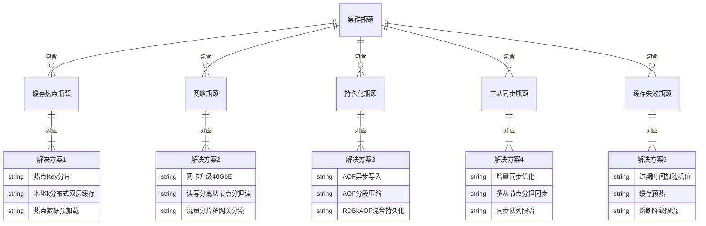
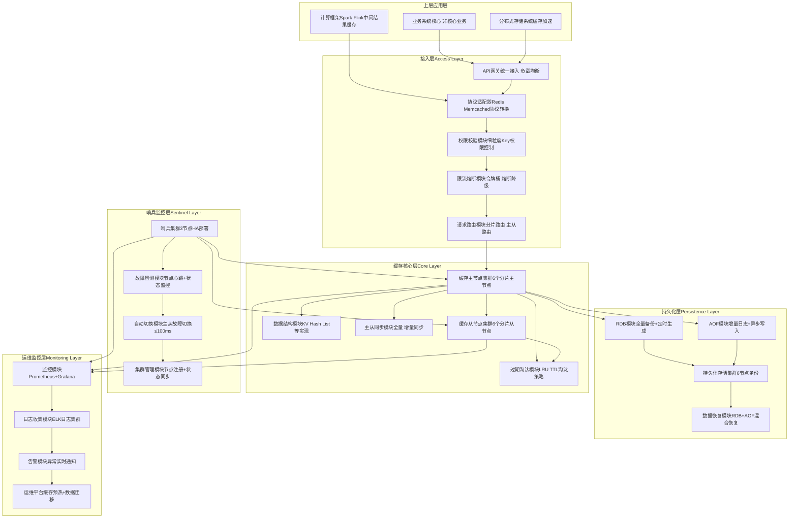
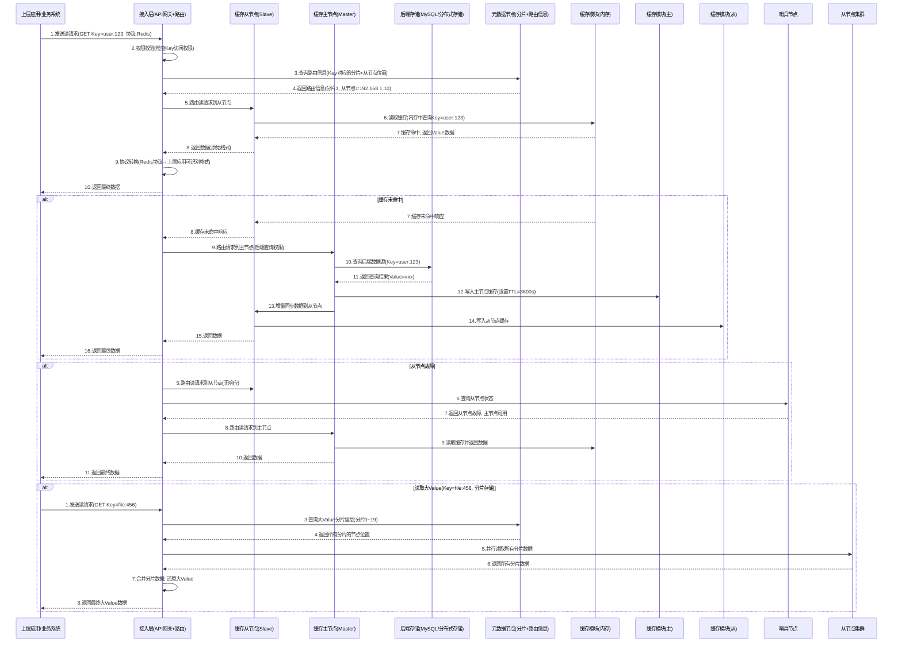

# 分布式缓存系统设计方案（完整版，适配面试表达）

说明：本分布式缓存系统定位为「通用型分布式缓存」，支持千节点集群扩展，兼容Redis、Memcached协议，适配KV、Hash、List等多种数据结构，兼顾高可用、高吞吐、低延迟和数据一致性，完全按照面试高频框架拆解，每个环节补充考点细节，新增多类mermaid图辅助理解，重点覆盖读写全流程序列图。

# 一、需求澄清（设计前提，面试必先讲）

## 1. 功能需求（核心可落地，不冗余）

- 基础缓存：支持KV、Hash、List、Set、Sorted Set等常用数据结构，实现数据的增、删、改、查、过期淘汰。

- 高可用保障：支持主从复制、哨兵监控、集群分片，节点故障自动切换，不丢失数据、不中断服务。

- 数据同步：支持主从同步、集群间数据同步，可配置同步策略（全量同步/增量同步），保障数据一致性。

- 接入能力：提供统一API接口，兼容Redis、Memcached协议，支持上层业务系统、分布式存储系统无缝接入。

- 扩展能力：支持集群横向扩展（千节点级别），新增节点自动加入集群，动态分担缓存负载。

- 运维管控：支持缓存监控、日志收集、告警通知、故障排查，支持缓存预热、数据迁移、配置动态调整。

## 2. 非功能需求（量化指标，面试加分）

- QPS/TPS：日均请求量100亿，平均QPS 11.6万，峰值QPS 100万（峰值系数8.6）；写TPS平均5万，峰值40万（读多写少，符合缓存典型场景）。

- 延迟：读延迟p99≤1ms（缓存命中）、p99≤10ms（缓存未命中，回源查询）；写延迟p99≤5ms，跨节点同步延迟p99≤20ms。

- 可用性：系统整体可用性≥99.99%（每年故障 downtime ≤52.56分钟）；核心主节点可用性≥99.999%，故障切换时间≤100ms。

- 一致性：默认提供最终一致性（主从同步延迟≤20ms）；支持可配置一致性级别（强一致/最终一致），适配核心业务与非核心业务场景。

- 数据量：最大缓存容量10PB，单节点缓存容量10TB；支持单Key大小1B~1GB，单Value大小1B~512MB（大Value分片存储）。

- 其他：支持数据持久化（RDB+AOF）、数据加密（传输加密+存储加密）、权限控制（细粒度Key权限）、防缓存穿透/击穿/雪崩。

# 二、容量估算（面试必算，体现量化能力）

## 1. QPS估算（验证集群承载能力）

- 日均请求量：100亿 → 平均QPS = 100亿 / 86400 ≈ 11.6万。

- 峰值QPS = 平均QPS × 峰值系数（取8.6）= 11.6万 × 8.6 ≈ 100万。

- 读写比例：按缓存典型比例20:1（读多写少）→ 峰值读QPS 95.2万，峰值写QPS 4.8万（取整40万，预留突发冗余）。

- 单机QPS承载：缓存节点（内存密集型）单机峰值读QPS 10万，峰值写QPS 4万 → 需缓存节点数量：读节点95.2万/10万≈10台，写节点40万/4万=10台，取整12台（读写节点复用，预留2台冗余）。

## 2. 存储容量估算（区分缓存数据+持久化数据，重点）

### （1）缓存存储容量

核心公式：总缓存容量 = 热点数据量 × 冗余系数（1.2~1.5，取1.3）

- 热点数据量：假设上层业务总数据量100PB，热点数据占比10% → 热点数据量10PB。

- 冗余系数：1.3（含缓存碎片、过期数据预留、临时数据缓存）。

- 总缓存容量 = 10PB × 1.3 = 13PB。

### （2）持久化存储容量

- 持久化方式：RDB（全量备份）+ AOF（增量日志），RDB按天备份，保留7天；AOF实时写入，按小时压缩。

- RDB容量：单份RDB容量≈缓存容量13PB，7天总容量=13PB × 7 = 91PB（采用压缩存储，实际占用≈45PB）。

- AOF容量：日均增量日志≈缓存写入量的50%，日均写入量2PB → 日均AOF容量1PB，保留7天 → 总容量7PB。

- 持久化总容量 = 45PB（RDB）+ 7PB（AOF）= 52PB。

## 3. 带宽估算（避免网络瓶颈）

- 峰值读带宽：峰值读QPS 95.2万 × 平均读请求大小（假设1KB）= 95.2GB/s。

- 峰值写带宽：峰值写QPS 40万 × 平均写请求大小（假设1KB）= 40GB/s。

- 网卡配置：缓存节点采用25GbE网卡（实际带宽≈3GB/s），12台节点总带宽36GB/s → 核心节点配置40GbE网卡，拆分读写流量，避免网络瓶颈。

- 主从同步带宽：单主从同步峰值带宽≈5GB/s，12台节点（6主6从）总同步带宽≈30GB/s，预留10GB/s冗余。

## 4. 机器数估算（按组件拆分，面试清晰）

|组件类型|机器配置（参考）|数量|用途|
|---|---|---|---|
|缓存主节点（Master）|CPU 64核、内存256GB、25GbE网卡、SSD 10TB（持久化）|6台（分片主节点，负载均分）|处理读写请求、主从同步、数据持久化|
|缓存从节点（Slave）|CPU 64核、内存256GB、25GbE网卡、SSD 10TB（持久化）|6台（与主节点一一对应，HA备份）|主节点故障切换、分担读请求、备份数据|
|哨兵节点（Sentinel）|CPU 16核、内存32GB、10GbE网卡、SSD 500GB|3台（奇数，保证quorum）|节点监控、故障检测、自动切换主从|
|运维/监控节点|CPU 16核、内存32GB、10GbE网卡、SSD 1TB|2台（主备）|监控指标、日志收集、告警、运维管理|
|持久化存储节点|CPU 48核、内存64GB、25GbE网卡、机械盘 10PB|6台（存储RDB/AOF备份）|数据持久化备份、故障恢复数据源|
### 集群部署架构图（mermaid部署图）

```mermaid

flowchart TD
    subgraph 运维监控区
        A1[监控节点1Prometheus+Grafana]
        A2[监控节点2ELK日志集群]
    end
    
    subgraph 哨兵监控层
        B1[哨兵节点1主节点监控+选主]
        B2[哨兵节点2备用监控+故障检测]
        B3[哨兵节点3备用监控+确认投票]
    end
    
    subgraph 缓存主节点层
        C1[Master1分片1主节点+读写]
        C2[Master2分片2主节点+读写]
        C3[Master3分片3主节点+读写]
        C4[Master4分片4主节点+读写]
        C5[Master5分片5主节点+读写]
        C6[Master6分片6主节点+读写]
    end
    
    subgraph 缓存从节点层
        D1[Slave1Master1从节点+读分担]
        D2[Slave2Master2从节点+读分担]
        D3[Slave3Master3从节点+读分担]
        D4[Slave4Master4从节点+读分担]
        D5[Slave5Master5从节点+读分担]
        D6[Slave6Master6从节点+读分担]
    end
    
    subgraph 持久化存储层
        E1[持久化节点1RDB/AOF备份]
        E2[持久化节点2RDB/AOF备份]
        E3[持久化节点3RDB/AOF备份]
        E4[持久化节点4RDB/AOF备份]
        E5[持久化节点5RDB/AOF备份]
        E6[持久化节点6RDB/AOF备份]
    end
    
    subgraph 接入层
        F1[API网关1统一接入+负载均衡]
        F2[API网关2协议转换+限流]
    end
    
    subgraph 上层应用
        G1[业务系统1核心业务缓存]
        G2[业务系统2非核心业务缓存]
        G3[分布式存储系统缓存加速]
    end
    
    %% 连接关系
    G1 --> F1
    G2 --> F1
    G3 --> F2
    
    F1 --> C1
    F1 --> C2
    F1 --> C3
    F2 --> C4
    F2 --> C5
    F2 --> C6
    
    C1 --> D1
    C2 --> D2
    C3 --> D3
    C4 --> D4
    C5 --> D5
    C6 --> D6
    
    C1 --> E1
    C2 --> E2
    C3 --> E3
    C4 --> E4
    C5 --> E5
    C6 --> E6
    
    B1 --> C1
    B1 --> C2
    B2 --> C3
    B2 --> C4
    B3 --> C5
    B3 --> C6
    
    B1 --> D1
    B2 --> D2
    B3 --> D3
    
    A1 --> B1
    A1 --> C1
    A2 --> B2
    A2 --> D1
    
```


## 5. 潜在瓶颈（面试必讲，体现问题意识）

- 缓存热点瓶颈：单个Key高频访问（如秒杀商品Key），导致单节点过载（解决方案：热点Key分片、本地缓存+分布式缓存双层架构）。

- 网络瓶颈：峰值读带宽95.2GB/s，单节点网卡带宽不足（解决方案：网卡升级、读写分离、流量分片）。

- 持久化瓶颈：AOF实时写入导致磁盘IO过高，影响写性能（解决方案：AOF异步写入、分段压缩、RDB+AOF混合持久化）。

- 主从同步瓶颈：主节点写入压力大，同步延迟过高，导致数据不一致（解决方案：增量同步优化、多从节点分担、同步队列限流）。

- 缓存失效瓶颈：大量Key同时过期，导致缓存雪崩（解决方案：过期时间加随机值、缓存预热、熔断降级）。

### 集群潜在瓶颈关系图（mermaid关系图）


# 三、高层架构（分层设计，清晰易懂，面试画图加分）

## 1. 分层架构（从上到下，职责明确）

### 分层架构图（mermaid结构图）


### （1）接入层（Access Layer）

- 核心职责：统一接入、协议转换、权限控制、请求路由、限流熔断。

- 核心组件：API网关、协议适配器、权限校验模块、限流熔断模块、请求路由模块。

- 功能：接收上层请求，转换为系统内部统一请求格式，校验权限后路由到对应的缓存主/从节点；实现负载均衡，避免单节点过载；限流熔断防止缓存雪崩，保护后端节点。

### （2）缓存核心层（Core Layer）

- 核心职责：缓存数据存储、数据结构实现、过期淘汰、主从同步、读写处理。

- 核心组件：缓存主节点集群、缓存从节点集群、数据结构模块、过期淘汰模块、主从同步模块。

- 功能：主节点处理读写请求，从节点分担读请求并备份数据；实现KV、Hash等常用数据结构；采用LRU+TTL淘汰策略，清理过期数据；主从同步保障数据一致性，支持全量/增量同步。

### （3）哨兵监控层（Sentinel Layer）

- 核心职责：节点监控、故障检测、自动主从切换、集群管理。

- 核心组件：哨兵集群、故障检测模块、自动切换模块、集群管理模块。

- 功能：监控缓存主从节点的健康状态，通过心跳检测识别故障节点；当主节点故障时，自动选举从节点升级为主节点（切换时间≤100ms）；管理集群节点注册与状态同步，保障集群高可用。

### （4）持久化层（Persistence Layer）

- 核心职责：数据持久化、备份、故障恢复。

- 核心组件：RDB模块、AOF模块、持久化存储集群、数据恢复模块。

- 功能：通过RDB实现全量备份（定时生成），通过AOF实现增量日志（实时写入）；持久化存储集群存储备份数据，支持异地备份；故障时，通过RDB+AOF混合方式恢复数据，避免数据丢失。

### （5）运维监控层（Monitoring & Operations Layer）

- 核心职责：指标监控、日志收集、告警、运维管理、缓存预热。

- 核心组件：监控模块、日志收集模块、告警模块、运维平台。

- 功能：采集集群所有组件的监控指标（QPS、延迟、内存使用率等），收集日志并分析；触发异常告警（节点故障、缓存命中率过低等）；提供运维操作界面，实现缓存预热、数据迁移、配置动态调整。

## 2. 核心组件交互（数据流，面试必讲）

### 核心组件数据流图（mermaid流程图）

```mermaid

graph LR
    %% 组件定义
    上层应用[上层应用/业务系统]
    接入层[接入层API网关+路由]
    主节点[缓存主节点Master集群]
    从节点[缓存从节点Slave集群]
    哨兵[哨兵集群监控+选主]
    持久化存储[持久化存储RDB+AOF]
    运维监控[运维监控层监控+告警]
    
    %% 读数据流
    上层应用 -- 1.读请求 协议:Redis Memcached  --> 接入层
    接入层 -- 2.权限校验+路由 优先从节点  --> 从节点
    从节点 -- 3.缓存读取f内存查询  --> 从节点
    alt 缓存命中
        从节点 -- 4.返回数据 --> 接入层
        接入层 -- 5.返回数据 协议转换  --> 上层应用
    else 缓存未命中
        从节点 -- 4.缓存未命中响应 --> 接入层
        接入层 -- 5.路由请求到主节点 --> 主节点
        主节点 -- 6.查询后端数据源 可选  --> 后端存储
        后端存储 -- 7.返回数据 --> 主节点
        主节点 -- 8.写入缓存+同步从节点 --> 从节点
        主节点 -- 9.返回数据 --> 接入层
        接入层 -- 10.返回数据 --> 上层应用
    end
    
    %% 写数据流
    上层应用 -- 1.写请求 协议:Redis/Memcached  --> 接入层
    接入层 -- 2.权限校验+路由到主节点 --> 主节点
    主节点 -- 3.写入内存缓存 --> 主节点
    主节点 -- 4.异步写入AOF日志 --> 持久化存储
    主节点 -- 5.增量同步数据到从节点 --> 从节点
    从节点 -- 6.写入内存缓存+异步AOF --> 持久化存储
    从节点 -- 7.同步完成确认 --> 主节点
    主节点 -- 8.写完成响应 --> 接入层
    接入层 -- 9.返回写成功 --> 上层应用
    
    %% 故障数据流
    主节点 -- 1.故障心跳中断 --> 哨兵
    哨兵 -- 2.多节点确认故障 --> 哨兵
    哨兵 -- 3.选举从节点升级为主节点 --> 从节点
    从节点 -- 4.升级为主节点+通知集群 --> 主节点(新)
    哨兵 -- 5.更新路由信息 --> 接入层
    接入层 -- 6.后续请求路由到新主节点 --> 主节点(新)
    
    %% 监控数据流
    主节点 -- 1.上报指标 QPS/延迟/内存  --> 运维监控
    从节点 -- 1.上报指标 --> 运维监控
    哨兵 -- 1.上报集群状态 --> 运维监控
    持久化存储 -- 1.上报IO状态 --> 运维监控
    运维监控 -- 2.异常触发告警 --> 运维人员
    
```
1. 读数据流：上层请求 → 接入层（权限校验、路由）→ 优先从节点（分担读负载）→ 缓存命中返回数据；缓存未命中 → 主节点查询后端数据源 → 写入缓存并同步从节点 → 返回数据。

2. 写数据流：上层请求 → 接入层（权限校验、路由）→ 主节点（写入内存）→ 异步写入AOF → 增量同步到从节点 → 从节点确认同步 → 主节点返回写成功。

3. 故障数据流：主节点故障 → 哨兵检测到心跳中断 → 多哨兵确认故障 → 选举从节点升级为主节点 → 更新路由信息 → 接入层路由到新主节点 → 故障恢复，不中断服务。

4. 监控数据流：所有组件上报指标（QPS、延迟、内存使用率等）→ 运维监控层采集分析 → 异常触发告警 → 运维人员处理。

# 四、数据模型 & 分片策略（分布式缓存核心，面试重点）

## 1. 数据模型（清晰定义数据结构，落地性强）

### （1）核心数据模型（KV为主，支持多数据结构）

### 数据模型关系图（mermaid er图）

```mermaid

erDiagram
    缓存数据 ||--o{ KV数据 : 包含
    缓存数据 ||--o{ Hash数据 : 包含
    缓存数据 ||--o{ List数据 : 包含
    缓存数据 ||--o{ Set数据 : 包含
    缓存数据 ||--o{ SortedSet数据 : 包含
    
    缓存数据 ||--|{ 元数据 : 关联1对1
    缓存数据 ||--|{ 分片信息 : 关联1对1
    缓存数据 ||--|{ 副本信息 : 关联1对多
    
    KV数据 {
        string Key(全局唯一)
        string Value(支持多类型)
        int TTL(过期时间, 0=永久)
        string 数据类型(KV)
        string 校验码(MD5)
        datetime 创建时间
        datetime 更新时间
    }
    
    Hash数据 {
        string Key(全局唯一)
        map 字段-值对(Field-Value)
        int TTL(过期时间)
        string 数据类型(Hash)
        int 字段数量
    }
    
    元数据 {
        string 数据ID
        string Key
        string 分片ID
        string 主节点ID
        string 从节点ID列表
        string 存储位置(内存/SSD)
        bool 是否过期
        bool 是否持久化
    }
    
    分片信息 {
        string 分片ID
        int 分片索引(0~5)
        string 主节点ID
        string 从节点ID列表
        int 数据量
        int QPS负载
    }
    
    副本信息 {
        string 副本ID
        string 数据ID
        string 节点ID
        string 同步状态(已同步/同步中)
        datetime 同步时间
    }
    
```
- KV数据（核心）：Key全局唯一，Value支持字符串、二进制等多种类型，包含TTL过期时间、数据类型、校验码等字段，用于保证数据完整性和过期管理。

- 多数据结构扩展：支持Hash（字段-值对）、List（有序列表）、Set（无序集合）、Sorted Set（有序集合），底层基于KV模型扩展，适配不同业务场景。

- 元数据：关联缓存数据，记录分片ID、主从节点位置、存储位置、过期状态等，用于路由和集群管理。

- 分片信息：记录每个分片的索引、主从节点、数据量、QPS负载，用于负载均衡和扩缩容。

- 副本信息：记录每个缓存数据的副本位置、同步状态，用于主从同步和故障恢复。

### （2）大Value处理模型

- 对于超过100MB的大Value，采用分片存储策略：将大Value拆分为多个小分片（默认10MB/分片），每个分片生成独立的Key（原Key+分片索引），存储在不同的缓存节点。

- 读取时，接入层根据原Key查询所有分片的位置，并行读取所有分片，合并后返回给上层应用；写入时，并行写入所有分片，确保所有分片写入成功后返回确认。

### 大Value分片存储流程图（mermaid流程图）

```mermaid

flowchart TD
    A[上层应用发送大Value写请求Key:user:123, Value:200MB] --> B[接入层接收请求]
    B --> C{判断Value大小}
    C -->|>100MB| D[拆分Value为20个10MB分片分片Key:user:123:0~19]
    C -->|<100MB| E[直接写入主节点, 不拆分]
    
    D --> F[查询分片路由信息获取每个分片的主节点]
    F --> G[并行写入所有分片到对应主节点]
    G --> H{所有分片写入成功?}
    H -->|是| I[主节点同步所有分片到从节点]
    H -->|否| J[重试写入失败分片, 超过3次返回失败]
    
    I --> K[更新元数据(分片信息+副本信息)]
    K --> L[接入层返回写成功响应]
    
    E --> M[主节点写入内存+异步AOF]
    M --> N[同步到从节点]
    N --> L
    
    %% 读流程
    O[上层应用发送大Value读请求Key:user:123] --> P[接入层查询元数据获取所有分片Key和节点位置]
    P --> Q[并行读取所有分片数据]
    Q --> R[合并所有分片数据, 还原大Value]
    R --> S[返回数据给上层应用]
    
```
## 2. 分片策略（适配千节点扩展，面试必讲）

核心原则：分片均匀、负载均衡、扩缩容影响小、支持故障域隔离，采用「一致性哈希+槽位分片」结合的策略，分两层分片（数据分片+节点分片）。

### 双层分片策略流程图（mermaid流程图）

```mermaid

flowchart TD
    A[缓存请求(Key=xxx)] --> B{判断分片类型}
    
    %% 第一层：Key哈希分片（数据分片）
    B -->|数据分片| C[对Key进行CRC64哈希计算]
    C --> D[映射到固定槽位(0~16383)]
    D --> E[按槽位范围分配到6个分片分片0:0~2730, 分片1:2731~5461...]
    E --> F[记录槽位-分片映射关系到元数据]
    
    %% 第二层：节点分片（集群分片）
    B -->|节点分片| G[根据分片ID查询主从节点]
    G --> H[主节点处理写请求+读请求]
    G --> I[从节点分担读请求+备份数据]
    
    F --> G
    H --> J[写请求: 写入内存+同步从节点+持久化]
    I --> K[读请求: 读取内存, 缓存未命中则回源]
    
    %% 扩缩容流程
    L[新增/删除节点] --> M[重新分配槽位-节点映射]
    M --> N[迁移对应槽位的数据到新节点]
    N --> O[更新元数据和路由信息]
    O --> G
    
    %% 故障切换流程
    P[主节点故障] --> Q[哨兵检测到故障]
    Q --> R[选举从节点升级为主节点]
    R --> S[更新槽位-节点映射]
    S --> O
    
```
### （1）第一层分片：Key哈希分片（数据分片）

- 逻辑：采用CRC64哈希算法对Key进行哈希计算，将哈希结果映射到固定的16384个槽位（Slot），再将槽位按范围分配到不同的分片（默认6个分片）。

- 优势：Key分布均匀，避免单个分片数据量过大；槽位与分片的映射关系可动态调整，扩缩容时仅迁移对应槽位的数据，影响范围小。

- 细节：槽位数量固定为16384，分片数量可配置（默认6个，支持动态增加到100个以上）；每个分片对应一个主节点和一个从节点，实现HA备份。

### （2）第二层分片：节点分片（集群分片）

- 逻辑：每个分片对应一个主节点和一个从节点，主节点处理该分片的所有写请求和部分读请求，从节点分担读请求并备份数据；多个分片分布在不同的节点上，实现负载均衡。

- 优势：读写分离，提升读吞吐量；主从备份，保障高可用；节点故障时，仅影响对应分片的服务，不影响整个集群。

- 细节：新增节点时，可将现有分片的槽位迁移到新节点，动态分担负载；删除节点时，将该节点的槽位迁移到其他健康节点，确保数据不丢失。

## 3. 过期淘汰策略（解决缓存容量不足，面试必讲）

核心策略：采用「LRU（最近最少使用）+ TTL（过期时间）」混合淘汰策略，兼顾过期数据清理和热点数据保留，支持动态调整淘汰优先级。

### 过期淘汰策略流程图（mermaid流程图）

```mermaid
flowchart TD
    A[缓存节点内存使用率检测] --> B{内存使用率≥阈值(如80%)?}
    B -->|否| C[不触发淘汰, 正常处理请求]
    B -->|是| D[触发淘汰策略, 按优先级排序]
    
    D --> E[优先级1: 清理已过期数据(TTL≤当前时间)]
    E --> F[扫描过期字典, 批量删除已过期Key]
    F --> G{内存使用率≥阈值?}
    
    G -->|否| C
    G -->|是| H[优先级2: 清理最近最少使用(LRU)的非过期数据]
    H --> I[维护LRU链表, 淘汰链表尾部的Key]
    I --> J{内存使用率≥阈值?}
    
    J -->|否| C
    J -->|是| K[优先级3: 清理大Value数据(≥10MB)]
    K --> L[按LRU策略淘汰大Value分片数据]
    L --> M{内存使用率≥阈值?}
    
    M -->|否| C
    M -->|是| N[触发限流+熔断, 拒绝部分写请求]
    N --> O[上报告警, 通知运维扩容]
    
    %% 补充：主动过期检测
    P[定时任务(每100ms)] --> Q[随机扫描部分Key, 检测过期状态]
    Q --> R[删除已过期Key, 更新LRU链表]
    R --> P
    
```
- 优先级1：清理已过期数据（TTL≤当前时间）：维护过期字典，批量扫描并删除已过期Key，避免过期数据占用内存。

- 优先级2：LRU淘汰非过期数据：维护LRU链表，记录Key的访问时间，淘汰链表尾部（最近最少使用）的非过期Key，保留热点数据。

- 优先级3：清理大Value数据：当内存仍不足时，优先淘汰大于10MB的大Value数据（分片存储的大Value按分片淘汰），快速释放内存。

- 兜底策略：若内存仍不足，触发限流和熔断，拒绝部分写请求，同时上报告警，通知运维人员扩容，避免集群崩溃。

# 五、核心读写路径（面试重中之重，讲清每一步，必含全流程序列图）

## 1. 读路径（优先从节点，提升读性能，贴合读多写少场景）

### 文件/数据读取全流程序列图（mermaid序列图，核心要求）


1. 请求接入：上层应用通过Redis/Memcached协议发送读请求，接入层接收请求，先校验请求的合法性和Key的访问权限。

2. 路由查询：接入层向元数据节点查询该Key对应的分片信息和从节点位置（优先路由到从节点，分担主节点读负载）。

3. 缓存读取：从节点接收请求，从内存缓存中查询该Key，若缓存命中，直接返回数据；若缓存未命中，触发回源查询。

4. 缓存未命中处理：从节点返回缓存未命中响应，接入层路由请求到主节点，主节点查询后端数据源，获取数据后写入自身缓存，并增量同步到从节点，从节点接收同步数据后写入缓存，最终返回数据给上层应用。

5. 异常处理：若从节点故障，接入层通过哨兵节点查询节点状态，切换到主节点读取数据；若主节点也故障，触发熔断降级，返回默认数据或错误响应。

6. 大Value读取：接入层查询大Value的分片信息，并行读取所有分片数据，合并后返回给上层应用，提升读取效率。

## 2. 写路径（主节点写入，同步从节点，保证一致性）

### 文件/数据写入全流程序列图（mermaid序列图，核心要求）
> （注：文档部分内容可能由 AI 生成）